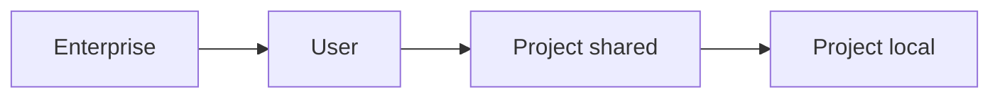

<LevelBadge level="intermediate" />

<VerifyNote lastVerified="2026-06-20" source="https://code.claude.com/docs/en/settings">
정확한 키와 파일 위치는 공식 Claude Code 설정 문서에서 확인하는 것이 가장 좋습니다.
</VerifyNote>

`settings.json`은 Claude Code의 설정이 있는 곳입니다 — [권한](/docs/claude-code/permissions), [훅](/docs/claude-code/hooks), 환경 변수, 모델 기본값 등. **계층**을 이해하는 것이 핵심입니다.

## 계층 (가장 전역적 → 가장 구체적)

나중에 오는(더 구체적인) 계층이 앞선 것을 오버라이드합니다:

1. **Enterprise / managed** — 조직 관리자가 설정한 정책. 모든 것을 이깁니다.
2. **User** — `~/.claude/settings.json`. 모든 프로젝트에 걸친 당신의 기본값.
3. **Project (shared)** — `.claude/settings.json`, 저장소에 커밋됨. 팀 전체.
4. **Project (personal)** — `.claude/settings.local.json`, git에서 무시됨. 이 저장소에 대한 당신의 오버라이드.

:::tip 공유 파일은 커밋하고, 로컬 파일은 무시하세요
팀 관례는 `.claude/settings.json`(커밋됨)에 두세요. 개인적인 조정과 머신별 경로는 `.claude/settings.local.json`(git 무시)에 두세요. 이렇게 하면 당신의 선호를 남에게 강요하지 않으면서 팀의 일관성을 유지합니다.
:::

## 흔히 설정하게 되는 것

- **`permissions`** — allow/ask/deny 규칙. [권한](/docs/claude-code/permissions)을 참고하세요.
- **`hooks`** — 라이프사이클 이벤트에서 실행되는 명령. [훅](/docs/claude-code/hooks)을 참고하세요.
- **`env`** — 세션용 환경 변수.
- **모델 / 동작 기본값** — 예: 선호 모델.

## 안전하게 편집하기

- 유효한 JSON으로 유지하세요(후행 쉼표 하나가 깨뜨립니다).
- 넓은 권한 규칙보다 **좁은** 것을 선호하세요.
- 커밋되는 파일에 비밀 값을 절대 넣지 마세요 — `env` 참조나 시크릿 매니저를 사용하세요.

바로 복사할 수 있는 시작 파일은 [훅 & settings.json 레시피](/docs/templates/hooks-settings)에 있습니다.

## 다음

- [권한 & 권한 모드](/docs/claude-code/permissions)
- [훅: 결정론적 자동화](/docs/claude-code/hooks)
- [커스텀 슬래시 명령](/docs/claude-code/slash-commands)
