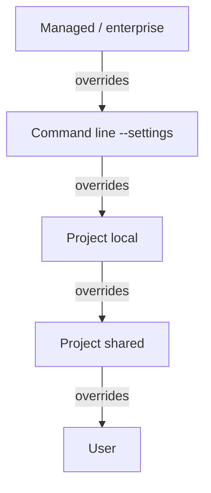

<LevelBadge level="intermediate" />

<VerifyNote lastVerified="2026-09-23" source="https://code.claude.com/docs/en/settings">
5단계 우선순위 스택(관리형 → 명령줄 → 프로젝트 로컬 → 프로젝트 공유 → 사용자)과 "환경 변수는 계층이 아니다"라는 규칙은 공식 페이지 [Settings files and precedence](https://code.claude.com/docs/en/settings)를 따릅니다. 키별 재정의는 [설정 레퍼런스](https://code.claude.com/docs/en/settings-reference)에 정리되어 있습니다.
</VerifyNote>

`settings.json`은 Claude Code의 설정이 있는 곳입니다 — [권한](/docs/claude-code/permissions), [훅](/docs/claude-code/hooks), 환경 변수, 모델 기본값 등. **계층**을 이해하는 것이 핵심입니다.

## 계층 (우선순위가 높은 것부터)

같은 키가 여러 곳에 설정되어 있으면 Claude Code는 그 키를 설정한 가장 높은 계층의 값을 사용합니다:

1. **관리형 / 엔터프라이즈** — `managed-settings.json`, MDM 정책, 또는 claude.ai 콘솔의 서버 관리 설정. 보안에 민감한 일부 예외를 제외하면 사용자가 설정한 어떤 값도 이를 덮어쓰지 못합니다.
2. **명령줄** — `claude --settings '<json-or-path>'`, 해당 세션에만 적용. 관리형을 제외한 모든 파일보다 위에 있으며 어떤 파일에도 기록하지 않습니다.
3. **프로젝트 (개인)** — `.claude/settings.local.json`, git에서 제외됨. 이 저장소에 대한 개인 재정의.
4. **프로젝트 (공유)** — `.claude/settings.json`, 저장소에 커밋됨. 팀 전체에 적용.
5. **사용자** — `~/.claude/settings.json`. 모든 프로젝트에서의 기본값.

```mermaid
flowchart TB
  M[Managed / enterprise] -->|overrides| C[Command line --settings]
  C -->|overrides| L[Project local]
  L -->|overrides| P[Project shared]
  P -->|overrides| U[User]
```

:::note 환경 변수는 계층이 아닙니다
환경 변수는 이 스택 바깥에 있으며 키마다 개별적으로 결정됩니다. 예를 들어 `ANTHROPIC_MODEL`은 어떤 파일의 `model` 키보다 우선하지만, `ANTHROPIC_DEFAULT_MODEL`은 어떤 파일도 `model`을 설정하지 않은 경우에만 적용됩니다.
:::

:::tip 공유 파일은 커밋하고, 로컬 파일은 무시하세요
팀 관례는 `.claude/settings.json`(커밋됨)에 두세요. 개인적인 조정과 머신별 경로는 `.claude/settings.local.json`(git 무시)에 두세요. 이렇게 하면 당신의 선호를 남에게 강요하지 않으면서 팀의 일관성을 유지합니다.
:::

## 흔히 설정하게 되는 것

- **`permissions`** — allow/ask/deny 규칙. [권한](/docs/claude-code/permissions)을 참고하세요.
- **`hooks`** — 라이프사이클 이벤트에서 실행되는 명령. [훅](/docs/claude-code/hooks)을 참고하세요.
- **`env`** — 세션용 환경 변수.
- **모델 / 동작 기본값** — 예: 선호 모델.

## 안전하게 편집하기

- 유효한 JSON으로 유지하세요(후행 쉼표 하나가 깨뜨립니다).
- 넓은 권한 규칙보다 **좁은** 것을 선호하세요.
- 커밋되는 파일에 비밀 값을 절대 넣지 마세요 — `env` 참조나 시크릿 매니저를 사용하세요.

바로 복사할 수 있는 시작 파일은 [훅 & settings.json 레시피](/docs/templates/hooks-settings)에 있습니다.

## 다음

- [권한 & 권한 모드](/docs/claude-code/permissions)
- [훅: 결정론적 자동화](/docs/claude-code/hooks)
- [커스텀 슬래시 명령](/docs/claude-code/slash-commands)
