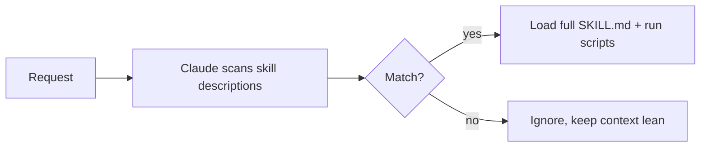

<LevelBadge level="advanced" />

<VerifyNote lastVerified="2026-06-20" source="https://code.claude.com/docs/en/skills">
스킬 파일 레이아웃과 스킬이 실행되는 곳(Claude Code, Claude.ai, Cowork)은 변화하고 있습니다 — 공식 스킬 문서에서 확인하세요.
</VerifyNote>

**스킬**은 전문성 — 지침과 선택적 스크립트 및 리소스 — 을 패키징하며, Claude는 **관련 있을 때만** 그것을 로드합니다. 모든 것을 [CLAUDE.md](/docs/claude-code/claude-md)에 욱여넣는 대신, Claude가 필요에 따라 끌어오는 능력 라이브러리를 제공하는 것입니다.

## 구조

스킬은 `SKILL.md`를 담은 폴더입니다: YAML 프런트매터 + 지침.

```markdown
---
name: pdf-forms
description: Use when the user needs to fill, read, or generate PDF forms.
---

# PDF Forms
Steps and rules for working with PDF forms…
(optionally reference scripts/ or resources/ in this folder)
```

**`description`이 트리거입니다** — Claude는 이것을 읽고 스킬을 *언제* 활성화할지 결정합니다. 올바른 때에 로드되고 그렇지 않을 때는 로드되지 않을 만큼 구체적으로, "Use when…" 형식으로 작성하세요.

## 점진적 공개 (스킬이 확장되는 이유)

Claude는 모든 스킬의 전체 본문을 처음부터 로드하지 않습니다 — 가벼운 `name` + `description`만 보고, 요청이 일치할 때만 전체 지침을 끌어오고 스크립트를 실행합니다. 그래서 많은 스킬이 설치되어 있어도 컨텍스트가 군더더기 없이 유지됩니다.



## 어디에 있는가

- 개인: `~/.claude/skills/<name>/SKILL.md`
- 프로젝트(공유 가능): `.claude/skills/<name>/SKILL.md`
- 팀 배포를 위해 [플러그인](/docs/claude-code/plugins-marketplaces)에 번들로 포함.

AILmanac은 [바로 쓸 수 있는 7개의 스킬 팩](/docs/templates/skills)을 제공합니다 — 하나를 복사해 넣어 시험해 보세요.

## 스킬 대 명령 대 서브에이전트 대 MCP

| 도구 | 무엇인가 | 당신 대 Claude가 트리거 |
|---|---|---|
| [슬래시 명령](/docs/claude-code/slash-commands) | 저장된 프롬프트 | **당신**이 호출 |
| **스킬** | 온디맨드 전문성 + 스크립트 | **Claude**가 관련 있을 때 로드 |
| [서브에이전트](/docs/claude-code/subagents) | 자체 컨텍스트를 가진 위임 에이전트 | Claude가 위임 |
| [MCP](/docs/claude-code/mcp) | 외부 도구/데이터로의 연결 | 호출할 도구를 제공 |

## 다음

- [첫 스킬 작성하기 (워크스루)](/docs/walkthroughs/first-skill)
- [SKILL.md 템플릿](/docs/templates/skills)
- [플러그인 & 마켓플레이스](/docs/claude-code/plugins-marketplaces)
