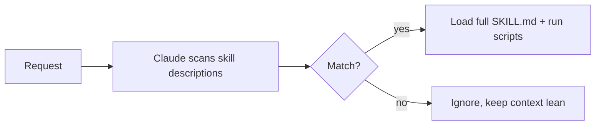

<LevelBadge level="advanced" />

<VerifyNote lastVerified="2026-06-23" source="https://code.claude.com/docs/en/skills">
스킬 파일 레이아웃, 점진적 공개, 스킬이 실행되는 곳(Claude Code, Claude.ai, Cowork)은 계속 발전합니다 — 공식 Skills 문서에서 확인하세요.
</VerifyNote>

<Callout type="objectives" items={["스킬이 무엇인지, 그리고 모든 것을 CLAUDE.md에 쑤셔넣는 것과 어떻게 다른지 정의한다", "SKILL.md — 프론트매터 + 지시 — 를 읽고 쓰며, 왜 description이 트리거인지 이해한다", "점진적 공개를 설명하고 왜 그것이 컨텍스트를 부풀리지 않고 많은 스킬을 확장하게 하는지 안다", "스킬이 사는 세 곳을 안다: 개인, 프로젝트, 플러그인 번들", "Skill, 슬래시 명령, 서브에이전트, MCP 사이에서 올바르게 선택한다", "스킬이 트리거되지 않게 하는 네 가지 흔한 실수를 피한다"]} />

**스킬(Skill)**은 전문성 — 지시와 선택적 스크립트 및 리소스 — 을 패키징하며, Claude가 **관련 있을 때만** 로드합니다. 모든 것을 [CLAUDE.md](/docs/claude-code/claude-md)에 쑤셔넣는 대신, Claude에 온디맨드로 끌어오는 기능 라이브러리를 줍니다.

## 구조

스킬은 `SKILL.md`가 있는 폴더입니다: YAML 프론트매터 + 지시.

```markdown
---
name: pdf-forms
description: Use when the user needs to fill, read, or generate PDF forms.
---

# PDF Forms
Steps and rules for working with PDF forms…
(optionally reference scripts/ or resources/ in this folder)
```

<Callout type="tip" items={["description이 트리거입니다 — Claude가 언제 스킬을 활성화할지 결정하려고 이를 읽습니다. \"Use when…\"으로, 올바른 때에 로드되고 그 외에는 안 되도록 충분히 구체적으로 쓰세요."]} />

## 점진적 공개 (스킬이 확장되는 이유)

Claude는 모든 스킬의 전체 본문을 미리 로드하지 않습니다 — 가벼운 `name` + `description`만 보고, 요청이 매칭될 때만 전체 지시를 끌어오고(스크립트를 실행합니다). 그래서 많은 스킬이 설치돼 있어도 컨텍스트가 가볍게 유지됩니다.



## 스킬이 사는 곳

<Steps items={[{title:"개인", body:"~/.claude/skills/<name>/SKILL.md — 당신 것으로 남으며, 모든 프로젝트에서 사용 가능."},{title:"프로젝트 (공유 가능)", body:".claude/skills/<name>/SKILL.md — git에 커밋하면 팀 전체가 그 기능을 얻습니다."},{title:"플러그인 번들", body:"팀 배포를 위해 스킬을 플러그인 안에 패키징하세요. Plugins & Marketplaces 참조."}]} />

AILmanac은 [바로 쓸 수 있는 스킬 팩 7개](/docs/templates/skills)를 제공합니다 — 하나를 복사해 시험해 보세요.

## 실습 예제: 스스로 트리거되는 스킬

`~/.claude/skills/release-notes/SKILL.md`를 만드세요:

```markdown
---
name: release-notes
description: Use when the user asks to write release notes or a changelog from git history.
---

# Release Notes
1. Run `git log <last-tag>..HEAD --oneline` to get the commits.
2. Group them into Features / Fixes / Breaking changes.
3. Write user-facing notes — what changed for *users*, not commit messages.
4. Output Markdown ready to paste into a GitHub release.
```

나중에 아래 프롬프트를 입력합니다. Claude는 이 단계들을 컨텍스트에 가진 적이 없지만 — 요청이 `description`과 매칭되므로 전체 `SKILL.md`를 끌어와 `git log`를 실행하고 그룹화된 노트를 만듭니다. 이름으로 아무것도 호출하지 않았습니다; **description이 라우팅을 했습니다**. 같은 폴더에 `scripts/` 파일을 추가하면 스킬이 1단계의 일부로 그것을 실행할 수 있습니다.

<PromptCard title="의도로 스킬 트리거 — 이름 불필요">{`Draft release notes since v1.4.`}</PromptCard>

## Skill vs 명령 vs 서브에이전트 vs MCP

| 도구 | 무엇인가 | 당신 vs Claude가 트리거 |
|---|---|---|
| [슬래시 명령](/docs/claude-code/slash-commands) | 저장된 프롬프트 | **당신**이 호출 |
| **스킬** | 온디맨드 전문성 + 스크립트 | **Claude**가 관련 있을 때 로드 |
| [서브에이전트](/docs/claude-code/subagents) | 자체 컨텍스트를 가진 위임된 에이전트 | Claude가 위임 |
| [MCP](/docs/claude-code/mcp) | 외부 도구/데이터로의 연결 | 호출할 도구를 제공 |

<Callout type="takeaways" items={["온디맨드로 발동하고 싶다 → 슬래시 명령.", "Claude가 절차를 알고 관련 있을 때 적용하길 원한다 → 스킬.", "작업이 별도 컨텍스트에서 일어나야 한다 → 서브에이전트.", "외부 시스템에 도달해야 한다 → MCP."]} />

## 흔한 실수

<Callout type="warning" items={["트리거되지 않는 description. \"PDF를 돕는다\"는 너무 모호합니다; \"Use when the user needs to fill, read, or generate PDF forms\"는 Claude에게 언제 로드할지 정확히 알려줍니다. description은 활성화 메커니즘 전부입니다 — 사람이 아니라 매칭을 위해 쓰세요.", "대신 모든 것을 CLAUDE.md에 넣기. CLAUDE.md는 매 세션 로드되어 항상 컨텍스트를 소모하지만; 스킬은 관련 있을 때만 로드됩니다. 상황적 절차는 스킬로 옮기고 CLAUDE.md는 항상 참인 프로젝트 규칙을 위해 두세요.", "하나의 거대한 스킬. 날카롭게 서술된 작은 스킬 여럿이 하나의 만능 스킬보다 라우팅이 낫습니다 — 점진적 공개는 각 description이 구체적일 때만 도움이 됩니다.", "공유 가능하다는 걸 잊기. git에 커밋된 .claude/skills/의 프로젝트 스킬은 팀 전체에 기능을 주고; ~/.claude/skills/의 개인 스킬은 당신 것으로 남습니다."]} />

## 용어 되짚기

<Flashcards cards={[{front:"스킬이란 무엇인가?", back:"SKILL.md가 있는 폴더로, 지시와 선택적 스크립트 및 리소스를 패키징하며, Claude가 관련 있을 때만 로드한다."},{front:"스킬의 트리거는?", back:"description 필드 — Claude가 언제 스킬을 활성화할지 결정하려고 읽는다. \"Use when…\"으로, 올바른 때에 로드되고 그 외에는 안 되도록 충분히 구체적으로 쓴다."},{front:"점진적 공개란?", back:"Claude가 미리 가벼운 name + description만 보고, 요청이 매칭될 때만 전체 SKILL.md를 끌어오고(스크립트를 실행) — 많은 스킬이 있어도 컨텍스트를 가볍게 유지한다."},{front:"개인 vs 프로젝트 스킬 위치?", back:"개인: ~/.claude/skills/<name>/SKILL.md(당신 것). 프로젝트: .claude/skills/<name>/SKILL.md(git에 커밋해 팀과 공유)."},{front:"스킬 vs 슬래시 명령?", back:"슬래시 명령은 온디맨드로 당신이 호출; 스킬은 요청이 description과 매칭될 때 Claude가 자동으로 로드."},{front:"스킬 vs CLAUDE.md?", back:"CLAUDE.md는 매 세션 로드되어 항상 컨텍스트를 소모; 스킬은 관련 있을 때만 로드. 항상 참인 규칙은 CLAUDE.md에, 상황적 절차는 스킬에."}]} />

## 스스로 점검하기

<Quiz title="스스로 점검하기" questions={[{q:"SKILL.md에서 Claude가 스킬을 언제 활성화할지 실제로 결정하는 것은?", options:["폴더 이름","프론트매터의 description 필드","본문의 첫 헤딩","사용자의 수동 호출"], answer:1, explain:"description이 트리거입니다 — Claude가 언제 스킬을 활성화할지 결정하려고 읽습니다. \"Use when…\"으로, 올바른 때에 로드되도록 충분히 구체적으로 쓰세요."},{q:"점진적 공개란 무엇인가요?", options:["Claude가 모든 스킬의 전체 본문을 미리 로드한다","Claude가 name + description만 보고, 요청이 매칭될 때만 전체 SKILL.md를 로드한다","스킬이 단계를 한 줄씩 사용자에게 드러낸다","CLAUDE.md가 세션 내내 점진적으로 로드된다"], answer:1, explain:"점진적 공개는 Claude가 가벼운 name + description을 보고 요청이 매칭될 때만 전체 지시(및 스크립트)를 끌어옴을 뜻합니다 — 많은 스킬이 설치돼 있어도 컨텍스트를 가볍게 유지합니다."},{q:"git으로 팀 전체가 기능을 얻게 하고 싶습니다. 스킬을 어디에 두나요?", options:["~/.claude/skills/<name>/SKILL.md","/etc/claude/skills/",".claude/skills/<name>/SKILL.md를 git에 커밋","CLAUDE.md 안"], answer:2, explain:"git에 커밋된 .claude/skills/의 프로젝트 스킬은 팀 전체에 기능을 주고; ~/.claude/skills/의 개인 스킬은 당신 것으로 남습니다."},{q:"이름으로, 온디맨드로, 스스로 무언가를 발동하고 싶습니다. 어떤 도구가 맞나요?", options:["스킬","슬래시 명령","서브에이전트","MCP"], answer:1, explain:"경험칙: 온디맨드로 발동하고 싶다 → 슬래시 명령. 관련 있을 때 Claude가 절차를 로드 → 스킬; 별도 컨텍스트 → 서브에이전트; 외부 시스템 도달 → MCP."},{q:"상황적 절차를 CLAUDE.md에 넣는 것보다 스킬을 선호하는 이유는?", options:["CLAUDE.md는 절차를 담을 수 없다","CLAUDE.md는 매 세션 로드되어 항상 컨텍스트를 소모하지만, 스킬은 관련 있을 때만 로드된다","스킬이 CLAUDE.md보다 빠르게 실행된다","CLAUDE.md는 git으로 공유할 수 없다"], answer:1, explain:"CLAUDE.md는 매 세션 로드되어 항상 컨텍스트를 소모하지만; 스킬은 관련 있을 때만 로드됩니다. 상황적 절차는 스킬로 옮기고 CLAUDE.md는 항상 참인 프로젝트 규칙을 위해 두세요."}]} />

## 다음

- [첫 스킬 작성하기 (워크스루)](/docs/walkthroughs/first-skill)
- [SKILL.md 템플릿](/docs/templates/skills)
- [플러그인 & 마켓플레이스](/docs/claude-code/plugins-marketplaces)
