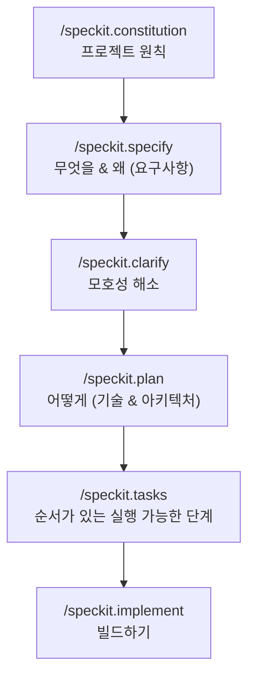

<LevelBadge level="intermediate" />

# Spec Kit을 활용한 명세 주도 개발

바이브 코딩 — "대시보드 만들어줘"라고 하고 돌아오는 결과를 그냥 받아들이는 방식 — 은 기능이 작을 때는 아주 잘 작동합니다. 그러나 기능이 커지면 에이전트가 표류하기 시작합니다. 이전 결정을 잊거나, 함수를 다시 발명하거나, 기술적으로는 실행되지만 의도한 것이 아닌 결과를 내놓습니다. **명세 주도 개발(SDD, Spec-Driven Development)** 은 2026년 에이전트 코딩 커뮤니티 전반에서 자리 잡은 해결책입니다. 프롬프트를 일회용으로 취급하는 대신, **글로 작성되고 검토 가능한 명세를 단일 진실 공급원**으로 삼고 에이전트가 *그것을 바탕으로* 코드를 생성하게 합니다.

GitHub의 오픈소스 **[Spec Kit](https://github.com/github/spec-kit)** 은 그 아이디어를 오늘 바로 Claude Code 안에서 실행할 수 있는 구체적인 워크플로로 바꿔줍니다.

<Callout type="objectives" items={["명세 주도 개발이 무엇인지, 그리고 어떤 문제를 해결하는지 이해하기", "Spec Kit의 단계들 살펴보기: constitution → specify → plan → tasks → implement", "Specify CLI 설치하고 Claude Code와 연결하기", "선택적 품질 게이트(clarify, analyze, checklist) 알아두기", "SDD가 그 오버헤드를 감수할 가치가 있을 때와 건너뛰어야 할 때 판단하기"]} />

<VerifyNote lastVerified="2026-06-28" source="https://github.com/github/spec-kit">
Spec Kit은 빠르게 발전하고 있습니다(~116k★, MIT 라이선스). 명령어 이름, `specify init`의 에이전트 선택 플래그, 지원 도구는 릴리스마다 바뀝니다 — 정확한 구문에 의존하기 전에 저장소 README의 최신 빠른 시작 가이드를 확인하세요. 아래의 슬래시 명령어 이름은 최근 릴리스에서 도입된 `/speckit.*` 네임스페이스를 사용합니다.
</VerifyNote>

## 왜 프롬프트만이 아니라 명세인가

프롬프트는 턴이 끝나는 순간 사라집니다. 반면 **명세는 산출물(artifact)** 입니다. 읽을 수 있고, PR에서 검토할 수 있으며, 수정하고 다시 실행할 수 있습니다. 이 단 하나의 전환이 큰 에이전트 빌드가 잘못되는 세 가지 방식을 모두 바로잡습니다.

- **표류(Drift)** — 아무것도 기록되지 않았기 때문에 에이전트가 이전 결정과 모순됩니다. 명세가 곧 기억입니다.
- **모호성(Ambiguity)** — "멋지게 만들어줘"는 열 가지 다른 의미가 될 수 있습니다. 요구사항을 산문으로 강제로 풀어내면 코드가 존재하기 *전에* 빈틈이 드러나고, 그때가 수정 비용이 가장 쌉니다.
- **검토 불가능한 디프(Unreviewable diffs)** — 2,000줄짜리 생성된 PR은 판단하기 어렵습니다. 검토된 명세 + 계획이 있으면 디프가 놀라움이 아니라 *예상된 것*이 됩니다.

핵심 사고 모델은 이렇습니다. **의도(intent)는 가치가 높고 지속되는 것이며, 코드는 그 하류에 있는 재생성 가능한 산출물이다.** SDD는 Claude Code 자체의 [Plan Mode](/docs/claude-code/plan-mode)의 규율 잡힌 사촌입니다 — 먼저 계획하고 그다음에 빌드한다 — 이를 기능 전체 규모로 확장하고 저장소의 파일로 영속화한 것입니다.

## Spec Kit 워크플로

Spec Kit은 하나의 기능을 슬래시 명령어로 이루어진 짧은 파이프라인으로 구조화합니다. 각 명령어는 Markdown 산출물을 저장소(`.specify/` 아래)에 기록하므로, 모든 단계가 검사 가능하고 버전 관리됩니다.

<Steps items={[{title: "Constitution", body: "프로젝트당 한 번 /speckit.constitution을 실행합니다. 이 명령어는 지배 원칙 — 코드 스타일, 테스트 기준, 협상 불가능한 아키텍처 원칙 — 을 .specify/memory/constitution.md에 기록합니다. 이후의 모든 단계가 이를 기준으로 검증되므로, 이것이 지속되는 가드레일입니다(원칙에 집중한 CLAUDE.md라고 생각하세요)."}, {title: "Specify", body: "/speckit.specify를 실행하고 무엇을(WHAT) 만들고 있으며 왜(WHY) 만드는지 — 사용자 스토리, 요구사항, 성공 기준 — 을 설명합니다. 의도적으로 기술 스택은 다루지 않습니다. 에이전트는 더 진행하기 전에 읽고 수정할 수 있는 구조화된 명세를 생성합니다."}, {title: "Plan", body: "/speckit.plan을 실행하면서 기술적 선택 — 프레임워크, 데이터 저장소, 제약 — 을 제시합니다. 이제 어떻게(HOW)가 작성됩니다: 아키텍처, 컴포넌트, 그리고 이들이 명세를 어떻게 충족하는지. 기술 결정은 명세가 아니라 여기에 들어가므로, 명세는 구현에 독립적인 상태로 유지됩니다."}, {title: "Tasks", body: "/speckit.tasks를 실행하여 계획을 번호가 매겨지고 순서가 있는, 개별적으로 검토 가능한 작은 단계 목록으로 나눕니다. 이것이 빌드를 감사 가능하게 만드는 요소입니다 — 어떤 코드도 작성되기 전에 그 순서를 볼 수 있습니다."}, {title: "Implement", body: "/speckit.implement를 실행하면 에이전트가 작업 목록을 실행하여 계획과 헌법(constitution)을 바탕으로 기능을 빌드합니다. 이전의 각 단계가 검토되었기 때문에, 결과로 나오는 디프는 놀라움이 아니라 예상된 것입니다."}]} />

### 선택적 품질 게이트

기능이 중요도가 높을 때 루프를 더 조여주는 세 가지 명령어가 더 있습니다.

- **`/speckit.clarify`** — 명세에서 충분히 명시되지 않은 영역을 캐묻고, 계획을 세우기 *전에* 타깃 질문을 합니다. `specify` 직후에 실행하는 것이 가장 좋습니다.
- **`/speckit.analyze`** — 명세, 계획, 작업을 일관성과 누락된 범위에 대해 교차 점검합니다.
- **`/speckit.checklist`** — 검증 체크리스트를 생성하여 "완료"가 정의되고 테스트 가능하도록 만듭니다.

<Callout type="tip" items={["/speckit.plan 전에 /speckit.clarify를 실행하세요 — 모호성을 고치는 비용은 아키텍처가 확정되기 전이 가장 쌉니다.", "생성된 각 산출물을 PR처럼 다루세요: 읽고, 수정하고, 그런 다음에야 다음 단계로 넘어가세요.", ".specify/ 산출물을 커밋하세요 — 그것들이 코드 뒤에 있는 의도의 검토 가능한 기록입니다."]} />

## Claude Code로 실행하기

Spec Kit은 슬래시 명령어를 프로젝트에 스캐폴딩해주는 CLI인 **Specify**를 제공합니다. Claude Code를 포함해 30개가 넘는 코딩 에이전트를 지원합니다.

<Steps items={[{title: "Specify CLI 설치", body: "uv를 사용해 저장소에서 설치합니다. (Python + uv 필요.)"}, {title: "프로젝트 초기화", body: ".specify/ 구조와 에이전트 명령어를 스캐폴딩합니다. 새 저장소나 기존 저장소에서 init을 실행하고, 프롬프트가 나오면 에이전트로 Claude Code를 선택하세요(또는 README의 최신 통합 플래그를 전달하세요)."}, {title: "Claude Code를 열고 명령어 확인", body: "프로젝트 폴더에서 claude를 실행합니다. /speckit.constitution, /speckit.specify, /speckit.plan, /speckit.tasks, /speckit.implement가 슬래시 명령어로 나타나면 제대로 연결된 것입니다."}]} />

<PromptCard title="Install the Specify CLI (uv)">{`uv tool install specify-cli --from git+https://github.com/github/spec-kit.git`}</PromptCard>

<PromptCard title="Scaffold spec-driven workflow into a project">{`# new project
specify init my-feature

# or in the current repo
specify init --here`}</PromptCard>

<PromptCard title="Then, inside Claude Code, run the pipeline">{`/speckit.constitution Establish principles: TypeScript strict, tests for every public function, no secrets in code.
/speckit.specify Build a CSV export for the reports page: users pick a date range and download a CSV of matching rows.
/speckit.clarify
/speckit.plan Next.js App Router, server action for the query, stream the CSV; no new dependencies.
/speckit.tasks
/speckit.implement`}</PromptCard>

<Callout type="warning" items={["specify init의 정확한 에이전트 선택 플래그는 릴리스마다 바뀝니다 — 플래그를 무작정 복사하지 말고 README의 빠른 시작 가이드를 확인하세요.", "SDD는 검증의 필요성을 없애주지 않습니다: 생성된 코드를 읽고 실행해보세요. 명세는 디프를 검토 가능하게 만들 뿐, 자동으로 올바르게 만들어주지는 않습니다.", "명세, 계획, 헌법에 절대 비밀이나 자격 증명을 넣지 마세요 — 다른 파일처럼 커밋됩니다."]} />

## 언제 사용할 것인가(그리고 언제 하지 말 것인가)

SDD는 선행 의식을 치르는 대가로 통제력을 얻습니다. 이 거래는 작업이 크거나, 모호하거나, 다른 사람의 검토를 받아야 할 때 가치가 있고 — 그렇지 않을 때는 순전한 오버헤드입니다.

<Callout type="info" items={["SDD를 선택하세요: 그린필드 기능, 여러 파일에 걸친 빌드, 동료가 검토해야 하는 모든 것, 또는 서브에이전트 군단에 넘길 작업.", "SDD를 건너뛰세요: 일회성 스크립트, 사소한 수정, 탐색용 일회용 코드 — 평범한 프롬프트나 Plan Mode가 더 빠릅니다.", "브라운필드에서도 작동합니다: /speckit.specify를 새 프로젝트뿐 아니라 기존 코드베이스의 개선 작업에도 겨누세요."]} />

<Flashcards title="SDD at a glance" cards={[{front: "SDD에서 단일 진실 공급원은 무엇인가?", back: "글로 작성된 명세입니다. 코드는 그 하류에 있는 재생성 가능한 산출물입니다."}, {front: "/speckit.constitution은 무엇을 하는가?", back: "이후의 모든 단계가 기준으로 검증되는, 지속되는 프로젝트 원칙(스타일, 테스트 기준, 아키텍처 규칙)을 기록합니다."}, {front: "기술 스택 결정은 어디에 속하는가?", back: "/speckit.plan에 속합니다 — 명세가 아닙니다. 명세는 구현에 독립적인 상태(무엇을 & 왜)로 유지되고, 계획이 곧 어떻게입니다."}, {front: "무엇이 Spec Kit 빌드를 감사 가능하게 만드는가?", back: "/speckit.tasks가 어떤 코드가 작성되기 전에 순서가 있고 검토 가능한 작업 목록을 생성하며, 각 단계가 검사 가능한 Markdown 산출물을 기록합니다."}, {front: "언제 SDD를 사용하지 말아야 하는가?", back: "일회성 스크립트, 사소한 수정, 또는 일회용 탐색 — 의식의 비용이 그것이 절약해주는 것보다 더 큽니다."}]} />

## 스스로 점검하기

<Quiz title="Check yourself" questions={[{q: "명세 주도 개발의 핵심 아이디어는 무엇인가?", options: ["더 자세한 일회성 프롬프트를 작성한다", "검토 가능한 명세를 단일 진실 공급원으로 삼고 그것을 바탕으로 코드를 생성한다", "계획을 건너뛰고 에이전트가 즉흥적으로 하게 둔다"], answer: 1, explain: "SDD는 의도를 지속되고 가치 높은 산출물로, 코드를 하류의 재생성 가능한 결과물로 취급합니다 — 일회용 프롬프트식 바이브 코딩의 정반대입니다."}, {q: "기술 스택과 아키텍처를 담아야 하는 Spec Kit 단계는 어느 것인가?", options: ["/speckit.specify", "/speckit.plan", "/speckit.constitution"], answer: 1, explain: "specify는 무엇을(WHAT)과 왜(WHY)를 설명하고(구현에 독립적), plan은 어떻게(HOW) — 프레임워크, 데이터 저장소, 아키텍처 — 가 결정되는 곳입니다."}, {q: "언제 명세 주도 개발이 그 오버헤드를 감수할 가치가 없는가?", options: ["동료가 검토해야 하는 여러 파일에 걸친 그린필드 기능", "일회용 한 줄짜리 스크립트나 사소한 수정", "서브에이전트에 넘길 모든 작업"], answer: 1, explain: "SDD의 선행 의식은 크거나, 모호하거나, 검토받는 작업에서 진가를 발휘합니다. 사소한 수정이라면 평범한 프롬프트나 Plan Mode가 더 빠릅니다."}]} />

<Callout type="takeaways" items={["명세 주도 개발은 프롬프트가 아니라 검토 가능한 명세를 단일 진실 공급원으로 삼아, 표류와 모호성, 검토 불가능한 디프를 없앱니다.", "GitHub의 Spec Kit(Specify CLI)은 SDD를 /speckit.* 슬래시 명령어로서 Claude Code에 들여옵니다.", "파이프라인은 constitution → specify → (clarify) → plan → (analyze) → tasks → (checklist) → implement이며, 각 단계가 검사 가능한 산출물을 기록합니다.", "무엇을/왜는 명세에, 어떻게는 계획에 두세요; 다음으로 넘어가기 전에 모든 산출물을 PR처럼 검토하세요.", "크거나, 모호하거나, 검토받는 기능에는 사용하고; 일회용 작업에는 건너뛰세요 — 그리고 언제나 생성된 코드를 검증하세요."]} />

## 다음

- [Plan Mode](/docs/claude-code/plan-mode) — 내장된, 더 가벼운 "빌드 전에 계획하기" 루프
- [Slash Commands](/docs/claude-code/slash-commands) — /speckit.* 명령어가 Claude Code의 명령어 시스템에 어떻게 들어맞는지
- [CLAUDE.md & Memory Files](/docs/claude-code/claude-md) — 헌법(constitution) 뒤에 있는 원칙-을-기억으로 삼는 아이디어
- [Subagents](/docs/claude-code/subagents) — 검토된 작업 목록을 에이전트 군단에 넘기기
- [Coding & Software Development](/docs/playbooks/coding) — SDD가 의존하는 모든 것을 검증하는 사고방식

## 출처 및 더 읽을거리

- [github/spec-kit — Toolkit for Spec-Driven Development](https://github.com/github/spec-kit) (MIT)
- [Spec Kit README & quickstart](https://github.com/github/spec-kit/blob/main/README.md)
- [Anthropic — Plan Mode in Claude Code](https://code.claude.com/docs/en/interactive-mode)
