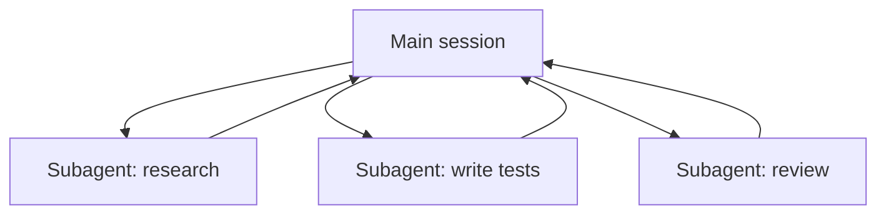

<LevelBadge level="advanced" />

<VerifyNote lastVerified="2026-06-23" source="https://code.claude.com/docs/en/sub-agents">
서브에이전트 frontmatter 필드, 기본 제공 에이전트 목록, 그리고 `/agents` 인터페이스는 시간이 지나면서 바뀝니다 — 공식 문서에서 확인하세요.
</VerifyNote>

**서브에이전트**는 **자체 컨텍스트 윈도우**와 **범위가 지정된 도구 집합**을 가진 별도의 Claude 인스턴스로, 메인 세션이 작업의 일부를 위임하는 대상입니다. 전체 대화 기록이 아니라 결과만 보고하므로 — 메인 세션은 집중을 유지하며 어수선해지지 않습니다.

## 위임하는 이유

- **메인 컨텍스트를 보호합니다.** 리서치 심층 탐색이나 대규모 파일 훑기는 수천 토큰을 소모할 수 있습니다. 서브에이전트에서 수행하면 결론만 돌아옵니다.
- **전문화합니다.** 서브에이전트에 맞춤형 시스템 프롬프트와 필요한 도구만 부여하세요 (예: 읽기 전용 리뷰어).
- **병렬화합니다.** 독립적인 하위 작업을 동시에 실행하세요 — 예: 세 개의 모듈을 동시에 탐색.



## 이미 가지고 있는 기본 제공 에이전트

직접 정의하기 전에, Claude Code가 자동으로 위임하는 서브에이전트를 기본 제공한다는 점을 알아두세요:

- **Explore** — 빠른 읽기 전용 에이전트(더 저렴한 모델에서 실행)로, 코드베이스를 건드리지 않고 검색하고 이해하기 위한 것입니다.
- **Plan** — 플랜 모드 동안 컨텍스트를 수집하여 리서치가 메인의 읽기 전용 대화 밖에 머물게 합니다.
- **General-purpose** — 탐색과 변경을 함께 수행하는 복잡한 다단계 작업을 위한 전체 도구 에이전트입니다.

이들을 이름으로 직접 호출하는 일은 드뭅니다. Claude는 작업이 맞을 때 이들을 끌어옵니다. 커스텀 서브에이전트는 *당신*이 같은 지시로 반복해서 다시 만들게 되는 일꾼들을 위한 것입니다.

## 직접 정의하기

서브에이전트는 YAML frontmatter가 있는 Markdown 파일입니다(본문이 시스템 프롬프트가 됩니다). `name`과 `description`만 필수이고, 나머지는 모두 선택 사항입니다. 프로젝트별로 `.claude/agents/`에 저장하거나(팀이 공유하도록 git에 체크인), 사용자별로 `~/.claude/agents/`에 저장하세요. `/agents` 명령으로 만들거나 직접 손으로 만드세요:

```markdown
---
name: code-reviewer
description: Expert code reviewer. Use proactively after code changes.
tools: Read, Glob, Grep
model: sonnet
---

You are a senior reviewer. Read the changed files, then report only
high-confidence issues: correctness bugs, security risks, and missing
tests. For each, show the file:line, the problem, and a concrete fix.
Do not restate what the code does. Never edit files.
```

서브에이전트를 좋게 만드는 두 가지:

- **`description`이 라우팅 신호입니다.** Claude는 이를 읽고 *언제* 위임할지 결정하므로, 트리거처럼 작성하세요 — "Use proactively after code changes"는 자동으로 끌어들이지만, 모호한 "helps with code"는 그렇지 않습니다. 이것이 파일에서 단일하게 가장 영향력 있는 줄입니다.
- **도구의 범위를 엄격하게 지정하세요.** `tools` 필드는 허용 목록입니다(또는 `disallowedTools`를 거부 목록으로 사용하세요). `Read, Glob, Grep`만 할 수 있는 리뷰어는 실수로라도 코드를 편집할 *수 없습니다* — 이 제약은 힌트가 아니라 보장입니다. `tools`를 생략하면 서브에이전트는 메인 세션이 가진 모든 것을 상속합니다.

## 실전 예시: 병렬 리뷰 팬아웃

세 개의 모듈을 건드린 기능을 끝냈고, 각각을 빠르고 독립적으로 점검하고 싶습니다. 메인 세션에서:

> "`auth/`, `billing/`, `api/`의 변경 사항을 리뷰해줘 — 각각에 code-reviewer 서브에이전트를 병렬로 사용해서."

Claude는 세 개의 `code-reviewer` 인스턴스를 동시에 생성합니다. 각각은 자기 모듈만 읽고, 파일 내용에 자기 컨텍스트를 소모하며, 짧은 발견 사항 목록을 반환합니다. 메인 세션은 원시 diff를 절대 보지 않고 — 세 개의 깔끔한 보고서만 보며 — 전체가 세 리뷰의 합이 아니라 가장 느린 단일 리뷰 인스턴스 정도의 시간에 끝납니다. 리뷰어가 읽기 전용이므로, 동시에 작업하는 세 에이전트는 쓰기에서 충돌할 수 없습니다.

## 병렬화하지 말아야 할 때

:::warning 병렬은 공짜가 아닙니다
- **의존적인 단계**는 순차적이어야 합니다 — 단계 B가 단계 A의 출력을 필요로 하는 작업을 팬아웃하지 마세요.
- **공유 파일 쓰기**는 충돌할 수 있습니다. 격리하거나([Git 워크트리](/docs/claude-code/worktrees) 참조) 직렬화하세요.
- **조율 오버헤드**가 작은 작업에서는 이점을 초과할 수 있습니다. 하위 작업이 규모가 크고 독립적일 때 위임하세요.
:::

## 서브에이전트 대 API/SDK "에이전트"

이 페이지는 Claude Code의 기본 제공 위임에 관한 것입니다. *당신만의* 에이전트를 프로그래밍적으로 구축하는 것은 [API에서 에이전트 구축하기](/docs/api/building-agents)입니다. 멘탈 모델 — 목표, 도구 루프, 격리된 컨텍스트 — 은 동일합니다.

## 흔한 실수

- **모호한 `description`.** 서브에이전트를 *언제* 사용할지 말하지 않으면, Claude는 적절한 순간에 위임하지 않습니다(또는 아예 위임하지 않습니다). "Use when…" / "Use proactively after…"로 시작하세요.
- **도구를 활짝 열어둔 채로 두기.** 리뷰를 목적으로 하는 서브에이전트는 쓰기를 할 수 있으면 안 됩니다. 허용 목록은 의도를 보장으로 바꿉니다.
- **공유 메모리를 기대하기.** 서브에이전트는 자신의 `description`, 자신의 시스템 프롬프트, 그리고 당신이 넘겨준 작업을 받습니다 — 당신의 메인 대화는 받지 않습니다. 위임 시 필요한 컨텍스트를 전달하세요.
- **의존적인 작업을 팬아웃하기.** 병렬성은 *독립적인* 하위 작업에만 도움이 됩니다. B가 A의 출력을 필요로 한다면, 순차적으로 실행하세요.

## 다음

- [멀티 서브에이전트 워크플로우 설계하기 (둘러보기)](/docs/walkthroughs/multi-subagent-workflow)
- [컨텍스트 관리](/docs/claude-code/context-management)
- [Git 워크트리](/docs/claude-code/worktrees)
