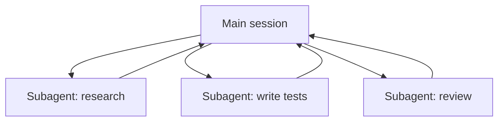

<LevelBadge level="advanced" />

<VerifyNote lastVerified="2026-06-23" source="https://code.claude.com/docs/en/sub-agents">
서브에이전트 frontmatter 필드, 기본 제공 에이전트 목록, 그리고 `/agents` 인터페이스는 시간이 지나며 바뀝니다 — 공식 문서에서 확인하세요.
</VerifyNote>

<Callout type="objectives" items={["서브에이전트란 무엇인가 — 자체 컨텍스트 윈도와 범위가 지정된 도구 세트를 가진 별도의 Claude","위임하는 세 가지 이유: 컨텍스트 보호, 전문화, 병렬화","Claude가 이미 위임하는 기본 제공 에이전트: Explore, Plan, General-purpose","자신만의 서브에이전트를 .claude/agents/에 정의하는 법과 description + tools가 왜 핵심 두 필드인지","언제 병렬화하지 말아야 하는지, 그리고 이것이 API 에이전트 및 대규모(fleet) 워크플로와 어떻게 연결되는지"]} />

**서브에이전트**는 **자체 컨텍스트 윈도**와 **범위가 지정된 도구 세트**를 가진 별도의 Claude 인스턴스로, 메인 세션이 작업 덩어리를 위임하는 대상입니다. 전체 대화 기록이 아니라 결과를 보고하므로 — 메인 세션은 집중을 유지하고 어수선해지지 않습니다.

## 왜 위임하는가

세 가지 일, 하나의 도구. 서브에이전트에 손을 뻗을 때마다 이것을 염두에 두세요:

- **메인 컨텍스트를 보호한다.** 리서치 몰입이나 큰 파일 훑기는 수천 토큰을 태울 수 있습니다. 서브에이전트에서 하면 결론만 돌아옵니다.
- **전문화한다.** 서브에이전트에 맞춤형 시스템 프롬프트와 필요한 도구만(예: 읽기 전용 리뷰어) 줍니다.
- **병렬화한다.** 독립적인 하위 작업을 한 번에 실행합니다 — 예: 세 개의 모듈을 동시에 탐색.

## 이미 가지고 있는 기본 제공 에이전트

자신만의 것을 정의하기 전에, Claude Code가 자동으로 위임하는 서브에이전트를 기본 제공한다는 것을 알아두세요:

| 기본 제공 | 하는 일 |
| --- | --- |
| **Explore** | 코드베이스를 건드리지 않고 검색·이해하기 위한 빠른 읽기 전용 에이전트(더 저렴한 모델에서 실행). |
| **Plan** | plan 모드 중 컨텍스트를 수집해 리서치가 메인의 읽기 전용 대화 밖에 머물게 합니다. |
| **General-purpose** | 탐색과 변경을 섞는 복잡한 다단계 작업을 위한 전체 도구 에이전트. |

이것들을 이름으로 직접 호출하는 경우는 드뭅니다. 작업에 맞을 때 Claude가 알아서 손을 뻗습니다. 커스텀 서브에이전트는 *당신*이 같은 지시로 계속 다시 만드는 일꾼을 위한 것입니다.

## 자신만의 것 정의하기

서브에이전트는 YAML frontmatter를 가진 Markdown 파일입니다(본문이 시스템 프롬프트가 됩니다). `name`과 `description`만 필수이고, 나머지는 선택입니다. 프로젝트별로 `.claude/agents/`에(팀이 공유하도록 git에 커밋) 또는 사용자별로 `~/.claude/agents/`에 저장합니다. `/agents` 명령어로 만들거나 직접 손으로 작성합니다.

<Steps items={[{title: "위치를 고른다", body: "프로젝트별 .claude/agents/(팀이 공유하도록 커밋) 또는 사용자별 ~/.claude/agents/."},{title: "파일을 만든다", body: "/agents 명령어를 쓰거나, YAML frontmatter를 가진 Markdown 파일을 직접 작성합니다."},{title: "필수 필드를 설정한다", body: "name과 description만 필수입니다. 나머지는 모두 선택입니다."},{title: "본문을 시스템 프롬프트로 작성한다", body: "frontmatter 아래의 Markdown 본문이 서브에이전트의 시스템 프롬프트가 됩니다."},{title: "도구 범위를 지정한다", body: "tools 허용목록을 추가해 서브에이전트가 작업에 필요한 것만 할 수 있게 합니다."}]} />

시작용 `code-reviewer` 서브에이전트:

<PromptCard title="code-reviewer 서브에이전트 (.claude/agents/code-reviewer.md)">{`---
name: code-reviewer
description: Expert code reviewer. Use proactively after code changes.
tools: Read, Glob, Grep
model: sonnet
---

You are a senior reviewer. Read the changed files, then report only
high-confidence issues: correctness bugs, security risks, and missing
tests. For each, show the file:line, the problem, and a concrete fix.
Do not restate what the code does. Never edit files.`}</PromptCard>

두 가지가 서브에이전트를 좋게 만듭니다:

- **`description`이 라우팅 신호다.** Claude는 이것을 읽고 *언제* 위임할지 결정하므로 트리거처럼 쓰세요 — "코드 변경 후 능동적으로 사용"은 자동으로 끌어들이고, 모호한 "코드를 돕는다"는 그렇지 않습니다. 파일에서 가장 지렛대가 큰 한 줄입니다.
- **도구를 빡빡하게 범위 지정하라.** `tools` 필드는 허용목록입니다(또는 `disallowedTools`를 거부목록으로 사용). `Read, Glob, Grep`만 할 수 있는 리뷰어는 실수로도 코드를 편집할 수 *없습니다* — 이 제한은 힌트가 아니라 보장입니다. `tools`를 생략하면 서브에이전트는 메인 세션이 가진 모든 것을 상속합니다.

## 실전 예제: 병렬 리뷰 팬아웃

세 모듈에 걸친 기능을 끝내고 각각을 빠르고 독립적으로 점검하고 싶습니다. 메인 세션에서:

<PromptCard title="세 리뷰어를 한 번에 팬아웃">{`Review the changes in auth/, billing/, and api/ — use the code-reviewer subagent on each, in parallel.`}</PromptCard>

Claude는 세 개의 `code-reviewer` 인스턴스를 한 번에 생성합니다. 각각 자기 모듈만 읽고, 파일 내용에 자기 컨텍스트를 태우고, 짧은 발견 목록을 반환합니다. 메인 세션은 원본 diff를 결코 보지 않습니다 — 세 개의 깔끔한 리포트만 봅니다 — 그리고 전체가 세 개를 합친 시간이 아니라 가장 느린 단일 리뷰 인스턴스 정도의 시간에 끝납니다. 리뷰어는 읽기 전용이므로 세 에이전트가 동시에 일해도 쓰기에서 충돌할 수 없습니다.

## 언제 병렬화하지 말아야 하는가

<Callout type="warning" items={["의존 단계는 순차적이어야 합니다 — 단계 B가 단계 A의 출력을 필요로 하는 작업을 팬아웃하지 마세요.","공유 파일 쓰기는 충돌할 수 있습니다. 격리하거나(Git Worktrees 참고) 직렬화하세요.","작은 작업에서는 조율 오버헤드가 이득을 넘어설 수 있습니다. 하위 작업이 상당하고 독립적일 때 위임하세요."]} />

충돌하는 쓰기를 격리하려면 [Git Worktrees](/docs/claude-code/worktrees)를 참고하세요.

## 서브에이전트 vs API/SDK "에이전트"

이 페이지는 Claude Code의 기본 제공 위임에 관한 것입니다. *자신만의* 에이전트를 프로그래밍으로 만드는 것은 [API에서 에이전트 만들기](/docs/api/building-agents)입니다. 멘탈 모델 — 목표, 도구 루프, 격리된 컨텍스트 — 은 동일합니다.

## 흔한 실수

<Flashcards title="함정 — 각 카드를 뒤집어 해결책 보기" cards={[{front: "모호한 description", back: "서브에이전트를 언제 쓸지 말하지 않으면 Claude는 적절한 순간에 위임하지 않습니다(혹은 아예 위임하지 않습니다). \"~할 때 사용\" / \"~후 능동적으로 사용\"으로 시작하세요."},{front: "도구를 활짝 열어둔 것", back: "리뷰용 서브에이전트가 쓰기가 가능해서는 안 됩니다. 허용목록이 의도를 보장으로 바꿉니다."},{front: "공유 메모리를 기대하는 것", back: "서브에이전트는 자신의 description, 시스템 프롬프트, 그리고 당신이 건넨 작업을 받습니다 — 당신의 메인 대화는 아닙니다. 위임할 때 필요한 컨텍스트를 넘기세요."},{front: "의존 작업을 팬아웃하는 것", back: "병렬성은 독립적인 하위 작업에만 도움이 됩니다. B가 A의 출력을 필요로 하면 순차로 실행하세요."}]} />

## 몇 개의 에이전트로 충분하지 않을 때

턴당 소수의 서브에이전트를 위임하는 것이 이 페이지의 기본입니다. 작업이 **수십, 수백** 개의 에이전트를 필요로 할 때 — 코드베이스 전체 훑기, 500개 파일 마이그레이션, 여러 출처에 걸쳐 교차 검증하는 리서치 — 조율은 단일 컨텍스트 윈도를 넘어섭니다. 그것이 [동적 워크플로 & ultracode](/docs/claude-code/dynamic-workflows)가 하는 일입니다: Claude가 계획을 담은 스크립트를 작성하고, 런타임이 에이전트를 백그라운드로 팬아웃합니다.

<Quiz title="스스로 점검하기" questions={[{q: "서브에이전트의 frontmatter에서 Claude가 언제 위임할지 결정하기 위해 읽는 라우팅 신호는 어느 필드인가요?", options: ["name", "description", "model"], answer: 1, explain: "description은 가장 지렛대가 큰 한 줄입니다 — Claude가 이것을 읽고 언제 위임할지 결정합니다. \"코드 변경 후 능동적으로 사용\"처럼 트리거로 쓰세요."}, {q: "리뷰어 서브에이전트에 tools: Read, Glob, Grep이 주어졌습니다. 이 허용목록이 보장하는 것은?", options: ["더 저렴한 모델에서 실행된다", "실수로도 코드를 편집할 수 없다", "메인 세션의 도구를 상속한다"], answer: 1, explain: "tools 필드는 허용목록이므로 Read, Glob, Grep으로 제한된 리뷰어는 쓸 수 없습니다 — 이 제한은 힌트가 아니라 보장입니다. tools를 생략하면 대신 모든 것을 상속합니다."}, {q: "서브에이전트 병렬화가 도움이 되지 않는 때는?", options: ["하위 작업이 독립적이고 상당할 때", "단계 B가 단계 A의 출력을 필요로 할 때", "각 에이전트가 다른 모듈을 읽을 때"], answer: 1, explain: "의존 단계는 순차로 실행해야 합니다. 병렬성은 독립적인 하위 작업에만 도움이 됩니다. B가 A의 출력을 필요로 하면 순차로 실행하세요."}]} />

<Callout type="takeaways" items={["서브에이전트는 자체 컨텍스트 윈도와 범위가 지정된 도구를 가진 별도의 Claude입니다. 대화 기록이 아니라 결과를 반환합니다.","메인 컨텍스트를 보호하려고, 전문화하려고, 또는 독립적인 작업을 병렬화하려고 위임하세요.","Claude는 이미 Explore, Plan, General-purpose 기본 제공을 갖추고 있고 자동으로 손을 뻗습니다.","name과 description만 필수 frontmatter 필드입니다 — 그리고 description은 Claude가 언제 위임할지 결정하는 라우팅 신호입니다.","tools 허용목록은 의도를 보장으로 바꿉니다. 독립적인 하위 작업만 팬아웃하고, 공유 쓰기는 격리하세요."]} />

## 다음

- [동적 워크플로 & ultracode](/docs/claude-code/dynamic-workflows) — 서브에이전트를 대규모로 조율
- [멀티 서브에이전트 워크플로 설계(워크스루)](/docs/walkthroughs/multi-subagent-workflow)
- [컨텍스트 관리](/docs/claude-code/context-management)
- [Git Worktrees](/docs/claude-code/worktrees)
