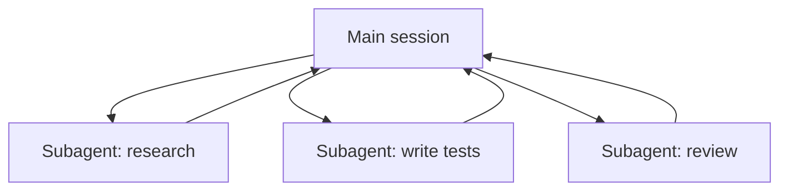

<LevelBadge level="advanced" />

<VerifyNote lastVerified="2026-06-20" source="https://code.claude.com/docs/en/sub-agents">
서브에이전트 설정과 `/agents` 인터페이스는 시간이 지나며 바뀝니다 — 공식 문서에서 확인하세요.
</VerifyNote>

**서브에이전트**는 **자체 컨텍스트 윈도우**와 **범위가 지정된 도구 집합**을 가진 별도의 Claude 인스턴스로, 메인 세션이 작업의 한 덩어리를 위임하는 대상입니다. 그것은 전체 대화 기록이 아니라 결과만 보고하므로 — 메인 세션은 집중되고 어수선하지 않게 유지됩니다.

## 왜 위임하는가

- **메인 컨텍스트를 보호하기.** 리서치 심층 탐구나 큰 파일 훑기는 수천 토큰을 소모할 수 있습니다. 서브에이전트에서 수행하면 결론만 돌아옵니다.
- **전문화하기.** 서브에이전트에 맞춤형 시스템 프롬프트와 필요한 도구만(예: 읽기 전용 리뷰어) 주세요.
- **병렬화하기.** 독립적인 하위 작업을 동시에 실행하세요 — 예: 세 모듈을 동시에 탐색.

## 정의하기

서브에이전트는 프런트매터(이름, 설명, 허용 도구, 때로는 모델)를 가진 Markdown 파일로 구성되며, `/agents` 인터페이스를 통해 관리됩니다. `description`은 메인 에이전트에게 *언제* 위임할지 알려줍니다. 도구는 좁게 범위를 잡으세요 — 리뷰어는 쓰기 권한이 거의 필요 없습니다.

## 언제 병렬화하지 말아야 하는가

:::warning 병렬은 공짜가 아니다
- **의존적인 단계**는 순차적이어야 합니다 — 단계 B가 단계 A의 출력을 필요로 하는 작업을 펼쳐 내보내지 마세요.
- **공유 파일 쓰기**는 충돌할 수 있습니다. 격리하거나([Git 워크트리](/docs/claude-code/worktrees) 참고) 직렬화하세요.
- **조율 오버헤드**가 작은 작업에서는 이익을 초과할 수 있습니다. 하위 작업이 상당히 크고 독립적일 때 위임하세요.
:::

## 서브에이전트 대 API/SDK의 "에이전트"

이 페이지는 Claude Code의 내장 위임에 관한 것입니다. *나만의* 에이전트를 프로그래밍 방식으로 구축하는 것은 [API로 에이전트 구축하기](/docs/api/building-agents)입니다. 멘탈 모델 — 목표, 도구 루프, 격리된 컨텍스트 — 은 동일합니다.

## 다음

- [멀티 서브에이전트 워크플로 설계하기 (워크스루)](/docs/walkthroughs/multi-subagent-workflow)
- [컨텍스트 관리](/docs/claude-code/context-management)
- [Git 워크트리](/docs/claude-code/worktrees)
