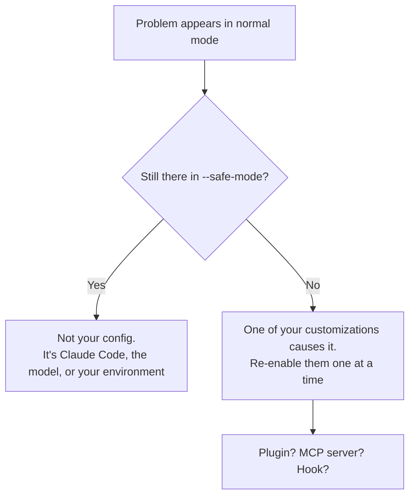

<LevelBadge level="intermediate" />

<Callout type="objectives" items={["증상 표를 이용해 어떤 Claude Code 문제든 한 단계 만에 해당 해결책으로 연결하기", "직접 손으로 디버깅하기 전에 대부분의 설정 문제를 해결하는 두 가지 진단 명령 실행하기", "플러그인, MCP 서버, 훅 중 무엇이 실제 원인인지 격리하기", "네 가지 고전적 런타임 실패 해결하기: 높은 메모리, 멈춤, 압축 반복, 아무것도 찾지 못하는 검색", "버그 리포트를 제출하기 전에 올바른 증거 수집하기"]} />

<VerifyNote lastVerified="2026-07-17" source="https://code.claude.com/docs/en/troubleshooting">
이 페이지의 명령, 플래그, 환경 변수는 공식 Claude Code 문제 해결 문서를 기준으로 검증되었습니다. 진단 기능은 릴리스마다 바뀝니다 — 정확한 플래그에 의존하기 전에 그곳에서 확인하세요.
</VerifyNote>

## 핵심 개념

거의 모든 Claude Code 문제는 두 종류 중 하나이며, 그 해결책은 완전히 다릅니다:

- **설정이 잘못됨** — 플러그인, MCP 서버, 훅, 설정 파일, 누락된 바이너리. 해결책은 *구성*입니다.
- **세션이 부하를 받음** — 컨텍스트 창이 가득 찼거나, 거대한 파일이 메모리를 폭발시켰거나, 터미널이 렌더링하지 못함. 해결책은 *위생 관리*입니다.

어느 쪽인지 추측하는 데서 사람들은 오후 하나를 날립니다. 아래 표는 그 추측을 건너뜁니다.

:::tip 다른 종류의 "이상함"인가요?
이 페이지는 **도구**의 오작동에 관한 것입니다 — 시작되지 않거나, 멈추거나, 검색이 아무것도 못 찾는 경우죠. **모델**이 오작동하는 경우라면 — 사실을 지어내거나, 지시를 잊거나, 합리적인 요청을 거절하는 경우 — 그건 다른 페이지입니다: [Claude가 왜 그랬을까?](/docs/contribute/troubleshooting)
:::

## 여기서 시작: 증상 → 이동할 곳

당신의 증상을 찾으세요. 페이지의 나머지는 읽지 마세요.

| 증상 | 이동할 곳 |
|---|---|
| `command not found`, 설치 실패, `EACCES`, PATH 또는 TLS 오류 | [공식: 설치 및 로그인](https://code.claude.com/docs/en/troubleshoot-install) |
| 로그인 반복, OAuth 오류, `403 Forbidden`, "organization disabled" | [공식: 로그인 및 인증](https://code.claude.com/docs/en/troubleshoot-install#login-and-authentication) |
| 설정이 적용되지 않음, 훅이 실행되지 않음, MCP 서버가 로드되지 않음 | 아래 [설정 격리하기](#설정-격리하기) |
| `API Error: 5xx`, `529 Overloaded`, `429`, 검증 오류 | [오류 및 속도 제한](/docs/api/errors-and-rate-limits) |
| `model not found` / "you may not have access to it" | [현재 모델 및 가격](/docs/whats-new/models-and-pricing) |
| VS Code 또는 JetBrains가 Claude를 감지하지 못함 | [IDE 통합](/docs/claude-code/ide-integrations) |
| 높은 CPU 또는 메모리 | 아래 [메모리와 CPU](#메모리와-cpu) |
| 멈춤, 정지, 무응답 | 아래 [멈춤과 정지](#멈춤과-정지) |
| `Autocompact is thrashing` | 아래 [압축 반복](#압축-반복) |
| 검색, `@file`, 에이전트, 스킬이 파일을 찾지 못함 | 아래 [검색이 아무것도 못 찾음](#검색이-아무것도-못-찾음) |
| IDE 터미널에서 상자, 번짐, 잘못된 글리프 | 아래 [깨진 터미널 텍스트](#깨진-터미널-텍스트) |

## 먼저 실행할 두 가지 명령

직접 손으로 디버깅하기 전에, 내장 점검을 실행하세요. 설치, 설정, 확장, 컨텍스트 사용량을 진단하고 — 확인 후 적용할 수 있는 해결책을 제안합니다.

<Steps items={[{title: "세션 안에서 점검 실행", body: "/doctor(별칭 /checkup)는 설치, 설정, 확장, 컨텍스트 사용량을 검사한 다음, 적용할 수 있는 해결책을 제안합니다. 이것만으로 대부분의 설정 관련 불만이 해결됩니다."}, {title: "Claude Code가 아예 시작조차 하지 않으면 셸에서 실행", body: "claude doctor는 세션 밖에서 동일한 점검을 수행하므로, 망가진 설정이 그것을 진단할 도구를 막을 수 없습니다."}, {title: "문제가 도구나 커넥터 쪽 냄새가 나면, MCP를 따로 확인", body: "/mcp는 구성된 모든 MCP 서버의 실시간 상태를 출력합니다 — 서버가 오작동한 게 아니라 로드에 실패했는지 확인하는 가장 빠른 방법입니다."}]} />

<PromptCard title="망가진 설정 진단하기">{`# inside a session
/doctor

# if the session won't start at all
claude doctor

# check MCP server status
/mcp`}</PromptCard>

## 설정 격리하기

설정이 적용되지 않거나, 훅이 실행되지 않거나, 무언가가 그냥 *이상하다면*, 질문은 결코 "무엇이 망가졌는가"가 아니라 — **당신의 커스터마이징 중 무엇이 망가졌는가**입니다. 그것들을 한꺼번에 제거해서 답하세요.

`--safe-mode`는 모든 커스터마이징을 비활성화한 채로 Claude Code를 시작합니다: 플러그인 없음, MCP 서버 없음, 훅 없음.

<PromptCard title="깨끗한 구성에 대해 테스트하기">{`claude --safe-mode`}</PromptCard>

이것은 깨끗한 이분법적 결과를 제공합니다:



커스터마이징이 원인임을 알게 되면, 이분 탐색을 하세요: 문제가 돌아올 때까지 그룹 단위로 다시 활성화하세요. 원인일 확률이 높은 순서대로 대략 나열하면 [MCP 서버](/docs/claude-code/mcp), [훅](/docs/claude-code/hooks), [플러그인](/docs/claude-code/plugins-marketplaces), [설정](/docs/claude-code/settings)입니다.

<Callout type="tip" items={["--safe-mode는 완전한 고장뿐 아니라 원인 모를 느려짐에도 올바른 첫 수순입니다. 수다스러운 MCP 서버는 둘 다의 매우 흔한 원인입니다."]} />

## 메모리와 CPU

Claude Code는 대부분의 환경에서 동작하지만 큰 코드베이스에서는 실제 자원을 소비할 수 있습니다. 다음을 순서대로 진행하세요 — 비용이 가장 적은 것부터 정렬되어 있습니다.

<Steps items={[{title: "정기적으로 압축하기", body: "/compact를 실행해 컨텍스트를 줄이세요. 부풀어 오른 컨텍스트 창은 무거운 세션의 가장 흔한 단일 원인입니다. /docs/claude-code/context-management를 참고하세요."}, {title: "주요 작업 사이에 재시작하기", body: "무관한 작업으로 전환할 때 하나의 프로세스가 오후 내내 상태를 쌓아두게 두지 말고 Claude Code를 닫고 재시작하세요."}, {title: "큰 빌드 디렉터리 숨기기", body: "빌드 출력물, 캐시, 벤더링된 의존성을 .gitignore에 추가해 애초에 검색이나 읽기에 들어오지 않게 하세요."}, {title: "커스터마이징 배제하기", body: "claude --safe-mode로 재시작하세요. 사용량이 떨어지면 플러그인, MCP 서버, 또는 훅이 원인입니다 — 거기서부터 이분 탐색하세요."}, {title: "여전히 메모리가 높으면 증거 수집하기", body: "/heapdump를 실행해 JavaScript 힙 스냅샷과 메모리 분석을 ~/Desktop(또는 Desktop 폴더가 없는 Linux에서는 홈 디렉터리)에 기록하세요."}]} />

`/heapdump` 분석은 상주 세트 크기(resident set size), JS 힙, 배열 버퍼(array buffers), 그리고 집계되지 않은 네이티브 메모리를 보고합니다. 그 분할이 유용한 부분입니다: 증가가 JavaScript 객체에 있는지 아니면 네이티브 코드 저편에 있는지 알려줍니다. 무엇이 메모리를 살아있게 붙잡고 있는지 살펴보려면, Chrome DevTools의 **Memory → Load**에서 `.heapsnapshot` 파일을 여세요.

<VerifyNote lastVerified="2026-07-17" source="https://code.claude.com/docs/en/troubleshooting">
`/heapdump`는 `~/Desktop`에 기록하며, Desktop 폴더가 없는 Linux 시스템에서는 홈 디렉터리로 폴백합니다. 메모리 문제를 보고할 때 두 파일을 모두 첨부하세요.
</VerifyNote>

## 멈춤과 정지

Claude Code가 응답을 멈추면:

<Steps items={[{title: "현재 작업 취소하기", body: "Ctrl+C를 누르세요. 세션을 죽이지 않고 실행 중인 것을 중단합니다."}, {title: "여전히 무응답이면 터미널 종료하기", body: "터미널을 닫고 재시작하세요. 파괴적으로 느껴지지만, 그렇지 않습니다."}, {title: "중단한 지점에서 이어가기", body: "같은 디렉터리에서 claude --resume를 실행하세요. 재시작은 대화를 잃지 않습니다 — 트랜스크립트는 프로세스보다 오래 살아남습니다."}]} />

<Callout type="tip" items={["긴 대화를 잃을까 봐 두려운 것이 사람들이 멈춤을 죽이는 대신 기다리는 이유입니다. 그러지 마세요 — 같은 디렉터리에서 claude --resume를 하면 세션이 돌아옵니다."]} />

## 압축 반복

이 오류는 경보처럼 보이지만 실제로는 *보호 장치*입니다:

```
Autocompact is thrashing: the context refilled to the limit...
```

이것은 자동 압축이 **성공했음**을 의미합니다 — 그런 다음 파일이나 도구 출력이 즉시 전체 컨텍스트 창을 다시 채우는 일이 연속으로 여러 번 일어난 것입니다. Claude Code는 진전이 없는 루프에 API 호출을 태우기보다 재시도를 멈춥니다.

원인은 거의 항상 지나치게 큰 무언가를 통째로 읽는 것입니다. 당신의 상황에 맞는 해결책을 고르세요:

| 상황 | 해결책 |
|---|---|
| 하나의 거대한 파일이 문제 | 파일 전체 대신 라인 범위나 단일 함수를 읽도록 Claude에게 요청하세요 |
| 컨텍스트에 더 이상 필요 없는 큰 출력물이 있음 | 그것을 버리는 초점을 주며 `/compact` |
| 큰 읽기가 정말로 필요함 | 그것을 [서브에이전트](/docs/claude-code/subagents)로 옮겨 별도의 컨텍스트 창을 소비하게 하세요 |
| 이전 대화가 더 이상 중요하지 않음 | `/clear` |

<PromptCard title="군더더기를 버리는 초점으로 압축하기">{`/compact keep only the plan and the diff`}</PromptCard>

서브에이전트 옵션은 사람들이 잊는 것이며, 종종 최선입니다: 서브에이전트가 *자신의* 컨텍스트에서 거대한 파일을 읽고 결론만 당신에게 반환합니다. [컨텍스트 관리](/docs/claude-code/context-management)와 [서브에이전트](/docs/claude-code/subagents)를 참고하세요.

## 검색이 아무것도 못 찾음

검색 도구, `@file` 멘션, 커스텀 에이전트, 또는 커스텀 스킬이 존재한다고 확신하는 파일을 찾지 못한다면, 번들된 `ripgrep` 바이너리가 당신의 시스템에서 실행되지 못하는 것일 가능성이 높습니다. 해결책은 당신 플랫폼의 자체 `ripgrep`을 설치하고 Claude Code에게 그것을 쓰라고 알려주는 것입니다.

<Steps items={[{title: "당신의 플랫폼용 ripgrep 설치하기", body: "macOS: brew install ripgrep — Ubuntu/Debian: sudo apt install ripgrep — Alpine: apk add ripgrep — Arch: pacman -S ripgrep — Windows: winget install BurntSushi.ripgrep.MSVC"}, {title: "Claude Code에게 번들 바이너리 사용을 멈추라고 알리기", body: "환경에서 USE_BUILTIN_RIPGREP=0을 설정하세요. 이 단계 없이는 ripgrep을 설치해도 아무것도 바뀌지 않습니다."}, {title: "검증하기", body: "실패하던 검색이나 @file 멘션을 다시 실행하세요. 여전히 빈 결과가 나오면 /doctor를 실행하세요."}]} />

<PromptCard title="macOS에서 검색 고치기">{`brew install ripgrep
export USE_BUILTIN_RIPGREP=0`}</PromptCard>

### WSL 예외

WSL에서는 불완전한 검색 결과가 대개 망가진 바이너리 때문이 **아닙니다**. Windows/Linux 파일 시스템 경계를 넘나들며 읽는 것은 디스크 성능 페널티를 수반하므로, 검색은 예상보다 적은 매치를 반환합니다. 검색은 여전히 작동합니다 — 그저 덜 내어줄 뿐입니다.

<Callout type="warning" items={["WSL에서는 결과가 불완전해도 claude doctor가 Search를 OK로 보고합니다. 녹색 점검이 이것을 배제하지 못합니다 — 바로 그 점이 진단을 어렵게 만듭니다."]} />

빠져나가는 세 가지 방법, 좋은 순서대로: 프로젝트를 `/mnt/c/`가 아니라 Linux 파일 시스템(`/home/`)으로 옮기기; WSL을 통하지 말고 Windows에서 Claude Code를 네이티브로 실행하기; 또는 검색을 좁혀 더 적은 파일을 스캔하기 — "auth-service 패키지에서 JWT 검증 로직을 검색해줘"가 "인증 코드 찾아줘"보다 낫습니다.

## 깨진 터미널 텍스트

VS Code, Cursor, 또는 Devin Desktop 통합 터미널 안에서 문자가 상자, 번짐, 또는 잘못된 글리프로 렌더링되는 것은 폰트나 인코딩 문제가 아니라 **GPU 렌더러** 문제입니다.

<PromptCard title="IDE 터미널의 깨진 글리프 고치기">{`/terminal-setup`}</PromptCard>

그것은 `terminal.integrated.gpuAcceleration`을 `"off"`로 설정합니다. 대신 에디터 설정에서 직접 설정하고 창을 다시 로드해도 됩니다 — 같은 결과입니다.

## 큰 표가 잘림

200행이 넘는 마크다운 표는 처음 200행을 렌더링한 뒤 `… N more rows not shown` 줄을 표시합니다. 이것은 **표시 제한일 뿐입니다** — 전체 표는 여전히 대화에 있으며, `/copy`는 모든 행을 복사합니다. 터미널에서 도저히 읽을 수 없을 만큼 큰 표라면, Claude에게 파일로 써 달라고 요청하세요.

<VerifyNote lastVerified="2026-07-17" source="https://code.claude.com/docs/en/troubleshooting">
200행 표시 제한은 Claude Code v2.1.208에서 도입되었습니다. 그 이전에는 모든 행이 렌더링되었으므로, 매우 큰 표가 포함된 세션을 재개하면 다시 렌더링하는 동안 멈출 수 있었습니다.
</VerifyNote>

## 좋은 버그 리포트 작성하기

여기 있는 어떤 것도 맞지 않으면 보고하세요 — 단, 증거를 가져오세요. "느려요"라고 하는 리포트는 아무 데도 가지 못하고, 힙 스냅샷과 `--safe-mode` 결과를 담은 리포트는 고쳐집니다.

<Steps items={[{title: "/doctor와 /mcp 실행하기", body: "점검이 뭐라고 하는지, 그리고 실제로 어떤 MCP 서버가 로드되었는지 기록하세요. 보고되는 버그의 절반은 여기서 답이 나옵니다."}, {title: "--safe-mode가 무언가를 바꾸는지 기록하기", body: "이 한 가지 사실만으로 유지 관리자는 Claude Code를 봐야 할지 당신의 커스터마이징을 봐야 할지 알 수 있습니다. 리포트에서 가장 가치 있는 한 줄입니다."}, {title: "자원 문제에는 산출물 첨부하기", body: "메모리 문제의 경우 /heapdump가 기록한 두 파일 — 스냅샷과 분석 — 을 모두 첨부하세요."}, {title: "보내기", body: "Claude Code 안에서 /feedback을 사용해 Anthropic에 직접 보고하거나, 먼저 github.com/anthropics/claude-code에서 알려진 이슈가 있는지 확인하세요."}]} />

<Callout type="takeaways" items={["/doctor(별칭 /checkup)를 먼저 실행하세요 — 세션이 시작되지 않으면 셸에서 claude doctor로. 설치, 설정, 확장, 컨텍스트 사용량을 진단하고 해결책을 적용할 수 있습니다.", "claude --safe-mode는 모든 커스터마이징을 한꺼번에 비활성화합니다. 문제가 그것을 견디고 살아남는지가 당신이 모을 수 있는 가장 유익한 단일 사실입니다.", "높은 메모리: /compact, 작업 사이 재시작, 빌드 디렉터리 .gitignore, 그다음 --safe-mode, 그다음 증거를 위한 /heapdump.", "멈춤은 대화를 잃은 것이 아닙니다 — Ctrl+C, 그다음 터미널 재시작, 그다음 같은 디렉터리에서 claude --resume.", "Autocompact 반복은 지나치게 큰 읽기 하나가 창을 다시 채운다는 뜻입니다. 청크 단위로 읽거나, 초점을 주며 /compact 하거나, 읽기를 서브에이전트에 위임하세요.", "검색이 아무것도 못 찾으면 대개 번들된 ripgrep이 실행되지 못하는 것입니다: 당신 플랫폼의 ripgrep을 설치하고 USE_BUILTIN_RIPGREP=0도 설정하세요. WSL에서는 대신 파일 시스템 경계 페널티이며 — claude doctor는 여전히 Search를 OK로 보고합니다."]} />

<Quiz title="스스로 점검하기" questions={[{q: "훅이 실행되지 않고 설정이 무시되는 것 같습니다. 시도해볼 가장 유익한 한 가지는 무엇인가요?", options: ["Claude Code 재설치", "claude --safe-mode를 실행하고 문제가 살아남는지 보기", "CLAUDE.md 삭제"], answer: 1, explain: "--safe-mode는 모든 커스터마이징을 한꺼번에 비활성화합니다. 문제가 사라지면 플러그인, MCP 서버, 또는 훅 중 하나가 원인이며 이분 탐색할 수 있습니다. 살아남으면 당신의 설정이 원인이 아니며 — 그것을 아는 것도 똑같이 유용합니다."}, {q: "Claude Code가 작업 도중 멈추고 Ctrl+C가 도움이 안 됩니다. 터미널을 닫습니다. 당신의 대화는 어떻게 되나요?", options: ["잃어버립니다 — 그래서 멈춤을 죽이지 말고 기다려야 합니다", "살아남습니다 — 같은 디렉터리에서 claude --resume를 실행하세요", "먼저 /compact를 실행한 경우에만 저장됩니다"], answer: 1, explain: "재시작은 대화를 잃지 않습니다. 같은 디렉터리에서 claude --resume를 실행해 세션을 다시 이어가세요. 트랜스크립트를 잃을까 봐 두려운 것이 바로 사람들이 불필요하게 멈춤을 기다리는 이유입니다."}, {q: "'Autocompact is thrashing: the context refilled to the limit...'가 보입니다. 실제로 무슨 일이 일어난 건가요?", options: ["압축이 실패했고 컨텍스트가 손상되었다", "압축은 성공했지만, 파일이나 도구 출력이 즉시 창을 연속으로 여러 번 다시 채웠다", "플랜의 토큰이 소진되었다"], answer: 1, explain: "압축은 성공했습니다 — 그런 다음 지나치게 큰 무언가가 컨텍스트를 반복해서 다시 채웠습니다. Claude Code는 진전이 없는 루프에 API 호출을 태우지 않으려고 재시도를 멈춥니다. 지나치게 큰 읽기를 고치세요: 청크로 나누거나, 초점을 주며 /compact 하거나, 서브에이전트로 옮기세요."}, {q: "@file 멘션이 아무것도 못 찾아서 brew로 ripgrep을 설치했는데, 검색이 여전히 안 됩니다. 무엇을 놓쳤나요?", options: ["기기를 재시작해야 한다", "번들된 것 대신 당신의 바이너리를 쓰도록 USE_BUILTIN_RIPGREP=0도 설정해야 한다", "brew는 잘못된 버전을 설치한다 — apt를 쓰세요"], answer: 1, explain: "ripgrep만 설치하는 것으로는 아무것도 바뀌지 않습니다. 실행되지 못한 번들 바이너리 대신 당신의 플랫폼 바이너리를 쓰도록 Claude Code에게 알리려면 환경에서 USE_BUILTIN_RIPGREP=0을 설정해야 합니다."}, {q: "WSL에서 검색이 예상보다 적은 매치를 반환하는데 claude doctor는 Search를 OK로 보고합니다. 무슨 일인가요?", options: ["doctor가 거짓말을 한다 — ripgrep 바이너리가 망가졌다", "Windows/Linux 파일 시스템 경계를 넘나들며 읽는 데 디스크 페널티가 있어, 검색이 작동은 하되 덜 내어준다", "프로젝트가 너무 커서 인덱싱할 수 없다"], answer: 1, explain: "WSL에서는 파일 시스템 간 읽기 페널티 때문에 검색이 네이티브 파일 시스템보다 적은 결과를 반환합니다. 여전히 작동하므로 doctor는 Search를 OK로 보고하며 — 바로 그 점이 발견을 어렵게 만듭니다. 프로젝트를 /home/로 옮기거나, Windows에서 네이티브로 실행하거나, 더 좁은 검색을 제출하세요."}]} />

## 다음

- [Claude가 왜 그랬을까?](/docs/contribute/troubleshooting) — 도구가 아니라 *모델의* 행동을 문제 해결하기
- [컨텍스트 관리](/docs/claude-code/context-management) — `/compact` 대 `/clear`, 그리고 세션을 가볍게 유지하기
- [오류 및 속도 제한](/docs/api/errors-and-rate-limits) — API에서의 `429`, `529`, 그리고 재시도 전략
- [MCP 토큰 비용](/docs/claude-code/mcp-token-cost) — 연결된 서버가 조용히 문제일 때
