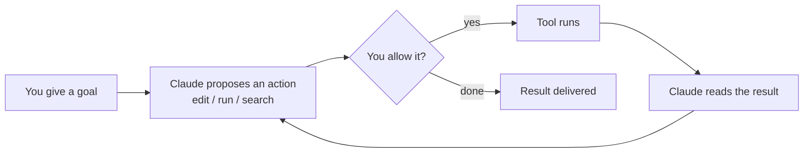

<LevelBadge level="beginner" />

<VerifyNote lastVerified="2026-06-27" source="https://code.claude.com/docs/en/overview">
설치 명령어와 정확한 기능 세트는 자주 바뀝니다. 설정에 대해서는 공식 Claude Code 문서를 진실의 출처로 삼으세요.
</VerifyNote>

<Callout type="objectives" items={["Claude Code를 단순한 채팅 창이 아니라 에이전트형으로 만드는 것이 무엇인지 설명하기", "에이전트 루프 그리기: 목표, 행동, 허가, 관찰, 반복", "Claude Code가 실행되는 표면들과 설정이 어떻게 함께 따라오는지 이름 대기", "레버리지 순서대로 설정할 것들을 정렬하기, CLAUDE.md부터", "Plan Mode로 안전한 첫 세션의 형태 걸어보기"]} />

**Claude Code**는 Anthropic의 *에이전트형* 코딩 도구입니다. 채팅 창과 달리, 실제로 **프로젝트에서 일을 할 수 있습니다**: 파일을 읽고 편집하고, 셸 명령을 실행하고, 코드베이스를 검색하고, 외부 도구를 호출합니다 — 모두 당신의 허가 아래에서.

## 멘탈 모델: 에이전트 루프

이것이 나머지 모든 것을 이해되게 만드는 하나의 아이디어입니다. 당신은 평범한 언어로 목표를 줍니다("auth 모듈에 테스트를 추가하고 실패하는 것을 고쳐"). Claude는 **계획하고, 행동하고, 결과를 관찰하고, 반복**하며 목표가 달성될 때까지 진행합니다. 당신은 [permissions](/docs/claude-code)와 [Plan Mode](/docs/claude-code)를 통해 통제를 유지합니다.

<Callout type="tip" items={["루프는 당신이 허가한 행동에서만 전진합니다. 그 허가 관문을 통과하지 않고는 아무것도 편집되거나 실행되지 않습니다 — 바로 그래서 다음 섹션들이 중요합니다."]} />

## 어디에서 실행할 수 있는가

같은 Claude Code가 표면을 넘어 당신을 따라옵니다 — 당신이 일하는 어디서든 **설정, 훅, 권한을 공유**합니다.

- **터미널(CLI)** — 원조 표면. 어떤 셸에서도 작동합니다.
- **IDE 확장** — 인라인 diff를 갖춘 VS Code와 JetBrains.
- **데스크톱과 웹** — 그리고 표면을 넘어 설정, 훅, 권한을 공유합니다.

## 설정할 것들(대략 레버리지 순서로)

이것을 사다리로 생각하세요: 먼저 위쪽 단을 익히고, 진짜 필요가 생길 때만 파워 기능을 얹으세요.

<Steps items={[{title: "CLAUDE.md", body: "지속적인 프로젝트 지시. 가장 큰 임팩트, 가장 적은 노력 — 여기서 시작하세요."}, {title: "Plan Mode", body: "어떤 편집도 실행되기 전에 조사하고 제안합니다."}, {title: "Permissions", body: "Claude가 묻지 않고 무엇을 할 수 있는지 결정합니다."}, {title: "settings.json", body: "모든 것 아래에 있는 전체 설정 시스템."}, {title: "파워 기능", body: "슬래시 명령어, 훅, 스킬, 서브에이전트, MCP 서버 — 필요할 때 얹습니다."}]} />

각 단은 자기 레슨으로 연결됩니다: [CLAUDE.md](/docs/claude-code), [Plan Mode](/docs/claude-code), [Permissions](/docs/claude-code), [settings.json](/docs/claude-code), [슬래시 명령어](/docs/claude-code), [훅](/docs/claude-code), [스킬](/docs/claude-code), [서브에이전트](/docs/claude-code), [MCP 서버](/docs/claude-code).

## 당신의 첫 세션(그 형태)

<Steps items={[{title: "설치하고 인증한다", body: "현재 명령어는 공식 문서를 참고하세요."}, {title: "프로젝트를 연다", body: "프로젝트로 cd 한 뒤 Claude Code를 시작합니다."}, {title: "시작용 CLAUDE.md를 생성한다", body: "/init을 실행해 프로젝트 지시를 스캐폴딩합니다."}, {title: "작고 구체적인 것을 물어본다", body: "시도: 이 앱에서 라우팅이 어떻게 작동하는지 설명해."}, {title: "먼저 Plan Mode에서 변경한다", body: "제안된 계획을 검토한 뒤 실행하게 하세요."}]} />

그 첫 세션에서 외워둘 만한 두 명령:

<PromptCard title="프로젝트 지시 스캐폴딩">{`/init`}</PromptCard>

<PromptCard title="안전한 읽기 전용 첫 질문">{`Explain how routing works in this app.`}</PromptCard>

현재의 설치 및 인증 명령어는 [공식 문서](https://code.claude.com/docs/en/overview)를 참고하세요.

<Callout type="tip" items={["읽기 전용으로 시작하세요. 첫 실제 작업은 Plan Mode를 쓰세요 — Claude가 파일을 건드리지 않고 조사한 뒤 계획을 보여줍니다. 신뢰를 쌓는 가장 안전한 방법입니다."]} />

## 한눈에 보는 핵심 용어

<Flashcards title="Claude Code 어휘" cards={[{front: "에이전트형 도구", back: "프로젝트에서 행동을 취하는 도구 — 파일 읽기/편집, 명령 실행, 코드 검색, 외부 도구 호출 — 단순한 채팅 창이 아닙니다."}, {front: "에이전트 루프", back: "평범한 언어로 된 목표, 그다음 Claude가 계획하고, 행동하고, 결과를 관찰하고, 목표가 달성될 때까지 반복합니다."}, {front: "Plan Mode", back: "Claude가 어떤 편집도 실행되기 전에 조사하고 계획을 제안합니다 — 가장 안전한 시작 방법."}, {front: "CLAUDE.md", back: "지속적인 프로젝트 지시. 가장 큰 임팩트, 가장 적은 노력. /init으로 생성합니다."}, {front: "Permissions", back: "통제 관문: Claude가 먼저 묻지 않고 무엇을 할 수 있는지."}]} />

<Quiz title="스스로 점검하기" questions={[{q: "Claude Code가 채팅 창과 다른 점은?", options: ["더 긴 답을 씁니다", "허가 아래 프로젝트에서 행동을 취합니다 — 파일 편집, 명령 실행, 코드 검색", "터미널에서만 작동합니다"], answer: 1, explain: "Claude Code는 에이전트형입니다: 당신의 허가 아래 프로젝트에서 행동합니다(파일 읽기/편집, 셸 명령 실행, 검색, 도구 호출)."}, {q: "에이전트 루프에서 Claude가 행동을 제안한 직후에 무슨 일이 일어나나요?", options: ["도구가 자동으로 실행됩니다", "당신이 허가할지 결정합니다", "결과가 전달됩니다"], answer: 1, explain: "제안된 모든 행동은 허가 관문을 통과합니다 — 도구는 당신이 허가해야만 실행됩니다."}, {q: "가장 적은 노력으로 가장 큰 임팩트를 내는 설정 단계는?", options: ["MCP 서버", "훅", "CLAUDE.md"], answer: 2, explain: "CLAUDE.md — 지속적인 프로젝트 지시 — 는 가장 적은 노력으로 가장 큰 임팩트를 내기 때문에 첫 번째로 나열됩니다."}]} />

<Callout type="takeaways" items={["Claude Code는 에이전트형입니다: 단순히 채팅하는 게 아니라 당신의 허가 아래 프로젝트에서 행동합니다.", "루프는 목표, 제안, 허가, 실행, 관찰, 반복입니다 — 당신은 권한과 Plan Mode로 통제합니다.", "터미널, VS Code/JetBrains, 데스크톱과 웹에서 실행되며 표면을 넘어 설정, 훅, 권한을 공유합니다.", "레버리지로 설정하세요: CLAUDE.md 먼저, 그다음 Plan Mode, Permissions, settings.json, 그다음 파워 기능.", "편집을 실행하게 하기 전에 첫 세션을 Plan Mode에서 읽기 전용으로 시작해 신뢰를 쌓으세요."]} />

## 다음

- 가장 레버리지 높은 설정 → [CLAUDE.md & 메모리 파일](/docs/claude-code)
- 처음부터 끝까지 해보기 → [워크스루: 실제 리포에 맞게 Claude Code 커스터마이즈](/docs/walkthroughs)
- 자신만의 자동화 만들기 → [템플릿 & 레시피](/docs/templates)
