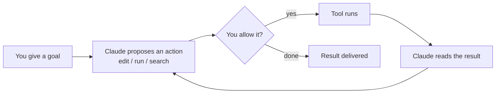

<LevelBadge level="beginner" />

<VerifyNote lastVerified="2026-06-20" source="https://docs.anthropic.com/en/docs/claude-code/overview">
설치 명령어와 정확한 기능 집합은 자주 바뀝니다. 설정에 관해서는 공식 Claude Code 문서를 신뢰할 수 있는 출처로 삼으세요.
</VerifyNote>

**Claude Code**는 Anthropic의 *에이전트형* 코딩 도구입니다. 채팅 창과 달리, **프로젝트 안에서 실제로 작업을 수행할 수 있습니다**: 파일을 읽고 편집하고, 셸 명령을 실행하고, 코드베이스를 검색하고, 외부 도구를 호출하는 것까지 — 모두 사용자의 허가하에 이루어집니다.

## 멘탈 모델: 에이전트 루프

이것이 나머지 모든 것을 이해하게 만드는 핵심 아이디어입니다:

자연어로 목표를 제시합니다("auth 모듈에 테스트를 추가하고 실패하는 것을 고쳐줘"). Claude는 목표가 달성될 때까지 **계획하고, 행동하고, 결과를 관찰하고, 반복합니다**. 사용자는 [권한](/docs/claude-code)과 [플랜 모드](/docs/claude-code)를 통해 통제권을 유지합니다.

## 어디에서 실행할 수 있는가

- **터미널 (CLI)** — 원조 환경이며, 어떤 셸에서도 작동합니다.
- **IDE 확장** — VS Code와 JetBrains에서 인라인 diff와 함께 사용할 수 있습니다.
- **데스크톱과 웹** — 그리고 설정, 훅, 권한을 여러 환경에 걸쳐 공유합니다.

## 무엇을 설정하게 되는가 (대략적인 레버리지 순서)

1. **[CLAUDE.md](/docs/claude-code)** — 지속적인 프로젝트 지침. 가장 큰 효과, 가장 적은 노력.
2. **[플랜 모드](/docs/claude-code)** — 어떤 편집이 실행되기 *전에* 조사하고 제안합니다.
3. **[권한](/docs/claude-code)** — Claude가 묻지 않고 할 수 있는 일.
4. **[settings.json](/docs/claude-code)** — 전체 설정 시스템.
5. **[슬래시 명령](/docs/claude-code)**, **[훅](/docs/claude-code)**, **[스킬](/docs/claude-code)**, **[서브에이전트](/docs/claude-code)**, **[MCP 서버](/docs/claude-code)** — 필요에 따라 단계적으로 추가하는 고급 기능.

## 첫 세션 (그 흐름)

1. 설치하고 인증합니다 (현재 명령어는 [공식 문서](https://docs.anthropic.com/en/docs/claude-code/overview)를 참고하세요).
2. 프로젝트로 `cd` 한 뒤 Claude Code를 시작합니다.
3. `/init`을 실행해 시작용 **CLAUDE.md**를 생성합니다.
4. 작고 구체적인 것을 요청합니다: *"이 앱에서 라우팅이 어떻게 작동하는지 설명해줘."*
5. 그다음 **플랜 모드**에서 먼저 변경을 시도하고, 계획을 검토한 뒤 실행하게 합니다.

:::tip 읽기 전용으로 시작하세요
첫 실전 작업에는 [플랜 모드](/docs/claude-code)를 사용하세요 — Claude는 파일을 건드리지 않고 조사한 뒤 계획을 보여줍니다. 신뢰를 쌓는 가장 안전한 방법입니다.
:::

## 다음

- 가장 레버리지가 큰 설정 → [CLAUDE.md & 메모리 파일](/docs/claude-code)
- 처음부터 끝까지 해보기 → [워크스루: 실제 저장소에 맞게 Claude Code 커스터마이즈하기](/docs/walkthroughs)
- 나만의 자동화 만들기 → [템플릿 & 레시피](/docs/templates)
