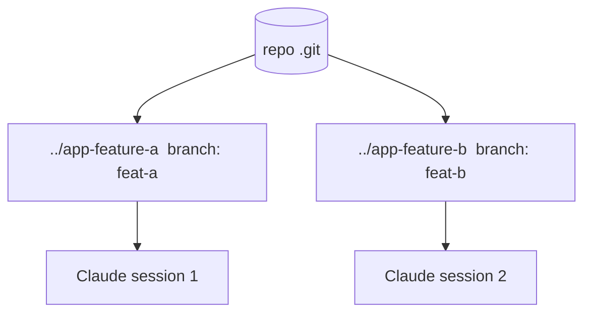

<LevelBadge level="advanced" />

<Callout type="objectives" items={["git 워크트리란 무엇인가 — 하나의 리포, 여러 작업 디렉터리, 각각 자기 브랜치","정확히 무슨 문제를 푸는가: 병렬 Claude 세션이 같은 파일에서 충돌하는 것을 막기","워크트리를 추가·나열·제거하는 네 개의 명령","이 기법이 값을 하는 때 — 그리고 병합 시점에 무는 세 가지 함정","워크트리가 서브에이전트와 어떻게 조합되는가: 세션 간 병렬성 대 세션 내 병렬성"]} />

**git 워크트리**는 하나의 저장소가 **여러 작업 디렉터리**를 갖게 하며, 각각 다른 브랜치로 체크아웃됩니다. 이것을 Claude Code와 짝지으면 같은 프로젝트에서 **여러 세션을 병렬로** 실행할 수 있습니다 — 각각 자기 파일을 편집하며 충돌 없이.

## 이것이 푸는 문제

두 Claude 세션이 같은 작업 디렉터리를 동시에 편집하면 서로의 변경에 걸려 넘어집니다. 워크트리는 각 세션에 **자기 디렉터리와 브랜치**를 주므로, 병렬 작업은 당신이 병합할 때까지 격리된 채로 유지됩니다.

## 기본

네 개의 명령이 전체 워크플로를 감당합니다: 워크트리 추가(새 디렉터리 + 새 브랜치), 존재하는 것 나열, 끝나면 하나 제거.

<Steps items={[{title: "기능용 워크트리를 추가한다", body: "리포에서 git worktree add ../app-feature-a -b feat-a 는 새 디렉터리와 새 브랜치를 한 번에 만듭니다."},{title: "수정용으로 또 하나 추가한다", body: "git worktree add ../app-fix-123 -b fix-123 — 첫 번째와 나란히 있는 두 번째 격리 디렉터리/브랜치."},{title: "가진 것을 본다", body: "git worktree list 는 모든 작업 디렉터리와 각각의 브랜치를 보여줍니다."},{title: "끝나면 정리한다", body: "git worktree remove ../app-feature-a 는 워크트리를 없애 낡은 디렉터리가 쌓이지 않게 합니다."}]} />

<PromptCard title="네 명령 워크플로">{`# from your repo
git worktree add ../app-feature-a -b feat-a   # new dir + new branch
git worktree add ../app-fix-123 -b fix-123
git worktree list
# when done with one:
git worktree remove ../app-feature-a`}</PromptCard>

각 워크트리 디렉터리에서 Claude Code 세션을 열고 독립적으로 일하게 하세요.

## 값을 하는 때

- 동시에 진행하고 싶은 **병렬 기능/수정**.
- 다른 곳에서 계속 작업하는 동안 한 워크트리에서 **오래 걸리는 작업**.
- 메인 체크아웃에서 격리된 **위험한 실험**.

## 함정

<Callout type="warning" items={["병합 되돌리기를 주의하세요: 브랜치는 결국 병합됩니다 — 충돌은 그때 드러나며, 작업 중에는 아닙니다. 워크트리를 집중되고 짧게 유지하세요.","상태를 가진 공유 리소스(하나의 개발 DB, 하나의 포트)를 분리하지 않고 두 워크트리에서 실행하지 마세요.","git worktree remove로 정리해 낡은 디렉터리가 쌓이지 않게 하세요."]} />

## 워크트리 vs 서브에이전트

두 가지 다른 병렬성 축 — 서로 경쟁하지 않고 쌓입니다.

| | 무엇을 병렬화하나 | 격리 |
| --- | --- | --- |
| **[서브에이전트](/docs/claude-code/subagents)** | 하나의 세션 *안에서*의 작업(위임) | 격리된 컨텍스트 |
| **워크트리** | 디스크 상 세션 *간의* 작업 | 격리된 브랜치/파일 |

이들은 잘 조합됩니다: 워크트리 안의 세션이 스스로 서브에이전트를 생성할 수 있습니다.

<Callout type="tip" items={["두 Claude 세션이 같은 리포를 동시에 건드려야 할 때 워크트리를 쓰세요. 한 세션이 작업 덩어리를 격리된 컨텍스트로 넘겨야 할 때 서브에이전트를 쓰세요."]} />

<Quiz title="스스로 점검하기" questions={[{q: "git 워크트리가 주는 것은?", options: ["단일 작업 디렉터리 안의 여러 브랜치", "하나의 리포에 대한 여러 작업 디렉터리, 각각 자기 브랜치", ".git 폴더의 백업 사본"], answer: 1, explain: "git 워크트리는 하나의 저장소가 여러 작업 디렉터리를 갖게 하며, 각각 다른 브랜치로 체크아웃됩니다 — 그래서 병렬 세션이 충돌하지 않습니다."}, {q: "새 디렉터리와 새 브랜치를 한 단계에 만드는 명령은?", options: ["git worktree list", "git worktree add ../app-feature-a -b feat-a", "git worktree remove ../app-feature-a"], answer: 1, explain: "git worktree add ../app-feature-a -b feat-a 는 새 디렉터리와 새 브랜치를 함께 만듭니다. list는 기존 워크트리를 보여주고, remove는 하나를 없앱니다."}, {q: "병렬 워크트리에서 병합 충돌이 실제로 드러나는 때는?", options: ["두 세션이 편집하는 동안 계속", "작업 중이 아니라 병합 되돌리기 시점에", "브랜치가 격리되므로 결코 없음"], answer: 1, explain: "브랜치는 작업하는 동안 격리된 채로 유지되므로 충돌은 작업 중에 나타나지 않습니다 — 병합 되돌리기 시점에 드러납니다. 워크트리를 집중되고 짧게 유지해 이를 제한하세요."}, {q: "워크트리와 서브에이전트는 어떻게 관련되나요?", options: ["이름만 두 개인 같은 기능이다", "워크트리는 디스크 상 세션 간을 병렬화하고, 서브에이전트는 하나의 세션 안을 병렬화한다 — 그리고 조합된다", "하나를 골라야 한다; 둘 다 쓰면 격리가 깨진다"], answer: 1, explain: "서브에이전트는 하나의 세션 안의 병렬성(격리된 컨텍스트)이고, 워크트리는 디스크 상 세션 간의 병렬성(격리된 브랜치/파일)입니다. 워크트리 안의 세션이 스스로 서브에이전트를 생성할 수 있습니다."}]} />

<Callout type="takeaways" items={["git 워크트리 = 하나의 리포, 여러 작업 디렉터리, 각각 자기 브랜치 — 충돌 없는 병렬 Claude 세션의 기반.","하나의 작업 디렉터리에 두 세션은 서로 걸려 넘어집니다. 세션당 워크트리 하나가 병합 전까지 파일과 브랜치를 격리합니다.","git worktree add ../dir -b branch 는 디렉터리 + 브랜치를 만들고, list는 보여주고, remove는 정리합니다.","병렬 기능/수정, 다른 작업과 나란히 오래 걸리는 작업, 격리된 위험한 실험에 값을 합니다.","병합 되돌리기를 조심하고, 상태를 가진 리소스(DB, 포트)를 워크트리 간에 공유하지 말고, 항상 정리하세요 — 그리고 워크트리는 서브에이전트와 조합됨을 기억하세요."]} />

## 다음

- [서브에이전트 & 병렬 에이전트](/docs/claude-code/subagents)
- [헤드리스 모드 & Agent SDK](/docs/claude-code/headless-and-agent-sdk)
- [컨텍스트 관리](/docs/claude-code/context-management)
