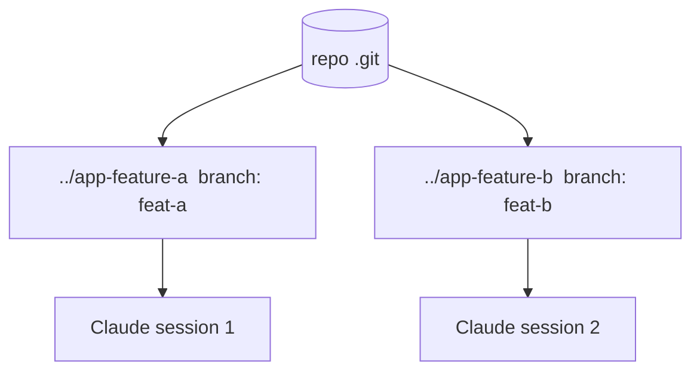

<LevelBadge level="advanced" />

**git 워크트리**는 하나의 저장소가 **여러 작업 디렉터리**를 가질 수 있게 하며, 각 디렉터리는 서로 다른 브랜치로 체크아웃됩니다. 이를 Claude Code와 결합하면 같은 프로젝트에서 **여러 세션을 병렬로** 실행할 수 있습니다 — 각자 자신의 파일을 편집하면서 충돌이 없습니다.

## 해결하는 문제

두 Claude 세션이 같은 작업 디렉터리를 동시에 편집하면 서로의 변경 사항에 걸려 넘어집니다. 워크트리는 각 세션에 **자신의 디렉터리와 브랜치**를 주므로, 병합할 때까지 병렬 작업이 격리된 채로 유지됩니다.



## 기본 사용법

```bash
# from your repo
git worktree add ../app-feature-a -b feat-a   # new dir + new branch
git worktree add ../app-fix-123 -b fix-123
git worktree list
# when done with one:
git worktree remove ../app-feature-a
```

각 워크트리 디렉터리에서 Claude Code 세션을 열고 독립적으로 작업하게 하세요.

## 언제 가치가 있는가

- 동시에 진행하고 싶은 **병렬 기능/수정**.
- 한 워크트리에서 **장시간 작업이 실행되는 동안** 다른 워크트리에서 계속 작업하기.
- 메인 체크아웃에서 격리된 **위험한 실험**.

## 함정

:::warning 병합 시점을 주의하세요
- 브랜치는 결국 **병합**됩니다 — 충돌은 그때 드러나지, 작업 중에 드러나지 않습니다. 워크트리를 집중되고 단명하게 유지하세요.
- 둘을 분리하지 않은 채 두 워크트리에서 **상태를 가진 공유 자원**(하나의 개발 DB, 하나의 포트)을 실행하지 마세요.
- `git worktree remove`로 정리해 오래된 디렉터리가 쌓이지 않게 하세요.
:::

## 워크트리 대 서브에이전트

- **[서브에이전트](/docs/claude-code/subagents)** = 하나의 세션 *내부*의 병렬성(위임, 격리된 컨텍스트).
- **워크트리** = 디스크상 세션 *간*의 병렬성(격리된 브랜치/파일). 둘은 잘 조합됩니다: 워크트리 안의 세션이 스스로 서브에이전트를 띄울 수 있습니다.

## 다음

- [서브에이전트 & 병렬 에이전트](/docs/claude-code/subagents)
- [헤드리스 모드 & Agent SDK](/docs/claude-code/headless-and-agent-sdk)
- [컨텍스트 관리](/docs/claude-code/context-management)
