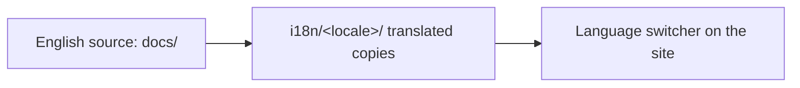

<LevelBadge level="intermediate" />

AILmanac은 영어 우선이지만 **번역되도록 설계되었습니다** — 그것이 "세상 모두에게" 도달하는 방법입니다. 여러분의 언어로 가져오고 싶다면, 그 경로는 다음과 같습니다.

## 여기서 i18n이 작동하는 방식

이 사이트는 Docusaurus에 내장된 국제화 기능을 사용합니다. **영어가 표준 원본입니다.** 로케일은 번역된 파일들의 병렬 집합이며, 로케일이 활성화되면 Docusaurus가 언어 전환기를 제공합니다.

## 황금률: 출시 전에 책임지기

:::warning 프로덕션에 반쪽짜리 번역은 금지
로케일은 **누군가 유지보수를 약속한 경우에만 프로덕션에서 활성화됩니다.** 30%만 번역되고 몇 달째 방치된 로케일은 번역이 아예 없는 것보다 신뢰도에 더 해롭습니다. 일부 페이지를 산발적으로 흩뿌리기보다 *완전한 섹션 하나*를 제대로 번역하는 것이 낫습니다.
:::

## 번역에 기여하는 방법

1. **이슈를 엽니다**(*translation* 템플릿 사용). 어떤 언어와 어떤 섹션을 맡을지 명시합니다.
2. 먼저 **일관된 덩어리를 번역합니다** — 예를 들어 *Start Here* 전체 — 무작위 페이지가 아니라.
3. **코드, 명령어, `VerifyNote` 출처는 변경하지 마세요.** 산문, 제목, 안내 박스 텍스트만 번역합니다.
4. **모델 ID나 링크는 번역하지 마세요.** `/docs/...` 경로는 그대로 유지합니다.
5. **PR을 엽니다.** 메인테이너가 리뷰하고, 로케일에 담당자와 완전한 첫 섹션이 갖춰지면 활성화합니다.

## 팁

- **Claude로 초안을 작성**한 다음, 유창한 사람이 리뷰하세요 — AI 번역은 훌륭한 첫 번째 작업이지 최종 권위가 아닙니다([환각](/docs/foundations/hallucinations)은 번역에도 적용됩니다).
- 영어 페이지의 **레벨/톤을 맞추세요.**
- **번역할 수 없는 용어를 표시하세요**(여러분 언어의 기술 커뮤니티에서 관례적이라면 "prompt", "token" 등을 그대로 두세요).

## 다음 단계

- [10분 만에 기여하기](/docs/contribute/contribute-in-10-minutes)
- [콘텐츠 스타일 가이드](/docs/contribute/style-guide)
- [행동 강령 및 거버넌스](/docs/contribute/governance)
