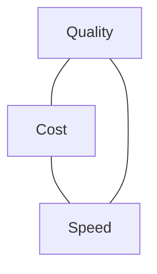

<LevelBadge level="intermediate" />

품질, 비용, 속도는 서로 잡아당깁니다. 셋을 동시에 최대로 끌어올릴 수는 없습니다 — 하지만 각각을 중요한 곳에 쓰고 나머지에서는 아낄 수 *있습니다*.

## 삼각형

더 큰 모델은 똑똑하지만 더 느리고 더 비쌉니다. 더 작은 모델은 빠르고 저렴하지만 능력은 떨어집니다. 좋은 엔지니어링이란 **각 작업을 이 삼각형의 올바른 지점으로 보내는 것**입니다.

## 가장 큰 지렛대 (대략 순서대로)

1. **모델 크기를 적정하게 맞추세요.** 분류 작업에 Opus를 돌리지 마세요. Sonnet으로 시작하고, 단순하거나 대량인 단계에는 Haiku로 내리고, 어려운 부분에만 Opus를 남겨 두세요 — [모델 선택하기](/docs/api/choosing-a-model).
2. **모델 등급화 / 캐스케이드.** 먼저 저렴한 모델을 쓰고, 필요할 때만(예: 신뢰도가 낮은 경우) 더 강한 모델로 격상하세요.
3. **[프롬프트 캐싱](/docs/api/prompt-caching).** 안정적인 프롬프트 접두부를 호출 간에 재사용하세요 — 반복되는 시스템 프롬프트, RAG 컨텍스트, 에이전트 도구 카탈로그에서 큰 절감 효과가 있습니다.
4. **입력 토큰을 줄이세요.** 중요한 것만 보내세요. [RAG](/docs/foundations/rag)는 전체 지식 베이스를 욱여넣는 것보다 낫습니다. 더 짧은 입력은 더 저렴하고 *그리고* 종종 더 좋습니다.
5. **출력을 제한하세요.** 합리적인 `max_tokens`와 빡빡한 형식 지시로 막으세요.
6. 지연 시간이 중요하지 않은 오프라인 작업은 **배치 처리**하세요.

## 지연 시간 특화 개선책

- 사용자가 출력을 즉시 보도록 응답을 **스트리밍**하세요 — 총 시간이 그대로여도 *체감* 속도에 엄청난 차이를 줍니다 ([스트리밍](/docs/api/streaming)).
- 독립적인 하위 호출을 **병렬화**하세요.
- 반복 작업을 **캐싱**하고, 가능한 곳에서는 미리 계산하세요.
- 인터랙티브 경로에는 **더 작은 모델**을 고르고, 무거운 작업은 비동기로 처리하세요.

## 맹목적으로 최적화하지 마세요

먼저 측정하세요: 토큰과 시간이 실제로 어디로 가고 있나요? 그다음 가장 큰 항목을 최적화하세요. 그리고 비용을 줄인 뒤에는 [평가(evals)](/docs/foundations/evals)로 품질을 다시 확인하세요 — 틀린 답을 내는 더 저렴한 구성은 더 저렴한 게 아닙니다.

## 다음

- [Claude 모델 선택하기](/docs/api/choosing-a-model)
- [프롬프트 캐싱 및 비용 최적화](/docs/api/prompt-caching)
- [토큰, 컨텍스트 및 가격](/docs/api/tokens-and-pricing)
