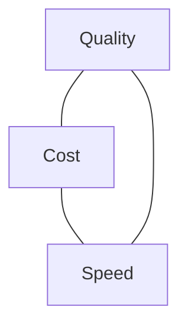
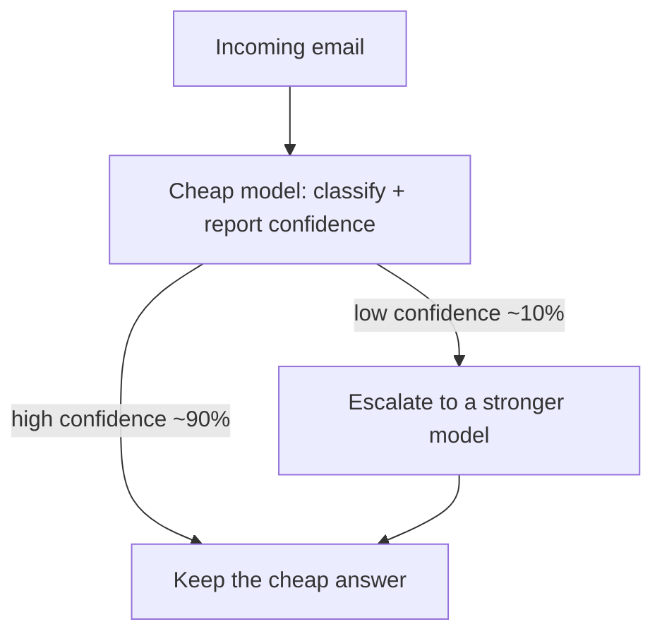

<LevelBadge level="intermediate" />

<Callout type="objectives" items={["비용/품질/속도의 삼각관계 — 세 가지를 동시에 최대화할 수 없는 이유","중요한 곳에 지출하고 나머지는 아끼는 여섯 가지 핵심 레버","저렴한 모델을 우선 쓰는 캐스케이드가 볼륨의 90%를 작은 모델로 라우팅해, 어려운 케이스의 품질을 떨어뜨리지 않고도 비용을 약 70% 줄이는 방법","체감 속도를 재설계하는 지연 시간 전용 승리 전략(스트리밍, 병렬화, 캐싱, 비동기)","'맹목적 최적화'가 품질을 태우는 이유 — 먼저 측정하고, 그다음에 evals로 가드하라"]} />

품질, 비용, 속도는 서로 잡아당깁니다. 세 가지를 동시에 최대화할 수는 없지만, 중요한 곳에 *각각* 지출하고 나머지는 아낄 수는 있습니다.

## 삼각관계

```mermaid
flowchart TD
  Q[Quality] --- C[Cost]
  C --- S[Speed]
  S --- Q
```

더 큰 모델은 더 똑똑하지만 느리고 비쌉니다. 더 작은 모델은 빠르고 저렴하지만 성능이 떨어집니다. 좋은 엔지니어링이란 **각 작업을 이 삼각형의 적절한 지점으로 라우팅하는 것**입니다.

## 가장 큰 레버들 (대략적인 우선순위 순)

<Steps items={[{title: "모델을 적정 규모로 맞추기", body: "분류 작업에 Opus를 돌리지 마세요. Sonnet에서 시작해 단순/고볼륨 단계에는 Haiku로 낮추고, 어려운 부분에만 Opus를 남겨두세요. 가장 큰 단일 레버 — /docs/api/choosing-a-model 참고."}, {title: "모델 계층화 / 캐스케이드", body: "먼저 저렴한 모델을 쓰고, 필요할 때만(예: 신뢰도가 낮은 케이스) 더 강한 모델로 에스컬레이트하세요. 아래 실사례 참고."}, {title: "프롬프트 캐싱", body: "안정적인 프롬프트 접두사를 여러 호출에 걸쳐 재사용 — 반복되는 시스템 프롬프트, RAG 컨텍스트, 에이전트 도구 카탈로그에 큰 절감. /docs/api/prompt-caching 참고."}, {title: "입력 토큰 다이어트", body: "중요한 것만 보내세요. RAG는 지식 베이스 전체를 우겨넣는 것보다 낫습니다. 짧은 입력 = 더 저렴하고 종종 더 나은 출력."}, {title: "출력 토큰 상한 설정", body: "합리적인 max_tokens와 엄격한 포맷 지침을 두세요. 출력 토큰은 가장 높은 요율로 청구되므로, 상한을 두면 꼬리가 잘립니다."}, {title: "오프라인 작업 배치화", body: "대화형이 아니어도 되는 것은 Message Batches API를 쓰세요. 지연 시간을 지불하고 큰 토큰당 할인을 얻습니다."}]} />

## 실사례: 저렴한 것 우선 캐스케이드

캐스케이딩은 모호하게 들려서 사람들이 건너뛰는 레버입니다. 구체화해봅시다. 10만 건의 고객 지원 이메일을 분류해야 한다고 합시다. 순진한 접근은 모든 이메일을 가장 강한 모델에 돌립니다. 캐스케이드는 대부분의 볼륨을 저렴한 모델에 라우팅하고 어려운 케이스만 에스컬레이트합니다:

```mermaid
flowchart TD
  In[Incoming email] --> Cheap[Cheap model: classify + report confidence]
  Cheap -->|high confidence ~90%| Done[Keep the cheap answer]
  Cheap -->|low confidence ~10%| Strong[Escalate to a stronger model]
  Strong --> Done
```

저렴한 모델이 자체적으로 90%의 케이스를 해결하고, 더 강한 모델이 토큰당 약 5배 비용이 든다고 가정합시다. 상대적 *비용 단위*로 계산하면(1 = 이메일 하나에 대한 저렴한 패스 하나):

- **전량 강한 모델:** `100k × 5 = 500k` 비용 단위.
- **캐스케이드:** `100k × 1` (모든 이메일이 저렴한 패스를 받음) `+ 10k × 5` (에스컬레이트되는 10%) `= 150k` 비용 단위.

약 **70% 절감**이며, 진짜로 어려운 케이스에는 여전히 최고의 모델이 사용됩니다. 배수와 분할은 예시일 뿐 — 여러분의 [토큰 카운트와 요율](/docs/api/tokens-and-pricing)을 대입하고, [evals](/docs/foundations/evals)로 *실제* 에스컬레이션 비율을 측정하세요. 교훈은 변하지 않습니다: 절감은 요율 자체가 아니라, 비싼 요율을 얼마나 드물게 지불하는지에서 나옵니다.

## 지연 시간 전용 승리 전략

<Callout type="tip" items={["응답을 스트리밍 — 사용자가 첫 토큰을 즉시 보므로, 총 시간이 그대로여도 체감 속도가 급등합니다 (/docs/api/streaming).","독립적인 하위 호출을 병렬화 — 세 도구로 팬아웃하는 요청은 max(latency)로 끝나지 sum(latency)이 아닙니다.","반복 작업을 캐싱하고 가능한 곳은 미리 계산 — 가장 빠른 토큰은 생성할 필요가 없는 토큰입니다.","대화형 경로에는 더 작은 모델 선택. 무거운 작업은 비동기로 옮겨 사용자가 기다리지 않게 하세요.","대화형 엔드포인트의 최대 출력 토큰 감소 — 긴 생성이 꼬리 지연의 지배적 원인입니다."]} />

## 맹목적으로 최적화하지 마라

먼저 측정하세요: 토큰과 초가 실제로 어디로 가고 있는가? 그다음 가장 큰 라인 아이템을 최적화하세요. 그리고 비용 절감 후에는 반드시 [evals](/docs/foundations/evals)로 품질을 재확인하세요 — 틀린 저렴한 설정은 더 저렴하지 않습니다.

<Quiz title="스스로 점검" questions={[{q: "일반적으로 가장 큰 단일 비용 레버는 무엇인가?", options: ["프롬프트 캐싱 활성화", "작업에 맞게 모델 크기 조정하기(작은 모델이 잘 처리하는 작업에 플래그십 모델을 돌리지 말 것)", "더 작은 max_tokens 설정", "배치 모드 사용"], answer: 1, explain: "모델 선택은 압도적으로 가장 큰 배수입니다 — 티어 간 종종 5~10배. 캐싱, 상한, 배치도 의미 있지만, 어느 것도 'Haiku급 모델이 올바르게 끝내는 작업에 플래그십 요율을 지불하기를 멈추기'를 이기지 못합니다."}, {q: "저렴한 것 우선 캐스케이드에서 실제 절감은 어디서 나오는가?", options: ["저렴한 모델이 본질적으로 토큰당 더 저렴함", "비싼 요율을 얼마나 드물게 지불하게 되는지 — 대부분의 케이스가 저렴한 티어에서 해결됨", "캐스케이드 뒤에 숨은 프롬프트 캐싱", "응답 스트리밍"], answer: 1, explain: "수학(100k × 1 + 10k × 5 vs 100k × 5)은 절감이 에스컬레이션 비율에 의해 지배됨을 보여줍니다. 90%를 저렴한 곳으로, 10%를 강한 곳으로 라우팅하면, 볼륨의 1/10에만 비싼 요율을 지불합니다."}, {q: "사용자가 응답이 더 빠르다고 느끼게 하고 싶다. 모델 선택을 바꾸지 않고 가장 도움이 되는 레버는?", options: ["max_tokens를 5로 설정해 응답을 짧게 함", "생성되는 대로 토큰을 스트리밍해 첫 토큰 시간을 크게 낮춤", "요청을 병렬로 두 번 재시도하고 가장 빠른 것을 유지", "로딩 스피너 추가"], answer: 1, explain: "스트리밍은 총 생성 시간을 바꾸지 않고 체감 지연을 재설계합니다 — 사용자는 출력이 생성되는 대로 보므로, 4초짜리 응답이 즉각적으로 느껴집니다. 작은 max_tokens로 자르는 것은 품질을 해치고, 병렬 재시도는 비용을 태웁니다."}, {q: "워크플로에서 Sonnet에서 Haiku로 옮겨 비용을 절감했다. 필수 다음 단계는?", options: ["출시 — 비용이 내려갔으니 그게 다임", "품질이 붕괴하지 않았는지 확인하기 위해 evals를 다시 돌린다 — 틀린 저렴한 설정은 더 저렴하지 않음", "프롬프트를 캐싱해 더 저렴하게 만든다", "모든 요청에 Opus 폴백을 추가"], answer: 1, explain: "모든 비용 절감은 evals로 가드되어야 합니다. 저렴한 오답은 보통 비싼 정답보다 더 비쌉니다 — 재시도, 에스컬레이션, 다운스트림 정리 때문에. 어떤 변경 후에도 품질을 측정하세요."}]} />

<Callout type="takeaways" items={["삼각관계는 실재합니다: 품질, 비용, 속도는 서로 잡아당깁니다 — 엔지니어링은 세 가지 모두를 최대화하는 게 아니라, 각 작업을 적절한 지점으로 라우팅하는 것입니다.","모델의 적정 규모화가 가장 큰 단일 레버이며, 캐스케이드는 어려운 소수에만 플래그십 요율을 지불함으로써 이를 배가시킵니다.","프롬프트 캐싱, 엄격한 max_tokens, RAG 기반 입력 다이어트는 모델 선택과 함께 복리로 작동합니다.","지연 시간 체감은 별개의 축입니다 — 스트리밍, 병렬 하위 호출, 비동기 중작업은 원가를 바꾸지 않고 UX를 재설계합니다.","모든 비용 절감은 evals로 가드되어야 합니다 — 틀린 저렴한 설정은 더 저렴하지 않습니다."]} />

## 다음

- [Claude 모델 선택하기](/docs/api/choosing-a-model)
- [프롬프트 캐싱 및 비용 최적화](/docs/api/prompt-caching)
- [토큰, 컨텍스트 및 가격](/docs/api/tokens-and-pricing)
