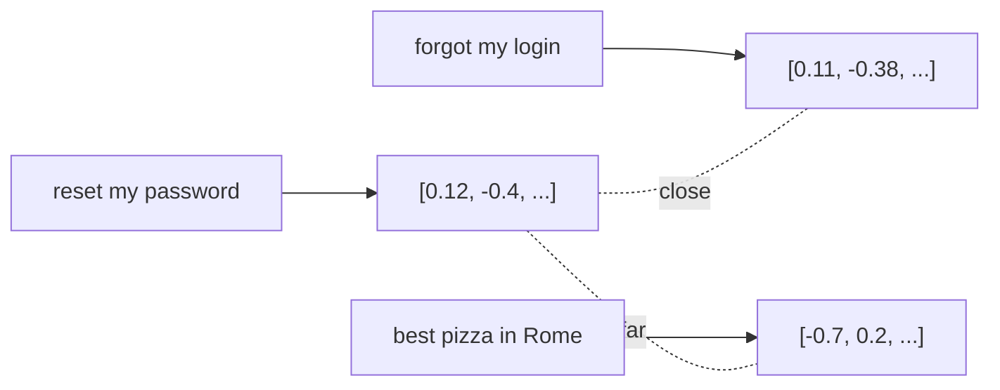

<LevelBadge level="intermediate" />

**임베딩**은 텍스트 조각을 그 *의미*를 담은 숫자 목록(**벡터**)으로 바꿉니다. 의미가 비슷한 텍스트는 — 공유하는 단어가 하나도 없더라도 — 서로 가까운 벡터를 갖습니다. 그것이 **의미 기반 검색**과 [RAG](/docs/foundations/rag)의 비결입니다.

## 직관

모든 문장이 거대한 다차원 공간 속의 한 점으로 놓여 있고, **비슷한 의미가 서로 가까이 자리하도록** 배치되어 있다고 상상해 보세요. "비밀번호를 어떻게 재설정하나요?"는 "로그인을 잊어버렸어요" 근처에, "로마에서 가장 맛있는 피자"와는 멀리 떨어진 곳에 놓입니다.

## 의미 기반 검색 vs 키워드 검색

- **키워드 검색**은 문자 그대로의 단어를 매칭합니다("password"는 "password"를 찾습니다).
- **의미 기반 검색**은 *의미*를 매칭합니다 — "로그인이 안 돼요"는 "password"라는 단어가 없어도 비밀번호 재설정 문서를 찾아냅니다.

가장 좋은 결과는 종종 둘을 **결합**할 때 나옵니다(하이브리드 검색).

## 벡터 검색이 작동하는 방식

1. 문서를 **임베딩**하고(보통 **청크**로 분할), 벡터를 **벡터 데이터베이스**에 저장합니다.
2. 쿼리 시점에 **쿼리를 임베딩**합니다.
3. (코사인 유사도 / 거리 기준으로) **가장 가까운** 벡터를 찾습니다.
4. 해당 청크를 반환합니다 — 보통 [RAG](/docs/foundations/rag)에 넣기 위함입니다.

## 실용적인 메모

- **청킹이 중요합니다.** 너무 크면 = 잡음 섞인 매칭, 너무 작으면 = 맥락 손실. 잘 조정하세요.
- **하나의 임베딩 모델을 일관되게 사용하세요** — 서로 다른 모델의 벡터는 비교할 수 없습니다.
- **메타데이터 + 필터**(날짜, 출처, 유형)는 검색을 훨씬 정밀하게 만듭니다.
- 벡터 DB가 항상 필요한 건 아닙니다 — 작은 코퍼스에는 단순한 인메모리 검색으로 충분합니다.

## 다음

- [검색 증강 생성 (RAG)](/docs/foundations/rag)
- [파인튜닝 vs 프롬프팅 vs RAG](/docs/foundations/finetune-vs-prompt-vs-rag)
- [할루시네이션과 줄이는 방법](/docs/foundations/hallucinations)
