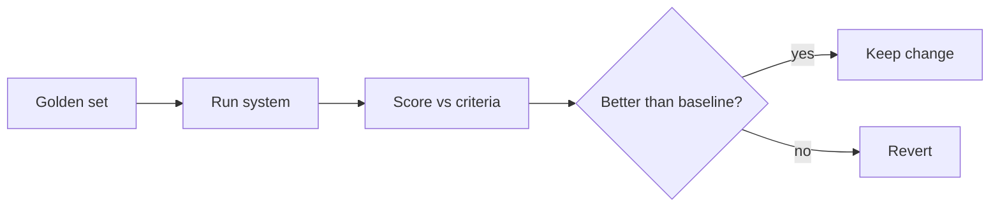

<LevelBadge level="advanced" />

AI 기반으로 무언가를 출시한다면, **평가(eval)**는 그것이 잘 작동하는지를 — 그리고 어떤 변경이 더 좋아지게 했는지 나빠지게 했는지를 — 아는 방법입니다. 평가가 없으면 깜깜이 비행입니다: 한 사례를 돕는 프롬프트 수정이 다른 열 개를 조용히 망가뜨릴 수 있습니다.

## 최소 실행 가능한 평가

시작하는 데 프레임워크가 필요하지는 않습니다:

1. **골든 세트를 수집하세요.** *올바른* 또는 *허용 가능한* 출력(혹은 명확한 기준)이 딸린 실제 입력 20~100개. 쉬운 사례, 까다로운 사례, 그리고 당신을 물었던 엣지 케이스를 포함하세요.
2. 작업별로 **"좋다"가 무엇을 의미하는지 정의하세요** — 정확히 일치, 핵심 사실 포함, 유효한 JSON 스키마, 지어낸 숫자 없음, 어조 등.
3. 현재 구성을 그 세트에 대해 **실행하고 채점하세요**.
4. **한 가지만 바꾸고**(프롬프트, 모델, 검색), 다시 실행한 뒤 **비교하세요**. 점수가 개선될 때만 그 변경을 유지하세요.

## 지표 선택하기

- 가능한 곳에서는 **결정론적 검사**: 스키마가 유효한가? 올바른 값을 포함하는가? 코드가 테스트를 통과하는가? 이런 것들은 저렴하고 신뢰할 수 있습니다.
- 모호한 품질(유용성, 어조)에는 **LLM-판정자(LLM-as-judge)**: 모델이 루브릭에 맞춰 출력을 채점하게 하세요. 유용하지만 **보정하세요** — 판정자에게는 편향(길이, 위치)이 있습니다. 표본에 대해 사람 평가와 비교해 판정자를 검증하세요.
- 가장 위험이 큰 부분에는 **사람의 검토**.

## 언제 실행할 것인가

- **어떤 프롬프트나 모델 변경 전후에.**
- **모델 마이그레이션 시** — 새 모델은 동작을 바꿀 수 있습니다 ([오류 및 마이그레이션](/docs/api/errors-and-rate-limits)).
- 프로덕션 시스템의 경우 게이트로서 **CI에서**.

:::tip 단계를 분리하세요
[RAG](/docs/foundations/rag)와 [에이전트](/docs/api/building-agents)의 경우 최종 답만이 아니라 각 단계를 평가하세요(검색이 올바른 문서를 찾았는가? 도구가 올바르게 호출되었는가?). 그래야 실패 지점을 좁힐 수 있습니다.
:::

## 다음

- [할루시네이션과 줄이는 방법](/docs/foundations/hallucinations)
- [API로 에이전트 만들기](/docs/api/building-agents)
- [모델 및 공급자 선택하기](/docs/foundations/choosing-a-model-provider)
