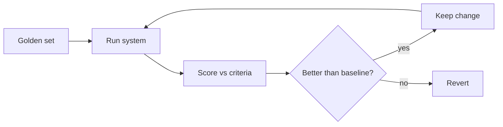

<LevelBadge level="advanced" />

<Callout type="objectives" items={[
  "가장 작은 유용한 eval 구축 — 20~100개의 실제 입력과 명확한 통과 기준으로 이루어진 골든 세트",
  "작업별로 올바른 지표 선택: 결정론적 검사, LLM-as-judge, 또는 사람 리뷰",
  "evals를 게이트로 실행 — 모든 프롬프트 변경, 모델 스왑 전후, 그리고 CI에서",
  "마지막 답변만이 아니라 모든 단계(검색, 도구 호출, 최종 답변)에 점수를 매겨 회귀 위치를 특정하기"
]} />

AI 기반 무언가를 출시한다면, **evals**는 그것이 작동하는지 아는 방법이자, 어떤 변경이 개선인지 악화인지 아는 방법입니다. 이것이 없으면 눈감고 나는 것과 같습니다: 한 케이스를 돕는 프롬프트 조정이 다른 열 개를 조용히 망칠 수 있습니다. Evals는 "감으로" 하는 이터레이션을 측정 가능한 루프로 바꿉니다.

## 최소 실행 가능한 eval

시작하는 데 프레임워크가 필요 없습니다. 전체 루프는 네 단계입니다:

<Steps items={[
  {title: "골든 세트 수집", body: "20~100개의 실제 입력과 올바른(또는 허용되는) 출력(또는 무엇이 통과인지에 대한 명확한 기준). 쉬운 케이스, 까다로운 케이스, 그리고 프로덕션에서 이미 여러분을 물었던 엣지 케이스를 포함시키세요."},
  {title: "작업별 '좋음'의 정의", body: "정확한 일치? 특정 핵심 사실 포함? 여러분의 스키마에 맞는 유효한 JSON? 환각된 숫자 없음? 브랜드 톤 유지? 통과 기준을 적어두세요 — 케이스당 한 줄이면 충분합니다."},
  {title: "베이스라인 실행 및 채점", body: "현재 설정을 세트에 돌리고 점수를 기록하세요. 이제 이것이 넘어야 할 숫자입니다. 저장하세요 — 미래의 여러분이 필요로 할 것입니다."},
  {title: "한 가지만 바꾸고, 다시 돌리고, 비교", body: "프롬프트 조정, 모델 스왑, 검색 변경 — 한 번에 하나의 변수. 점수가 오르고 아무것도 회귀하지 않으면 변경을 유지. 아니면 되돌리기. 이것이 전체 루프입니다."}
]} />

```mermaid
flowchart LR
  G[Golden set] --> R[Run system]
  R --> S[Score vs criteria]
  S --> C{Better than baseline?}
  C -->|yes| K[Keep change]
  C -->|no| X[Revert]
  K --> R
```

## 지표 선택

모든 질문이 같은 테스트를 받을 자격은 없습니다. 작업에 맞게 지표를 매치하세요:

| 작업 유형 | 지표 | 비용 | 신뢰도 |
|---|---|---|---|
| 구조화 출력 (JSON, SQL) | 스키마 검증, 정확 일치 | 무료 | 높음 |
| 코드 생성 | 작성한 테스트를 실행 | 저렴 | 높음 |
| 추출 (날짜, 엔티티) | 문자열 포함 / 정규식 | 무료 | 높음 |
| 분류 | 정확도, 정밀도, 재현율 | 무료 | 높음 |
| 요약, 초안, 톤 | 루브릭이 있는 LLM-as-judge | 중간 | 중간 — 반드시 보정 필요 |
| 고위험 글쓰기, 안전성 | 일부에 대한 사람 리뷰 | 비쌈 | 최고 |

세 가지 경험칙:

- **가능한 곳에는 결정론적 검사.** 답이 "이 스키마에 맞는 유효한 JSON"이거나 "코드가 이 테스트를 통과함"이면, LLM에게 묻지 말고 그냥 검사하세요.
- **모호한 품질에는 LLM-as-judge.** 유용성, 톤, 사실성-대-소스. 저렴하고 빠르지만 *편향*이 있습니다(길이, 위치, 자기 선호). 그 숫자를 신뢰하기 전에 샘플에서 사람 평가와 대조해 판단자를 검증하세요.
- **최고 위험 슬라이스에는 사람.** 릴리스당 사람이 채점하는 10개 케이스도 0보다 낫습니다.

<PromptCard title="LLM-as-judge 시작 루브릭">{`You are grading assistant responses against a source document.

For each response, output a JSON object with these fields:
- grounded: true if every factual claim is supported by the source, else false
- complete: true if the response answers all parts of the question, else false
- concise: true if the response contains no filler or repetition, else false
- overall_score: 1-5 (1 = unusable, 5 = ship it)
- reasoning: one sentence explaining the score

Do not consider length. Do not consider whether the response comes first or second.

<source>{{SOURCE}}</source>
<question>{{QUESTION}}</question>
<response>{{RESPONSE}}</response>

Return only the JSON, no preamble.`}</PromptCard>

## 언제 실행할 것인가

- **어떤 프롬프트나 모델 변경 전후.** 예외 없이. 골든 세트의 요점은 안전하다고 생각한 변경을 잡는 것입니다.
- **모델 마이그레이션 시.** 새 모델은 행동을 바꿉니다 — 때로는 조용히. 모델 ID를 뒤집기 전에 evals를 돌리세요. [오류 및 마이그레이션](/docs/api/errors-and-rate-limits) 참고.
- **프로덕션 시스템의 CI에서.** 초록색 eval을 머지 게이트로 만드세요. 회귀는 사용자가 보기 전에 잡힙니다.
- **보고된 모든 버그 이후.** 실패한 케이스를 골든 세트에 추가하세요. 세트는 시스템과 함께 자랍니다.

## 최종 답변만이 아니라 모든 단계에 대해 eval

[RAG](/docs/foundations/rag)와 [에이전트](/docs/api/building-agents)의 경우, 단일 "최종 답변" 점수는 어디서 깨졌는지를 숨깁니다. 각 단계를 별도로 점수 매겨 회귀가 한 곳에 착지하게 하세요:

| 단계 | 확인 사항 |
|---|---|
| 검색 | top-k에 답을 담은 문서가 포함되었는가? |
| 도구 선택 | 에이전트가 이번 턴에 올바른 도구를 골랐는가? |
| 도구 인자 | 인자가 잘 형성되고 올바른가? |
| 최종 답변 | 골든 기준과 일치하는가? |

검색 점수는 떨어졌지만 최종 답변 점수가 유지되면, 검색 회귀임을 알 수 있습니다 — 프롬프트 문제가 아닙니다. 이런 종류의 국지화가 evals를 단순 채점이 아니라 실제 디버깅에 유용하게 만드는 지점입니다.

## 흔한 실수

- **답을 생성한 같은 모델로 채점하기.** 자기 선호 편향이 점수를 부풀립니다. 다른 모델 — 더 좋게는 다른 계열 — 을 판단자로 쓰세요.
- **"정답"을 흘리는 판단자 프롬프트.** 판단자가 골드 답변을 보면, 그것과 일치하는 것을 보상할 이유를 찾을 것입니다. 유사성이 아니라 기준으로 판단하세요.
- **첫날에 얼어붙은 골든 세트.** 세트는 프로덕션이 여러분을 놀라게 할 때마다 자라야 합니다. 낡은 세트는 과거를 측정합니다.
- **작업이 아니라 eval에 최적화.** 모든 케이스가 통과할 때까지 작은 세트에 대해 프롬프트를 튜닝하면 과적합했을 수 있습니다. 이터레이션 중에는 절대 보지 않는 검증 슬라이스로 케이스의 약 20%를 유지하세요.

<Quiz title="스스로 점검" questions={[
  {q: "최소 실행 가능한 eval은 무엇인가?", options: ["여러분의 데이터로 파인튜닝된 모델", "채점할 수 있는 통과 기준을 가진 20~100개의 실제 입력으로 이루어진 골든 세트", "지연 시간과 비용을 추적하는 대시보드"], answer: 1, explain: "'좋음'의 명확한 정의가 있는 20~100개의 실제 입력이면 시작하는 데 충분합니다. 프레임워크가 필요한 게 아니라 — 채점할 수 있는 무언가가 필요합니다."},
  {q: "결정론적 검사를 LLM-as-judge보다 선호해야 할 때는 언제인가?", options: ["절대 안 됨 — LLM 판단자가 더 섬세함", "통과 기준이 객관적일 때(스키마 유효, 정확 일치, 테스트 통과)", "LLM 판단자를 감당할 수 없을 때만"], answer: 1, explain: "코드로 통과/실패를 결정할 수 있으면 그렇게 하세요 — 결정론적 검사는 무료, 빠르고, 편향이 없습니다. LLM-as-judge는 진짜로 모호한 품질 차원에 남겨두세요."},
  {q: "RAG 에이전트에서 각 단계를 별도로 점수 매기는 이유는?", options: ["규정 준수를 만족시키기 위해", "회귀가 어디서 깨졌는지를(검색, 도구, 또는 최종 답변) 알려주기 위해", "eval을 더 느리고 더 철저하게 만들기 위해"], answer: 1, explain: "단일 종단 간 점수는 어느 단계가 회귀했는지를 숨깁니다. 단계별 점수는 버그의 국지화를 가능케 합니다 — 검색이 떨어졌지만 최종은 유지되었다? 그건 검색 회귀지 프롬프트 회귀가 아닙니다."},
  {q: "eval 세트에 과적합되었다는 위험 신호는?", options: ["골든 세트가 절대 바뀌지 않고 100% 통과함", "LLM 판단자를 사용함", "CI에서 evals를 실행함"], answer: 0, explain: "100% 통과율에 얼어붙은 골든 세트는 보통 그것을 암기하도록 튜닝했다는 의미입니다. 이터레이션 중에는 절대 보지 않는 홀드아웃 검증 슬라이스를 유지하고, 실제 프로덕션 실패에서 세트를 키우세요."}
]} />

<Callout type="takeaways" items={[
  "20~100개 실제 입력 + 통과 기준 + 한 번에 하나의 변수 = 작동하는 eval 루프.",
  "결정론적 > LLM-판단자 > 사람 — 작업이 허용하는 가장 저렴한 지표를 선택하세요.",
  "파이프라인의 최종 답변만이 아니라 모든 단계에 점수를 매기세요.",
  "골든 세트는 보고된 모든 버그와 함께 자랍니다. 낡은 세트는 과거를 측정합니다."
]} />

## 다음

- [AI 에이전트 평가하기](/docs/playbooks/evaluating-agents) — 더 깊은 플레이북: 궤적 채점, LLM-판단자 보정, CI 게이트
- [환각과 이를 줄이는 방법](/docs/foundations/hallucinations)
- [API로 에이전트 만들기](/docs/api/building-agents)
- [모델 및 제공자 선택하기](/docs/foundations/choosing-a-model-provider)
