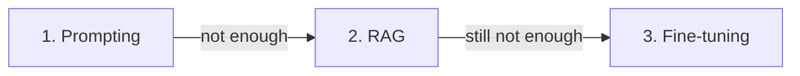

<LevelBadge level="intermediate" />

모델이 원하는 대로 하지 않을 때, 세 가지 지렛대가 있습니다 — 그리고 사람들은 가장 비싼 것에 먼저 손을 뻗습니다. 실제로 통하는 순서가 여기 있습니다.

## 이 순서대로 시도하세요

### 1. 프롬프팅 — 항상 여기서 시작
더 명확한 지시, 예시, 역할, 출력 제약 ([프롬프팅 기초](/docs/prompting/basics)). 문제의 **대부분**을 해결하고, 추가 비용이 들지 않으며, 즉시 반복할 수 있습니다. "모델이 X를 못 한다"의 대부분은 알고 보면 "프롬프트가 모호했다"입니다.

### 2. RAG — *당신의* 지식이 필요할 때
간극이 **누락되었거나 최신인 정보**(당신의 문서, 당신의 데이터, 현재 사실)라면 [RAG](/docs/foundations/rag)를 추가하세요. 모델을 건드리지 않고도 지식을 갱신 가능하고 인용 가능하게 유지합니다.

### 3. 파인튜닝 — 최후의 수단, *동작/형식*을 대규모로 다룰 때
파인튜닝은 당신의 예시로 모델을 추가 학습시킵니다. 프롬프팅 + RAG로도 일관된 **스타일, 형식, 작업 동작**을 얻을 수 없고, **고품질 예시가 많이** 있으며, 그것을 정당화할 만한 **사용량**이 있을 때에만 손을 뻗으세요.

## 의사결정 표

| 당신의 문제 | 선택할 것 |
|---|---|
| 모호하거나 틀린 출력, 잘못된 형식 | **프롬프팅** |
| 당신의 데이터를 모름 / 최신 정보가 필요 | **RAG** |
| 매우 구체적인 스타일/동작을 일관되게, 대규모로 | **파인튜닝** |
| 행동(액션)을 취해야 함 | (이것들이 아님 — 그건 [도구 사용/에이전트](/docs/api/tool-use)) |

## 사람들이 틀리는 이유

파인튜닝은 "모델을 가르치는 것"처럼 *들리기* 때문에 진짜 해결책처럼 느껴집니다. 하지만 가장 느리고, 가장 비싸고, 가장 유연성이 떨어지는 선택이며, 최신 지식을 잘 **추가하지 못하고**(그건 RAG가 합니다), 잘못하기도 쉽습니다. 프롬프팅과 RAG를 먼저 소진하세요 — 보통 3단계까지 갈 필요가 없습니다.

:::tip 함께 쓰입니다
강력한 시스템은 흔히 좋은 **프롬프트** + 지식을 위한 **RAG**이며, 파인튜닝은 좁은 동작상의 필요에만 남겨 둡니다. 이들은 상호 배타적이지 않습니다.
:::

## 다음

- [검색 증강 생성 (RAG)](/docs/foundations/rag)
- [프롬프팅 기초](/docs/prompting/basics)
- [AI 품질 평가하기 (Evals)](/docs/foundations/evals)
