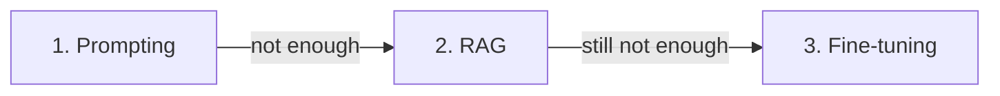

<LevelBadge level="intermediate" />

<Callout type="objectives" items={["모델이 원하는 대로 하지 않을 때 가진 세 가지 레버","실제로 통하는 순서 — 그리고 파인튜닝이 거의 1단계가 아닌 이유","RAG가 올바른 해결책일 때와 과잉일 때","파인튜닝이 진짜로 잘하는 것(과 못하는 것)","실제 프로덕션 시스템에서 세 가지가 어떻게 결합되는가"]} />

모델이 원하는 대로 하지 않을 때 세 가지 레버가 있습니다 — 그리고 사람들은 비싼 것을 먼저 잡습니다. 실제로 통하는 순서는 다음과 같습니다.

## 이 순서로 시도하라

```mermaid
flowchart LR
  A[1. Prompting] -->|not enough| B[2. RAG]
  B -->|still not enough| C[3. Fine-tuning]
```

<Steps items={[{title: "1. 프롬프팅 — 항상 여기서 시작", body: "더 명확한 지시, 예시, 역할, 출력 제약(/docs/prompting/basics 참고). 대부분의 문제를 해결하고, 추가 비용이 없으며, 즉시 이터레이션할 수 있습니다. '모델이 X에 형편없다'의 대부분은 '프롬프트가 모호했다'로 밝혀집니다."}, {title: "2. RAG — 여러분의 지식이 필요할 때", body: "간극이 누락되었거나 최신 정보(여러분의 문서, 데이터, 현재 사실)라면 RAG(/docs/foundations/rag)를 추가하세요. 모델을 건드리지 않고도 지식을 업데이트 가능하고 인용 가능하게 유지 — 문서를 교체하면 다음 답변이 이를 반영합니다."}, {title: "3. 파인튜닝 — 최후 수단, 대규모 행동/포맷용", body: "파인튜닝은 여러분의 예시로 모델을 추가 학습시킵니다. 프롬프팅 + RAG로 일관된 스타일, 포맷, 작업 행동을 얻을 수 없고, 고품질 예시가 많으며, 이를 정당화할 볼륨이 있을 때만 손을 뻗으세요."}]} />

## 의사결정 표

| 여러분의 문제 | 손을 뻗을 것 |
|---|---|
| 모호한/틀린 출력, 잘못된 포맷 | **프롬프팅** |
| 여러분의 데이터를 모름 / 최신 정보 필요 | **RAG** |
| 매우 특정한 스타일/행동이 대규모로 일관되게 필요 | **파인튜닝** |
| 행동을 수행해야 함 | (이것들이 아닙니다 — [도구 사용/에이전트](/docs/api/tool-use)입니다) |

<Flashcards title="어느 레버가 어떤 문제를 해결하는가" cards={[{front: "증상: 출력이 모호하거나, 포맷이 틀리거나, 작업의 요점을 놓칩니다.", back: "프롬프팅으로 해결. 역할, 제약, 예시, 목표 포맷을 추가하세요. 가장 저렴하고 빠릅니다 — 열 번 중 아홉 번은 이것이 전체 해답입니다."}, {front: "증상: 모델이 여러분 회사의 문서, 현재 가격표, 지난주 뉴스를 모릅니다.", back: "RAG로 해결. 질의 시점에 관련 청크를 검색하고 컨텍스트로 주입하세요. 지식은 업데이트 가능하고 인용 가능하게 유지됩니다 — 재훈련 필요 없음."}, {front: "증상: 수천 번의 호출에 걸쳐 매우 일관된 하우스 스타일, JSON 스키마, 좁은 분류 행동이 필요한데 프롬프팅이 계속 흔들립니다.", back: "파인튜닝을 고려하세요. 오직 프롬프팅 + RAG가 실패한 후, 그리고 수백~수천 개의 고품질 예시와 훈련 비용을 회수할 호출 볼륨이 있을 때만."}, {front: "증상: 모델이 행동을 수행해야 합니다(이메일 발송, 쿼리 실행, API 호출).", back: "이 세 가지 중 어느 것도 아닙니다 — 도구 사용 / 에이전트입니다. /docs/api/tool-use 참고."}]} />

## 왜 사람들이 이를 틀리는가

파인튜닝은 "모델을 가르치는 것"처럼 *들리므로* 진짜 해결책처럼 느껴집니다. 하지만 가장 느리고, 가장 비싸며, 가장 유연성이 낮은 옵션이고, **새로운 지식을 잘 추가하지 못하며**(RAG가 그것을 함), 잘못하기 쉽습니다. 먼저 프롬프팅과 RAG를 소진하세요 — 대개 3단계는 필요하지 않습니다.

<Callout type="warning" items={["프론티어 모델을 여러분의 데이터로 파인튜닝하는 것은 새로운 사실을 신뢰성 있게 추가하지 않습니다 — 스타일과 행동을 이동시킵니다. 사실은 여전히 환각됩니다.","파인튜닝된 모델은 그 베이스 버전에 묶여 있습니다. 벤더가 더 나은 베이스를 출시할 때, 재훈련하거나 갇힙니다.","나쁜 훈련 데이터는 나쁜 행동을 증폭시킵니다 — 평범한 데이터셋은 모델을 더 낫게 만드는 게 아니라 더 나쁘게 만듭니다.","'우리는 파인튜닝이 필요하다' 요청의 대부분은 실제로 '우리의 프롬프트가 즉흥적 규칙 40줄이다'입니다 — 먼저 프롬프트를 리팩터링하세요."]} />

:::tip 그들은 결합됩니다
강한 시스템은 대개 좋은 **프롬프트** + 지식을 위한 **RAG**이며, 파인튜닝은 좁은 행동적 필요를 위해 남겨둡니다. 서로 배타적이지 않습니다.
:::

<PromptCard title="구체적 예시: '모델이 우리 제품에 대한 질문에 답할 수 없다'">{`# Wrong first move: fine-tune on the product manual.
# Right first move: retrieve the relevant chapter and inject it.

# 1. PROMPTING (baseline)
System: "You are a support agent for Acme Widgets. Be concise, cite doc sections."
User:   "Does the Widget Pro support Bluetooth 5.3?"
# Fails — model has no idea what a Widget Pro is.

# 2. + RAG (usually enough)
System: "You are a support agent for Acme Widgets. Be concise, cite doc sections."
Context: [top-3 chunks from product manual retrieved by embedding search]
User:    "Does the Widget Pro support Bluetooth 5.3?"
# Works — model reads the retrieved specs and answers with a citation.

# 3. + Fine-tuning (only if house voice / format is still drifting after 1+2)
# Train on 500-2000 (prompt, ideal answer) pairs to lock in the style — NOT to teach facts.`}</PromptCard>

<Quiz title="스스로 점검" questions={[{q: "모델이 여러분의 작업에 모호하고 포맷이 잘못된 답변을 준다. 무엇을 먼저 시도하겠는가?", options: ["이상적인 출력 배치로 파인튜닝", "더 나은 컨텍스트를 검색하도록 RAG 추가", "프롬프트를 조이기 — 역할, 제약, 예시, 목표 포맷", "더 큰 모델로 전환"], answer: 2, explain: "프롬프팅은 항상 1단계입니다. '모델이 X에 형편없다'의 대부분은 '프롬프트가 모호했다'로 밝혀집니다. 무료이고, 즉시 이터레이션할 수 있으며, 대부분의 문제를 해결합니다."}, {q: "모델이 여러분의 내부 위키를 모른다. 어느 레버?", options: ["프롬프팅 — 위키를 설명하는 더 긴 시스템 프롬프트를 작성", "RAG — 질의 시점에 관련 위키 페이지를 검색하고 주입", "파인튜닝 — 모델이 그것을 '알도록' 위키 코퍼스로 훈련", "없음 — 그냥 모델을 전환"], answer: 1, explain: "누락된 또는 최신 정보가 정확히 RAG가 해결하는 것입니다. 파인튜닝은 사실을 추가하는 데 신뢰할 수 없고 베이스 모델에 묶여 있습니다. RAG는 지식을 업데이트 가능하고 인용 가능하게 유지합니다 — 위키 페이지를 교체하면 다음 답변이 이를 반영합니다."}, {q: "파인튜닝은 실제로 무엇에 잘하는가?", options: ["모델에 새로운 사실적 지식을 추가", "프롬프팅 + RAG가 도달할 수 없을 때, 대규모로 일관된 스타일, 포맷, 좁은 작업 행동을 고정", "모델을 더 빠르게 만들기", "시스템 프롬프트의 필요성을 제거"], answer: 1, explain: "파인튜닝은 스타일과 행동을 이동시키지 사실을 이동시키지 않습니다. 좁고 대규모 볼륨의 행동적 필요(예: 수백만 호출에 걸쳐 특정 톤으로 엄격한 JSON 스키마 생성)를 위한 올바른 최후 수단 도구입니다. 사실은 RAG에 속합니다."}, {q: "성숙한 프로덕션 시스템의 모습은 어떤 조합인가?", options: ["모든 것을 파인튜닝하고 프롬프팅을 건너뛴다", "지식을 위한 강한 프롬프트 + RAG, 그리고 좁은 행동적 필요를 위해 남겨둔 파인튜닝 — 그들은 서로 배타적이지 않다", "세 가지 중 하나만 — 섞으면 충돌이 발생", "프롬프트 + 파인튜닝, RAG는 절대 사용 안 함"], answer: 1, explain: "세 레버는 결합됩니다. 좋은 프롬프트가 프레임을 설정하고, RAG가 최신 지식을 공급하며, 파인튜닝(사용된다면)이 대규모로 하나의 특정 행동을 고정합니다."}]} />

<Callout type="takeaways" items={["모델이 원하는 대로 하지 않을 때의 세 레버: 프롬프팅, RAG, 파인튜닝 — 이 순서로.","프롬프팅은 '모델이 X에 형편없다' 불평의 10건 중 9건을 제로 비용, 즉시 이터레이션으로 해결합니다.","RAG는 간극이 누락 또는 최신 지식일 때 올바른 해결책 — 파인튜닝은 사실 추가에 신뢰할 수 없습니다.","파인튜닝은 대규모의 일관된 스타일/포맷/행동을 위한 최후 수단이며, 이를 정당화할 수백~수천 개의 고품질 예시와 호출 볼륨이 필요합니다.","실제 프로덕션 시스템에서 셋은 결합됩니다: 강한 프롬프트 + RAG + 좁은 파인튜닝."]} />

## 다음

- [검색 증강 생성 (RAG)](/docs/foundations/rag)
- [프롬프팅 기초](/docs/prompting/basics)
- [AI 품질 평가하기 (Evals)](/docs/foundations/evals)
