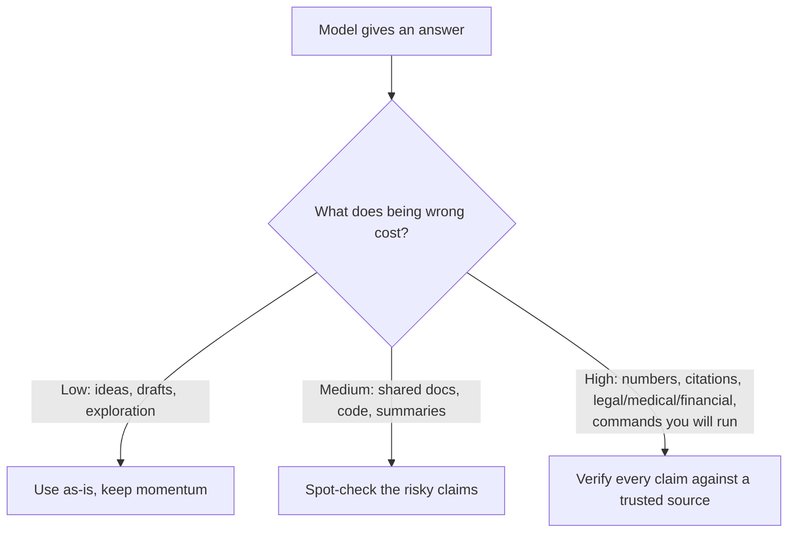

<LevelBadge level="intermediate" />

<Callout type="objectives" items={["모델이 왜 자신감 넘치고 잘 짜인 거짓 답을 꾸며내는지 이해하기", "가장 회의적이어야 할 5가지 고위험 영역 알아보기", "환각을 크게 줄이는 6부 도구 모음 적용하기", "근거를 대고, 빠져나갈 여지를 주고, 인용을 강제하는 복붙 반환각 프롬프트 하나 사용하기", "검증 노력을 틀릴 때의 비용에 맞추는 사고방식 채택하기"]} />

**환각**은 모델이 거짓을 완전한 자신감으로 진술하는 것입니다. 거짓말도 아니고 고장난 것도 아닙니다 — LLM이 작동하는 방식의 이면입니다: 모델은 *그럴듯한* 텍스트를 생성하고, 그럴듯함이 항상 참인 것은 아닙니다([LLM이란 무엇인가?](/docs/foundations/what-is-an-llm) 참고). 이것을 완전히 프롬프트로 없앨 수는 없지만, 크게 줄이고 나머지는 잡아낼 수 있습니다.

## 왜 일어나는가

모델은 그럴듯한 이어짐을 예측합니다. 무언가를 "알지" 못할 때, *가장 그럴듯해 보이는* 이어짐은 종종 자신감 넘치고 잘 짜인 — 그리고 틀린 — 답입니다. 여지를 만들어 주지 않는 한 내장된 "확신이 없다" 신호는 없습니다.

<Callout type="tip" items={["대부분의 환각을 고치는 법은 불확실성을 위한 여지를 의도적으로 만드는 것입니다 — 모델에게 모른다고 말할 허락을 주세요."]} />

## 고위험 영역

출력이 다음을 포함할 때 가장 회의적이 되세요:

- **인용, 따옴, 참고문헌** — 조작된 논문, 가짜 URL, 잘못 귀속된 인용.
- **특정 숫자, 날짜, 통계** — 그럴듯하지만 지어낸 수치.
- **틈새이거나 아주 최근의 사실** — 모델이 안정적으로 학습한 범위를 넘어선 것.
- **API와 라이브러리 세부** — 존재하지 않는 메서드나 파라미터.
- **사람 및 법률/의료 세부** — 판돈이 크고, 미묘하게 틀리기 쉬움.

## 감축 도구 모음

이것들을 쌓으세요 — 각각이 도움이 됩니다:

<Steps items={[
  {title: "출처에 근거를 대라", body: "출처 텍스트를 붙여넣고 \"위 텍스트에서만 답해; 거기에 없으면 없다고 말해\"라고 하세요. 이것이 RAG(/docs/foundations/rag)의 핵심 아이디어입니다."},
  {title: "빠져나갈 여지를 줘라", body: "\"확신이 없으면 '모르겠습니다'라고 말해\"를 명시적으로 허용하세요 — 자신감 넘치는 추측을 극적으로 줄입니다."},
  {title: "추론과 인용을 요구하라", body: "\"각 주장을 뒷받침하는 정확한 문장을 인용해.\" 뒷받침 없는 주장이 명백해집니다."},
  {title: "창의성을 낮춰라", body: "모델이 temperature 제어를 노출하는 사실 기반 작업에서는 그것을 낮추세요(Sampling Controls, /docs/foundations/sampling-controls 참고)."},
  {title: "도구를 써라", body: "수학, 최신 데이터, 조회에는 회상을 믿지 말고 모델에게 계산기/검색/도구(/docs/api/tool-use)를 주세요."},
  {title: "교차 확인하라", body: "같은 질문을 두 방식으로 묻거나, 두 번째 패스가 첫 번째를 비판하게 하세요."}
]} />

## 복붙 반환각 프롬프트

위 도구 모음의 대부분이 하나의 재사용 가능한 래퍼로 압축됩니다. 표시된 곳에 출처를 붙여넣고 질문하세요 — 답에 근거를 대고, 모델에게 빠져나갈 여지를 주고, 한 번에 인용을 강제합니다:

<PromptCard title="반환각 래퍼">{`You answer ONLY from the SOURCE below.
Rules:
- If the answer is not in the SOURCE, reply exactly: "Not stated in the source."
- After every claim, quote the exact sentence from the SOURCE that supports it.
- Do not add outside knowledge, estimates, or assumptions.

SOURCE:
"""
[paste the document, transcript, or data here]
"""

QUESTION: [your question]`}</PromptCard>

왜 작동하는가: "Not stated in the source" 탈출구는 추측 압박을 없애고, 문장을 인용하라는 규칙은 뒷받침 없는 주장을 숨길 수 없게 만듭니다. 정말로 모델 자신의 지식을 원할 때는 SOURCE 블록을 빼세요 — 하지만 그러면 검증은 다시 당신 몫입니다.

## 실제로 당신을 지키는 사고방식

<Callout type="warning" items={["어떤 프롬프트도 출력을 100% 신뢰할 수 있게 만들지 못합니다. 결과가 중요한 것 — 리포트의 숫자, 인용, 실행할 명령, 의료/법률/금융 세부 — 은 신뢰할 수 있는 출처에 대조해 확인하세요. AI를 최종 권위가 아니라 빠른 초안으로 다루세요. 이것이 책임 있는 사용(/docs/security/responsible-use)의 핵심입니다."]} />

간단한 규칙: **틀릴 때의 비용이 검증의 양을 정한다.** 브레인스토밍? 자유롭게 믿으세요. 통계를 발표? 매번 검증하세요.

<Callout type="takeaways" items={["환각은 완전히 프롬프트로 없앨 수 있는 버그가 아니라, 그럴듯함 기반 생성의 부산물입니다.", "인용, 숫자/날짜, 틈새이거나 최근의 사실, API 세부, 사람/법률/의료 세부에 가장 회의적이 되세요.", "도구 모음을 쌓으세요: 출처에 근거 대기, 빠져나갈 여지 주기, 인용 요구, temperature 낮추기, 도구 쓰기, 교차 확인.", "하나의 래퍼 프롬프트가 근거 대기 + 여지 주기 + 인용 강제를 한 번에 합니다.", "검증 노력을 틀릴 때의 비용에 맞추세요 — 값쌀 때는 자유롭게 믿고, 중요할 때는 모든 주장을 검증하세요."]} />

<Quiz title="스스로 점검하기" questions={[
  {
    q: "모델은 왜 환각을 일으키나요?",
    options: [
      "사용자에게 의도적으로 거짓말을 한다",
      "가장 그럴듯해 보이는 이어짐을 예측하는데, 그것이 항상 참은 아니다",
      "고장 나서 재학습이 필요하다",
      "답 도중에 항상 메모리가 바닥난다"
    ],
    answer: 1,
    explain: "환각은 LLM이 작동하는 방식의 이면입니다: 그럴듯한 텍스트를 생성하는데, 그럴듯함이 항상 참은 아닙니다. 모델이 무언가를 모를 때, 가장 그럴듯해 보이는 이어짐은 종종 자신감 넘치고 잘 짜였으며 틀립니다."
  },
  {
    q: "다음 중 가장 회의적이어야 할 고위험 영역은?",
    options: [
      "아이디어를 위한 열린 브레인스토밍",
      "이미 쓴 문장을 다시 표현하기",
      "특정 숫자, 날짜, 통계",
      "직접 검산할 수 있는 간단한 정의 묻기"
    ],
    answer: 2,
    explain: "특정 숫자, 날짜, 통계는 고위험 영역입니다 — 그럴듯하지만 지어낼 수 있습니다. 다른 고위험 영역으로는 인용/따옴, 틈새이거나 최근의 사실, API 세부, 사람/법률/의료 세부가 있습니다."
  },
  {
    q: "\"확신이 없으면 '모르겠습니다'라고 말해\" 같은 명시적 여지를 주는 것의 가장 직접적인 효과는?",
    options: [
      "모델을 더 빠르게 만든다",
      "자신감 넘치는 추측을 극적으로 줄인다",
      "temperature를 자동으로 올린다",
      "모델을 실시간 검색에 연결한다"
    ],
    answer: 1,
    explain: "모델이 모른다고 말하도록 명시적으로 허용하면 자신감 넘치는 추측을 만들어내는 압박이 사라지고, 이것이 환각 답을 극적으로 줄입니다."
  },
  {
    q: "답이 얼마나 검증이 필요한지를 정하는 규칙은?",
    options: [
      "답의 길이",
      "모델이 밝힌 자신감 수준",
      "틀릴 때의 비용",
      "프롬프트를 쓰는 데 걸린 시간"
    ],
    answer: 2,
    explain: "틀릴 때의 비용이 검증의 양을 정합니다. 브레인스토밍? 자유롭게 믿으세요. 통계를 발표? 매번 검증하세요."
  },
  {
    q: "반환각 래퍼 프롬프트에서, 뒷받침 없는 주장을 숨길 수 없게 만드는 것은?",
    options: [
      "temperature를 0으로 낮추기",
      "각 주장 뒤에 SOURCE에서 뒷받침하는 정확한 문장을 인용하라는 규칙",
      "질문을 두 번 묻기",
      "SOURCE 블록 제거하기"
    ],
    answer: 1,
    explain: "문장을 인용하라는 규칙은 모델이 각 주장을 SOURCE의 정확한 문장으로 뒷받침하도록 강제하므로, 실제로 뒷받침되지 않는 주장은 명백해집니다. \"Not stated in the source\" 탈출구는 추측 압박을 없앱니다."
  }
]} />

## 다음

- [검색 증강 생성(RAG)](/docs/foundations/rag)
- [AI 품질 평가(Evals)](/docs/foundations/evals)
- [책임 있는 사용, 윤리 & 검증](/docs/security/responsible-use)
