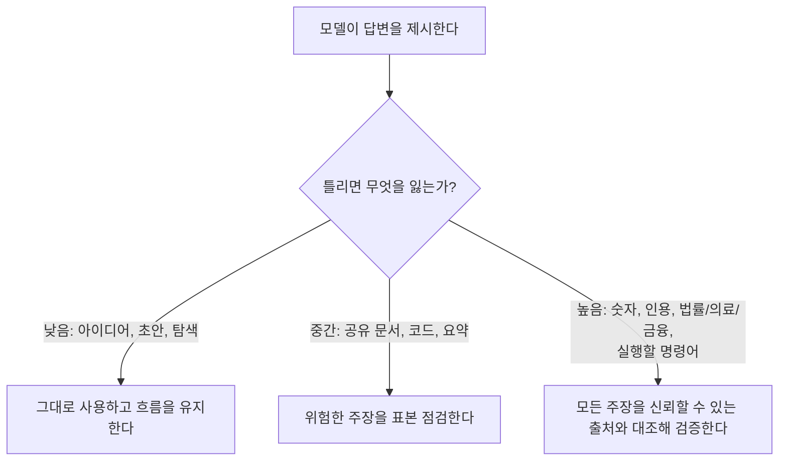

<LevelBadge level="intermediate" />

**환각(hallucination)**이란 모델이 거짓인 내용을 완전한 확신을 가지고 진술하는 것을 말합니다. 이는 거짓말도 아니고 고장도 아닙니다. LLM이 작동하는 방식의 이면일 뿐입니다. LLM은 *그럴듯한* 텍스트를 생성하는데, 그럴듯하다고 해서 항상 참인 것은 아닙니다([LLM이란 무엇인가?](/docs/foundations/what-is-an-llm) 참고). 프롬프트만으로 이를 완전히 없앨 수는 없지만, 크게 줄이고 남은 것은 잡아낼 수 있습니다.

## 왜 발생하는가

모델은 가능성이 높은 다음 내용을 예측합니다. 무언가를 "알지" 못할 때, *가장 그럴듯해 보이는* 다음 내용은 종종 자신감 있고 잘 짜여진 — 그리고 틀린 — 답변이 됩니다. 여지를 만들어 주지 않는 한, 모델에는 "확신이 없다"는 내장 신호가 없습니다.

## 고위험 영역

출력에 다음이 포함될 때 가장 의심해야 합니다.

- **인용, 발언, 참고문헌** — 날조된 논문, 가짜 URL, 잘못 귀속된 인용.
- **구체적인 숫자, 날짜, 통계** — 그럴듯하지만 지어낸 수치.
- **틈새 정보나 아주 최근의 사실** — 모델이 안정적으로 학습한 범위를 벗어난 내용.
- **API 및 라이브러리 세부 사항** — 존재하지 않는 메서드나 매개변수.
- **인물 및 법률/의료 관련 세부 사항** — 위험이 크고, 미묘하게 틀리기 쉬운 영역.

## 환각 감소 도구 모음

이것들을 겹겹이 쌓아 사용하세요. 각각이 도움이 됩니다.

1. **출처에 근거하게 하라.** 출처 텍스트를 붙여넣고 *"위 텍스트에서만 답하라. 텍스트에 없으면 없다고 말하라."* 라고 하세요. 이것이 [RAG](/docs/foundations/rag)의 핵심 아이디어입니다.
2. **빠져나갈 여지를 줘라.** *"확신이 없으면 '모르겠습니다'라고 말하라"* 를 명시적으로 허용하세요. 자신감 있는 추측을 극적으로 줄여 줍니다.
3. **근거와 인용을 요구하라.** *"각 주장을 뒷받침하는 정확한 문장을 인용하라."* 근거 없는 주장이 분명히 드러납니다.
4. 모델이 온도(temperature) 제어를 노출하는 사실 기반 작업에서는 **창의성을 낮춰라**([샘플링 제어](/docs/foundations/sampling-controls) 참고).
5. **도구를 사용하라.** 수학, 최신 데이터, 조회 작업에서는 기억에 의존하지 말고 모델에게 계산기/검색/[도구](/docs/api/tool-use)를 제공하세요.
6. **교차 확인하라.** 같은 질문을 두 가지 방식으로 묻거나, 두 번째 단계에서 첫 번째 답변을 비판하게 하세요.

## 복사해서 붙여 쓰는 환각 방지 프롬프트

위 도구 모음의 대부분은 재사용 가능한 하나의 래퍼로 압축됩니다. 표시된 곳에 출처를 붙여넣고 질문하세요. 이 한 번으로 답변을 출처에 근거하게 하고, 모델에게 빠져나갈 여지를 주며, 인용을 강제합니다.

```text
당신은 아래 SOURCE에서만 답합니다.
규칙:
- 답이 SOURCE에 없으면 정확히 다음과 같이 답하세요: "출처에 명시되지 않았습니다."
- 모든 주장 뒤에는, 그것을 뒷받침하는 정확한 문장을 SOURCE에서 인용하세요.
- 외부 지식, 추정, 가정을 추가하지 마세요.

SOURCE:
"""
[여기에 문서, 대화록 또는 데이터를 붙여넣으세요]
"""

QUESTION: [당신의 질문]
```

작동하는 이유: "출처에 명시되지 않았습니다"라는 탈출구는 추측해야 한다는 압박을 없애 주고, 문장을 인용하라는 규칙은 근거 없는 주장을 숨기는 것을 불가능하게 만듭니다. 정말로 모델 자체의 지식을 원할 때는 SOURCE 블록을 빼세요. 다만 그러면 검증은 다시 당신의 몫이 됩니다.

## 진짜로 당신을 지켜 주는 마음가짐

:::warning 중요한 것은 항상 검증하라
어떤 프롬프트도 출력을 100% 신뢰할 수 있게 만들지는 못합니다. 결과가 중요한 모든 것 — 보고서의 숫자, 인용, 실행할 명령어, 의료/법률/금융 세부 사항 — 에 대해서는 **신뢰할 수 있는 출처와 대조해 확인하세요**. AI를 빠른 초안으로 다루되, 최종 권위로 여기지 마세요. 이것이 [책임 있는 사용](/docs/security/responsible-use)의 핵심입니다.
:::

간단한 규칙: **틀렸을 때의 대가가 검증의 양을 정한다.** 브레인스토밍 중인가요? 마음껏 신뢰하세요. 통계를 발표하나요? 매번 검증하세요.



## 다음

- [검색 증강 생성(RAG)](/docs/foundations/rag)
- [AI 품질 평가(Evals)](/docs/foundations/evals)
- [책임 있는 사용, 윤리 및 검증](/docs/security/responsible-use)
