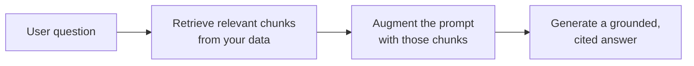

<LevelBadge level="intermediate" />

<Callout type="objectives" items={[
  "RAG가 무엇이고 retrieve-augment-generate 루프란 무엇인가",
  "인덱싱, 검색, 증강, 그리고 인용을 포함한 생성을 하는 법",
  "'내 문서에 대해 답하기' 필요에 RAG가 파인튜닝을 이기는 이유",
  "RAG 품질을 죽이는 다섯 가지 실패 양상",
  "가장 큰 두 격차를 메우는 복붙 근거 대기 프롬프트"
]} />

**RAG**는 모델이 훈련받은 적 없는 **당신의** 데이터 — 문서, 지식 베이스, 코드베이스 — 에 대한 질문에 답하게 만듭니다. 아이디어는 단순합니다: 관련 조각을 **검색(retrieve)**하고, 그것으로 프롬프트를 **증강(augment)**한 뒤, 그 조각에 근거한 답을 **생성(generate)**합니다.

## 루프

<Steps items={[
  {title: "데이터를 인덱싱한다", body: "청크로 나누고, 임베딩하고(/docs/foundations/embeddings 참고), 벡터(및/또는 키워드) 인덱스에 저장합니다."},
  {title: "검색한다", body: "질문에 가장 관련 있는 상위 청크를 끌어옵니다."},
  {title: "증강한다", body: "그 청크를 \"아래 컨텍스트에서만 답해; 거기에 없으면 없다고 말해\" 같은 지시와 함께 프롬프트에 넣습니다."},
  {title: "생성한다", body: "답을 만듭니다 — 그리고 이상적으로는 각 주장이 어느 청크에서 왔는지 인용합니다."}
]} />

인덱싱의 임베딩 단계는 [임베딩 & 벡터 검색](/docs/foundations/embeddings)을 참고하세요.

## 왜 파인튜닝 대신 RAG인가?

<Callout type="tip" items={[
  "신선함: 모델이 아니라 데이터를 업데이트",
  "검증 가능: 인용을 제공",
  "저렴함: 재훈련보다 훨씬 저렴"
]} />

대부분의 "내 문서에 대해 답하기" 필요에는 RAG가 올바른 첫 도구입니다 — [파인튜닝 vs 프롬프팅 vs RAG](/docs/foundations/finetune-vs-prompt-vs-rag) 참고.

## 실패 양상(RAG 품질이 죽는 곳)

<Callout type="warning" items={[
  "나쁜 검색 = 나쁜 답. 올바른 청크가 검색되지 않으면 모델은 그것을 쓸 수 없습니다. 대부분의 'RAG가 틀렸다' 문제는 검색 문제입니다.",
  "너무 굵거나 너무 잘게 청킹하면 관련성이 망가집니다(임베딩 참고).",
  "근거 대기 지시 없음: 모델이 검색된 사실을 자신의 추측과 섞습니다. 컨텍스트에서만 답하고 빈틈을 인정하라고 하세요.",
  "너무 많이 채우기: 무관한 청크가 신호를 희석하고 토큰을 씁니다. 적고 질 높은 청크를 검색하세요.",
  "인용 없음: 검증할 수 없으니 신뢰할 수 없습니다."
]} />

청킹 실패는 [임베딩](/docs/foundations/embeddings)으로 이어지고, 과도한 채우기는 [토큰](/docs/foundations/tokens-and-context) 비용을 발생시킵니다.

<Callout type="tip" items={[
  "검색을 따로 평가하세요: '올바른 청크를 검색했는가?'를 '모델이 잘 답했는가?'와 분리해 측정하세요. 문제를 빠르게 국소화합니다. Evals(/docs/foundations/evals) 참고."
]} />

## 복붙: 근거 대기 프롬프트

가장 레버리지 높은 단일 수정은 근거 대기 지시입니다. 검색된 청크를 이런 템플릿에 넣으세요 — 모델이 컨텍스트에서만 답하고, 각 주장을 인용하고, 추측 대신 빈틈을 인정하도록 강제합니다:

<PromptCard title="근거 대기 프롬프트">{`You are answering strictly from the context below.

Rules:
- Use ONLY the context to answer. Do not use outside knowledge.
- Cite the source after each claim, like [chunk 2].
- If the answer is not in the context, reply exactly:
  "I don't have that in the provided sources."
- Quote numbers and names verbatim — never paraphrase a figure.

Context:
[chunk 1] ...
[chunk 2] ...
[chunk 3] ...

Question: <the user's question>`}</PromptCard>

이것을 *소수의* 질 높은 청크(검색한 전부가 아니라)와 짝지으면 두 가지 가장 큰 격차를 한 번에 메웁니다: 환각적 섞임과 검증 불가능한 답. 그다음 [eval](/docs/foundations/evals)로 검색과 생성을 따로 평가해 어느 절반을 튜닝할지 알아내세요.

## 용어 마스터하기

<Flashcards cards={[
  {front: "RAG", back: "당신의 데이터에서 관련 조각을 검색하고, 그것으로 프롬프트를 증강한 뒤, 그 조각에 근거한 답을 생성합니다."},
  {front: "인덱스 단계", back: "데이터를 청크로 나누고, 임베딩하고, 벡터 및/또는 키워드 인덱스에 저장합니다."},
  {front: "증강 단계", back: "검색된 청크를 근거 대기 지시와 함께 프롬프트에 넣습니다: 컨텍스트에서만 답하고, 빈틈을 인정하라."},
  {front: "RAG가 파인튜닝을 이기는 이유", back: "신선함(모델이 아니라 데이터 업데이트), 인용 제공, 재훈련보다 훨씬 저렴."},
  {front: "1번 RAG 실패 양상", back: "나쁜 검색. 올바른 청크가 검색되지 않으면 모델은 쓸 수 없습니다 — 대부분의 'RAG가 틀렸다' 문제는 검색 문제입니다."},
  {front: "근거 대기 지시", back: "모델에게 컨텍스트에서만 답하고, 각 주장을 인용하고, 답이 거기 없으면 그렇게 말하라고 하세요."}
]} />

<Quiz title="스스로 점검하기" questions={[
  {
    q: "RAG의 세 글자는 순서대로 무엇을 뜻하나요?",
    options: ["Read, Analyze, Generate", "Retrieve, Augment, Generate", "Rank, Aggregate, Group", "Reduce, Append, Generate"],
    answer: 1,
    explain: "RAG = 관련 청크를 Retrieve, 그것으로 프롬프트를 Augment, 그다음 근거 있는 답을 Generate."
  },
  {
    q: "'RAG가 틀렸다'일 때, 진짜 문제는 대개 무엇인가요?",
    options: ["모델이 너무 작다", "검색 — 올바른 청크가 끌어와지지 않았다", "컨텍스트 윈도에 토큰이 너무 적다", "임베딩이 잘못 파인튜닝되었다"],
    answer: 1,
    explain: "나쁜 검색 = 나쁜 답. 올바른 청크가 검색되지 않으면 모델은 쓸 수 없습니다. 대부분의 'RAG가 틀렸다' 문제는 검색 문제입니다."
  },
  {
    q: "'내 문서에 대해 답하기'에 RAG가 대개 파인튜닝보다 선호되는 이유는?",
    options: ["모델을 더 크게 만든다", "지식을 신선하게 유지하고, 인용을 주고, 재훈련보다 저렴하다", "어떤 프롬프트도 필요 없게 만든다", "모델이 결코 환각하지 않음을 보장한다"],
    answer: 1,
    explain: "RAG는 지식을 신선하게 유지하고(모델이 아니라 데이터 업데이트), 인용을 제공하며, 재훈련보다 훨씬 저렴합니다."
  },
  {
    q: "모델이 사실을 추측과 섞는 것을 막는 가장 레버리지 높은 단일 수정은?",
    options: ["가능한 모든 청크를 검색한다", "컨텍스트에서만 답하도록 강제하는 근거 대기 지시", "temperature를 올린다", "토큰 절약을 위해 인용을 건너뛴다"],
    answer: 1,
    explain: "근거 대기 지시는 모델이 컨텍스트에서만 답하고, 각 주장을 인용하고, 추측 대신 빈틈을 인정하도록 강제합니다."
  },
  {
    q: "왜 검색을 생성과 따로 평가하나요?",
    options: ["모델 제공자가 요구해서", "문제를 빠르게 국소화한다 — 어느 절반을 튜닝할지 안다", "토큰 비용을 자동으로 줄인다", "그렇지 않으면 생성을 측정할 수 없어서"],
    answer: 1,
    explain: "'올바른 청크를 검색했는가?'를 '모델이 잘 답했는가?'와 분리해 측정하면 문제를 빠르게 국소화하고 어느 절반을 튜닝할지 알려줍니다."
  }
]} />

<Callout type="takeaways" items={[
  "RAG = 관련 청크 검색, 프롬프트 증강, 근거 있고 인용된 답 생성.",
  "인덱스(청크 + 임베딩 + 저장), 상위 청크 검색, 근거 대기 지시로 증강, 인용과 함께 생성.",
  "문서 Q&A에는 파인튜닝보다 RAG를 선호하세요: 신선하고, 인용되며, 더 저렴합니다.",
  "대부분의 실패는 검색 실패입니다 — 전부가 아니라 적고 질 높은 청크를 검색하세요.",
  "항상 근거 대기 지시를 추가하고 인용하세요; 검색과 생성을 따로 평가하세요."
]} />

## 다음

- [임베딩 & 벡터 검색](/docs/foundations/embeddings)
- [파인튜닝 vs 프롬프팅 vs RAG](/docs/foundations/finetune-vs-prompt-vs-rag)
- [리서치 & 종합 플레이북](/docs/playbooks/research)
