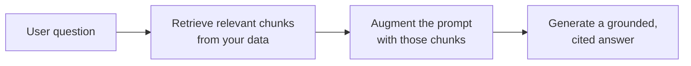

<LevelBadge level="intermediate" />

**RAG**는 모델이 학습한 적 없는 **당신의** 데이터 — 문서, 지식 베이스, 코드베이스 — 에 대한 질문에 답하게 만듭니다. 아이디어는 단순합니다: 관련된 조각을 **검색(retrieve)**하고, 그것으로 프롬프트를 **증강(augment)**한 뒤, 그 조각에 근거한 답을 **생성(generate)**합니다.

## 루프

1. 데이터를 **색인(index)**합니다: 청크로 분할하고, [임베딩](/docs/foundations/embeddings)한 뒤, 벡터(및/또는 키워드) 색인에 저장합니다.
2. 질문에 가장 관련 있는 상위 청크를 **검색**합니다.
3. **증강**: 그 청크를 *"아래 컨텍스트만으로 답하고, 거기에 없으면 없다고 말해 줘"* 같은 지시와 함께 프롬프트에 넣습니다.
4. **생성**하고 — 이상적으로는 각 주장이 어느 청크에서 왔는지 **인용**합니다.

## 왜 파인튜닝 대신 RAG인가?

RAG는 지식을 **최신으로** 유지하고(모델이 아니라 데이터를 갱신), **인용**을 제공하며, 재학습보다 훨씬 저렴합니다. 대부분의 "내 문서에 대해 답하기" 요구에는 적절한 첫 도구입니다 — [파인튜닝 vs 프롬프팅 vs RAG](/docs/foundations/finetune-vs-prompt-vs-rag)를 참고하세요.

## 실패 양상 (RAG 품질이 죽는 곳)

- **나쁜 검색 = 나쁜 답.** 올바른 청크가 검색되지 않으면 모델은 그것을 쓸 수 없습니다. "RAG가 틀렸다" 문제의 대부분은 *검색* 문제입니다.
- **청킹이 너무 거칠거나 너무 잘게** — 관련성을 망칩니다([임베딩](/docs/foundations/embeddings)).
- **근거 지시가 없음** — 모델이 검색된 사실과 자기 추측을 섞어 버립니다. *오직* 컨텍스트만으로 답하고 빈틈은 인정하라고 지시하세요.
- **너무 많이 욱여넣기** — 관련 없는 청크가 신호를 희석하고 [토큰](/docs/foundations/tokens-and-context) 비용을 발생시킵니다. 적고 고품질인 청크를 검색하세요.
- **인용 없음** — 검증할 수 없으니 신뢰할 수 없습니다.

:::tip 검색을 따로 평가하세요
"올바른 청크를 검색했는가?"를 "모델이 잘 답했는가?"와 분리해서 측정하세요. 문제를 빠르게 좁혀 줍니다. [평가(Evals)](/docs/foundations/evals)를 참고하세요.
:::

## 다음

- [임베딩 및 벡터 검색](/docs/foundations/embeddings)
- [파인튜닝 vs 프롬프팅 vs RAG](/docs/foundations/finetune-vs-prompt-vs-rag)
- [리서치 및 종합 플레이북](/docs/playbooks/research)
