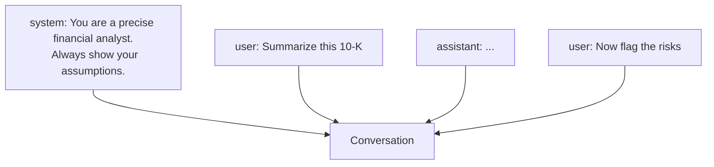

<LevelBadge level="beginner" />

모든 AI 대화는 **메시지**로 이루어지며, 각 메시지에는 **역할(role)**이 있습니다. 세 가지 역할을 이해하면 모델을 어떻게 조종하는지 — 그리고 왜 어떤 지시는 먹히고 어떤 지시는 그렇지 않은지 — 가 설명됩니다.

## 세 가지 역할

- **시스템(System)** — 대화 전체를 위한 최상위 설정: 모델이 어떤 존재여야 하는지, 규칙, 형식. 한 번 설정하면 전체에 적용됩니다.
- **사용자(User)** — 그게 바로 당신입니다: 당신의 질문과 입력, 턴마다.
- **어시스턴트(Assistant)** — 모델의 답변입니다. (예시로 *어시스턴트의 입에 말을 넣어 줄* 수도 있습니다 — [퓨샷(few-shot)](/docs/prompting/few-shot)을 참고하세요.)

## 왜 시스템 프롬프트가 가장 강력한 지렛대인가

시스템 메시지는 **그 뒤에 오는 모든 것**의 틀을 잡습니다. 모델의 역할, 기준, 어조, 강한 규칙을 설정하는 곳이며 — 모델은 이를 비중 있게 다룹니다. 대화(또는 앱) 전체에 걸쳐 일관된 동작을 원한다면, 사용자 턴에 묻어 두지 말고 여기에 넣으세요.

실제로는:
- **챗 앱:** 당신 계정의 [사용자 지정 지침](/docs/claude-app/custom-instructions)이 개인용 시스템 프롬프트 역할을 합니다.
- **Claude Code:** [CLAUDE.md](/docs/claude-code/claude-md)가 당신의 프로젝트에 대해 이 역할을 합니다.
- **API:** [`system` 파라미터](/docs/api/first-call).

같은 아이디어, 세 가지 표면입니다.

## 실용적인 팁

- **시스템 프롬프트에서 역할, 규칙, 출력 형식을 구체적으로** 적으세요 — 그렇게 할 가장 효과 높은 자리입니다.
- 실제 작업에 **사용자 턴은 집중시키세요**. 매 턴마다 규칙을 다시 붙여 넣지 마세요.
- **지시가 충돌하나요?** 나중에 나온 명시적인 사용자 지시는 모호한 시스템 지시를 덮어쓸 수 있습니다 — 놀라지 않으려면 일관성을 유지하세요 ([문제 해결](/docs/contribute/troubleshooting)).

## 다음

- [프롬프팅 기초](/docs/prompting/basics)
- [사용자 지정 지침 및 스타일](/docs/claude-app/custom-instructions)
- [토큰, 컨텍스트 및 메모리](/docs/foundations/tokens-and-context)
