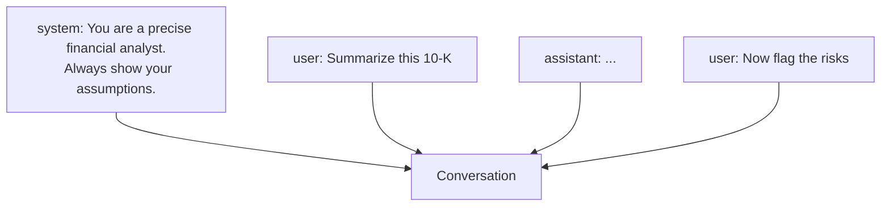

<LevelBadge level="beginner" />

<Callout type="objectives" items={["모든 AI 대화를 구성하는 세 가지 역할 — 각각이 무엇을 위한 것인지", "시스템 프롬프트가 왜 행동을 조정하는 데 가장 큰 영향력을 가진 유일한 지점인지", "동일한 아이디어가 챗 앱, Claude Code, API에서 어떻게 나타나는지", "흔한 함정: 규칙을 시스템 메시지가 아닌 사용자 턴에 묻어두기"]} />

모든 AI 대화는 **메시지**로 구성되며, 각 메시지에는 **역할**이 있습니다. 세 가지 역할을 이해하면 모델을 어떻게 조정할지 — 그리고 왜 어떤 지시는 지속되고 다른 지시는 그렇지 않은지 — 알 수 있습니다.

## 세 가지 역할

<Steps items={[{title: "system — 상시 브리핑", body: "전체 대화를 위한 최상위 설정: 모델이 어떤 존재여야 하는지, 규칙, 출력 형식. 한 번 설정하면 이후 모든 턴에 적용됩니다."}, {title: "user — 매번 당신의 차례", body: "당신의 질문과 입력, 한 턴씩. 실제 작업에 초점을 맞추세요. 매 턴마다 상시 규칙을 다시 붙여넣지 마세요."}, {title: "assistant — 모델의 답변", body: "모델의 응답입니다. 어시스턴트의 입에 말을 넣는 것도 가능하며, 이를 few-shot 예시로 사용할 수 있습니다 (/docs/prompting/few-shot 참조) — 모델은 이를 이전 턴으로 취급하고 그 스타일로 계속합니다."}]} />

```mermaid
flowchart TD
  S["system: You are a precise financial analyst.
  Always show your assumptions."] --> C[Conversation]
  U1[user: Summarize this 10-K] --> C
  A1[assistant: ...] --> C
  U2[user: Now flag the risks] --> C
```

## 시스템 프롬프트가 왜 가장 강력한 지렛대인가

시스템 메시지는 **이후 모든 것**의 틀을 만듭니다. 모델의 역할, 표준, 어조, 엄격한 규칙을 설정하는 곳이며 — 모델은 이를 무겁게 가중합니다. 전체 대화(또는 앱) 전반에서 일관된 행동을 원한다면 사용자 턴에 묻어두지 말고 여기에 두세요.

동일한 아이디어, 세 가지 표면:

| 표면 | 시스템 프롬프트 역할을 하는 것 |
|---|---|
| **챗 앱** (Claude.ai, ChatGPT, Gemini) | 계정의 [사용자 지정 지침](/docs/claude-app/custom-instructions) |
| **Claude Code** | 프로젝트 루트의 [`CLAUDE.md`](/docs/claude-code/claude-md) |
| **API** | 요청의 `system` 파라미터 ([첫 호출](/docs/api/first-call)) |

## 실제 before/after 사례

가장 흔한 실수는 상시 규칙을 시스템 메시지가 아닌 모든 사용자 턴에 넣는 것입니다. 무엇이 바뀌는지 보세요.

**Before — 사용자 턴에 규칙이 뭉쳐져 매번 반복됨:**

<PromptCard title="Rules in the user turn (fragile)">{`user: You are a precise financial analyst. Always show your assumptions.
Never invent numbers. Now: summarize this 10-K.
[10-K text]`}</PromptCard>

**After — 규칙을 시스템 메시지로 올리고, 사용자 턴은 깔끔하게:**

<PromptCard title="Rules in the system message (durable)">{`system: You are a precise financial analyst. Always show your assumptions.
Never invent numbers. Cite the section of the filing for each claim.

user: Summarize this 10-K.
[10-K text]

user: Now flag the risks.`}</PromptCard>

"after" 버전은 턴 전반에서 행동을 안정적으로 유지하고, 매 턴 다시 보내는 토큰을 절반으로 줄이며, 앱을 변경하기 쉽게 만듭니다 — 상시 브리핑을 한 곳에서 편집하면 됩니다.

## 어시스턴트의 입에 말을 넣기

잘 활용되지 않는 기법: `assistant` 턴을 **few-shot 예시** 또는 **형식 프라이머**로 앞에 붙일 수 있으며, 모델은 그 스타일로 계속합니다. 이것이 큰 프롬프트 없이 템플릿과 루브릭이 강제되는 방법입니다.

<PromptCard title="Prime the assistant to follow a format">{`system: You are a code reviewer. Return only the sections below.

user: Review this pull request. [diff]

assistant: ## Summary
- 
## Risks
- 
## Suggested changes
-`}</PromptCard>

모델은 당신이 심어둔 어시스턴트 턴을 이전 응답으로 취급하고 같은 형태로 완성합니다.

## 흔한 실수

<Callout type="tip" items={["모든 사용자 턴의 규칙 — 상시 규칙은 시스템 메시지에 한 번 두고, 사용자 턴은 실제 작업에 사용하세요.", "턴 전반에서 자신과 모순되기 — 나중의 명시적인 사용자 지시가 모호한 시스템 지시를 덮어쓸 수 있습니다. 일관성을 유지하세요.", "어시스턴트 역할을 읽기 전용으로 취급하기 — 형식, 어조, few-shot 패턴을 프라이밍하기 위해 심을 수 있습니다.", "변경되는 사실로 시스템 프롬프트를 과부하시키기 — 휘발성 사실(문서, 데이터, 현재 상태)은 시스템 메시지가 아닌 사용자 턴 또는 검색 컨텍스트에 두세요."]} />

## 스스로 확인하기

<Quiz title="Check yourself" questions={[{q: "어조, 형식, 역할과 같은 상시 규칙은 어디에 있어야 하나요?", options: ["모델이 잊지 않도록 매 사용자 턴에 반복", "시스템 메시지에, 한 번 설정", "어시스턴트의 첫 번째 응답에", "프롬프트가 아닌 모델 구성에"], answer: 1, explain: "시스템 메시지는 전체 대화의 틀을 만듭니다. 거기에 규칙을 한 번 설정하는 것이 매 사용자 턴에 반복하는 것보다 더 지속적이고, 저렴하며, 변경하기 쉽습니다."}, {q: "Claude Code에서 API의 system 파라미터와 동일한 역할을 하는 파일은 무엇인가요?", options: ["package.json", "CLAUDE.md", "README.md", ".env"], answer: 1, explain: "프로젝트 루트의 CLAUDE.md는 Claude Code의 상시 브리핑입니다 — 해당 프로젝트를 위한 시스템 프롬프트와 동등합니다."}, {q: "모델이 응답하기 전에 어시스턴트 턴에 텍스트를 직접 쓸 수 있나요?", options: ["아니오 — 어시스턴트 역할은 읽기 전용입니다", "예 — 어시스턴트 턴을 심으면 형식이나 스타일이 프라이밍되고 모델은 거기서부터 계속합니다", "API에서만, 챗 앱에서는 절대 안 됩니다", "파인튜닝을 사용할 때만"], answer: 1, explain: "어시스턴트 턴을 심는 것은 템플릿이나 few-shot 스타일을 강제하는 흔한 기법입니다 — 모델은 이를 이전 응답으로 취급합니다."}, {q: "사용자 턴이 지금 시스템 프롬프트와 모순되는 내용을 말합니다. 어떻게 되는 경향이 있나요?", options: ["시스템 프롬프트가 항상 이깁니다", "나중의 명시적 사용자 지시가 모호한 시스템 지시를 덮어쓸 수 있습니다 — 놀라움을 피하려면 일관성을 유지하세요", "모델이 답변을 거부합니다", "모델이 둘의 평균을 냅니다"], answer: 1, explain: "시스템 프롬프트는 무겁게 가중되지만, 명확하고 명시적인 사용자 지시가 모호한 것을 덮어쓸 수 있습니다. 역할 전반의 일관성이 중요합니다."}]} />

<Callout type="takeaways" items={["세 가지 역할: system은 브리핑을 설정, user는 턴마다 질문, assistant는 응답합니다 (또는 심어집니다).", "시스템 프롬프트는 가장 큰 영향력의 지렛대 — 상시 규칙을 거기에 한 번 두세요.", "챗 사용자 지정 지침, CLAUDE.md, API의 `system` 필드는 세 가지 표면에서의 동일한 아이디어입니다.", "휘발성 사실은 사용자 턴 또는 검색에 속하며, 시스템 메시지에 속하지 않습니다."]} />

## 다음

- [프롬프팅 기초](/docs/prompting/basics)
- [사용자 지정 지침과 스타일](/docs/claude-app/custom-instructions)
- [토큰, 컨텍스트, 메모리](/docs/foundations/tokens-and-context)
