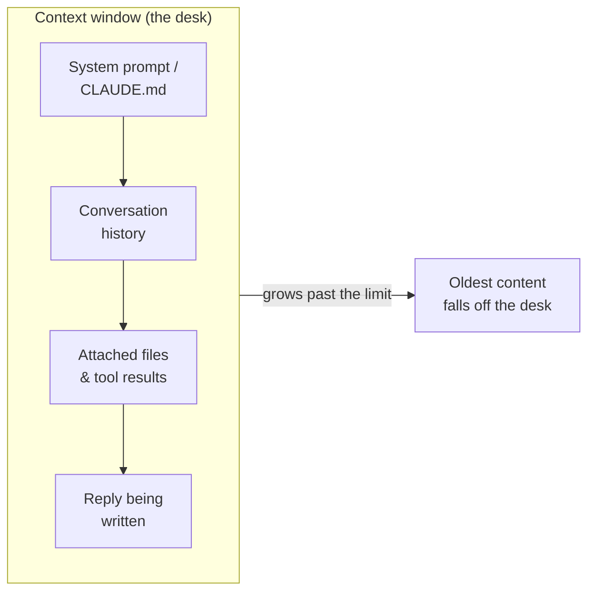

<LevelBadge level="beginner" />

세 가지 개념이 "왜 그렇게 동작했지?"라는 수많은 순간을 풀어줍니다: **토큰**, **컨텍스트 윈도우**, 그리고 **메모리**. 이를 이해하면 표류, 망각, 그리고 예상치 못한 비용에 더 이상 놀라지 않게 됩니다.

<Callout
  type="objectives"
  items={[
    "모델이 읽는 방식으로 텍스트를 읽기 — 단어나 글자가 아니라 토큰으로",
    "컨텍스트 윈도우를 유한한 책상으로 그려보고, 무언가가 거기서 떨어져 나가는 시점을 예측하기",
    "'컨텍스트 부패(context rot)'를 인식하기 — 모델이 긴 입력의 중간 부분을 놓치는 이유",
    "'메모리'의 네 가지 실제 출처와 이를 의도적으로 제공하는 방법 알기"
  ]}
/>

## 토큰: 모델이 사고하는 단위

모델은 글자나 단어를 읽지 않습니다 — 모델은 **토큰**을 읽으며, 이는 영어에서 대략 단어의 ¾에 해당하는 텍스트 덩어리입니다. "Unbelievable"은 3~4개의 토큰일 수 있고, 흔한 단어는 각각 하나이며, 공백, 쉼표, 또는 코드 한 조각도 각각 토큰을 소모합니다. 입력 *과* 모델의 출력이 모두 집계되며, 토큰은 정확히 [가격 및 한도](/docs/api/tokens-and-pricing)가 측정되는 단위입니다.

직접 손으로 셀 필요는 없지만, 대략적인 감각은 도움이 됩니다: **단어 ~750개 ≈ 토큰 ~1,000개**. 무언가 입력하고 지켜보세요:

<TokenEstimator />

:::tip 비율이 달라지는 이유
평이한 영어는 토큰당 단어 ¾에 가깝습니다. 코드, JSON, 비라틴 문자, 긴 URL, 드문 단어는 *더 많은* 토큰으로 쪼개집니다 — 그래서 500줄짜리 파일이나 중국어 문단은 단어 수가 시사하는 것보다 더 많은 비용이 듭니다. 청구서나 한도가 예상을 벗어날 때, 보통 이것이 원인입니다.
:::

## 컨텍스트 윈도우: 작업 메모리

**컨텍스트 윈도우**는 모델이 한 번에 고려할 수 있는 최대 토큰 수입니다 — *당신의 시스템 프롬프트, 지금까지의 전체 대화, 첨부된 모든 파일, 그리고 작성 중인 답변,* 이 모두를 합한 것입니다. 이를 모델의 책상이라고 생각하세요: 크지만, 유한합니다. 윈도우 크기는 모델마다 다르고 계속 커지고 있습니다 — 하나를 외우기보다는 현재 수치를 [모델 및 가격](/docs/whats-new/models-and-pricing)에서 확인하세요.

그 순간 모델이 "아는" 모든 것은 그 책상 위에 놓여 있습니다:

대화가 윈도우를 넘어 커지면, **가장 오래된 내용이 떨어져 나갑니다**. 그래서 아주 긴 대화는 어떻게 시작했는지를 "잊어버린" 것처럼 보이거나, 원래 지시에서 표류할 수 있습니다.

## 컨텍스트 부패: 단지 *가득 참* 대 *비어 있음*의 문제가 아니다

더 미묘한 문제가 있습니다: 모든 것이 여전히 들어맞을 때조차, 모델은 긴 입력의 **중간**보다 **처음과 끝**을 더 안정적으로 활용하는 경향이 있습니다. 50페이지 분량 붙여넣기의 한가운데에 중요한 한 문장을 묻어두면, 그것은 과소평가될 수 있습니다 — 흔히 *"중간에서 길을 잃음(lost in the middle)"*이라 불리는 실패 양상입니다.

<VerifyNote lastVerified="2026-06-29" source="https://arxiv.org/abs/2307.03172">"중간에서 길을 잃음" 효과 — 컨텍스트 중간에 배치된 정보의 활용이 저하되는 현상 — 은 Liu et al. (2023)에 의해 문서화되었습니다. 더 새로운 롱컨텍스트 모델은 이를 더 잘 처리하지만, 아래의 실용적 습관은 여전히 보람이 있습니다.</VerifyNote>

<Steps
  items={[
    {title: "요청을 먼저 제시하라", body: "긴 문서를 붙여넣기 전에 실제 지시나 질문을 먼저 두세요 — 그 뒤에 묻어두지 마세요."},
    {title: "끝에서 다시 말하라", body: "긴 내용 뒤에 핵심 지시를 한 줄로 반복하세요. 처음과 마지막 위치가 가장 강력합니다."},
    {title: "붙여넣기 전에 다듬어라", body: "관련 없는 부분을 빼세요. 중간의 잡음이 적을수록 남은 신호가 더 많은 주의를 받습니다."},
    {title: "거대하면 나누어라", body: "아주 큰 입력의 경우, 모든 것을 쏟아붓는 대신 요약하거나 청크로 나누세요 — 또는 새 하위 작업을 위해 새 대화를 시작하세요."}
  ]}
/>

다음은 지시가 강력한 위치에 놓이도록 구조화한 동일한 요청입니다:

<PromptCard title="지시는 처음에, 끝에서 다시 말하기">{`작업: 이 계약서에서 우리의 책임을 제한하는 모든 부분을 찾고, 해당 조항을 정확히 인용하라.

[... 여기에 40페이지 전체 계약서를 붙여넣으세요 ...]

작업 상기: 책임 제한 조항만, 정확한 인용과 조항 번호와 함께 나열하라. 그 외의 모든 것은 무시하라.`}</PromptCard>

:::tip Claude Code에서
긴 에이전트 세션도 동일한 천장에 부딪힙니다. Claude Code는 이를 의도적으로 관리합니다 — 히스토리를 압축하고 무엇이 시야에 남을지 당신이 조정하도록 합니다. [컨텍스트 관리](/docs/claude-code/context-management)와 [컨텍스트 엔지니어링](/docs/frontiers/context-engineering)을 참고하세요.
:::

## 메모리: 당신이 제공하지 않는 한, 아무것도 없다

기본적으로, 각 대화는 **백지 상태**입니다. 모델은 당신의 지난 대화를 기억하지 않습니다. 메모리처럼 보이는 모든 것은 다음 네 가지 중 하나입니다:

| 출처 | 무엇인가 | 당신이 제어하는 방법 |
| --- | --- | --- |
| **재전송된 히스토리** | 채팅 앱은 윈도우가 찰 때까지 매 턴마다 대화를 재전송합니다 | 새 대화 시작하기; 스레드를 집중적으로 유지하기 |
| **메모리 기능** | 일부 Claude 환경은 대화 간에 사실을 전달합니다 | [대화 간 메모리](/docs/claude-app/memory) 설정 |
| **당신이 제공하는 파일** | 의도적으로 첨부하는 지속적인 컨텍스트 | [프로젝트](/docs/claude-app/projects), [CLAUDE.md](/docs/claude-code/claude-md) |
| **당신 자신의 코드** | API는 **상태를 저장하지 않습니다(stateless)** — 이전 메시지를 직접 재전송합니다 | [첫 API 호출](/docs/api/first-call) |

핵심 줄기: *모델이 무언가를 기억하길 원한다면, 계속해서 그것을 책상 위에 올려두어야 합니다.*

## 이것이 중요한 이유

거의 모든 "내 이전 지시를 무시했어" 또는 "맥락을 놓쳤어" 문제는 세 가지 중 하나로 거슬러 올라갑니다: 윈도우가 가득 찼거나, 새 세션이 차갑게 시작했거나, 핵심 세부사항이 긴 붙여넣기의 죽은 한가운데에 놓였거나. 이를 알면, 중요한 내용을 *시야에* 유지하도록 프롬프트와 세션을 구조화하게 됩니다.

## 스스로 점검하기

<Quiz
  questions={[
    {
      q: "평이한 영어 750단어는 대략 몇 개의 토큰입니까?",
      options: ["약 250", "약 1,000", "약 3,000", "정확히 750"],
      answer: 1,
      explain: "유용한 경험칙은 일반적인 영어의 경우 단어 ~750개 ≈ 토큰 ~1,000개입니다. 코드와 비라틴 문자는 더 높게 나옵니다."
    },
    {
      q: "긴 대화가 시작을 '잊기' 시작합니다. 가장 가능성 높은 원인은:",
      options: [
        "모델이 고장 났다",
        "대화가 커지면서 가장 이른 내용이 컨텍스트 윈도우에서 떨어져 나갔다",
        "모델이 당신의 이전 메시지를 영구적으로 학습했다",
        "토큰이 환불되었다"
      ],
      answer: 1,
      explain: "컨텍스트 윈도우는 유한합니다. 대화가 그것을 초과하면, 가장 오래된 토큰이 '책상'에서 떨어져 나갑니다 — 그래서 초기 지시가 시야에서 사라질 수 있습니다."
    },
    {
      q: "거대한 문서와 핵심 지시 하나를 붙여넣어야 합니다. 가장 좋은 배치는?",
      options: [
        "지시를 문서의 정확한 한가운데에만 둔다",
        "지시를 맨 처음에 두고 끝에서 다시 말한다",
        "지시 없이 — 모델이 추측하도록 둔다",
        "모델이 볼 수 없는 별도 대화에 지시를 둔다"
      ],
      answer: 1,
      explain: "모델은 긴 입력의 처음과 끝을 가장 안정적으로 활용합니다('중간에서 길을 잃음'). 요청을 먼저 제시하고 끝에서 다시 말하세요."
    }
  ]}
/>

## 핵심 용어

<Flashcards
  title="어휘 굳히기"
  cards={[
    {front: "토큰", back: "모델이 실제로 처리하는 텍스트 덩어리 — 영어 단어의 대략 ¾. 입력과 출력이 모두 집계되며, 가격은 토큰당 책정됩니다."},
    {front: "컨텍스트 윈도우", back: "모델이 한 번에 고려할 수 있는 최대 토큰: 시스템 프롬프트 + 히스토리 + 파일 + 답변, 이 모두 합산. 유한함 — 한도를 넘는 내용은 떨어져 나갑니다."},
    {front: "중간에서 길을 잃음", back: "긴 입력의 중간보다 처음과 끝을 더 안정적으로 활용하는 경향. 중요한 지시는 강력한 위치에 두세요."},
    {front: "무상태성(Statelessness)", back: "API는 호출 사이에 아무것도 기억하지 않습니다. 대화를 이어가려면 이전 메시지를 당신이 직접 재전송합니다."}
  ]}
/>

:::note 요점 정리
- **토큰**은 사고와 청구 모두의 단위입니다 — 영어 750단어당 ~1,000개, 코드와 다른 문자는 더 많음.
- **컨텍스트 윈도우**는 유한한 책상입니다; 긴 대화가 잊는 이유는 오래된 내용이 거기서 떨어져 나가기 때문입니다.
- 윈도우 안에서조차, **지시를 먼저 제시하고 끝에서 다시 말하세요** — 중간은 과소 활용됩니다.
- 기본적으로 **메모리는 없습니다**. 파일, 프로젝트, CLAUDE.md로, 또는 히스토리를 재전송하여 의도적으로 제공하세요.
:::

## 다음

- [LLM이란 무엇인가?](/docs/foundations/what-is-an-llm)
- [시스템, 사용자 및 어시스턴트 역할](/docs/foundations/roles)
- [컨텍스트 엔지니어링](/docs/frontiers/context-engineering)
- [토큰, 컨텍스트 및 가격 (API)](/docs/api/tokens-and-pricing)
