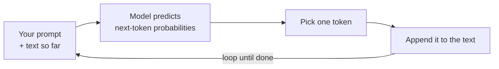

<LevelBadge level="beginner" />

**대규모 언어 모델**(LLM) — Claude를 뒷받침하는 기술 — 은 겉보기에 단순한 한 가지 일을 합니다. 텍스트를 읽고 **다음에 무엇이 올지 예측**하는 것을, 한 번에 한 조각씩 수행합니다. 그게 전부입니다. 나머지 모든 것은 이 일을 놀라울 만큼 잘 해냄으로써 창발적으로 나타납니다.

<Callout
  type="objectives"
  items={[
    "한 문장짜리 멘탈 모델을 파악하기: LLM은 매우 정교한 자동 완성이다",
    "모델이 어떻게 루프 안에서 한 번에 하나의 토큰씩 답을 만들어 가는지 보기",
    "이 메커니즘이 왜 강점과 특이한 버릇을 모두 설명하는지 이해하기",
    "LLM이 아닌 것이 무엇인지 알기 — 그리고 그것이 사용 방식을 어떻게 바꾸는지"
  ]}
/>

## 한 문장짜리 멘탈 모델

> LLM은 엄청난 양의 텍스트를 읽고, 언어 — 그리고 그 안에 담긴 생각 — 이 어떻게 이어지는 경향이 있는지 그 패턴을 학습한 매우 정교한 자동 완성이다.

질문을 하면 모델은 답을 "찾아보는" 것이 아닙니다. 당신의 텍스트가 이어질 가장 그럴듯한 연속을, 토큰 단위로 생성하는 것입니다([토큰과 컨텍스트](/docs/foundations/tokens-and-context) 참고). 좋은 질문의 그럴듯한 연속은 보통 좋은 답이며 — 그래서 이것이 애초에 작동하는 것입니다.

:::tip 비유: 스테로이드 맞은 예측 키보드
다음 단어를 제안하는 휴대폰의 자동 완성을 떠올려 보세요. 이제 그것이 인터넷에 있는 대부분의 책, 기사, 코드를 읽었다고 — 그리고 다음 단어뿐 아니라 딱 맞는 에세이 전체, 번역, 프로그램까지 제안했다고 상상해 보세요. 그것이 LLM의 직관입니다.
:::

## 한 번에 하나의 토큰씩

전체 엔진은 하나의 루프입니다. 지금까지의 모든 것을 읽고, 다음 조각을 예측하고, 그것을 덧붙이고, 반복합니다.

<Steps
  items={[
    {title: "읽기", body: "모델은 당신의 프롬프트와 지금까지 생성된 모든 것을 하나의 텍스트 덩어리로 받아들입니다."},
    {title: "예측", body: "다음 토큰이 무엇이 될 수 있는지에 대한 확률을 계산합니다."},
    {title: "선택", body: "하나의 토큰을 고릅니다. 이것이 결정적인지 아니면 조금 무작위적인지는 temperature 같은 샘플링 제어가 조정하는 부분입니다."},
    {title: "덧붙이고 반복", body: "선택된 토큰이 텍스트에 추가되고, 조금 더 길어진 텍스트가 다시 입력됩니다 — 답이 끝날 때까지 루프를 돕니다."}
  ]}
/>

각 단계는 언제나 **하나의** 토큰만 예측한 다음, 조금 더 길어진 텍스트를 다시 입력합니다. 모델은 전체 답에 대한 계획을 미리 갖고 있지 않으며 — 일관성은 이 예측을 극도로 잘, 수천 번 수행함으로써 창발적으로 나타납니다. "하나의 토큰을 고르는" 단계가 어떻게 동작하는지(그리디 vs. 조금 무작위)는 temperature 같은 [샘플링 제어](/docs/foundations/sampling-controls)가 조정하는 부분입니다.

## 이것이 강점을 설명하는 이유

글, 코드, 추론 전반에 걸친 패턴을 학습했기 때문에, LLM은 **글쓰기, 요약, 번역, 설명, 코딩**을 유연하게 할 수 있습니다 — 이 모두는 "이 텍스트를 합리적으로 이어가기"에 해당하는 작업입니다. 명확한 설정을 주면 강력한 연속을 만들어 냅니다. 그래서 [프롬프팅](/docs/prompting/basics)이 그토록 중요한 것입니다. 당신은 모델이 이어갈 텍스트의 시작을 빚어내고 있는 것이니까요.

## 이것이 특이한 버릇을 설명하는 이유

같은 메커니즘이 거친 부분들을 설명합니다.

- **자신 있게 틀릴 수 있습니다.** 유창하게 들리는 연속이 언제나 참인 것은 아닙니다 — 그것이 [환각](/docs/foundations/hallucinations)입니다.
- **오늘의 사실을 진정으로 "알지" 못합니다** — 당신이 제공하거나 그것을 찾아볼 도구가 있지 않는 한.
- **대화들 사이에 기억이 없습니다** — 당신이 어떤 것을 주지 않는 한.

## LLM이 **아닌** 것

:::warning 기대치를 조정하면 더 나은 결과를 얻습니다
- ❌ **데이터베이스나 검색 엔진이 아닙니다.** 검증된 레코드를 검색하는 것이 아니라 생성합니다.
- ❌ **계산기가 아닙니다.** 수학에 대해 추론할 수 있지만 정확함이 보장되지는 않습니다 — 그럴 때는 도구를 주세요.
- ❌ **사람이 아닙니다.** 감정도, 의도도, 지속적인 기억도 없습니다. 강력한 텍스트 엔진입니다.
:::

가끔 잘못 기억하는, 명석하고 빠르며 박식한 조수로 대하되 — 중요한 것은 **검증**하세요.

## 핵심 용어

<Flashcards
  title="핵심 개념 복습하기"
  cards={[
    {front: "LLM (대규모 언어 모델)", back: "Claude를 뒷받침하는 기술. 텍스트를 읽고 다음에 무엇이 올지 한 번에 한 조각씩 예측합니다."},
    {front: "다음 토큰 예측", back: "핵심 루프: 지금까지의 텍스트를 읽고, 다음 토큰을 예측하고, 덧붙이고, 끝날 때까지 반복합니다."},
    {front: "토큰", back: "각 단계에서 모델이 예측하는 텍스트 조각. 모델은 언제나 한 번에 하나씩만 예측합니다."},
    {front: "환각", back: "실제로는 참이 아닌, 유창하게 들리는 연속 — 검색이 아니라 생성하는 것의 부작용입니다."},
    {front: "샘플링 / temperature", back: "'하나의 토큰을 고르는' 단계가 어떻게 동작하는지 제어합니다 — 그리디 vs. 조금 무작위."}
  ]}
/>

<Callout
  type="takeaways"
  items={[
    "LLM은 매우 정교한 자동 완성이다 — 답을 찾아보는 것이 아니라 다음 토큰을 예측한다",
    "일관성은 그 예측 루프를 한 번에 하나의 토큰씩 수천 번 돌림으로써 창발적으로 나타난다",
    "같은 메커니즘이 강점(글쓰기, 요약, 번역, 설명, 코딩)과 특이한 버릇(자신 있게 틀림, 실시간 사실 없음, 기억 없음)을 모두 설명한다",
    "데이터베이스도, 계산기도, 사람도 아니다 — 중요한 것은 검증하라"
  ]}
/>

## 스스로 점검하기

<Quiz
  title="스스로 점검하기"
  questions={[
    {
      q: "질문을 하면 LLM은 근본적으로 무엇을 하나요?",
      options: [
        "검증된 사실의 데이터베이스에서 답을 찾아본다",
        "당신의 텍스트가 이어질 가장 그럴듯한 연속을 한 번에 한 토큰씩 생성한다",
        "가장 최근의 답을 얻기 위해 실시간 웹을 검색한다"
      ],
      answer: 1,
      explain: "LLM은 아무것도 찾아보지 않습니다 — 당신의 텍스트가 이어질 가장 그럴듯한 연속을 토큰 단위로 생성합니다."
    },
    {
      q: "LLM은 왜 자신 있게 틀릴 수 있나요?",
      options: [
        "유창하게 들리는 연속이 언제나 참인 것은 아니다 — 그것이 환각이다",
        "답변 도중에 메모리가 부족해진다",
        "모르는 질문에는 답하기를 거부한다"
      ],
      answer: 0,
      explain: "검증된 레코드를 검색하는 것이 아니라 그럴듯하게 들리는 텍스트를 생성하므로, 유창한 연속이라도 여전히 거짓일 수 있습니다 — 그것이 환각입니다."
    },
    {
      q: "LLM에 대한 진술 중 옳은 것은 무엇인가요?",
      options: [
        "검증된 레코드를 검색하는 검색 엔진이다",
        "정확함이 보장되는 계산기다",
        "사람이 아니며, 당신이 어떤 것을 주지 않는 한 대화들 사이에 지속적인 기억이 없다"
      ],
      answer: 2,
      explain: "LLM은 강력한 텍스트 엔진입니다 — 데이터베이스도, 계산기도, 사람도 아닙니다. 당신이 제공하지 않는 한 대화들 사이에 기억이 없습니다."
    }
  ]}
/>

## 다음

- [토큰, 컨텍스트 & 기억](/docs/foundations/tokens-and-context)
- [환각과 줄이는 방법](/docs/foundations/hallucinations)
- [프롬프팅 기초](/docs/prompting/basics)
