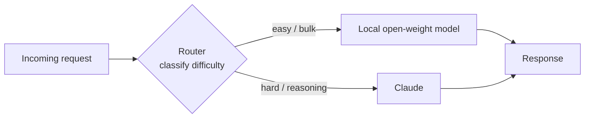

<LevelBadge level="advanced" />

"프런티어 모델 **또는** 로컬 모델"이라는 프레이밍은 잘못된 선택지입니다. 프로덕션에서 가장 비용 효율적이고, 프라이버시를 존중하며, 회복력 있는 시스템은 **둘 다** 사용합니다 — 쉽고 대량이거나 민감한 작업을 위해 로컬에서 실행되는 작은 오픈웨이트 모델과, 어려운 추론을 처리하는 **스마트 레이어**로서의 Claude 같은 프런티어 모델. 이 페이지는 각 모델이 가장 잘하는 일을 하도록 둘을 연결하는 지속 가능한 *패턴*에 관한 것입니다. 이 패턴들은 제공자 중립적이며 — Claude는 그저 "추론" 역할에 아주 잘 맞을 뿐입니다 — 특정 모델 이름보다 오래 살아남습니다.

<Callout type="objectives" items={[
  "하이브리드(프런티어 + 로컬)가 비용, 프라이버시, 회복력 면에서 어느 한 모델만 쓰는 것을 능가하는 이유를 이해하기",
  "다섯 가지 지속 가능한 하이브리드 패턴 배우기: 라우터/빅-리틀, 초안 후 다듬기, 프라이버시 마스킹, 대량 전/후처리, 오프라인 폴백",
  "각 패턴별로: 언제 사용해야 하는지, 받아들이는 트레이드오프, 구체적인 스케치를 알기",
  "반복 가능한 4단계 방법으로 자신만의 Claude+로컬 하이브리드를 설계하기",
  "이 패턴들이 제공자 중립적임을 알기 — Claude는 록인이 아니라 '스마트 레이어'로 끼워집니다",
]} />

## 양자택일이 아니라 왜 하이브리드인가

로컬 오픈웨이트 모델([Ollama로 모델을 로컬에서 실행하기](/docs/models/run-models-locally-ollama) 참고)과 프런티어 모델은 *서로 다른* 일에 능합니다:

- **로컬**은 프라이빗하고(데이터가 절대 기기를 떠나지 않음), 대규모에서 저렴하며(토큰당 요금 없음), 작은 모델의 경우 저지연이고, 오프라인에서도 작동합니다. 하지만 가장 어려운 추론, 긴 컨텍스트, 에이전트 작업에서는 실질적인 **능력 격차**가 있습니다.
- **Claude(프런티어)**는 바로 그런 어려운 작업에서 앞서지만, 모든 호출이 토큰 비용을 발생시키고 데이터를 클라우드 API로 전송합니다.

아래 모든 패턴의 바탕이 되는 통찰: **대부분의 요청은 쉽고, 어려운 것은 소수입니다.** 저렴한 로컬 모델이 대다수를 처리하고 진짜로 어려운 부분에만 프런티어 모델을 예약하면, 프런티어 품질의 대부분을 비용의 일부로 얻을 수 있으며 — 민감한 데이터는 로컬에 유지할 수 있습니다. Microsoft의 *Hybrid LLM* 논문은 이를 공식화했습니다: 쉬운 쿼리를 작은 모델로 보내는 학습된 라우터가 응답 품질 저하 없이 큰 모델 호출을 **최대 40% 줄였습니다**([arXiv 2404.14618](https://arxiv.org/abs/2404.14618)). 오픈소스 [RouteLLM](https://github.com/lm-sys/RouteLLM) 프레임워크도 비슷한 결과를 보고합니다 — 쿼리의 약 절반을 더 저렴한 모델로 라우팅하여 일반 벤치마크에서 대략 **절반의 비용**으로 프런티어에 근접한 품질을 냅니다.

> 과대광고가 아니라 **제약**을 기준으로 하이브리드를 선택하세요. 어떤 모델이 어떤 작업에 맞는지 아직 모른다면 [모델 선택하기](/docs/models/choosing-a-model)에서 시작하세요 — 그런 다음 돌아와 로컬과 프런티어 사이의 *경계가 어디에 놓이는지* 결정하세요.

---

## 패턴 1 — 라우터 / 빅-리틀

**아이디어.** 모든 요청 앞에 얇은 **분류기**를 둡니다. 그것은 작업을 보고 결정합니다: 쉬움/대량 → 로컬 모델; 어려운 추론 → Claude. 휴대폰이 백그라운드 작업을 작고 효율적인 코어에서 돌리고 무거운 부하일 때만 큰 코어를 깨우는 "big.LITTLE" CPU 설계에서 빌려온 것입니다.

**언제 사용하는가.** 요청이 뒤섞인 스트림이 있고 — 많은 것은 사소하고, 몇 개는 진짜로 어렵고 — 어려운 것에만 프런티어 가격을 지불하고 싶을 때. 이것이 일꾼 같은 하이브리드입니다.

**트레이드오프.** 라우터는 *틀릴* 수 있습니다. 어려운 작업을 로컬 모델로 잘못 보내면 품질이 떨어지고, 쉬운 것을 Claude로 잘못 보내면 과다 지불하게 됩니다. 임계값을 튜닝하여 비용과 품질을 저울질하며, 작은 평가로 자신의 데이터에서 그 임계값을 **측정**해야 합니다([평가](/docs/power-user/evals) 참고).

**스케치.** 라우터는 규칙 레이어(길이, 키워드, 코드 존재 여부)처럼 단순할 수도, 작은 분류기 모델처럼 풍부할 수도 있습니다. 저렴하고 투명한 옵션 하나는 **로컬** 모델 자체에게 난이도를 분류하게 한 다음 디스패치하는 것입니다:

<PromptCard title="라우터 분류 프롬프트 (로컬 모델에서 실행)">{`You are a request router. Classify the user request into exactly one tier.

Return ONLY a JSON object: {"tier": "...", "reason": "..."}

Tiers:
- "local"  → simple, mechanical, or high-volume: short rewrites, formatting,
             single-fact lookup, basic classification/extraction, boilerplate.
- "frontier" → hard reasoning, multi-step planning, long-context synthesis,
             ambiguous instructions, code that must be correct, anything where
             a wrong answer is costly.

Bias toward "local" when in doubt about a CHEAP, low-risk task,
and toward "frontier" when a mistake would be EXPENSIVE.

Request:
"""
{{REQUEST}}
"""`}</PromptCard>

라우터의 출력은 최종 답이 아니라 라우팅 결정입니다 — 그것을 작고 빠르게 유지하세요. 많은 도구나 모델에 걸친 더 풍부한 라우팅에도 같은 분류-후-디스패치 로직이 일반화됩니다(그리고 모델이 [도구](/docs/api/tool-use) 사이에서 선택하는 방식과 닮았습니다).

---

## 패턴 2 — 초안 후 다듬기

**아이디어.** 로컬 모델이 **저렴한 초안**을 만들고; Claude가 그것을 **다듬고, 교정하거나, 검증**합니다. 백지에서 생성하는 게 아니라 다듬는 데 프런티어 토큰을 지불합니다 — 그리고 좋은 초안은 Claude의 일을 짧고 더 신뢰할 수 있게 만듭니다.

**언제 사용하는가.** 거친 초안이 완벽한 초안보다 훨씬 저렴하지만 최종 출력은 고품질이어야 하는 개방형 생성: 장문 글쓰기, 코드, 구조화된 문서, 정확히 맞아야 하는 요약.

**트레이드오프.** 한 번이 아니라 두 번의 모델 호출은 지연을 더하고, *나쁜* 초안은 다듬는 모델을 자신의 실수 쪽으로 고정시킬 수 있습니다. 이점은 초안 작성이 비싼 부분이고 다듬기가 상대적으로 저렴할 때 나타납니다 — "로컬 초안 + 프런티어 다듬기"가 수용 가능한 출력당 비용에서 실제로 "프런티어가 전부 처리"를 능가하는지 자신의 데이터에서 검증하세요.

**스케치.** 로컬 모델이 초안 작성 → 초안을 집중된 지시와 함께 Claude에 전달: *"여기 초안이 있습니다. 오류를 고치고, 조이고, 주장을 검증하세요; 수정된 버전을 반환하세요."* 이것은 토큰 수준에서 **추측 디코딩(speculative decoding)**을 구동하는 것과 같은 직관입니다 — 작은 초안 작성기가 제안하고, 큰 모델이 검증하여 통과하는 것만 유지합니다([NVIDIA: speculative decoding](https://developer.nvidia.com/blog/an-introduction-to-speculative-decoding-for-reducing-latency-in-ai-inference/)). 작업 수준에서 당신은 손으로 같은 일을 하고 있습니다: 저렴한 제안, 비싼 검증.

---

## 패턴 3 — 프라이버시 마스킹

**아이디어.** 로컬 모델(또는 로컬 NLP 도구)이 무언가가 클라우드 API로 전송되기 *전에* 텍스트에서 **PII를 제거**합니다. Claude는 마스킹된 버전을 추론하고; 필요하면 돌아오는 길에 실제 값을 로컬에서 다시 삽입합니다.

**언제 사용하는가.** 프런티어 추론을 원하지만 규제 대상이거나 민감한 데이터(건강, 금융, 고객 기록)를 다루고 있고 원본 PII가 당신의 환경을 **떠나서는 안 될** 때. 마스킹은 그 안의 사람들을 노출하지 않고도 문제의 *형태*에 클라우드 모델을 사용하게 해줍니다.

**트레이드오프.** 마스킹은 결코 완벽하지 않습니다 — 놓친 엔티티는 유출이고, 과도한 마스킹은 모델이 잘 답하는 데 필요한 컨텍스트를 파괴합니다. 마스킹 도구를 보안 통제로 취급하세요: 재현율을 테스트하고, 마스킹 해제 매핑을 엄격히 로컬에 유지하세요.

**스케치.** 입력에 대해 로컬 탐지기/익명화기를 실행하여 엔티티를 플레이스홀더(`[PERSON_1]`, `[EMAIL_1]`)로 교체하고, 마스킹된 텍스트를 Claude로 보낸 다음, 플레이스홀더를 로컬에서 다시 채웁니다. Microsoft의 오픈소스 [Presidio](https://github.com/microsoft/presidio)가 여기서 흔한 구성 요소입니다 — 그것은 PII를 탐지하고 익명화하며 플러그형 NLP 백엔드를 사용할 수 있고, 어려운 사례에 대한 2차 처리를 위해 로컬 모델을 포함할 수 있습니다. 중요하지만 자주 놓치는 세부 사항: 사용자의 최신 메시지뿐 아니라 검색된 문서와 도구 결과를 포함하여 모델에 도달하는 **모든 것**을 마스킹하세요.

---

## 패턴 4 — 대량 전/후처리

**아이디어.** 로컬 모델이 **대량의 반복적인** 작업 — 수천 개 항목에 걸친 추출, 분류, 태깅, 정규화 — 을 처리하고, Claude는 로컬 모델이 낮은 신뢰도로 표시한 **몇 개의 어려운 사례**만 처리합니다.

**언제 사용하는가.** 파이프라인 워크로드: 지원 티켓 10만 건 분류, 문서 산더미에서 필드 추출, 콘텐츠 홍수에 태깅. 모든 항목을 프런티어 API로 돌리면 느리고 비쌉니다; 대부분의 항목은 쉽습니다.

**트레이드오프.** 올바른 항목이 에스컬레이션되도록 신뢰할 수 있는 **신뢰도 / 에스컬레이션 신호**가 필요합니다. 너무 적극적이면 과다 지불하고; 너무 소극적이면 어려운 꼬리 부분의 품질이 떨어집니다. 로컬 모델의 자체 보고 신뢰도가 출발점이지만, 그것을 검증하세요.

**스케치.** 로컬 모델이 전체 배치를 처리하고 신뢰도 점수를 붙입니다; 임계값 미만인 항목(또는 스키마/검증 체크에 실패한 항목)은 어려운 판단을 위해 Claude로 에스컬레이션됩니다. 이것은 라이브 요청 대신 배치에 적용된 패턴 1입니다 — 캐스케이드가 활용하는 것과 같은 "저렴한 쪽이 대다수를, 프런티어가 꼬리를" 경제학이며, 쉬운 다수에서 최소한의 품질 손실로 종종 **40~70% 비용 절감**을 냅니다.

---

## 패턴 5 — 오프라인 폴백

**아이디어.** 로컬 모델이 **안전망**입니다. 클라우드 API가 다운되거나, 속도 제한에 걸리거나, 도달 불가능할 때, 요청은 *완전히* 실패하는 대신 로컬 모델로 *넘어갑니다*. 저하된 답변이 오류 페이지보다 낫습니다.

**언제 사용하는가.** 항상 최고 품질보다 가용성이 더 중요한 모든 것: 계속 작동해야 하는 내부 도구, 온디바이스 기능, 제공자 장애 중에 사용자에게 강한 오류를 보여줄 수 없는 제품.

**트레이드오프.** 폴백 응답은 정의상 **더 낮은 품질**입니다 — 프런티어 천장을 "그래도 작동함"과 맞바꾸는 것입니다. 저하를 명시적으로 만드세요(라벨을 붙이고, 기능 세트를 좁히세요) — 더 약한 답변을 진짜인 척 조용히 제공하지 마세요.

**스케치.** 호출을 순서 있는 체인으로 감싸세요: Claude 시도 → 가용성 오류(타임아웃, 429/5xx) 발생 시 백오프로 재시도 → 여전히 실패하면 로컬 모델로 라우팅. LiteLLM과 OpenRouter 같은 LLM 게이트웨이는 정확히 이 폴백 체인 패턴을 구현하며, 오프라인 경로가 여전히 유용한 무언가를 제공할 수 있도록 공통 프롬프트 캐싱도 포함합니다. 지속 가능한 원칙: **로컬 모델을 마지막 방어선으로 항상 예열해 두세요**, 그래서 장애가 경험을 망가뜨리는 대신 저하시키도록 하세요.

---

## 자신만의 Claude+로컬 하이브리드 설계하기

<Steps items={[
  {title: "요청 분포를 매핑하기", body: "실제 트래픽을 샘플링하고 어느 정도 비율이 진짜로 어려운지 vs 쉬움/대량인지 vs 민감한지 라벨링하세요. 이 분포의 형태가 어떤 패턴이 이득인지 알려줍니다 — 긴 쉬운 꼬리는 라우터나 대량 전처리에 유리하고; 작은 민감한 부분은 마스킹에 유리합니다."},
  {title: "제약에 맞는 패턴을 고르기", body: "뒤섞인 라이브 트래픽 → 패턴 1(라우터). 예산 내에서 고품질 생성 → 패턴 2(초안 후 다듬기). 규제 대상/민감한 데이터 → 패턴 3(마스킹). 파이프라인 / 배치 볼륨 → 패턴 4(대량). 가용성이 중요 → 패턴 5(폴백). 많은 시스템은 둘이나 셋을 조합합니다."},
  {title: "경계를 설정한 다음 측정하기", body: "로컬이 어디서 멈추고 Claude가 어디서 시작하는지 결정하세요(라우터 임계값, 신뢰도 컷오프, 마스킹 정책). YOUR 데이터에서 작은 평가를 실행하여 비용 대 품질 트레이드에 숫자를 붙이세요. 리더보드나 벤더의 헤드라인을 믿지 마세요 — 자신의 작업에서 측정하세요. 평가 페이지를 참고하세요."},
  {title: "관측성과 안전 밸브를 추가하기", body: "모든 라우팅/에스컬레이션 결정과 그 결과를 로깅하여 모델과 트래픽이 변할 때 경계를 다시 튜닝할 수 있게 하세요. 명시적 폴백(패턴 5)을 유지하여 제공자 장애가 망가지는 대신 우아하게 저하되도록 하세요."},
]} />

<VerifyNote lastVerified="2026-06-28" source="https://docs.anthropic.com/en/docs/build-with-claude/models">
특정 모델 이름, 컨텍스트 윈도우, 토큰당 가격, 속도 제한은 자주 바뀌며 의도적으로 여기 다시 기재하지 **않습니다** — 그것들이 변동성이 큰 부분입니다. 라우터나 캐스케이드의 비용 또는 품질 임계값을 고정하기 전에, 위 출처에서 현재 Claude 모델 라인업과 가격을 확인하고, <a href="https://ollama.com/library">Ollama 라이브러리</a>에서 현재 로컬 모델 이름을 확인하세요. 이 페이지의 패턴은 지속 가능하지만, 경계 뒤의 정확한 숫자는 그렇지 않습니다.
</VerifyNote>

<Quiz title="스스로 점검하기" questions={[
  {q: "모든 하이브리드 패턴이 작동하게 만드는 핵심 경제적 통찰은 무엇인가요?", options: ["로컬 모델이 항상 프런티어 모델보다 낫다", "대부분의 요청은 쉽고; 소수만이 진정으로 프런티어 추론을 필요로 한다", "프런티어 모델이 로컬 모델보다 토큰당 더 저렴하다"], answer: 1, explain: "실제 트래픽의 대다수는 쉽습니다. 저렴한 로컬 모델이 쉬운 다수를 처리하고 어려운 소수에만 프런티어 모델을 예약하면, 비용의 일부로 품질의 대부분을 얻습니다. 그 비대칭성이 바로 여기 모든 패턴이 활용하는 것입니다."},
  {q: "고객 기록을 추론하는 데 프런티어 모델을 반드시 써야 하지만, 원본 PII는 당신의 환경을 떠날 수 없습니다. 어떤 패턴이 맞나요?", options: ["라우터 / 빅-리틀", "프라이버시 마스킹", "오프라인 폴백"], answer: 1, explain: "프라이버시 마스킹은 무언가가 클라우드 API에 도달하기 전에 PII를 로컬에서 제거하므로, Claude는 마스킹된 버전을 추론하고 실제 값은 당신의 환경에 남습니다. 라우터는 작업을 어디로 보낼지 결정할 뿐, 민감한 데이터를 제거하지 않습니다."},
  {q: "라우터 / 빅-리틀 패턴에 특유한 주된 위험은 무엇인가요?", options: ["오직 하나의 모델만 사용할 수 있다", "잘못 라우팅된 작업은 품질(어려운 것을 로컬로 보냄)이나 비용(쉬운 것을 프런티어로 보냄)을 대가로 치른다", "클라우드 API가 항상 온라인이어야 한다"], answer: 1, explain: "라우터는 분류기이고 틀릴 수 있습니다. 어려운 작업을 약한 모델로 잘못 보내면 품질이 상하고; 쉬운 것을 프런티어로 잘못 보내면 돈을 낭비합니다. 그래서 자신의 데이터에서 라우팅 임계값을 튜닝하고 측정하는 것입니다."},
  {q: "왜 초안 후 다듬기가 때로는 가치가 없나요?", options: ["항상 단일 프런티어 호출보다 낮은 품질을 낸다", "두 번의 호출이 지연을 더하고, 나쁜 로컬 초안이 다듬는 모델을 실수 쪽으로 고정시킬 수 있다", "프런티어 모델은 자신이 쓰지 않은 텍스트를 편집할 수 없다"], answer: 1, explain: "초안 후 다듬기는 초안 작성이 비싼 부분이고 다듬기가 저렴할 때만 이깁니다. 두 번의 모델 호출은 지연을 더하고, 약한 초안이 다듬는 모델을 헷갈리게 할 수 있으므로 — 로컬 초안 + 프런티어 다듬기가 실제로 프런티어가 전부 처리하는 것을 능가하는지 자신의 데이터에서 검증하세요."},
]} />

<Flashcards title="다섯 가지 하이브리드 패턴 한눈에 보기" cards={[
  {front: "라우터 / 빅-리틀", back: "각 요청을 분류한 다음 디스패치: 쉬움/대량 → 로컬, 어려운 추론 → Claude. 일꾼 같은 하이브리드. 트레이드오프: 라우터가 잘못 라우팅할 수 있음 — 자신의 데이터에서 임계값을 튜닝하세요."},
  {front: "초안 후 다듬기", back: "로컬 모델이 저렴하게 초안 작성; Claude가 다듬기/검증. 생성이 아니라 다듬기에 프런티어 토큰을 지불. 트레이드오프: 추가 지연, 그리고 나쁜 초안이 다듬는 모델을 고정시킬 수 있음."},
  {front: "프라이버시 마스킹", back: "로컬 모델/NLP 도구가 무언가 클라우드 API에 도달하기 전에 PII 제거; 로컬에서 다시 채움. 민감한 데이터에 프런티어 추론을 쓰게 해줌. 트레이드오프: 놓친 엔티티는 유출; 사용자 메시지뿐 아니라 도구 결과와 검색된 문서도 마스킹하세요."},
  {front: "대량 전/후처리", back: "로컬이 전체 배치에 걸쳐 대량 추출/분류를 처리; Claude는 낮은 신뢰도 에스컬레이션만 처리. 배치에 적용된 패턴 1. 신뢰할 수 있는 신뢰도/에스컬레이션 신호가 필요."},
  {front: "오프라인 폴백", back: "로컬 모델이 안전망: 클라우드 API가 다운되거나 속도 제한에 걸리면, 완전히 실패하는 대신 로컬로 넘어감. 저하된 답변이 오류보다 낫다. 저하를 명시적으로 만드세요."},
]} />

<Callout type="takeaways" items={[
  "프런티어 vs 로컬은 잘못된 선택 — 최고의 시스템은 둘 다 쓰며, 어려운 작업의 소수를 위한 제공자 중립적 '스마트 레이어'로 Claude를 둡니다",
  "다섯 패턴 모두 하나의 통찰에 올라탑니다: 대부분의 요청은 쉽고 저렴하다; 진짜로 어려운 부분에 프런티어 지출을 예약하세요",
  "라우터/빅-리틀은 일꾼; 초안 후 다듬기는 예산 내에서 품질을 삽니다; 마스킹은 민감한 데이터를 열어줍니다; 대량 전처리는 파이프라인을 확장합니다; 오프라인 폴백은 회복력을 삽니다 — 그리고 이들은 조합됩니다",
  "모든 패턴에는 경계(임계값, 신뢰도 컷오프, 마스킹 정책)가 있습니다 — 리더보드가 아니라 작은 평가로 YOUR 데이터에서 측정하세요",
  "변동성 큰 숫자(모델 이름, 가격, 제한)는 검증 단계 뒤에 두세요; 패턴은 지속 가능하지만 세부 사항은 그렇지 않습니다",
]} />

## 출처 및 더 읽을거리

- [Hybrid LLM: Cost-Efficient and Quality-Aware Query Routing (arXiv 2404.14618, ICLR 2024)](https://arxiv.org/abs/2404.14618)
- [RouteLLM — LLM 라우터를 서빙하고 평가하는 오픈소스 프레임워크 (GitHub, LMSYS)](https://github.com/lm-sys/RouteLLM)
- [RouteLLM: An Open-Source Framework for Cost-Effective LLM Routing (LMSYS 블로그)](https://www.lmsys.org/blog/2024-07-01-routellm/)
- [Microsoft Presidio — PII 탐지, 마스킹, 익명화 (GitHub)](https://github.com/microsoft/presidio)
- [Presidio PII masking with LiteLLM — 튜토리얼](https://docs.litellm.ai/docs/tutorials/presidio_pii_masking)
- [An Introduction to Speculative Decoding (NVIDIA 기술 블로그)](https://developer.nvidia.com/blog/an-introduction-to-speculative-decoding-for-reducing-latency-in-ai-inference/)
- [Model fallbacks — 자동 페일오버를 통한 신뢰할 수 있는 AI (OpenRouter 문서)](https://openrouter.ai/docs/guides/routing/model-fallbacks)
- [Anthropic — Claude 모델 개요](https://docs.anthropic.com/en/docs/build-with-claude/models)
