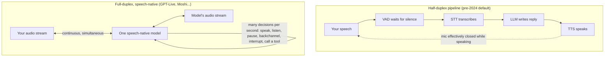

<LevelBadge level="beginner" />

십 년 동안 컴퓨터와 이야기한다는 것은 사람인 척하는 무전기와 번갈아 말하는 일이었습니다. **2026년 7월 8일, OpenAI가 GPT-Live를 출시했습니다** — 말하는 *동안* 듣는 음성 모델 — 그리고 무전기 시대가 공식적으로 끝나기 시작했습니다. 이 페이지는 내부에서 실제로 무엇이 바뀌었는지, 옛 음성 스택이 왜 로봇처럼 느껴질 수밖에 없었는지, 그리고 2026년 음성 에이전트 지형 전체를 과장 없이 판단하는 법을 설명합니다.

<Callout type="objectives" items={[
  "고전적인 STT → LLM → TTS 파이프라인이 왜 늘 굼떴는지 이해하기 — 마감의 문제가 아니라 물리의 문제입니다",
  "전이중이 무엇인지 알기: 듣기와 말하기를 동시에 하는 하나의 음성 네이티브 모델",
  "GPT-Live와 현재 음성 지형(OpenAI, Google, ElevenLabs, Anthropic, 오픈 모델)에 대한 검증된 사실 얻기",
  "오늘날 음성 에이전트가 진짜로 쓸 만한 때 — 그리고 여전히 무엇이 깨지는지 알기",
]} />

<VerifyNote lastVerified="2026-07-13" source="https://openai.com/index/introducing-gpt-live/">
GPT-Live는 며칠 전에 출시되었고 세부 사항(모델 티어, 롤아웃, API 접근)이 빠르게 움직이고 있습니다. 이 페이지의 제품 이름, 제공 여부, 지연시간 수치는 상하기 쉽습니다 — 오늘의 진실은 각 제공자의 페이지(출처에 링크)에서 확인하세요.
</VerifyNote>

## 200밀리초 문제

이 페이지의 나머지 전부를 설명하는 사실이 여기 있습니다. **사람은 서로에게 약 0–200밀리초 안에 반응합니다.** 10개 언어에 걸친 획기적인 교차언어 연구(Stivers 외, *PNAS* 2009)는 테스트된 모든 문화에서 응답 간격이 **0 ms** 근처에 몰린다는 것을 발견했습니다. 우리는 상대가 말을 끝내기 *전에* 답을 시작하는 일이 예사인데, 뇌가 상대의 차례가 끝나는 지점을 예측하기 때문입니다.

이제 고전적인 음성 어시스턴트 스택과 비교해 봅시다. 그것은 서로 붙인 **세 개의 별도 모델로 이루어진 파이프라인**이었습니다.

1. **STT (음성-텍스트 변환)**가 여러분의 오디오를 텍스트로 옮기고,
2. **LLM**이 그 전사를 읽고 답을 쓰고,
3. **TTS (텍스트-음성 변환)**가 그 답을 다시 오디오로 바꿉니다.

각 단계가 (대체로) 끝나야 다음이 시작되므로 지연이 **쌓입니다**. 더 나쁜 것은, 파이프라인은 여러분이 말을 멈췄는지 알 방법이 없고 — 오디오에는 "전송" 버튼이 없으니까요 — 그래서 엔지니어들이 **VAD (음성 활동 감지)** 침묵 타이머를 덧붙였습니다. 대략 0.5초에서 1초의 침묵을 기다린 뒤 차례가 끝났다고 *추측*합니다. 그 하나의 해킹이 두 가지 고전적 실패 모드를 모두 설명합니다. 생각하려고 문장 중간에 멈추면 봇이 끼어들고, 딱 떨어지게 끝내도 봇은 여전히 침묵 타이머를 기다리며 앉아 있습니다. 다 더하면 사람이 약 0–200 ms를 기대하는 자리에 1–3초의 정적이 생깁니다 — 모델이 한 마디 하기도 전에 이미 **한 자릿수만큼 너무 느립니다**.

그리고 더 나빠집니다. 파이프라인은 무전기처럼 **반이중**입니다. 봇이 말하는 동안에는 듣지 않습니다. 특별한 엔지니어링 없이는 끼어들("바지인") 수 없고, 봇은 *여러분이* 말하는 동안 "음음" 할 수 없으며, 겹침 — 대화에서 가장 인간적인 부분 — 은 구조상 그냥 불가능합니다.

## "전이중"이 실제로 뜻하는 것

**전이중(Full-duplex)**은 통신 용어입니다. 양방향이 *동시에* 송신합니다(전화 통화). 반면 **반이중(half-duplex)**은 번갈아 합니다(무전기). AI 음성에 적용하면 이렇습니다.

- **모델이 듣기와 말하기를 동시에 합니다.** "네 차례 / 내 차례" 상태 기계가 없습니다. 출력 오디오가 흘러 나가는 동안 입력 오디오가 계속 흘러 들어옵니다.
- **음성 네이티브입니다.** 세 모델이 텍스트를 주고받는 대신, 하나의 모델이 오디오를 직접 소비하고 생산합니다. 전사 단계도, 합성 단계도, 쌓이는 지연시간도 없습니다 — 그리고 정보 손실도 없습니다(어조, 망설임, 반어, 감정이 텍스트로 납작해진 적이 없으므로 살아남습니다).
- **차례 주고받기가 타이머가 아니라 학습된 행동이 됩니다.** GPT-Live에 대한 OpenAI의 설명에 따르면 모델은 상호작용 결정을 "초당 여러 번" 내립니다. 말할지, 계속 들을지, 멈출지, 맞장구칠지, 끼어들지, 도구를 부를지. 모델이 사람처럼 차례의 끝을 *예측*하므로 침묵 감지 해킹이 사라집니다.
- **맞장구와 바지인이 공짜로 딸려 옵니다.** 여러분이 말하는 동안 "음음"이라 중얼거릴 수 있고(**백채널**), 끼어드는 순간 문장 중간에 멈출 수 있고(**바지인**), 여러분이 생각하는 동안 조용히 있을 수 있습니다 — 파이프라인에서는 불가능하거나 해킹이었던 것들입니다.

이것을 아는 사람이 드뭅니다. **전이중은 2026년에 OpenAI가 발명한 게 아닙니다.** 프랑스 랩 **Kyutai가 2024년에 Moshi를 오픈소스로 공개했습니다** — 이론적 약 160 ms / 실제 약 200 ms 지연시간의 전이중 음성 모델로, *두 개의 병렬 오디오 스트림*(여러분의 것과 자기 것)을 모델링하고 시간 정렬된 텍스트 토큰의 "Inner Monologue"로 자기 발화의 언어적 일관성을 유지합니다. 오늘 가중치를 내려받아 로컬에서 돌릴 수 있습니다. 이번 달 바뀐 것은 전이중이 연구 데모에서 **수억 ChatGPT 사용자의 기본 인터페이스**가 되었다는 점입니다.

## GPT-Live: OpenAI가 실제로 내놓은 것

OpenAI의 발표와 출시 보도(2026년 7월 8일)에 대조해 검증했습니다.

- **두 모델: GPT-Live-1과 GPT-Live-1 mini.** mini가 Advanced Voice Mode를 대체해 ChatGPT Voice의 기본값이 되고(무료 티어 포함), 더 큰 GPT-Live-1은 유료 티어용입니다. TechCrunch는 이미 **1억 5천만 명 이상**이 ChatGPT의 음성 기능을 쓴다고 보도합니다.
- **진짜 전이중 아키텍처.** 출력을 생성하면서 입력을 연속 처리하고, 말하기/듣기/멈춤/끼어들기/도구 결정을 초당 여러 번 내립니다. 맞장구를 치고("음음", "네"), 빠른 왕복을 처리하며 — 특히 — **조용히 있으면서** 불릴 때까지 맥락만 흡수할 수 있습니다.
- **프런티어 모델로의 위임.** 웹 검색, 더 깊은 추론, 에이전틱 작업이 필요하면 GPT-Live는 그 작업을 OpenAI의 프런티어 모델(출시 시점 GPT-5.5)에 **백그라운드로 넘기고 여러분과 계속 대화합니다**. 음성 모델은 대화의 프런트엔드이고, 무거운 사고는 다른 곳에서 일어납니다. 이 "빠른 말꾼 + 느린 사색가" 분업이 주시할 아키텍처 패턴입니다.
- **실시간 번역**은 말하면서 듣는 연속 설계에서 저절로 나옵니다 — 모델이 여러분의 문장을 말하는 거의 그 순간에 다른 언어로 옮길 수 있습니다. (출시 보도는 일부 언어에서 억양 품질이 아직 고르지 않다고 지적했습니다.)
- **출시 시점에 개발자 API 없음.** GPT-Live는 당분간 ChatGPT 제품입니다. OpenAI는 API 접근이 곧 온다고 하며 가입 양식을 두었습니다. 빌더에게는 **Realtime API의 gpt-realtime이 현재의 개발자 제품**입니다(아래 참고).
- **출시 시점의 알려진 한계:** 음성 세션에서 비디오/화면 공유 없음, 주요 언어 바깥에서는 품질이 고르지 않음, OpenAI는 정서적 의존 영향을 모니터링 중이라고 밝힘.

<VerifyNote lastVerified="2026-07-13" source="https://openai.com/index/introducing-gpt-live/">
티어별 제공 여부, 위임 뒤에 있는 정확한 프런티어 모델, API 시점이 여기서 가장 빠르게 움직이는 주장입니다 — 이를 옮기기 전에 OpenAI의 발표를 다시 확인하세요.
</VerifyNote>

## 음성 지형, 검증됨 (2026년 7월)

| 플레이어 | 무엇이 있나 | 전이중? | 비고 |
|---|---|---|---|
| **OpenAI — GPT-Live** | ChatGPT Voice (소비자용) | **예** — 음성 네이티브 | 어려운 작업을 대화 도중 프런티어 모델에 위임. 아직 API 없음 |
| **OpenAI — Realtime API (gpt-realtime)** | 개발자 API, 정식 제공 | 음성-음성, 단일 모델 | 프로덕션 음성 에이전트: SIP 전화 통화, 원격 MCP 서버, 이미지 입력 |
| **Google — Gemini Live API** | 개발자 API (AI Studio / Vertex, 정식 제공) | 네이티브 오디오, 스트리밍 | 바지인, "proactive audio"(관련 있을 때만 말함), 정서적 대화, 도구 사용 + Google 검색 |
| **ElevenLabs — Agents** | 에이전트 플랫폼 (2026년 3월 출시) | 자체 차례 주고받기 모델을 얹은 오케스트레이션 스택 | TTS/STT + 차례 주고받기 + 도구 호출. 70개 이상 언어. 첫 차례 500 ms 미만 주장. 전화/웹/앱 채널 |
| **Anthropic — Claude** | [Claude 앱의 보이스 모드](/docs/claude-app/voice-mode). Claude Code의 푸시투토크 `/voice` (2026년 3월, 다국어는 2026년 6월 베타 종료) | **아니오** — 차례 기반 | 말하면 음성 답변을 받고 전사가 저장됩니다. 검증일 기준 음성 네이티브 전이중 모델은 발표되지 않았습니다 — 누가 아니라고 해도 믿지 마세요 |
| **Kyutai — Moshi** | 오픈 가중치 + 코드 (GitHub, Hugging Face) | **예** — 오픈소스 증명 | 약 160–200 ms 지연시간, 듀얼 스트림 오디오, "Inner Monologue". 로컬에서 실행 |

대부분의 보도가 놓치는 그 표의 두 가지 요점: **(1)** 오늘날 "음성 에이전트"는 두 가지 다른 아키텍처를 뜻합니다. 진짜 음성 네이티브 전이중 모델(GPT-Live, Moshi, Gemini의 네이티브 오디오) 대 학습된 차례 주고받기 모델을 위에 얹은 매우 빠르고 잘 오케스트레이션된 파이프라인(ElevenLabs Agents). 둘 다 좋게 느껴질 수 있지만, 발화를 겹칠 수 있는 것은 앞의 것뿐입니다. **(2)** 오픈소스 선택지는 실재합니다. Moshi는 자체 하드웨어에서 전이중을 돌릴 수 있음을 증명하며, 오디오를 클라우드로 보낼 수 없는 사용 사례라면 이것이 중요합니다(그 결정 프레임워크는 [모델 고르기](/docs/models/choosing-a-model) 참고).

## 전이중 대화가 실제로 흐르는 방식

<Steps items={[
  {title: "오디오가 연속으로 흘러 들어온다", body: "녹음 후 전송이 없습니다. 마이크 오디오가 프레임 단위로 토큰으로 인코딩되어(Moshi의 코덱은 80 ms 프레임을 씁니다) 도착하는 대로 모델에 공급됩니다 — 모델이 문장 중간이어도요."},
  {title: "모델이 끊임없이 미세 결정을 내린다", body: "초당 여러 번 고릅니다: 계속 말할지, 멈출지, 조용히 있을지, 맞장구('음음')를 떨어뜨릴지, 답을 시작할지. 차례 주고받기는 침묵 타이머가 아니라 모델이 실제 대화에서 배운 예측입니다."},
  {title: "여러분이 끼어들면 즉시 양보한다", body: "바지인이 네이티브입니다. 모델은 듣기를 멈춘 적이 없으므로 여러분이 시작하는 순간 듣습니다. 자기 문장을 끊고, 여러분이 한 말을 흡수하고, 조정합니다 — '멈춰' 같은 키워드가 필요 없습니다."},
  {title: "어려운 질문은 부드럽게 위임된다", body: "웹 검색이나 진짜 추론이 필요한 것을 물으면 GPT-Live는 그것을 백그라운드에서 프런티어 모델에 넘기면서 — 대화를 살려 둡니다('그거 좀 확인해 볼게요... 그건 그렇고—'). 답은 준비되면 엮여 들어옵니다."},
  {title: "침묵도 유효한 수다", body: "전이중 모델은 의도적으로 아무 말도 하지 않을 수 있습니다 — 차례를 가로채지 않고 여러분이 소리 내어 생각하게 둡니다. 파이프라인 봇은 문자 그대로 이걸 못 했습니다. VAD가 여러분의 멈춤을 초대장으로 취급했으니까요."},
]} />

## 음성 에이전트가 이제 쓸 만한 곳 — 그리고 여전히 깨지는 것

**이제 진짜로 쓸 만한 곳:**

- **고객 지원과 전화 워크플로.** 1초 미만의 차례 주고받기와 바지인이 가장 큰 두 불만 요인을 없앱니다. Realtime API의 SIP 지원과 ElevenLabs Agents 모두 정확히 이것을 겨냥합니다.
- **손이 자유롭지 않거나 눈이 바쁜 사용.** 운전, 요리, 현장 작업, 접근성 — 상호작용이 마침내 말하기 속도를 따라잡습니다([Claude 앱의 보이스 모드](/docs/claude-app/voice-mode)는 이미 캡처-후-전사 버전을 다룹니다).
- **실시간 번역과 언어 연습.** 말하면서 듣는 것이 준동시통역과 자연스러운 회화 훈련을 처음으로 가능하게 합니다.
- **에이전트 프런트엔드로서의 음성.** 위임 패턴 — 느린 프런티어 모델이 일하는 동안 빠른 음성 모델과 대화 — 은 "오래 도는 에이전틱 작업"을 음성으로 관리하겠다는 OpenAI의 공언된 베팅입니다.

**여전히 깨지는 것:**

- **환각된 오디오.** 음성 네이티브 모델은 사실만이 아니라 *소리*에서도 환각할 수 있습니다. 잘못된 언어로 표류하거나, 이름과 숫자를 뭉개거나, 억양이 어긋납니다(GPT-Live의 출시 번역 데모가 정확히 이 비판을 받았습니다). 확인하지 않은 구어 숫자는 절대 믿지 마세요.
- **시끄러운 환경과 크로스토크.** 항상 열린 마이크는 모든 것을 듣습니다 — 옆 대화, TV, 두 번째 화자. 전이중은 모델을 주변 오디오에 덜 노출시키는 게 아니라 *더* 노출시킵니다.
- **실시간 액션의 안전성.** 대화 속도로 행동하는 모델은 잘못 들은 문장에 대화 속도로 행동할 수 있습니다. 돈, 메시지, 삭제를 건드리는 음성 에이전트에는 명시적인 구두 확인 게이트와 읽기 전용 기본값 성향이 필요합니다 — 다른 에이전트와 같은 규칙이지만([기초](/docs/foundations) 참고) 입력 채널의 충실도가 더 낮습니다.
- **정서적 의존.** 맞장구치고, 망설이고, 결코 여러분에게 지치지 않는 시스템은 친구처럼 느껴지도록 설계된 것입니다. OpenAI 자신도 이를 모니터링한다고 표시합니다. 그에 맞게 설계하고(그리고 사용하세요).

<PromptCard title="음성 에이전트를 위한 시스템 프롬프트 뼈대 (음성 네이티브 모델과 파이프라인 모두에서 동작)">{`You are a voice assistant for {company}. You are SPEAKING, not writing.

Style:
- Short sentences. One idea per sentence. No lists, no markdown, no URLs read aloud.
- If the user interrupts, stop immediately and address what they said.
- If the user pauses mid-thought, stay silent. Do not fill silence.

Safety:
- Before ANY action that sends, buys, deletes, or changes something:
  say back exactly what you will do and wait for a clear spoken "yes".
- Repeat numbers, names, and addresses back for confirmation — always.
- If audio is unclear or noisy, say what you think you heard and ask.
- If asked for something outside {scope}, say so and offer a human handoff.`}</PromptCard>

<Quiz title="확인해 보세요" questions={[
  {q: "고전적인 STT → LLM → TTS 스택은 왜 늘 굼떴나요?", options: ["모델이 너무 작았기 때문", "세 개의 순차 단계와 침묵 감지 타이머가 쌓여 1–3초 지연이 되는데, 사람은 약 0–200 ms를 기대하기 때문", "마이크가 지연을 더하기 때문", "TTS 목소리가 로봇 같았기 때문"], answer: 1, explain: "구조적입니다. 각 단계가 앞 단계를 기다리고, 무엇이 시작되기 전에 VAD가 침묵을 기다립니다. 사람은 약 0–200 ms 안에 반응하므로(Stivers 외, PNAS 2009) 파이프라인은 설계상 한 자릿수만큼 너무 느렸습니다."},
  {q: "전이중 모델이 반이중 파이프라인은 구조상 할 수 없는 무엇을 할 수 있나요?", options: ["사실 질문에 답하기", "더 유창하게 말하기", "말하면서 듣기 — 바지인, 맞장구, 겹치는 발화를 가능하게 함", "도구 사용하기"], answer: 2, explain: "반이중은 무전기처럼 차례를 번갈아 합니다. 봇이 말하는 동안에는 듣지 않습니다. 동시에 듣고 말하기가 전이중의 정의적 속성입니다."},
  {q: "GPT-Live는 웹 검색이나 깊은 추론이 필요한 질문을 어떻게 처리하나요?", options: ["어려운 질문에는 음성을 거부합니다", "답이 준비될 때까지 통화를 멈춥니다", "메모리에서만 답합니다", "백그라운드에서 프런티어 모델에 위임하고 그동안 대화를 이어 갑니다"], answer: 3, explain: "'빠른 말꾼 + 느린 사색가' 분업: 음성 네이티브 모델이 대화를 맡고 무거운 작업을 프런티어 모델(출시 시점 GPT-5.5)에 넘긴 뒤, 결과가 준비되면 엮어 넣습니다."},
  {q: "GPT-Live 출시 이전에 참이었던 것은?", options: ["약 200 ms 지연시간의 전이중 음성 모델이 이미 오픈소스였다 (Kyutai의 Moshi, 2024)", "어떤 모델도 끼어들 수 없었다", "음성 AI는 법적으로 인터넷 연결이 필요했다", "Claude에 전이중 음성 네이티브 모델이 있었다"], answer: 0, explain: "Moshi는 2024년에 듀얼 스트림 전이중 오디오와 약 160–200 ms 지연시간의 오픈 가중치를 내놓았습니다. GPT-Live의 의의는 전이중을 발명한 게 아니라 주류화한 것입니다. Claude의 음성 기능은 검증일 기준 여전히 차례 기반입니다."},
]} />

<Flashcards title="음성 AI 어휘" cards={[
  {front: "반이중 (Half-duplex)", back: "방향을 번갈아 하는 통신 — 무전기 방식. 옛 음성 어시스턴트 파이프라인: 봇이 말하는 동안에는 듣지 않는다."},
  {front: "전이중 (Full-duplex)", back: "전화 통화처럼 양방향이 동시에. 모델이 듣기와 말하기를 동시에 하고 초당 여러 번 말할지, 멈출지, 양보할지 결정한다."},
  {front: "음성 네이티브 모델", back: "오디오를 직접 소비하고 생산하는 단일 모델 — STT/TTS 단계도, 쌓이는 지연시간도 없고, 발화가 텍스트로 납작해진 적이 없으므로 어조/감정이 살아남는다."},
  {front: "바지인 (Barge-in)", back: "문장 중간에 에이전트를 끊으면 즉시 멈추고 적응하는 것. 전이중에서는 네이티브이고, 파이프라인에서는 덧붙인 해킹이다."},
  {front: "백채널 (Backchannel)", back: "상대가 말하는 동안 내는 짧은 청자 신호 — '음음', '네', '알겠어요'. 반이중에서는 구조상 불가능하다."},
  {front: "VAD / 엔드포인팅", back: "음성 활동 감지: 옛 파이프라인이 여러분이 말을 끝냈다고 추측하는 데 쓴 침묵 타이머. 말을 끊는 실패와 어색하게 기다리는 실패 둘 다의 원인."},
  {front: "지연시간 누적 (Latency stacking)", back: "파이프라인 지연이 더해진다: VAD 대기 + STT + LLM + TTS ≈ 1–3초. 사람은 약 0–200 ms를 기대한다 — 봇을 로봇처럼 느끼게 만든 격차."},
  {front: "위임 (빠른 말꾼 / 느린 사색가)", back: "GPT-Live의 패턴: 빠른 음성 네이티브 모델이 대화를 맡고 검색/추론을 백그라운드의 프런티어 모델에 넘기면서 그동안 대화를 살려 둔다."},
]} />

<Callout type="takeaways" items={[
  "옛 스택은 잘못 만들어진 게 아니라 구조적으로 너무 느렸습니다: 쌓이는 STT/LLM/TTS 지연시간과 침묵 타이머, 사람이 기대하는 약 0–200 ms 대비",
  "전이중 = 말하면서 듣는 하나의 음성 네이티브 모델. 바지인, 맞장구, 의도적 침묵이 해킹이 아니라 학습된 행동이 됩니다",
  "GPT-Live(2026년 7월 8일)는 ChatGPT에서 전이중을 주류화하고 위임을 개척합니다: 앞에는 빠른 음성 모델, 뒤에는 프런티어 모델 추론",
  "지형이 둘로 갈립니다: 음성 네이티브 전이중(GPT-Live, Gemini 네이티브 오디오, 2024년부터 오픈소스인 Moshi) 대 학습된 차례 주고받기를 얹은 빠른 오케스트레이션 파이프라인(ElevenLabs Agents). Claude의 음성은 여전히 차례 기반입니다",
  "음성 에이전트는 이제 지원, 핸즈프리, 번역에 쓸 만합니다 — 하지만 오디오 환각, 시끄러운 방, 실시간 액션 안전성은 여전히 확인 게이트를 요구합니다",
]} />

## 다음

- [AI 모델 지형: 모델 고르기](/docs/models/choosing-a-model) — 어떤 모달리티에도 적용되는 결정 프레임워크
- [Claude와 이야기하기 (보이스 모드)](/docs/claude-app/voice-mode) — 오늘날 Claude의 음성 기능이 하는 일
- [기초](/docs/foundations) — 음성이 물려받는 토큰, 컨텍스트, 에이전트 안전 기본기

## 출처 및 더 읽을거리

- [Introducing GPT-Live — OpenAI](https://openai.com/index/introducing-gpt-live/) — 출시 발표 (2026년 7월 8일)
- [OpenAI가 더 자연스러운 실시간 대화를 위한 새 음성 모델을 출시하다 — TechCrunch](https://techcrunch.com/2026/07/08/openai-releases-new-voice-models-for-more-natural-live-conversations/) — 출시 보도: 티어, 1억 5천만 음성 사용자, 번역 데모 유의점
- [프로덕션 음성 에이전트를 위한 gpt-realtime 및 Realtime API 업데이트 소개 — OpenAI](https://openai.com/index/introducing-gpt-realtime/) — 현재의 개발자 음성-음성 제품 (정식 제공)
- [Gemini Live API 기능 — Google AI for Developers](https://ai.google.dev/gemini-api/docs/live-api/capabilities) — 네이티브 오디오, 바지인, proactive audio, 도구 사용
- [ElevenLabs Agents](https://elevenlabs.io/agents) — 에이전트 플랫폼: 차례 주고받기 모델, 채널, 언어
- [Moshi: 실시간 대화를 위한 음성-텍스트 파운데이션 모델 — Kyutai (arXiv 2410.00037)](https://arxiv.org/abs/2410.00037) — 오픈 전이중 아키텍처: 듀얼 스트림, Inner Monologue, 이론적 160 ms 지연시간
- [kyutai-labs/moshi — GitHub](https://github.com/kyutai-labs/moshi) — 전이중을 로컬에서 돌리기 위한 코드와 가중치
- [대화에서 차례 주고받기의 보편성과 문화적 변이 — Stivers 외, PNAS 2009](https://www.pnas.org/doi/10.1073/pnas.0903616106) — 약 0–200 ms 인간 차례 간격 증거
- [Claude Code가 보이스 모드 기능을 내놓다 — TechCrunch](https://techcrunch.com/2026/03/03/claude-code-rolls-out-a-voice-mode-capability/) — Claude의 푸시투토크 음성 입력 현황
