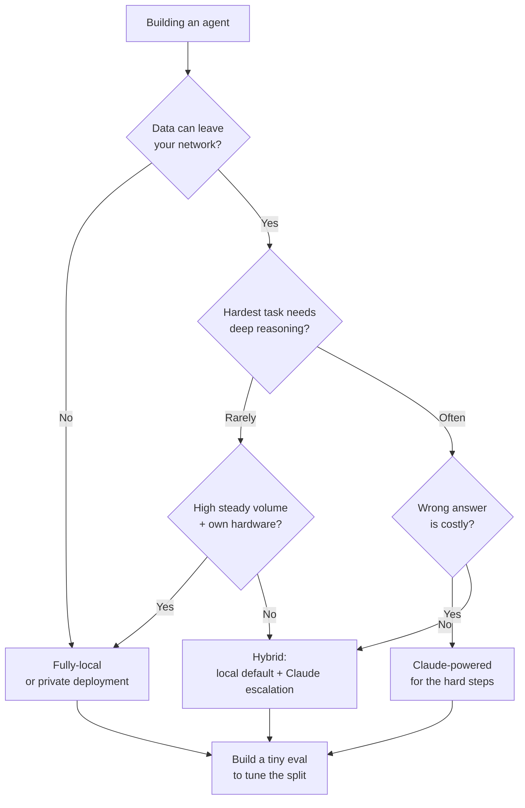

<LevelBadge level="intermediate" />

당신은 에이전트를 만들고 있습니다. 첫 번째 진짜 갈림길은 이것입니다. 에이전트가 **완전 로컬** 오픈 웨이트 모델(비공개, 무료로 실행, 온전히 당신의 것)에서 돌아가야 할까요, **Claude**(프론티어 품질, 호스팅형)에서 돌아가야 할까요, 아니면 둘의 **하이브리드**로 돌아가야 할까요? 이 페이지는 의사결정 프레임워크입니다 — 실제로 결정을 좌우하는 요인들, 명확한 "만약 X → Y로 기운다" 흐름, 그리고 **하이브리드가 대개 이긴다**는 솔직한 현실: 쉽고 민감한 90%는 로컬로, 어려운 10%는 Claude로.

<Callout type="objectives" items={[
  "로컬 vs Claude vs 하이브리드를 실제로 결정하는 요인들을 짚어보기",
  "당신의 에이전트를 위한 명확한 '만약 X → Y로 기운다' 의사결정 흐름을 따라가기",
  "하이브리드(로컬 기본값 + Claude 에스컬레이션)가 왜 종종 양극단 모두를 이기는지 이해하기",
  "리더보드가 아니라, 결정을 가르는 작은 평가(eval)를 손에 쥐고 떠나기",
]} />

<VerifyNote lastVerified="2026-06-28" source="https://artificialanalysis.ai/">
여기 담긴 지속적인 주장들 — *최상위 오픈 웨이트 모델과 프론티어 모델 사이에 역량 격차가 존재하지만 계속 좁혀지고 있다*, 그리고 *라우팅/캐스케이드(저렴한 모델 먼저, 어려우면 에스컬레이션)는 품질을 유지하면서 비용을 절감한다* — 는 안정적입니다. 하지만 **구체적인 수치**(이번 달 격차가 얼마나 큰지, 어떤 오픈 모델이 선두인지, 토큰당 Claude 가격, 특정 하드웨어에서의 정확한 초당 토큰 수)는 끊임없이 변합니다. 어떤 구체적 수치든 상하기 쉬운 것으로 취급하고, 이에 베팅하기 전에 [Artificial Analysis](https://artificialanalysis.ai/) 같은 실시간 트래커를 확인하세요.
</VerifyNote>

## 세 가지 선택지, 한숨에

- **완전 로컬 에이전트** — Ollama/LM Studio/vLLM를 통해 자신의 하드웨어에서 돌아가는 오픈 웨이트 모델(Llama, Qwen, Mistral, DeepSeek 등). 데이터가 절대 기기를 떠나지 않고, 호출당 비용이 없으며, 오프라인에서 작동하고, 하드웨어와 모델의 한계에 묶입니다. → [로컬 AI 에이전트](/docs/models/local-ai-agents)
- **Claude 기반 에이전트** — Claude API를 호출합니다. 프론티어급 추론과 도구 사용, 돌볼 인프라 없음, 즉각적인 확장. 하지만 데이터가 당신의 네트워크를 떠나고, 호출당 비용을 지불하며, 연결성이 필요합니다.
- **하이브리드** — 로컬 모델이 일상적/민감한 대부분을 처리하고, 어렵거나 위험이 큰 단계는 Claude로 에스컬레이션합니다. 대부분의 프로덕션 에이전트가 수렴하는 패턴입니다. → [Claude + 로컬 모델](/docs/models/claude-plus-local-models)

## 실제로 결정을 좌우하는 요인들

당신의 에이전트를 이 요인들에 통과시켜 보세요. 대부분의 결정은 처음 두세 개만으로 정리됩니다.

| 요인 | 이럴 때 **로컬**로 기운다… | 이럴 때 **Claude**로 기운다… |
|---|---|---|
| **데이터 민감성 / 프라이버시** | 데이터가 규제 대상이거나 네트워크를 떠날 수 없을 때 | 데이터가 비민감하거나 규정을 준수하는 데이터 계약이 있을 때 |
| **작업 난이도 및 추론 깊이** | 작업이 좁고, 범위가 잘 정의되어 있으며, 반복적일 때 | 작업이 깊은 다단계 추론, 긴 컨텍스트, 까다로운 도구 사용을 필요로 할 때 |
| **신뢰성 요구** | 실수해도 재시도나 사람이 개입하면 괜찮을 때 | 각 단계가 반드시 옳아야 하고, 실패의 대가가 클 때 |
| **지연 시간** | 로컬 하드웨어가 충분히 빠르게 응답할 때 | GPU를 마련하느니 속도에 돈을 내는 편이 나을 때 |
| **당신의 물량에서의 비용** | 물량이 많고 꾸준할 때 — 고정 하드웨어가 상각된다 | 물량이 적거나 들쭉날쭉할 때 — 호출당 지불이 놀리는 GPU보다 낫다 |
| **오프라인 요구** | 반드시 에어갭/연결 없이 실행해야 할 때 | 항상 온라인이어도 괜찮을 때 |
| **보유한 하드웨어** | 성능 좋은 GPU / 통합 메모리를 소유하고 있을 때 | 없고, 사거나 빌리고 싶지도 않을 때 |
| **돌봄 예산** | 튜닝, 양자화, 평가, 유지보수를 할 수 있을 때 | 운영 없이 "그냥 돌아가기"를 원할 때 |

**대개 결정을 가르는 두 가지:** 데이터가 네트워크를 *떠날 수 없다면*, 그것 하나만으로 다른 모든 것과 무관하게 로컬(또는 프라이빗 배포)로 밀립니다. 떠날 수 있다면, **작업 난이도**가 다음으로 결정을 흔드는 요인입니다 — 쉬운 작업은 로컬에서 저렴하게 처리되고, 어려운 추론은 [프론티어 격차](/docs/models/choosing-a-model)가 여전히 물어뜯는 지점입니다.

<Callout type="info" items={[
  "오픈 웨이트 vs 프론티어 역량 격차는 실재하지만 빠르게 좁혀지고 있습니다 — 최상위 오픈 모델은 일상적 작업과 많은 코딩 작업에서 훌륭하며, 가장 어려운 에이전트형, 장기 지평선, 심층 추론 작업에서는 여전히 대부분 뒤처집니다.",
  "바로 그 비대칭성이 하이브리드를 강력하게 만듭니다: 쉽고 민감한 다수는 로컬로 보내고, 진정으로 프론티어 추론이 필요한 조각만 Claude에 남겨두세요.",
]} />

## 의사결정 흐름

<Steps items={[
  {title: "데이터가 당신의 네트워크를 떠날 수 있는가?", body: "아니오라면 → 로컬(또는 프라이빗/VPC 배포)이 기준선입니다. 프라이버시는 선호가 아니라 강한 제약입니다 — 다른 요인들을 압도합니다. 예라면 → 흐름을 계속 따라가세요."},
  {title: "당신의 에이전트가 해야 하는 가장 어려운 일은 얼마나 어려운가?", body: "모든 작업이 좁고 반복적이라면 → 좋은 로컬 모델이 기준을 넘을 가능성이 큽니다; 로컬로 기우세요. 일부 단계가 깊은 추론, 긴 컨텍스트, 섬세한 멀티툴 오케스트레이션을 필요로 한다면 → 적어도 그 단계들에 대해서는 Claude로 기우세요."},
  {title: "틀린 답의 대가는 얼마나 큰가?", body: "실수가 그저 재시도나 사람의 한 번 훑어봄을 의미한다면 → 로컬의 허용 오차로 충분합니다. 단 한 번의 잘못된 단계가 비싸거나 위험하다면 → 중요한 곳에서는 Claude의 신뢰성을 택하세요."},
  {title: "당신의 물량과 하드웨어는 어떤가?", body: "이미 소유한 하드웨어에서 물량이 많고 꾸준하다면 → 로컬이 아름답게 상각됩니다. 물량이 적거나 들쭉날쭉하고 GPU가 없다면 → Claude의 호출당 지불이 놀리는 쇳덩이를 피합니다."},
  {title: "정말로 인프라를 운영하고 싶은가?", body: "모델을 양자화하고, 서빙하고, 모니터링하고, 재평가할 의향이 있다면 → 로컬/하이브리드가 실현 가능합니다. 운영을 전혀 원치 않는다면 → Claude, 혹은 로컬 부분이 아주 단순한 하이브리드."},
  {title: "하이브리드를 기본값으로 두고, 필요 없다는 걸 증명하라", body: "로컬 모델을 기본 작업자로, Claude를 어렵거나 위험이 큰 조각을 위한 에스컬레이션 경로로. 1단계가 순수 로컬을 강제하거나 작업이 한결같이 어렵지(그렇다면 순수 Claude) 않은 한, 여기서 시작하세요."},
]} />

## 왜 하이브리드가 종종 이기는가

대부분의 실제 워크로드는 **한쪽으로 치우쳐** 있습니다: 요청의 큰 다수는 쉽거나 민감하고, 작은 소수만이 진정으로 어렵습니다. 하이브리드는 그 형태를 직접적으로 활용합니다.

- **로컬이 쉽고 민감한 90%를 처리** — 빠르고, 한계 비용이 없고, 비공개이며, 오프라인 가능. 트래픽의 대부분은 API를 전혀 건드리지 않습니다.
- **Claude가 어려운 10%를 처리** — 다단계 추론, 모호한 엣지 케이스, 정확함이 중요한 단계들. 프론티어 품질이 필요한 조각에만 프론티어 가격을 지불합니다.

이것이 **캐스케이드 / 라우팅** 패턴입니다: 저렴한(로컬) 모델을 먼저 시도하고, 품질 신호가 로컬 답이 충분치 않다고 알리면 Claude로 에스컬레이션하거나, 난이도/민감성 분류기로 앞단에서 라우팅합니다. 전면 프론티어 비용의 일부만 지불하면서 품질 대부분을 유지하는, 잘 확립된 방법입니다 — 게다가 민감한 케이스를 "로컬 전용"에 고정할 수 있으므로 프라이버시 경계 역할도 겸합니다.

<PromptCard title="한 극단에 전념하기 전 자가 점검">{`Answer for YOUR agent:
1. Must any data stay on my machine?            (yes -> local baseline)
2. What % of tasks are genuinely HARD?          (high -> Claude leans heavier)
3. What's a wrong answer cost me?               (high -> Claude on those steps)
4. My volume + hardware?                        (high+own GPU -> local amortizes)
5. Can I babysit infra?                         (no -> Claude or simple hybrid)

If answers conflict -> you've just described a HYBRID.
Now build the tiny eval below and let DATA pick the split.`}</PromptCard>

솔직한 단서: 하이브리드는 **움직이는 부품이 더 많습니다** — 두 개의 모델 경로, 라우터, 그리고 유지해야 할 품질 신호. 당신의 에이전트가 한결같이 단순*하거나* 한결같이 어렵다면, 단일 모델 구성이 더 단순하고 아마도 옳습니다. 워크로드가 진정으로 한쪽으로 치우쳐 있을 때 하이브리드에 손을 뻗으세요.

<Flashcards title="의사결정 가이드 용어" cards={[
  {front: "완전 로컬 에이전트", back: "자신의 하드웨어에서 돌아가는 오픈 웨이트 모델로 구동되는 에이전트. 비공개, 호출당 비용 없음, 오프라인 가능; 하드웨어와 모델의 한계에 묶임."},
  {front: "Claude 기반 에이전트", back: "Claude API를 호출하는 에이전트. 프론티어급 추론과 도구 사용, 인프라 없음, 즉각적 확장; 데이터가 네트워크를 떠나고 호출당 비용을 지불함."},
  {front: "하이브리드 (캐스케이드 / 라우팅)", back: "로컬 모델이 쉽고 민감한 다수를 처리하고, Claude가 어렵고 위험이 큰 소수를 처리함. 저렴한 것 먼저 시도 후 에스컬레이션, 또는 앞단에서 난이도/민감성으로 라우팅."},
  {front: "대개 결정을 가르는 요인", back: "먼저 데이터 민감성(네트워크를 떠날 수 있는가?), 그다음 작업 난이도(가장 어려운 단계가 얼마나 어려운가?). 나머지는 결정을 가르는 보조 요인."},
  {front: "역량 격차", back: "최상위 오픈 웨이트 모델은 주로 가장 어려운 추론/에이전트 작업에서 프론티어 모델에 뒤처짐. 실재하지만 좁혀지는 중 — 바로 그래서 하이브리드가 그토록 효과적임."},
]} />

<Quiz title="스스로 확인하기" questions={[
  {q: "당신의 에이전트가 법적으로 네트워크를 떠날 수 없는 데이터를 처리합니다. 이는 무엇을 먼저 의미할까요?", options: ["Claude를 사용하라 — 품질이 더 높으니까", "다른 요인들과 무관하게, 완전 로컬 또는 프라이빗 배포가 기준선이다", "토큰당 가장 저렴한 쪽을 골라라"], answer: 1, explain: "프라이버시는 강한 제약입니다. 데이터가 네트워크를 떠날 수 없다면 그것이 결정을 압도합니다 — 다른 무엇을 저울질하기 전에 로컬(또는 프라이빗/VPC 배포)이 당신의 기준선입니다."},
  {q: "왜 하이브리드 에이전트가 전형적이고 치우친 워크로드에서 종종 이길까요?", options: ["프론티어 모델은 규모에서 항상 더 저렴하다", "로컬이 쉽고 민감한 다수를 저렴하고 비공개로 처리하고, Claude는 프론티어 추론이 필요한 어려운 소수에게만 남겨진다", "어떤 평가도 필요 없게 만든다"], answer: 1, explain: "대부분의 워크로드는 치우쳐 있습니다. 쉽고 민감한 90%를 로컬 모델로, 어려운 10%를 Claude로 라우팅하면 전면 프론티어 비용의 일부만으로 품질 대부분을 유지하고 — 민감한 케이스는 로컬에 고정합니다."},
  {q: "언제 단일 모델 구성(순수 로컬 또는 순수 Claude)이 하이브리드보다 나은 선택일까요?", options: ["항상 — 하이브리드는 결코 값어치를 못 한다", "워크로드가 한결같이 단순하거나 한결같이 어려워서, 추가되는 라우터와 품질 신호 장치가 제 몫을 못할 때", "GPU가 없을 때만"], answer: 1, explain: "하이브리드는 움직이는 부품을 더합니다(두 경로, 라우터, 품질 신호). 작업이 전부 쉽거나 전부 어렵다면 단일 모델이 더 단순하고 대개 옳습니다. 하이브리드는 워크로드가 진정으로 치우쳐 있을 때 값어치를 합니다."},
]} />

## 그런 다음, 결정을 확정 짓는 유일한 일을 하라: 테스트하기

위의 모든 요인은 후보군을 좁혀줍니다; **작은 평가(eval)가 승자를 고릅니다.** 느낌이나 공개 리더보드로 고르지 마세요.

- 실제 워크로드에서 **10~50개의 진짜 케이스**를 정답과 함께 수집하세요(가장 어렵고 가장 민감한 케이스를 포함).
- 후보 목록 — 후보 로컬 모델, Claude, 그리고 (해당된다면) 하이브리드 라우터 — 을 동일한 케이스들에 대해 실행하세요.
- 품질을 채점한 다음, **당신의 실제 물량에서의 비용과 지연 시간**을 저울질하세요. 10배 비싼 2%의 품질 향상은 값어치가 없을 수 있고, 반드시 옳아야 하는 단계에서의 2% 향상은 타협 불가일 수 있습니다.
- 하이브리드의 경우, 평가는 **어디에 선을 그을지** — 무엇이 Claude로 에스컬레이션되고 무엇이 로컬에 남을지 — 도 알려줍니다.

평가를 보관하세요. 새 오픈 웨이트 모델이 나오거나 가격이 바뀌면, 다시 실행하는 것만으로 조마조마한 마이그레이션이 5분짜리 점검으로 바뀝니다. → [평가(Evals)](/docs/power-user/evals)

<Callout type="takeaways" items={[
  "순서대로 결정하라: 먼저 데이터 민감성(네트워크를 떠날 수 있는가?), 그다음 작업 난이도(가장 어려운 단계가 얼마나 어려운가?). 나머지 — 지연 시간, 물량, 하드웨어, 돌봄 예산 — 는 결정을 가르는 보조 요인이다.",
  "순수 로컬은 프라이버시, 오프라인, 꾸준한 고물량에서의 비용에서 이긴다; Claude는 가장 어려운 추론, 신뢰성, 무운영 확장에서 이긴다.",
  "하이브리드는 치우친 워크로드에서 대개 이긴다: 쉽고 민감한 90%는 로컬로, 어려운 10%는 Claude로 — 캐스케이드/라우팅하고 프론티어 가격이 값어치를 하는 곳에서만 지불하라.",
  "오픈 웨이트 격차는 실재하지만 좁혀지고 있다 — 바로 그것이 오늘날 하이브리드를 그토록 효과적으로 만든다.",
  "느낌으로 결정하지 마라: 당신의 데이터로 작은 평가를 만들고, 당신의 물량에서 비용과 지연 시간을 저울질하고, 다음 모델 출시를 위해 그것을 보관하라.",
]} />

## 출처 및 더 읽을거리

- [Artificial Analysis](https://artificialanalysis.ai/) — 오픈 및 프론티어 모델 전반의 독립적이고 자주 갱신되는 역량/가격/속도 비교(상하기 쉬운 구체적 수치를 다시 확인할 곳).
- [Anthropic — 모델 개요](https://docs.anthropic.com/en/docs/about-claude/models) — Claude의 현재 라인업, 컨텍스트, 역량.
- [Anthropic — API 가격](https://www.anthropic.com/pricing) — 물량 기준 계산을 위한 현재 토큰당 비용.
- [Ollama](https://ollama.com/) · [LM Studio](https://lmstudio.ai/) — 로컬/하이브리드 경로를 위해 오픈 웨이트 모델을 로컬에서 실행.
- [Meta — Llama](https://www.llama.com/) · [Mistral — Models](https://docs.mistral.ai/getting-started/models/) — 로컬 에이전트에서 흔히 쓰이는 오픈 웨이트 계열.

## 다음

- 로컬 쪽을 구축하기 → [로컬 AI 에이전트](/docs/models/local-ai-agents)
- 하이브리드를 연결하기 → [Claude + 로컬 모델](/docs/models/claude-plus-local-models)
- 선택을 폭넓게 잡기 → [모델 선택하기](/docs/models/choosing-a-model)
- 결정을 측정 가능하게 만들기 → [평가(Evals)](/docs/power-user/evals)
