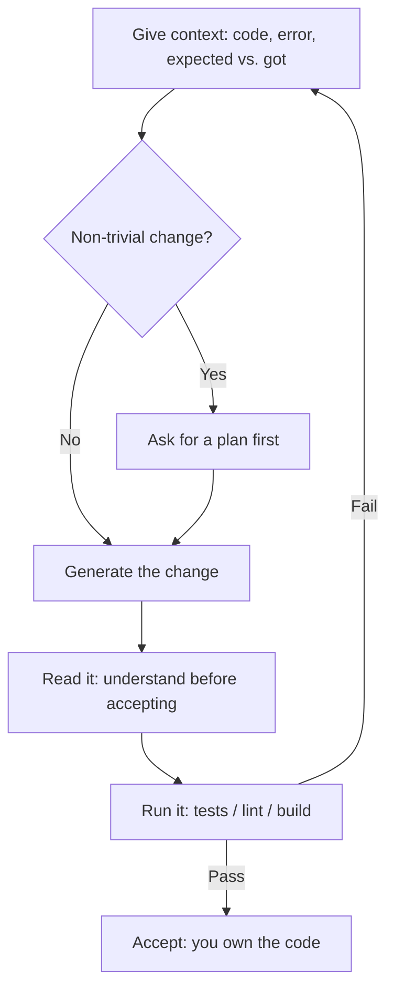

<LevelBadge level="all" />

<Callout type="objectives" items={["AI 코딩이 진정으로 잘하는 것을 알기 — 설명, 생성, 리팩터링, 디버그, 번역, 리뷰", "황금 루프 돌리기: 컨텍스트 입력, 계획, 생성, 읽기, 실행 — 그리고 실패를 새 컨텍스트로 되돌리기", "모호한 한 줄짜리 대신 몫을 하는 프롬프트에 손 뻗기", "두 가지 하드 룰을 내재화: 실행으로 검증하기, 그리고 시크릿을 절대 붙여넣지 않기"]} />

코딩을 배우든 프로덕션 소프트웨어를 배포하든, AI는 루프를 바꿉니다. 승자들은 그것을 빠르고 박식한 페어로 취급하며 **그것이 생산하는 모든 것을 검증** 합니다.

## 잘하는 것

- 낯선 코드나 오류를 평이한 언어로 **설명**.
- 보일러플레이트, 테스트, 함수 초안을 **생성**.
- 명확성을 위해 **리팩터링** 하고, 스택 트레이스로 추론해 **디버그**.
- 언어/프레임워크 간 **번역**.
- 버그와 냄새에 대해 diff를 **리뷰**.

실제 코드베이스라면, 파일을 읽고 테스트를 실행하고 승인과 함께 편집할 수 있는 [Claude Code](/docs/claude-code/what-is-claude-code) 를 리포지토리 *안에서* 사용하세요.

## 황금 루프

1. **컨텍스트를 주기** — 관련 코드, 오류, 기대와 실제. 모호한 입력, 모호한 출력.
2. 사소하지 않은 변경에는 편집 전에 **계획을 요청** ([Plan Mode](/docs/claude-code/plan-mode)).
3. 변경을 **생성**.
4. **읽기** — 수락하기 전에 이해하기. 코드는 당신 소유입니다.
5. **실행** — 테스트/린트/빌드. *실행하지 않고 "이거 작동해"를 절대 믿지 마세요.*

좋은 결과와 나쁜 결과를 가르는 단계는 맨 위로 돌아가는 화살표입니다: 테스트가 실패할 때, 맹목적으로 패치하지 말고 — 실패를 새 컨텍스트로 되돌려 넣으세요.

## 몫을 하는 프롬프트

<PromptCard title="코드 설명 + 엣지 케이스 찾기">{`Explain what this function does and any edge cases it mishandles: {code}`}</PromptCard>

<PromptCard title="테스트 생성">{`Write tests for {function}. Cover the happy path and the edge cases. {code}`}</PromptCard>

<PromptCard title="스택 트레이스로 디버그">{`This throws {error}. Here's the code and stack trace. Find the root cause and propose a minimal fix. {context}`}</PromptCard>

## 하드 룰

:::warning 검증하고, 시크릿을 보호하세요
- 생성된 코드를 **실행하고 리뷰** 하세요 — 미묘하게 틀리거나 존재하지 않는 API를 만들 수 있습니다.
- **시크릿/키를 절대 프롬프트에 붙여넣지 마세요** ([Privacy](/docs/foundations/privacy)).
- 에이전트/자동화 코딩에서는 [권한](/docs/claude-code/permissions) 을 잠그고 [Securing Agents](/docs/security/securing-agents) 를 읽으세요.
:::

<Quiz title="스스로 확인해 보세요" questions={[{q: "황금 루프에서, 좋은 AI 코딩 결과와 나쁜 결과를 가장 크게 가르는 것은?", options: ["항상 가장 큰 모델 사용", "맨 위로 돌아가는 화살표: 맹목적으로 패치하는 대신 실패한 테스트의 출력을 새 컨텍스트로 되돌려 넣기", "시간을 아끼려 첫 생성을 수락"], answer: 1, explain: "루프가 방법입니다. 테스트가 실패할 때 패치를 추측하지 말고 — 실패를 새 컨텍스트로 넘겨서 다음 시도가 실제로 무엇이 잘못됐는지에 근거하게 하세요."}, {q: "왜 수락하기 전에 생성된 코드를 읽어야 합니까?", options: ["읽기가 테스트 러너를 트리거", "미묘하게 틀리거나 존재하지 않는 API를 만들 수 있고 — 어느 쪽이든 코드는 당신 소유이므로", "SDK가 열지 않은 코드를 실행하기를 거부"], answer: 1, explain: "AI 출력은 틀렸을 때도 자신감 있어 보이고, 때때로 존재하지 않는 함수를 호출합니다. 그것을 읽는 것이 배포 전에 잡는 방법입니다 — 그리고 누가 타이핑했든 코드에 대한 책임은 당신에게 있습니다."}, {q: "이 중 프롬프트에 절대 들어가서는 안 되는 것은?", options: ["오류 메시지와 스택 트레이스", "시크릿이나 API 키", "기대한 것 대 실제로 일어난 것"], answer: 1, explain: "오류, 스택 트레이스, 기대-대-실제는 정확히 결과를 개선하는 컨텍스트입니다. 시크릿과 키는 밖에 두어야 할 유일한 것 — 붙여넣으면 유출된 것입니다."}]} />

<Callout type="takeaways" items={["AI를 빠르고 박식한 페어로 취급하되 — 실제로 실행해서 그것이 생산하는 모든 것을 검증하세요", "컨텍스트 입력, 품질 출력: 모호한 요청 대신 코드, 오류, 기대-대-실제를 주세요", "사소하지 않은 편집 전에 계획을 요청해서 어떤 코드 변경 전에 접근을 리뷰하세요", "수락하기 전에 생성된 코드를 읽으세요 — 미묘하게 틀리거나 존재하지 않는 API를 만들 수 있습니다", "시크릿이나 키를 절대 프롬프트에 붙여넣지 말고, 에이전트가 스스로 코딩하게 두기 전에 권한을 잠그세요"]} />

## 다음

- [What Claude Code Is](/docs/claude-code/what-is-claude-code)
- [Customize Claude Code for a Real Repo](/docs/walkthroughs/customize-claude-code)
- [Your First API Call](/docs/api/first-call)
