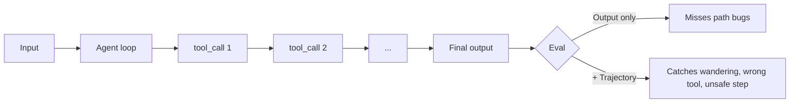

<LevelBadge level="advanced" />

<VerifyNote lastVerified="2026-07-24" source="https://platform.claude.com/docs/en/test-and-evaluate/develop-tests">
Anthropic의 평가 가이드는 방법론(SMART 기준, 정확 일치, LLM 채점 Likert/이진)의 진실의 원천입니다. 에이전트 궤적 평가는 아직 발전 중인 분야입니다 — 프레임워크 이름은 예시로 취급하고 각 벤더의 문서에서 API를 확인하세요.
</VerifyNote>

<Callout type="objectives" items={["에이전트 평가가 프롬프트 평가와 왜 다른지 이해하기 — 최종 답변뿐 아니라 궤적이 중요하다", "20–100개의 실제 사례로 명확한 통과 기준을 갖춘 골든 세트 구축하기", "네 가지 계층 점수화: 도구 호출 정확성, 궤적 품질, 작업 성공, 프로덕션 드리프트", "LLM-as-judge를 안전하게 사용하기: 루브릭 우선, 사람과의 보정, 판정 스팟체크", "CI에서 실행되어 나쁜 변경이 사용자에게 도달하기 전에 실패시키는 평가 배포하기"]} />

**에이전트 평가**는 "프롬프트가 올바른 단어를 반환했는가?"보다 더 어려운 질문에 답합니다. *루프 안에서 실행되는 모델이 올바른 도구를 올바른 순서로, 올바른 인자와 함께 선택하여, 올바른 결과에 도달했는가 — 그리고 예산과 안전 한계 내에 머물렀는가?*

이 단계를 건너뛰면 시스템 프롬프트를 조정할 때마다 조용히 퇴보하는 "도움이 되는" 에이전트를 배포하게 될 것입니다.

## 에이전트가 자체 평가가 필요한 이유

단일 프롬프트 평가는 하나의 입력 → 하나의 출력을 점수화합니다. 에이전트는 **궤적**을 생성합니다: 여러 턴에 걸친 추론 체인, 도구 호출, 중간 관찰, 그리고 수정. 이를 어렵게 만드는 두 가지 실패 모드가 있습니다:

- **올바른 답, 잘못된 경로.** 낭비적인 루프, 안전하지 않은 조치, 또는 운 좋은 추측 후에 에이전트가 올바른 출력에 우연히 도달합니다. 최종 답변만 보는 평가는 이를 통과로 표시하지만, 프로덕션에서는 그렇지 않습니다.
- **잘못된 답, 그럴듯한 경로.** 모든 단계가 개별적으로는 합리적으로 보이지만, 에이전트가 도구를 잘못 사용했거나, 제약을 무시했거나, 중간 사실을 환각했습니다. 응답만이 아니라 추적을 봐야 합니다.



## 네 가지 평가 계층

값비싼 채점기를 기다리지 않고 나쁜 변경이 빠르게 실패하도록 가장 저렴한 것부터 계층화하세요.

<Steps items={[
  {title: "계층 1 — 도구 호출 정확성 (결정론적)", body: "예상되는 각 단계에 대해 도구 이름이 일치하는지, 필수 매개변수가 존재하는지, 타입이 유효한지 확인합니다. 순수 코드, 밀리초, 모델 불필요. 다른 어떤 것이 실행되기 전에 'write_file을 호출했어야 하는데 search를 호출한' 경우를 잡아냅니다."},
  {title: "계층 2 — 궤적 품질 (루브릭 + LLM-judge)", body: "전체 추적을 점수화합니다: 에이전트가 합리적인 경로를 택했는지, 아니면 방황하거나, 루프에 빠지거나, 되돌아갔는지? 필요한 최소 단계 대비 실제 단계 수, 중복 호출, 도구 오류 후 재시도, 완료 시 중단했는지 여부. 여기서 명시적 루브릭이 있는 LLM 판정자를 사용합니다."},
  {title: "계층 3 — 작업 성공 (엔드투엔드)", body: "목표가 달성되었는가? 가능한 경우 결정론적으로(스키마 유효, 파일 작성됨, 테스트 통과), 모호한 경우 LLM으로 판정(요약이 충실함, 답변이 도움이 됨). 이것이 헤드라인 숫자입니다."},
  {title: "계층 4 — 프로덕션 드리프트 및 안전", body: "프로덕션에서 실제 추적을 샘플링하고 일부를 다시 채점합니다. 개입률(사람이 얼마나 자주 개입해야 했는지), 거부율, 성공한 작업당 비용을 관찰합니다. 이들이 이동하면 모델, 도구, 또는 입력이 아래에서 변경된 것입니다."}
]} />

## 가치를 예측하는 지표

모든 지표가 대시보드에 속하는 것은 아닙니다. 2026년에 배포 결정을 이끄는 다섯 가지는 다음과 같습니다:

| 지표 | 측정 대상 | 중요한 이유 |
|---|---|---|
| **작업 성공률** | 에이전트가 올바르게 완료한 골든 세트 사례의 % | 헤드라인. 나머지는 모두 진단용. |
| **성공 작업당 비용** | $ / 통과 사례 (입력 + 출력 토큰, 도구 비용) | 10배 비용으로 성공하는 것은 퇴보. |
| **지연 시간 (p50 / p95)** | 작업당 실제 시간, 꼬리 포함 | p95는 실제 사용자가 느끼는 것 — 평균은 거짓말. |
| **도구 호출 정확도** | 이름 + 인자가 올바른 예상 도구 호출의 % | 궤적 품질 예측; 계산 비용 저렴. |
| **개입률** | 프로덕션에서 사람의 인수가 필요한 작업의 % | 자율성 숫자. 상승 = 신뢰 하락. |

함께 추적하세요 — 하나만 움직이고 나머지는 그대로면 보통 소음이 아니라 선행 신호입니다.

## 골든 세트 구축하기

<Steps items={[
  {title: "실제 입력 수집", body: "실제 사용에서 20–100개의 작업을 가져옵니다(로그, 지원 티켓, 사용자 요청). 자주 발생하는 쉬운 경로, 까다로운 중간, 그리고 이미 당신을 물었던 엣지 케이스를 포함합니다."},
  {title: "사례별 통과 기준 작성", body: "각각에 대해: '완료'는 어떻게 생겼나? 정확한 예상 출력, 필요한 사실, 유효한 JSON 스키마, 존재해야 할 파일, 또는 모호한 사례에 대한 루브릭. 기준을 쓸 수 없다면 그 사례는 쓸모없습니다 — 삭제하거나 명확히 하세요."},
  {title: "이상적인 궤적에 주석 달기", body: "일부에 대해 좋은 에이전트가 취할 도구 순서를 스케치합니다. 이것이 계층 1이 확인하는 대상입니다."},
  {title: "고정하고 버전 관리", body: "세트를 저장소에 커밋합니다. 사례를 제자리에서 편집하지 마세요 — 점수 히스토리가 비교 가능하도록 v2를 v1과 나란히 추가하세요."},
  {title: "실패로부터 성장시키기", body: "모든 프로덕션 버그는 수정하기 전에 새로운 평가 사례가 됩니다. 그렇게 해야 세트가 쇠퇴하는 대신 예측력을 유지합니다."}
]} />

## LLM-as-judge — 저렴하고, 빠르지만, 보정하세요

모호한 출력을 수동으로 채점하는 것은 확장되지 않습니다. 명시적 루브릭에 따라 읽는 유능한 모델은 확장됩니다 — Anthropic 자체 [평가 방법론 가이드](https://platform.claude.com/docs/en/test-and-evaluate/develop-tests)는 톤, 충실성, 유용성, 안전에 대해 이 패턴을 권장합니다.

판정자에게는 잘 문서화된 편향이 있습니다: 더 긴 답변, 먼저 표시된 옵션, 자신의 표현을 반영하는 출력을 선호합니다. 세 가지 습관이 그들을 정직하게 유지합니다:

- **바이브가 아닌 루브릭.** "유용성을 1–5로 평가"는 쓸모없습니다. 스케일의 모든 점을 관찰 가능한 행동에 고정하세요.
- **사람이 라벨링한 샘플로 보정.** 사람이 30–50개 사례를 채점하게 하고; 판정자 대 사람 일치도를 측정합니다(Cohen's κ ≥ 0.6 목표). 불일치하면 루브릭을 강화하세요.
- **판정자로 다른 모델 사용.** 출력을 생성한 것과 같은 모델로 채점하면 양방향으로 편향이 새어 나갑니다.
- **매주 판정 스팟체크.** 무작위 판정자 점수 10개와 그 근거를 읽으세요. 드리프트를 잡는 가장 저렴한 방법입니다.

<PromptCard title="LLM-as-judge 루브릭 템플릿">{`You are grading an AI assistant's response against a rubric. Be strict. Cite exact evidence from the response.

<task>{task}</task>
<response>{response}</response>

Rubric (rate 1–5 per dimension):
- Task completion: 1 = ignored task; 3 = partial; 5 = fully done, no gaps.
- Faithfulness: 1 = contains false claims; 3 = mostly grounded, one soft claim; 5 = every claim traceable to input/tools.
- Efficiency: 1 = wandered/looped; 3 = extra steps; 5 = minimum viable path.

Output JSON only:
{"task_completion": N, "faithfulness": N, "efficiency": N, "evidence": "<quote>", "verdict": "pass"|"fail"}`}</PromptCard>

<PromptCard title="궤적 검토 프롬프트 (계층 2)">{`You are auditing an AI agent's tool-call trajectory. The goal was: {goal}
Expected minimum steps: {n_min}

<trajectory>
{list of tool_name(args) -> result, in order}
</trajectory>

Answer in JSON:
{"steps_taken": N, "wasted_steps": N, "wrong_tool_calls": [<indices>], "unsafe_actions": [<indices>], "verdict": "pass"|"fail", "reason": "<one sentence>"}`}</PromptCard>

<PromptCard title="적대적 사례 생성기 (세트 성장)">{`Generate 5 new eval cases that are likely to break an agent whose current failures cluster around: {failure_pattern}.

For each case give: input, expected output OR pass criterion, ideal tool sequence, and why this case is hard.

Return YAML.`}</PromptCard>

## CI 게이트: 나쁜 변경이 배포되기 전에 실패시키기

평가는 자동으로 퇴보를 차단할 때만 값을 합니다. 모든 프롬프트 / 모델 / 도구 변경에 대한 체크로 CI에 연결하세요:

```python
# tests/eval_gate.py — runs on every PR
import json, sys
from anthropic import Anthropic
from my_agent import run_agent

client = Anthropic()
golden = json.load(open("evals/golden.v3.json"))

results = []
for case in golden:
    trace = run_agent(case["input"])
    layer1 = tool_calls_match(trace, case["expected_tools"])   # deterministic
    layer3 = judge(client, case, trace.final_output)           # LLM rubric
    results.append({"id": case["id"], "layer1": layer1, "layer3": layer3["verdict"]})

pass_rate = sum(r["layer3"] == "pass" for r in results) / len(results)
tool_acc  = sum(r["layer1"] for r in results) / len(results)

# Gates — tighten over time
assert pass_rate >= 0.85, f"Task success dropped to {pass_rate:.0%}"
assert tool_acc  >= 0.90, f"Tool-call accuracy dropped to {tool_acc:.0%}"
print(f"PASS: task={pass_rate:.0%} tools={tool_acc:.0%}")
```

실행별 점수를 저장하여 추세를 차트로 그릴 수 있도록 하세요. 병합 사이 3점 이상의 하락은 소음이 아니라 실제 퇴보입니다.

<Callout type="warning" title="평가를 저조하게 만드는 안티패턴" items={["최종 답변만 판정 — 모든 궤적 버그를 놓칩니다. 계층 1과 2도 점수화하세요.", "정적 골든 세트 — 모든 프로덕션 실패와 함께 성장하지 않으면 프로덕션을 예측하는 것을 멈춥니다. 매월 시간을 예산에 편성하세요.", "에이전트와 판정자로 같은 모델 — 양방향 편향. 채점을 위해 다른 모델로 교체하세요.", "게이트에 비용 또는 지연 시간 없음 — 도구 호출 8개를 추가하는 프롬프트 조정이 청구서를 10배로 하면서 평가를 '통과'할 수 있습니다.", "바이브 전용 채점 — '더 나은 느낌'은 지표가 아닙니다. 두 숫자를 비교할 수 없으면 자신 있게 배포할 수 없습니다."]} />

<Callout type="takeaways" items={["에이전트는 답변이 아닌 궤적을 생성합니다 — 결과뿐 아니라 경로를 평가하세요", "가장 저렴한 것부터 계층화: 도구 호출 정확성 → 궤적 품질 → 작업 성공 → 프로덕션 드리프트", "배포 결정을 이끄는 다섯 가지 지표: 작업 성공률, 성공당 비용, p50/p95 지연 시간, 도구 호출 정확도, 개입률", "LLM-as-judge는 확장되지만, 명시적 루브릭, 다른 모델, 사람 라벨 대비 보정이 있어야만 가능합니다", "프로덕션 실패로부터 성장하지 않는 골든 세트는 프로덕션을 예측하는 것을 멈춥니다 — 매월 성장시키세요", "평가를 하드 게이트로 CI에 연결하세요 — 사용자보다 먼저 퇴보를 잡는 체크"]} />

## 자가 점검

<Quiz title="자가 점검" questions={[
  {
    q: "에이전트가 최종 답변 평가만이 아닌 궤적 평가가 필요한 이유는?",
    options: [
      "최종 답변 평가는 CI에서 실행하기에 너무 느리다",
      "에이전트는 방황이나 안전하지 않은 단계를 통해 올바른 답에 도달할 수 있고(올바른 답, 잘못된 경로) — 잘못된 답에 이르는 그럴듯해 보이는 경로를 생성할 수 있다",
      "궤적 평가는 LLM-as-judge를 지원하는 유일한 종류다",
      "최종 답변 평가는 분류 작업에만 작동한다"
    ],
    answer: 1,
    explain: "두 가지 실패 모드가 출력만 보는 채점에서 숨습니다: 나쁜 경로를 통한 올바른 답(통과로 표시되지만, 프로덕션에서 퇴보) 및 그럴듯한 경로를 통한 잘못된 답(조용히 실패). 결과뿐 아니라 궤적도 점수화해야 합니다."
  },
  {
    q: "평가를 계층화하고 있습니다. 가장 저렴한 것부터 가장 비싼 순서로 올바른 것은?",
    options: [
      "LLM으로 판정한 작업 성공 → 결정론적 도구 호출 체크 → 프로덕션 드리프트 → 궤적 루브릭",
      "결정론적 도구 호출 정확성 → 궤적 품질(LLM-judge) → 작업 성공 → 프로덕션 드리프트",
      "프로덕션 드리프트 → 작업 성공 → 궤적 루브릭 → 도구 호출 체크",
      "궤적 루브릭 → 작업 성공 → 도구 호출 체크 → 프로덕션 드리프트"
    ],
    answer: 1,
    explain: "계층 1(결정론적 도구 호출 체크)은 모델 없이 밀리초 단위로 실행되므로 나쁜 변경을 빠르게 실패시킵니다. 그 다음 LLM으로 채점된 궤적과 작업 성공 계층, 그 다음 프로덕션 드리프트 모니터링."
  },
  {
    q: "LLM-as-judge를 시간이 지나도 신뢰할 수 있도록 실제로 유지하는 습관의 쌍은?",
    options: [
      "에이전트와 같은 모델로 채점하고, 매 실행마다 루브릭 재작성",
      "관찰 가능한 앵커가 있는 루브릭 사용, 그리고 사람이 라벨링한 샘플로 판정자 보정",
      "과잉 명세를 피하기 위해 바이브 기반 프롬프트 선호, 절대 판정 스팟체크 안 함",
      "항상 사용 가능한 가장 큰 모델을 판정자로 사용, 보정 불필요"
    ],
    answer: 1,
    explain: "앵커된 루브릭은 판정자가 기준을 발명할 자유를 제거하고, 사람 보정(Cohen's κ ≥ 0.6이 일반적 목표)은 판정자가 당신의 근거 진실에 동의한다는 것을 증명합니다. 다른 모델 사용과 매주 스팟체크가 그림을 완성합니다."
  },
  {
    q: "CI 게이트가 작업 성공률을 통과했지만 지연 시간과 작업당 비용이 두 배가 되었습니다. 올바른 판단은?",
    options: [
      "배포하세요 — 작업 성공이 헤드라인 지표다",
      "게이트를 실패시키세요: 다섯 가지 배포 지표는 함께 움직이고, 통과율이 유지되어도 2배 비용/지연 시간 변경은 퇴보다",
      "평가 재실행 — 숫자는 소음일 것이다",
      "배포를 정당화하기 위해 통과율 임계값 완화"
    ],
    answer: 1,
    explain: "다섯 가지 지표는 배포 결정을 함께 내립니다. 통과율은 유지하면서 비용이나 지연 시간을 2배로 만드는 프롬프트 조정은 게이트가 존재하는 이유입니다 — 청구서와 UX 퇴보는 정확도 하락만큼 사용자에게 강하게 영향을 미칩니다."
  }
]} />

<Flashcards cards={[
  {front: "궤적 (에이전트 평가에서)", back: "에이전트가 작업 전반에 걸쳐 취한 도구 호출, 인자, 관찰, 추론 단계의 완전한 순서 체인 — 최종 출력에 더해 평가하는 대상."},
  {front: "골든 세트", back: "20–100개의 실제 작업으로 구성된 고정되고 버전 관리된 컬렉션으로, 명시적 통과 기준(및 일부에 대한 이상적인 궤적)이 있으며 모든 프롬프트/모델/도구 변경이 이에 대해 점수화됨."},
  {front: "도구 호출 정확도", back: "이름이 일치하고 필수 매개변수가 유효한 예상 도구 호출의 %. 결정론적이고, 저렴하며, 궤적 품질의 강력한 선행 지표."},
  {front: "LLM-as-judge", back: "(다른) 유능한 모델이 명시적 루브릭에 대해 출력을 점수화하는 채점 패턴. 빠르고 확장 가능하지만, 신뢰할 수 있으려면 사람 라벨 대비 보정되어야 함."},
  {front: "개입률", back: "사람이 인수해야 했던 프로덕션 작업의 %. 개입률 상승 = 자율성 하락, 오프라인 점수가 괜찮아 보일 때도."},
  {front: "성공 작업당 비용", back: "총 토큰 + 도구 비용을 에이전트가 올바르게 완료한 작업 수로 나눈 값. '여전히 작동'이 '10배 더 비쌈'을 숨기는 퇴보를 잡음."},
  {front: "CI 평가 게이트", back: "모든 PR에서 골든 세트를 실행하고 임계값 이하(예: 통과율 < 85%, 도구 정확도 < 90%)에서 빌드를 하드 실패시키는 자동화된 체크. 병합 전에 조용한 퇴보를 차단."}
]} />

## 다음

- [Supabase Evals — 실제 백엔드 에이전트 벤치마크](/docs/models/supabase-evals-agent-benchmark) — 실제 컨테이너 코딩 에이전트 평가가 엔드투엔드로 어떻게 보이는지의 배포된 예 (Apache-2.0).
- [API에서 에이전트 구축](/docs/api/building-agents) · [평가 (기초)](/docs/foundations/evals)
- [에이전트 및 도구 보안](/docs/security/securing-agents) · [환각과 감소 방법](/docs/foundations/hallucinations)
- [Headless 및 Agent SDK](/docs/claude-code/headless-and-agent-sdk) · [Managed Agents](/docs/api/managed-agents)
