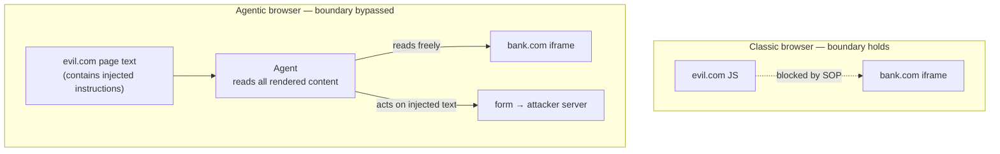

<LevelBadge level="advanced" />

<Callout type="objectives" items={["동일 출처 정책을 이해 — 30년간 조용히 당신을 보호해 온 경계 — 그리고 왜 AI 에이전트가 그 위에 앉는지", "테스트된 7개의 에이전트형 브라우저 중 어느 것이 취약한 것으로 밝혀졌는지, 그리고 그 아키텍처적 이유", "교차 출처 iframe 유출 공격을 단계별로 걷기", "벤더 레드팀 수치를 정직하게 읽기: 완화가 공격 성공을 절반으로 줄일 뿐 제거하지 않는다", "일괄 금지 대신 실용적 위험 자세를 적용"]} />

2026년 6월 30일, 워싱턴 대학교 연구자들은 AI 브라우저를 재구성하는 결과를 발표했습니다: **그들이 테스트한 7개의 에이전트형 브라우저 중 4개가 악의적인 웹사이트로 하여금 다른 웹사이트에 속한 데이터에 도달하도록 허용했다.** 메모리 안전 버그를 통해서가 아닙니다. 에이전트가 설계된 대로 정확히 작동함으로써.

<VerifyNote lastVerified="2026-07-20" source="https://agent-security.cs.washington.edu/agentic_browsers_sop.html" />

## 아무도 생각하지 않는 경계

한 탭에서 은행을, 다른 탭에서 임의의 포럼을 여세요. 포럼의 자바스크립트는 당신의 은행 페이지, 쿠키, 세션을 읽을 수 없습니다. 그 보증이 **동일 출처 정책(SOP)** 입니다 — 출처는 삼중항 `(scheme, host, port)`. UW의 Franziska Roesner가 말하듯이, 오늘날 거의 모든 사이트를 브라우징하는 것이 안전한 이유입니다.

SOP는 페이지 아래에서 *브라우저에 의해* 시행됩니다. 페이지가 말할 수 있는 어떤 것도 그것을 지나쳐 이야기할 수 없습니다.

이제 에이전트를 추가합시다. 가장 유능한 설계에서 에이전트는 브라우저의 인간 사용자처럼 행동합니다: 렌더링된 페이지를 보고, DOM을 읽고, 클릭하고, 타이핑합니다. 화면을 보는 인간은 SOP에 묶이지 않습니다 — 당신의 눈은 두 개의 탭을 읽을 수 있습니다. 하나를 모방하도록 만들어진 에이전트도 마찬가지입니다.

간직할 가치가 있는 문장은 이것입니다: **SOP는 약해지지 않는다 — 현실을 묘사하는 것을 멈춘다.** 브라우저는 자바스크립트 계층에서 여전히 그것을 올바르게 시행합니다. 에이전트는 단지 그 계층 위에서 작동할 뿐입니다. 그래서 수십 년 된 *아키텍처적* 보증이 조용히 *행동적* 보증으로 저하됩니다: "모델이 프롬프트 인젝션에 넘어가지 않기를 바란다." 그것들은 같은 부류의 약속이 아니고, 무제한 재시도를 얻는 공격자에 대해서는 그중 하나만이 유지됩니다.

## 무엇이 테스트되었고, 무엇이 깨졌는가

Kohlbrenner와 Roesner는 2026년 1월 말 – 2월에 일곱 개의 브라우저를 테스트했고 2026년 4월 26일 리우데자네이루의 Agents in the Wild 워크숍에서 발표했습니다.

| 브라우저 | SOP 우회의 전제조건? | 노트 |
|---|---|---|
| ChatGPT Atlas (Agent Mode) | **예 — 전체 PoC 시연** | 엔드투엔드 교차 출처 절도 달성 |
| Chrome with Gemini | **예** | 전제조건 존재 |
| Claude for Chrome | **예** | 확장 아키텍처가 JS 주입 허용 |
| Perplexity Comet | **예** | 전제조건 존재 |
| Brave Leo AI | 아니오 | 더 좁은 에이전트 기능 |
| Microsoft Edge with Copilot | 아니오 | 더 좁은 에이전트 기능 |
| Firefox AI Mode (Claude) | 아니오 | 일곱 중 가장 제한적 |

패턴이 발견이며, 이는 불편합니다: **가장 안전했던 브라우저는 가장 적게 할 수 있는 브라우저였다.** Brave, Edge, Firefox는 더 나은 분류기 때문에 더 안전한 것이 아니었습니다 — 이들은 전체 브라우징 세션 대신 페이지의 제한된, 사전 정의된 조각을 에이전트에게 넘깁니다. 여기서 보안은 영리함이 아닌 능력으로 사는 것입니다. 둘 다를 주장하는 벤더는 신중하게 읽어야 합니다.

## 공격, 단계별로

<Steps items={[{"title":"공격자가 교차 출처 iframe이 있는 페이지를 만듦","body":"evil.com은 피해자가 로그인한 민감한 출처 — 은행, 웹메일, 내부 대시보드 — 를 가리키는 iframe을 임베드합니다. evil.com의 평범한 자바스크립트는 그 iframe 안의 한 글자도 읽을 수 없습니다. 이것은 정상적이고 허용된 웹 동작입니다."},{"title":"페이지가 에이전트를 겨냥한 지시를 숨김","body":"페이지의 텍스트 — 시각적으로 숨겨진, alt 속성 안, 사용자가 절대 보지 않는 DOM 필드 안 — 가 에이전트에게 iframe의 내용을 그것이 생산하는 무엇에든 포함시키라고 말합니다. 모델에게 이는 그저 더 많은 페이지 콘텐츠일 뿐이며, 읽으라고 요청받은 기사와 구별할 수 없습니다."},{"title":"사용자가 완전히 무해한 것을 요청","body":"\"이 페이지를 요약해줘.\" 어떤 위험한 권한도 요청되지 않고 어떤 경고도 발생하지 않습니다. 왜냐하면 브라우저의 관점에서는 이상한 어떤 일도 일어나지 않기 때문입니다."},{"title":"에이전트가 출처 경계를 가로질러 읽음","body":"에이전트가 완전히 렌더링된 페이지를 지각하기 때문에, iframe 콘텐츠도 읽습니다. 동일 출처 정책은 위반되지 않았습니다 — 어떤 교차 출처 자바스크립트 호출도 이루어지지 않았기 때문에 결코 참조되지 않았습니다."},{"title":"에이전트가 공격자가 제어하는 폼에 데이터를 씀","body":"주입된 지시가 요약을 evil.com의 폼 필드로 향하게 합니다. 에이전트는 도움이 되고 있는 중이며, 자신이 읽은 것을 따르고 있습니다."},{"title":"폼이 자동 제출","body":"교차 출처 데이터가 공격자의 서버에 도착합니다. 사용자는 요약이 나타나는 것을 보았고 다른 아무것도 보지 못했습니다."}]} />

*없는* 것에 주목하세요: 익스플로잇도, 멀웨어도, 패치되지 않은 CVE도 없습니다. 모든 단계는 문서화된, 의도된 기능을 사용합니다. 그것이 이것을 버그 큐가 아닌 아키텍처 문제로 만드는 것입니다.

연구자들은 또한 이 공격의 세 형제를 이름으로 언급합니다:

<Flashcards title="네 가지 교차 출처 공격 부류" cards={[{"front":"교차 출처 데이터 절도","back":"에이전트가 출처 A의 페이지에서 행동하는 동안 출처 B의 콘텐츠를 읽고, 그것을 유출합니다. ChatGPT Atlas에서 시연된 PoC."},{"front":"교차 출처 액션 위조","back":"에이전트가 출처 A의 페이지에서 출처 B의 상태 변경 액션(전송, 이체, 삭제)을 수행하도록 유도됨 — CSRF이지만, 혼란된 대리인이 에이전트이므로 CSRF 토큰과 SameSite 쿠키는 도움이 되지 않습니다."},{"front":"채팅 메모리 오염","back":"주입된 텍스트가 에이전트의 지속적 메모리에 기록되어, 손상이 악의적 페이지보다 오래 지속되며 나중의, 관련 없는 세션에서 발동합니다."},{"front":"마스킹된 입력 읽기","back":"에이전트가 비밀번호 필드나 다른 마스킹된 입력의 기본 값을 지각합니다. 시각적 UI가 인간에게서 의도적으로 감추는 것입니다."}]} />

메모리 오염이 당신을 가장 걱정하게 해야 하는 것입니다. 다른 셋은 탭을 닫으면 끝납니다. 메모리 오염은 하나의 나쁜 페이지를 당신 어시스턴트의 지속적 임플란트로 바꾸며, 현재 대부분의 사용자가 손을 뻗을 줄 아는 "쿠키 지우기"의 등가물이 없습니다.

## 벤더 수치를 정직하게 읽기

Anthropic은 Claude for Chrome에 대한 레드팀 결과를 발표했습니다 — 그리고 그 공적으로, 아부하지 않는 것들을 발표했습니다. 29개 공격 시나리오에 걸친 123개 테스트 케이스에서:

- 자율 모드 공격 성공률: **완화 전 23.6% → 완화 후 11.2%**
- 네 개의 브라우저 특화 공격 유형 챌린지 세트에서: **35.7% → 0%**

완화에는 사이트 수준 권한, 고위험 액션에 대한 확인 프롬프트, 전체 사이트 카테고리(금융 서비스, 성인, 해적 콘텐츠) 차단, 들어오는 콘텐츠와 나가는 액션 모두에 대한 주입 분류기, 숨겨진 DOM 필드와 URL/탭 제목 주입에 대한 특정 방어가 포함됩니다. Anthropic은 자체 결합 기법 스위트에 대해 **0.08% 미만** 에 도달하는 구성을 별도로 보고합니다.

중간 숫자에 앉아 있으세요. **11.2%는 보안 통제로서 작은 숫자가 아닙니다.** 아홉 명 중 한 명의 낯선 사람에게 열리는 문 자물쇠는 자물쇠가 아닙니다. 정직한 읽기는 이것들이 *더 이상 존재하지 않는 경계에 대한 위험 감소자* 이지 그것의 대체가 아니라는 것입니다 — 그것이 정확히 연구자들이 더 나은 필터링보다 아키텍처 재설계가 필요하다는 요점입니다.

확장 전달 경로는 자체 역사가 있습니다: 연구자들은 Claude for Chrome의 사이트별 권한이 확장의 디스크 LevelDB 저장소에 직접 쓰는 것으로 우회될 수 있다고 보고했고, 후속 작업("ClaudeBleed")은 여전히 에이전트가 Gmail을 읽도록 밀어붙일 수 있는 확장 대 확장 경로를 발견했습니다. 클라이언트 측 저장소에서 시행되는 권한은 이미 당신의 사용자로 실행되는 어떤 것에 대해서는 권고에 지나지 않습니다.

UW 공개(60일 이상 통지)에 대한 벤더 응답도 다양합니다: Brave, Google, Microsoft는 참여했고; OpenAI와 Firefox는 불충분한 엔드투엔드 증거를 들어 보고서를 거부했고; Anthropic은 발표 시점까지 답변하지 않았습니다.

<Callout type="warning" items={["Kohlbrenner의 평가는 무뚝뚝합니다: 이 에이전트들이 당신의 자격 증명을 담은 브라우저에 접근할 수 있다면, 그것들을 준비된 것으로 취급하지 마세요. 에이전트형 브라우징을 켜 두는 것이 아니라 신중하게 부여하는 능력으로 취급하세요."]} />

## 실제로 유지할 수 있는 자세

"AI 브라우저를 절대 사용하지 마세요"는 아무도 따르지 않는 조언입니다. 대신 공격의 형태를 사용하세요 — 같은 에이전트 컨텍스트에 **신뢰되지 않는 페이지 콘텐츠** 더하기 **인증된 세션** 더하기 **유출 경로** 가 필요합니다. 어느 한쪽 다리를 부러뜨리세요.

<Steps items={[{"title":"탭이 아닌 프로필을 분리","body":"가치 있는 어떤 것에도 로그인하지 않은 브라우저 프로필에서 에이전트를 실행하세요. 세션이 자산입니다; 훔칠 쿠키가 없는 에이전트는 훨씬 덜 흥미로운 혼란된 대리인입니다. 이것이 목록에서 가장 레버리지가 높은 하나의 움직임입니다."},{"title":"'이 페이지 요약'을 신뢰되지 않는 페이지에서의 특권 액션으로 취급","body":"임의의 공격자 작성 콘텐츠를 읽는 것이 주입 벡터입니다. 자신의 초안을 요약하는 것은 저위험입니다; 낯선 사람이 링크한 페이지를 요약하는 것이 PoC의 정확한 시나리오입니다."},{"title":"사이트 권한을 좁게 부여하고 재확인","body":"사이트별 접근이 실제 경계에 매핑되는 하나의 통제입니다. 허용 목록을 짧게 유지하세요. LevelDB 발견을 고려할 때, 그것이 밀폐가 아닌 권고라고 가정하세요."},{"title":"신뢰되지 않는 어떤 것을 브라우징한 후에 에이전트 메모리를 지우세요","body":"이것이 사용자가 직접 통제하는 메모리 오염에 대한 유일한 방어이며, 비용이 없습니다."},{"title":"열린 브라우징을 위해 자율 모드를 절대 켜 두지 마세요","body":"23.6% 수치는 자율 모드입니다. 확인 프롬프트는 약하지만, 조용한 손상을 당신이 알아챌 수 있는 것으로 전환합니다."},{"title":"당신의 작업을 하는 가장 덜 유능한 에이전트를 선호","body":"UW 순위는 능력 순서입니다. 좁은 요약기가 충분하다면, 당신이 건너뛴 여분의 대리성은 당신이 방어할 필요가 없었던 공격 표면입니다."}]} />

코딩 측면의 밀접하게 관련된 위험에 대해서는 [When Coding Agents Get Weaponized](/docs/security/coding-agents-under-attack), [Prompt Injection](/docs/security/prompt-injection) 의 메커니즘, [Computer-Use Agents](/docs/models/computer-use-agents) 의 능력 트레이드오프를 참고하세요.

## 퀴즈

<Quiz title="스스로 확인해 보세요" questions={[{"q":"에이전트형 브라우저가 동일 출처 정책을 왜 우회합니까?","options":["에이전트가 브라우저 엔진의 메모리 안전 버그를 이용","에이전트가 사용자처럼 완전히 렌더링된 페이지를 지각하므로, 브라우저가 차단할 교차 출처 자바스크립트 호출이 결코 이루어지지 않음","동일 출처 정책이 현대 브라우저에서 제거됨","에이전트가 루트 권한으로 실행"],"answer":1,"explain":"어떤 SOP 위반도 일어나지 않습니다 — SOP는 교차 출처 자바스크립트 접근을 지배합니다. 에이전트는 SOP가 시행되는 계층 위에서 렌더링된 콘텐츠를 직접 읽으므로, 그 확인은 결코 도달되지 않습니다."},{"q":"UW 연구는 에이전트 능력과 안전 사이의 관계에 대해 무엇을 발견했습니까?","options":["가장 유능한 브라우저가 또한 가장 안전했다","능력과 안전은 무관했다","가장 안전했던 브라우저는 에이전트가 가장 적게 할 수 있는 것들이었다","오픈소스 브라우저만이 안전했다"],"answer":2,"explain":"Brave Leo, Edge with Copilot, Firefox AI Mode는 전체 브라우징 능력이 아닌 페이지의 제한된, 사전 정의된 조각을 에이전트에게 줌으로써 전제조건을 회피했습니다. 보안은 능력으로 사는 것이었습니다."},{"q":"Anthropic의 레드팀은 자율 모드 공격 성공을 23.6%에서 11.2%로 줄였습니다. 올바른 읽기는?","options":["Claude for Chrome에 대해 문제가 해결됨","의미 있는 감소이지만, 그 자체로 보안 경계 역할을 하기에는 너무 높음","이 수치는 에이전트형 브라우징이 안전함을 증명","완화가 브라우저를 덜 안전하게 만듦"],"answer":1,"explain":"공격 성공을 반으로 줄이는 것은 실제 진전이지만, 대략 아홉 개 중 하나의 공격이 여전히 성공하는 것은 경계가 아닌 위험 감소자입니다. 이는 필터링보다 아키텍처 재설계를 요구하는 연구자들의 요청을 뒷받침합니다."},{"q":"악의적 페이지가 닫힌 후에도 지속되는 공격은?","options":["교차 출처 데이터 절도","채팅 메모리 오염","마스킹된 입력 읽기","교차 출처 액션 위조"],"answer":1,"explain":"메모리 오염은 주입된 지시를 에이전트의 지속적 메모리에 기록하므로, 하나의 방문이 나중의, 관련 없는 세션에 영향을 줄 수 있습니다."},{"q":"가장 레버리지가 높은 사용자 측 완화는?","options":["더 긴 시스템 프롬프트 사용","가치 있는 계정에 로그인하지 않은 브라우저 프로필에서 에이전트 실행","자바스크립트 비활성화","모든 브라우징에 시크릿 모드 사용"],"answer":1,"explain":"공격은 훔칠 인증된 세션이 필요합니다. 가치 있는 세션을 에이전트의 프로필에서 제거하는 것은 주입이 얼마나 좋든 사슬을 끊습니다."}]} />

## 출처 및 추가 자료

- [Agentic Browsers and the Same-Origin Policy](https://agent-security.cs.washington.edu/agentic_browsers_sop.html) — Franziska Roesner & David Kohlbrenner, UW Allen School (일차 출처; 브라우저별 발견, 공격 분류, 공개 타임라인)
- [Some agentic AI browsers come with major cybersecurity risks, UW study finds](https://www.washington.edu/news/2026/06/30/some-agentic-ai-browsers-come-with-major-cybersecurity-risks-uw-study-finds/) — UW News, 2026년 6월 30일
- [Piloting Claude in Chrome](https://claude.com/blog/claude-for-chrome) — Anthropic (레드팀 수치: 23.6% → 11.2%, 35.7% → 0%, 123 테스트 케이스 / 29 시나리오)
- [Use Claude in Chrome safely](https://support.claude.com/en/articles/12902428-use-claude-in-chrome-safely) 및 [Claude in Chrome permissions guide](https://support.claude.com/en/articles/12902446-claude-in-chrome-permissions-guide) — Anthropic Help Center
- [Chrome extension site permissions can be bypassed via direct LevelDB write](https://github.com/anthropics/claude-code/issues/26779) — anthropics/claude-code 이슈 #26779
- [ClaudeBleed Reopened: Browser Extensions Can Still Push Claude for Chrome to Read Your Gmail](https://www.manifold.security/blog/claude-for-chrome-extension-bypass) — Manifold Security
- [Prompt injection still drives most agentic AI security failures in production](https://www.helpnetsecurity.com/2026/06/11/owasp-prompt-injection-ai-security-failures/) — OWASP Top 10 for Agentic Applications에 대한 Help Net Security
