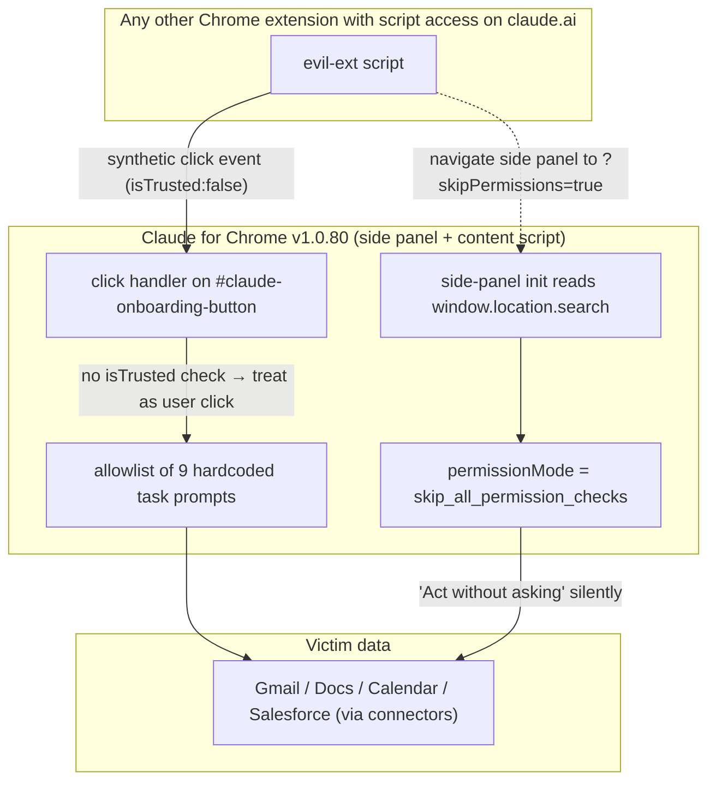

<LevelBadge level="advanced" />

<Callout type="objectives" items={["Claude for Chrome의 두 우회를 이해 — 누락된 event.isTrusted 검사와 사이드 패널을 자체 승격하는 URL 매개변수", "Anthropic이 6월 9일 이전에 트래커를 \"해결됨\"으로 표시하고 여덟 개의 릴리스(v1.0.73 → v1.0.80)를 변경 없이 배포한 것이 여기의 진짜 이야기인 이유를 보기", "일반적인 방어 패턴 배우기: 다른 확장이 여러분의 오리진을 공유할 때 클라이언트 전용 허용 목록은 보안 경계가 아님", "지금 2분 안에 적용할 수 있는 세 가지 구체적인 완화책 취하기"]} />

**2026년 7월 7일**, Anthropic은 **Claude for Chrome v1.0.80**을 릴리스했습니다. Manifold Security는 같은 날 이를 테스트하고 5월의 두 버그 리포트가 v1.0.72와 바이트 대 바이트 동일하게 여전히 재현 가능하다는 것을 발견했습니다. `claude.ai`에 대한 스크립트 액세스가 있는 다른 모든 확장 — 수천 개의 Chrome 확장이 요청하는 권한 — 은 Claude에게 Gmail을 열고, 메시지를 읽고, 그것에 대해 조치하도록 조용히 지시할 수 있습니다. 승인 대화상자 없음. 사용자 제스처 없음.

<VerifyNote lastVerified="2026-07-22" source="https://www.manifold.security/blog/claude-for-chrome-extension-bypass" />

이야기는 "확장에 버그가 있었다"가 아닙니다. Chrome 확장은 지속적으로 버그를 배포합니다. 이야기는 배포된 에이전틱 브라우저 제품이, 9개월간의 조사와 뒤에 있는 공개적인 "ClaudeBleed" 사건 후에도, 여전히 공격자가 완전히 통제하는 곳 — 클라이언트 — 에서 권한 모델을 시행하고, 코드가 변경되지 않은 상태로 추적 이슈를 **해결됨**으로 표시한다는 것입니다.

## 하나의 그림으로 본 두 결함

두 개의 독립적인 버그. **어느 하나만으로도** 모든 하드코딩된 작업을 트리거하기에 충분합니다. 함께라면, 하나는 트리거(가짜 클릭)를, 다른 하나는 무음 실행(자동 승격)을 제공합니다.

## 결함 #1 — 누락된 `isTrusted` 검사

브라우저가 디스패치하는 모든 이벤트에는 `isTrusted` 불리언이 있습니다. 실제 사용자 액션 — 물리적 클릭, 키 누름, 터치 — 은 `isTrusted: true`로 도착합니다. JavaScript가 `dispatchEvent(new MouseEvent(...))`를 통해 합성하는 모든 것은 `isTrusted: false`로 도착합니다. 그것은 브라우저의 유일한 신뢰할 수 있는 *사용자 대 코드* 신호이며, 보안에 민감한 핸들러가 그것들을 구분할 수 있도록 정확히 존재합니다.

Claude for Chrome 콘텐츠 스크립트는 id가 `#claude-onboarding-button`인 요소에 대한 클릭을 수신하고, 클릭이 9개의 허용 목록에 있는 작업 ID(`usecase-gmail`, `usecase-gdocs`, `usecase-calendar`, `usecase-salesforce`, 플러스 DoorDash, Zillow 및 3개의 온보딩 챌린지) 중 하나와 일치하면 일치하는 프롬프트를 실행하기 위해 Claude의 사이드 패널로 전달합니다.

핸들러는 `event.isTrusted`를 절대 확인하지 않습니다. 연구원들의 말로: 확장의 관점에서 가짜 클릭과 실제 클릭은 구별할 수 없습니다.

이것이 중요한 이유는 놓치기 쉬운 아키텍처적 요점 때문입니다: **`https://claude.ai/*`와 일치하는 `content_scripts`를 설치한 다른 모든 Chrome 확장은 Chrome의 관점에서 Claude의 오리진을 공유하고, 페이지에 스크립트를 주입할 수 있습니다.** 그 권한은 이색적이지 않습니다 — 비밀번호 관리자, 노트 클리퍼, 번역 도구, 광고 차단기, 그리고 수많은 "생산성" 확장이 일상적으로 그것을 요청합니다. 스크립트가 그 페이지에서 실행되기만 하면, `#claude-onboarding-button`에 대한 합성 클릭을 디스패치하는 것은 대략 6줄의 코드입니다. Manifold의 리포트는 정확히 그 크기를 언급하여 한 가지 점을 지적합니다: 수정은 하나의 `if` 문이고, 익스플로잇은 하나의 디스패치 호출입니다.

9-프롬프트 허용 목록은 ClaudeBleed에 대한 Anthropic의 *이전* 완화책이었습니다 — 아이디어는 "클릭이 위조되더라도 고정된 안전한 작업 목록만 실행할 수 있다"였습니다. 그 모델은 "Gmail 통합 실행"이 목록에 있는 순간 깨집니다. Gmail을 읽고 그것에 대해 조치하는 것은 안전한 작업이 아닙니다.

<Callout type="tip" items={["교훈은 \"isTrusted를 추가하라\"가 아닙니다 — 그 아래의 교훈입니다: \"안전한\" 에이전트 작업의 허용 목록은 그 목록에서 가장 안전하지 않은 작업만큼만 안전합니다. 세밀한 통합별 사용자 동의는 신뢰할 수 없는 자유 형식 트리거뿐만 아니라 그 트리거 중 모든 것에 속합니다."]} />

## 결함 #2 — 패널 URL의 `?skipPermissions=true`

Chrome 확장 사이드 패널은 자체 URL을 가지며, 그 URL의 쿼리 문자열은 패널 내부에서 `window.location.search`를 통해 읽을 수 있습니다. Claude의 사이드 패널은 `skipPermissions` 매개변수를 읽습니다. `"true"`와 같다면, 패널은 `permissionMode = "skip_all_permission_checks"`로 초기화됩니다 — 사용자가 수동으로 *묻지 않고 조치*를 활성화할 때와 같은 내부 모드입니다.

그것은 클라이언트 측 자체 서비스 권한 상승입니다. 패널은 자신에게 권한을 요청하고 패널 자체가 URL에서 받은 값을 기반으로 예라고 답하고 있습니다 — `chrome.sidePanel.open({...})`이나 패널로 탐색할 수 있는 무엇이든 제공할 수 있는 것입니다.

Manifold는 그 시나리오를 **CVSS 9.6 Critical**로 평가합니다, 왜냐하면 그 모드에서는 승인 상자가 전혀 없기 때문입니다: 9개의 허용 목록 프롬프트가 조용히 실행됩니다. 합성 클릭 결함만으로도(일반 승인 상자가 여전히 표시됨) 7.7 High로 평가되는데, 왜냐하면 사용자가 엔터를 누르기 전에 원칙적으로 대화상자를 알아차릴 수 있기 때문입니다.

수정의 올바른 형태는 "URL 매개변수를 살균"하는 것이 아닙니다. 그것은 권한 모드 간 전환이 패널이 로드된 후 실제 UI 컨트롤에서 명시적, `isTrusted` 사용자 제스처를 요구해야 한다는 것 — 패널이 자체 URL, 자체 스토리지 또는 다른 확장이 게시할 수 있는 메시지 채널에서 읽는 값이 절대로 아니라는 것입니다. 그것은 브라우저가 이미 전체 화면, 카메라 및 클립보드 권한에 적용하는 동일한 아키텍처적 제약이며, 같은 이유입니다.

## "해결됨" ≠ 패치된 이유 — 프로세스 실패

타임라인이 이것을 코드 이야기가 아니라 거버넌스 이야기로 만드는 것입니다:

<Steps items={[
{ "title": "2026년 5월 21일 — Manifold가 두 이슈 보고", "body": "v1.0.72에 대해 Anthropic에 두 개의 별도 버그 리포트가 접수됨." },
{ "title": "5월 22일 — 인정되고 닫힘", "body": "Anthropic은 둘 다 인정했습니다. 리포트 #1은 기존 트래커의 중복으로 닫혔습니다; 리포트 #2는 URL 매개변수가 \"확장 자체에서만 사용됨\"이라는 주장으로 \"정보성\"으로 기각되었습니다 — 그것이 정확히 버그가 위반하는 가정입니다." },
{ "title": "6월 9일 이전 — 내부 트래커가 \"해결됨\"으로 표시됨", "body": "\"ClaudeBleed\" 우산 이슈는 Anthropic의 내부 추적에서 해결됨으로 뒤집혔습니다 — 두 개의 근본 버그에 대한 수정이 아니라 명백히 9-프롬프트 허용 목록 완화책의 힘으로." },
{ "title": "7월 7일 — v1.0.80 배포, 코드 바이트 동일", "body": "여덟 개의 릴리스(v1.0.73 → v1.0.80)가 보고와 지금 사이에 나갔습니다. 연구원들은 재검증했습니다: 클릭 핸들러와 패널 초기화는 그들이 원래 테스트한 버전에서 변경되지 않았습니다." },
{ "title": "7월 14일 — 공개 공개", "body": "CVE 없음. Anthropic 자문 없음. 공개 블로그 포스트 + Hacker News + 업계 언론 보도. 이 페이지 기준: 여전히 패치되지 않음." }
]} />

내면화할 가치가 있는 두 가지 실패 모드, 왜냐하면 이 이야기 외에서 흔하기 때문입니다:

1. **완화책 붕괴.** 익스플로잇의 형태를 바꾸는 완화책(\"이제 9개의 버튼 중 하나를 클릭해야 합니다\")이 수정으로 취급됩니다. 그 버튼에 대한 트리거 자체가 위조 가능할 때, 완화책은 보안을 추가하지 않습니다 — 공격 레시피만 바꿉니다.
2. **\"설계상 해결됨\" 표류.** 버그 #2는 확장 자체만 `skipPermissions`를 설정한다는 이론으로 닫혔습니다. 그것은 *의도*의 설명이지, *브라우저의 실제 시행*의 설명이 아닙니다. `sidePanel` 액세스가 있거나 패널 URL을 통한 리다이렉트가 있는 모든 것이 그것도 설정할 수 있습니다.

두 패턴 모두 이유가 있어 보안 리뷰 안티패턴 목록에 나타납니다. 여러분의 자체 코드에서 그것들을 주시하세요.

## 무엇이 실행되고, 어떤 데이터에 도달할 수 있는가

Manifold의 리포트에서 9개의 하드코딩된 작업 ID:

| 카테고리 | 작업 ID | 프롬프트가 Claude에게 대략 무엇을 하라고 하는가 |
| --- | --- | --- |
| Google | `usecase-gmail`, `usecase-gdocs`, `usecase-calendar` | Gmail 읽기(받은편지함을 반복하는 "홍보 이메일 구독 해지" 흐름 포함), Google Docs 댓글 읽기, Calendar 가용성 읽기 및 회의 생성 |
| CRM / 상거래 | `usecase-salesforce`, `usecase-doordash`, `usecase-zillow` | Salesforce 리드 읽기 및 기회로 변환; DoorDash / Zillow 흐름을 통해 실행 |
| 온보딩 | 세 개의 온보딩 챌린지 | 가이드 투어 프롬프트 |

도달 범위는 피해자가 활성화한 커넥터에 따라 다릅니다. Gmail이 연결되어 있으면 `usecase-gmail`이 Gmail을 읽습니다. Salesforce가 연결되어 있으면 `usecase-salesforce`가 CRM을 만집니다. 패널은 사용자가 요청한 것을 하고 있습니다 — 다만 *이* 사용자가 아니고, 지금이 아닙니다.

<Callout type="warning" items={["\"묻지 않고 조치\"는 특별한 개발자 모드가 아닙니다. 그것은 Claude for Chrome 설정의 체크박스입니다. 켜져 있으면 결함 #1만으로도 실제 Gmail / Docs / Calendar / Salesforce 읽기가 트리거됩니다. 꺼져 있으면 결함 #2(?skipPermissions=true)가 패널 수명 동안 조용히 다시 활성화할 수 있습니다."]} />

## 지금 할 세 가지 (2분)

<Steps items={[
{ "title": "묻지 않고 조치 끄기", "body": "Claude for Chrome 설정 → \"묻지 않고 조치\" 비활성화. 승인 프롬프트는 성가시지만, 결함 #1만으로 남는 유일한 사용자 가시 신호입니다." },
{ "title": "어떤 확장이 claude.ai를 만질 수 있는지 감사", "body": "chrome://extensions → 각각의 세부정보 → 사이트 액세스. 모든 사이트로 설정되거나 claude.ai를 나열하는 모든 것은 Claude 페이지에 콘텐츠 스크립트를 주입할 수 있습니다. 적극적으로 신뢰하지 않는 것들을 다운그레이드하거나 제거하세요. 비밀번호 관리자와 노트 클리퍼가 이중 확인할 가치가 있는 두 카테고리입니다." },
{ "title": "사용하지 않는 커넥터 정리", "body": "Claude → 설정 → 커넥터에서, 의존하지 않는 Gmail / Docs / Calendar / Salesforce 통합을 연결 해제하세요. 9개의 하드코딩된 작업은 실제로 연결된 커넥터에 대해서만 위험합니다." }
]} />

전체 팀을 위해 에이전틱 확장을 실행한다면, 네 번째를 추가하세요: **에이전트가 실제로 실행하는 것에 대한 런타임 관찰** — 단순히 어떤 권한을 가지고 있는지가 아니라. 두 결함 모두 권한 감사를 통과하고 동작 관찰에서 실패합니다, 왜냐하면 그들이 에이전트가 사용자가 요청한 적이 없는 것들을 *하도록* 만들기 때문입니다. 그 간극은 Manifold 자체의 권장이 도달하는 곳이며, 이 하나의 제품을 훨씬 넘어서 잘 일반화됩니다.

<PromptCard title="Chrome extension audit prompt for Claude">
{`Here is my current chrome://extensions export (or a list I'll paste): {LIST}.

For each extension:
1. Is its "site access" set to "All sites" or does it match claude.ai? Flag those.
2. From its Chrome Web Store description, what content_scripts permissions does it plausibly require? Is claude.ai a required domain for its stated function?
3. Rate each on a "trust to run a script inside my Claude tab" scale from 1 (dedicated password manager from a known vendor) to 5 (random productivity extension with <10k installs).
4. Give me a two-column recommendation: KEEP AS-IS / RESTRICT TO SPECIFIC SITES / REMOVE — with a one-line reason per row.

Do not soften. If something looks sketchy, say sketchy.`}
</PromptCard>

## 더 넓은 패턴 — 클라이언트 전용 허용 목록, 에이전틱 범위

Claude for Chrome에서 확대하세요. 같은 형태가 증가하는 에이전틱 제품에서 나타납니다:

- 신뢰할 수 있는 UI(확장, 데스크톱 앱, IDE 플러그인)가 사용자 데이터에 대해 실제 조치를 취할 수 있는 에이전트를 노출합니다.
- 위험을 제약하기 위해, 벤더는 에이전트가 승인 없이 실행할 수 있는 작업/프롬프트/도구의 **허용 목록**을 추가합니다.
- 허용 목록의 항목에 대한 **트리거**는 *클라이언트 내부*에 남아 있습니다 — 클릭, URL, 저장된 설정, 다른 컴포넌트가 공유하는 채널의 메시지.
- 같은 신뢰 영역(같은 확장 호스트, 같은 오리진, 같은 IPC 버스)의 다른 코드가 트리거를 위조할 수 있습니다.

각 라운드가 가르치는 교훈은 같습니다. `docs/security/agentic-browsers-same-origin.mdx`(SOP 위 에이전트 읽기), `docs/security/coding-agents-under-attack.mdx`(자동 승인이 새로운 공격 표면), `docs/security/prompt-injection.mdx`(신뢰할 수 없는 콘텐츠가 신뢰할 수 없는 지시가 됨)도 참조하세요. 그 모든 것이 *경계가 공격자가 이미 서 있는 곳에 그려진* 사례입니다.

포스트잇에 적을 가치가 있는 두 가지 불변항:

1. **공격자가 호출할 수 있는 권한 검사는 권한 검사가 아닙니다.** "이 페이지의 모든 스크립트", "모든 URL 매개변수", "모든 스토리지 값", 또는 "알 수 없는 오리진에서 온 모든 postMessage" 중 어떤 것이든 여러분의 에이전트를 *묻기*에서 *조치*로 뒤집을 수 있다면, 그 뒤집기는 여러분이 렌더링한 실제 DOM 요소의 `isTrusted` 제스처 뒤에 속합니다.
2. **허용 목록은 동의의 대체물이 아닙니다.** 목록의 어떤 단일 작업이라도 프롬프트 없이 실행될 때 사용자를 놀라게 한다면(`내 Gmail 읽기`가 자격이 있음), 허용 목록은 공격자 선택을 줄이지만 공격자 영향은 줄이지 않습니다.

## 빠른 체크

<Quiz questions={[
  {
    "q": "Claude for Chrome v1.0.80에서, claude.ai에 대한 스크립트 액세스가 있는 일반적인 Chrome 확장이 9개의 허용 목록 작업을 트리거하기에 충분한 이유는 무엇입니까?",
    "options": [
      "확장이 사용자의 세션 쿠키를 사용하여 Claude API를 직접 호출할 수 있기 때문입니다.",
      "#claude-onboarding-button의 클릭 핸들러가 event.isTrusted를 확인하지 않기 때문에, 페이지의 모든 스크립트에서 온 합성 클릭이 사용자 입력으로 취급됩니다.",
      "Chrome이 확장의 개인 키를 동일 오리진 스크립트에 노출하기 때문입니다.",
      "Claude가 공격자의 확장 코드를 자체 프로세스에 사이드 로드하기 때문입니다."
    ],
    "answer": 1,
    "explain": "버그는 누락된 isTrusted 검사입니다. Claude 페이지에서 실행되는 모든 스크립트에서 디스패치된 합성 MouseEvent가 사용자가 클릭한 것처럼 핸들러를 통과합니다. API 키 노출이나 프로세스 교차가 필요하지 않습니다 — 페이지에 대한 스크립트 액세스만 있으면 됩니다."
  },
  {
    "q": "?skipPermissions=true 우회의 실제 메커니즘은 무엇입니까?",
    "options": [
      "URL 매개변수가 Anthropic의 서버로 전송되고, 서버가 관리자 토큰을 반환합니다.",
      "사이드 패널이 window.location.search 자체를 읽고, skipPermissions가 \"true\"와 같으면 permissionMode를 로컬로 skip_all_permission_checks로 설정합니다 — 서버가 관여하지 않습니다.",
      "패널에 대한 Chrome의 동일 오리진 정책을 비활성화합니다.",
      "패널에 Chrome의 디버거 권한을 부여합니다."
    ],
    "answer": 1,
    "explain": "그것은 클라이언트 전용, 자체 서비스 권한 상승입니다. 패널은 자신에게 상승된 권한을 요청하고 자체 URL에서 답을 읽습니다 — 패널을 열거나 탐색할 수 있는 모든 것이 통제합니다."
  },
  {
    "q": "Anthropic은 2026년 6월 9일 이전에 기본 트래커를 \"해결됨\"으로 표시했지만, v1.0.80(7월 7일)은 v1.0.72와 바이트 동일합니다. 이것이 가장 잘 보여주는 실패 모드는 무엇입니까?",
    "options": [
      "확장의 빌드 파이프라인의 공급망 손상.",
      "완화책 붕괴: 9-프롬프트 허용 목록이 수정으로 취급되었지만, 그 프롬프트에 대한 트리거 자체가 위조 가능하므로 허용 목록은 익스플로잇의 형태를 바꾸지만 그 영향을 줄이지 않습니다.",
      "Chrome의 매니페스트 v3 권한 모델의 버그.",
      "Anthropic이 Manifold의 공개 계약을 취소함."
    ],
    "answer": 1,
    "explain": "허용 목록은 Anthropic의 이전 ClaudeBleed 완화책이었습니다. 항목을 선택하는 트리거가 신뢰할 수 있는 경우에만 도움이 됩니다. 누락된 isTrusted 검사는 트리거를 위조 가능하게 만드므로, 완화책은 공격자 영향이 아니라 공격자 선택을 줄입니다 — 그러나 트래커는 수정인 것처럼 닫혔습니다."
  },
  {
    "q": "다음 중 Claude for Chrome 사용자가 지금 적용할 수 있는 가장 강력한 단일 완화책은 무엇입니까?",
    "options": [
      "claude.ai에서 JavaScript 비활성화.",
      "Google Chrome 제거.",
      "\"묻지 않고 조치\" 비활성화 및 어떤 다른 확장이 claude.ai에 대한 스크립트 액세스를 가지고 있는지 감사.",
      "Anthropic API 키 회전."
    ],
    "answer": 2,
    "explain": "\"묻지 않고 조치\"를 비활성화하면 승인 프롬프트가 복원됩니다(따라서 결함 #1만으로도 사용자에게 보이게 됩니다), 그리고 claude.ai 스크립트 액세스가 있는 확장을 정리하면 합성 클릭을 디스패치할 수 있는 당사자가 처음부터 제거됩니다. API 키 회전은 여기서 아무것도 하지 않습니다 — 공격은 API 자격 증명이 아니라 사용자의 UI 세션을 탑니다."
  }
]}/>

<Callout type="takeaways" items={["Claude for Chrome v1.0.80(2026년 7월 7일)은 여전히 5월에 v1.0.72에서 처음 보고된 두 Manifold 버그에 취약합니다 — 9-프롬프트 허용 목록의 합성 클릭 우회, 그리고 패널 URL의 ?skipPermissions=true를 통한 자체 승격.", "두 버그 모두 클라이언트 전용 권한 검사입니다. 트래커의 \"해결됨\"은 완화책(허용 목록)을 가리켰지, 근본적인 시행 간극이 아니었습니다.", "지금: 묻지 않고 조치 끄기, 어떤 다른 Chrome 확장이 claude.ai에 스크립트를 주입할 수 있는지 감사, 그리고 사용하지 않는 커넥터 연결 해제.", "일반 규칙: 페이지의 모든 스크립트가 호출할 수 있는 권한 검사는 권한 검사가 아닙니다. 모드 전환은 URL / 스토리지 / 메시지 값이 아니라 실제 UI 요소의 isTrusted 제스처를 타야 합니다."]} />

## 소스 & 추가 읽을거리

- Manifold Security — [ClaudeBleed Reopened: browser extensions can still push Claude for Chrome to read your Gmail](https://www.manifold.security/blog/claude-for-chrome-extension-bypass) (기본 기술 작성; 타임라인, CVSS 등급, 바이트 동일 코드 관찰)
- The Hacker News — [Researchers Say Claude for Chrome Flaw Lets Rogue Extensions Trigger Gmail Reads](https://thehackernews.com/2026/07/claude-for-chrome-flaw-lets-other.html) (업계 보도; Anthropic의 공개 응답)
- BleepingComputer — [Claude Chrome extension flaw lets malicious extensions trigger AI actions](https://www.bleepingcomputer.com/news/security/claude-chrome-extension-flaw-lets-malicious-extensions-trigger-ai-actions/) (공격 표면, 권한 요구 사항)
- TechRadar — [The bypass is still six lines of JavaScript](https://www.techradar.com/pro/the-bypass-is-still-six-lines-of-javascript-security-experts-warn-that-claude-for-chrome-browser-extension-could-be-hijacked-despite-it-alerting-anthropic-several-times-that-something-was-wrong) (수정이 단일 조건인 이유에 대한 컨텍스트)
- AILmanac 관련: [Agentic Browsers Break the Same-Origin Policy](/docs/security/agentic-browsers-same-origin), [When Coding Agents Get Weaponized](/docs/security/coding-agents-under-attack), [Prompt Injection: the safety model you can't ignore](/docs/security/prompt-injection)
- OWASP — [Top 10 for LLM Applications](https://genai.owasp.org/llm-top-10/) (LLM01 Prompt Injection & LLM06 Excessive Agency이 이 버그가 매핑되는 두 카테고리)
