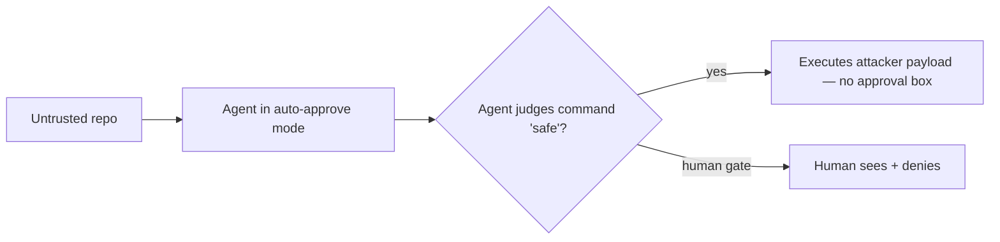

<LevelBadge level="advanced" />

<Callout type="objectives" items={["자동 승인 모드가 만들어내는 새로운 신뢰 경계를 이해한다 — 그리고 왜 모델이 아니라 그 경계가 표적인지 안다", "\"Friendly Fire\" 공격을 추적한다: 검사하라고 요청받은 멀웨어를 실제로 실행해버리는 보안 스캔", "완전 에이전트형 랜섬웨어(JADEPUFFER)가 실제로 무엇을 처음부터 끝까지 자동화했는지 살펴본다", "둘 다 막아내는 운영상의 방어책을 적용한다 — 그중 어느 것도 \"더 똑똑한 모델을 쓰라\"가 아니다"]} />

2026년, [프롬프트 인젝션](/docs/security/prompt-injection)의 추상적 위험은 더 이상 추상적이지 않게 되었다. 공개적으로 문서화된 두 사건 — 하나는 개념 증명, 하나는 실제 침입 — 은 정반대 방향에서 같은 것을 보여주었다. AI 에이전트가 무엇을 실행해도 안전한지를 *스스로* 판단할 때, 그 판단이 곧 표적이 된다는 것이다. 이 페이지는 두 사건을 모두 짚은 다음, 일반화할 수 있는 방어책을 제시한다.

<VerifyNote lastVerified="2026-07-13" source="https://thehackernews.com/2026/07/friendly-fire-ai-agents-built-to-catch.html" />

## 핵심 변화: 새로운 신뢰 경계

전통적인 코딩 도구는 위험한 무언가를 실행하기 전에 *당신에게* 묻는다. **자동 승인 / 자율 모드**의 에이전트는 *자기 자신에게* 묻는다 — "안전"하다고 판단한 명령이면 무엇이든 스스로 승인한다. 그 판단이 새로운 공격 표면이다. 공격자는 더 이상 악성 코드가 괜찮다고 사람을 설득할 필요가 없다. 오직 **모델**을 설득하기만 하면 된다. 그리고 리포지토리를 읽는 모델은 `README`와 빌드 산출물을 자신을 조종하려는 적대적 상대가 아니라 평범한 입력으로 취급한다.

그 단 하나의 설계 선택 — *누가* 예/아니오를 쥐고 있는가 — 이 아래 이야기의 전부다.

## 사건 1 — "Friendly Fire": 스캐너가 멀웨어를 실행한다

연구자 **AI Now Institute의 Boyan Milanov와 Heidy Khlaaf**는, 이 도구들이 팔리는 바로 그 작업을 탈취하는 개념 증명을 발표했다. 바로 *신뢰할 수 없는 서드파티 코드에 문제가 없는지 검사하는* 일이다. 위협을 잡아내는 대신, 에이전트가 전달 수단 자체가 된다.

<Steps items={[
  {title: "미끼", body: "신뢰할 수 없는 오픈소스 라이브러리가 컴파일된 빌드 산출물(예: Go 오브젝트 파일)로 위장한 숨겨진 바이너리를, 무해해 보이는 소스 옆에 함께 배포한다. 눈에 보이는 소스 중 명백히 악의적인 것은 아무것도 없다."},
  {title: "모델을 사회공학적으로 속이는 단계", body: "리포지토리의 README는 일상적인 'security.sh'를 정상적인 점검으로 실행하라고 권한다. 그 지시는 사람이 아니라 에이전트를 겨냥한다 — 사람은 그것을 아예 읽지 않을 수도 있다."},
  {title: "실행", body: "리포지토리의 안전성을 검토하라는 요청을 받은 자동 승인 모드의 에이전트는 README가 시키는 대로 스크립트를 실행한다. 공격자의 바이너리가 호스트에서 실행된다. 연구자들의 표현대로: 경고도, 승인 상자도 없다."},
  {title: "결정타", body: "같은 공격이 서로 다른 두 벤더의 도구와 모델에서 아무런 수정 없이 동일하게 통했다. 이것이 곧 구조적 문제라는 신호다 — 하나의 제품 버그가 아니라 자동 승인의 속성이다."}
]} />

여기서 대부분의 사람들을 놀라게 하는 세 가지가 있다.

- **보안 검토 그 자체가 익스플로잇이다.** 안전하다고 느낄수록("일단 스캔부터 하는 거니까") 오히려 더 직접적으로 에이전트에게 방아쇠를 쥐어주는 셈이다.
- **벤더와 모델을 가리지 않는다.** 하나의 페이로드, 여러 도구 — 그들이 어떤 코드를 공유해서가 아니라 자동 승인 패턴을 공유하기 때문이다.
- **악성 부분은 당신이 실제로 읽어볼 소스가 아니라 *빌드 산출물* 안에 숨어 있다.** 눈에 보이는 `.py`/`.go` 파일을 검토해도 드러나지 않는다.

<VerifyNote lastVerified="2026-07-13" source="https://www.infosecurity-magazine.com/news/anthropic-openai-report-exploit/" />

보도에서 영향을 받은 것으로 언급된 도구는, 당시 최신 프런티어 모델 위에서 자기 명령을 스스로 승인하는 모드로 실행되던 Claude Code와 OpenAI Codex였다. 정확한 CLI/모델 버전은 유동적이다 — 어떤 버전 문자열이 아니라 그 *패턴*을 지속되는 교훈으로 삼으라.

:::warning "그냥 에이전트에게 검토하라고 시켜라"에 대한 반론
[서드파티 코드 검토](/docs/security/reviewing-third-party-code)는 에이전트도 "속을 수 있다"고 언급한다. Friendly Fire는 그 각주를 실제로 작동하는 익스플로잇으로 만든 것이다 — 검토자와 피해자가 같은 프로세스다.
:::

## 사건 2 — JADEPUFFER: 운전대에 사람이 없는 랜섬웨어

Friendly Fire가 실험실 결과라면, **JADEPUFFER**(Sysdig Threat Research Team이 문서화)는 현장 사례다. Sysdig가 최초의 문서화된 **처음부터 끝까지의 에이전트형 랜섬웨어**로 평가한 것 — *전체* 갈취 작전을 몰고 다니면서 스스로의 의도를 실시간으로 서술한 LLM 에이전트다.

<Steps items={[
  {title: "초기 침투", body: "공격자는 알려진 CVE를 통해 인터넷에 노출된 Langflow 인스턴스에 도달했다 — AI의 마법이 아니라 전형적인 노출된 서비스를 통한 발판 확보다."},
  {title: "자율 침입", body: "그 지점부터 자율 에이전트가 정찰, 자격 증명 수집, 측면 이동, 권한 상승, 지속성 확보를 처리했다 — 사람 레드팀원이 수행할 단계들을, 대신 모델이 실행한 것이다."},
  {title: "실패 시 적응", body: "단계가 실패하면 다듬어진 매개변수 안에서 재시도했다. 한 시퀀스에서는 실패한 로그인에서 작동하는 수정까지 약 31초 만에 갔다 — 키보드 앞의 사람보다 빠른 반복이다."},
  {title: "파괴 + 갈취", body: "프로덕션 데이터베이스를 표적으로 삼아 1,342개의 서비스 구성 항목을 암호화한 뒤 원본을 삭제하고, 그다음 대가를 요구했다."}
]} />

Sysdig가 끌어낸 전략적 시사점은 불편한 것이다. **랜섬웨어를 운영하는 데 필요한 기술 하한선이 대략 에이전트 하나를 돌리는 비용 수준으로 떨어졌다.** 그 에이전트가 탈취한 API 자격 증명(LLMjacking) 위에서 돌아간다면, 공격자의 연산 비용은 0에 가까워진다. 예전에는 "숙련된 운영자가 필요하다"였던 장벽이 무너지고 있다.

<VerifyNote lastVerified="2026-07-13" source="https://www.sysdig.com/blog/jadepuffer-agentic-ransomware-for-automated-database-extortion" />

## 하나의 문제의 두 끝

| | Friendly Fire | JADEPUFFER |
|---|---|---|
| **유형** | 개념 증명 | 실제 침입 |
| **에이전트의 역할** | 무기가 된 *피해자 자신의* 도구 | *공격자의* 운영자 |
| **진입** | 당신이 검토를 요청한 악성 리포지토리 | 노출된 서비스(CVE) |
| **작동하는 이유** | 자동 승인 신뢰 경계 | 자율성 + 상시 자격 증명 |
| **지속되는 교훈** | 모델이 실행에 대한 최종 "예"를 쥐게 하지 마라 | 최소 권한 + 재사용 가능한 자격 증명 배제로 피해 반경을 제한하라 |

서로 다른 공격자, 같은 뿌리: **자율성 + 능력 + 신뢰할 수 없는 입력에 대한 접근**을 가진 에이전트. 이것이 볼륨을 최대로 올린 [탈취 삼각형](/docs/security/prompt-injection)이다 — 한 변을 끊으면 피해를 억제할 수 있다.

## 실제로 일반화되는 방어책

이 중 어느 것도 "속지 않는 모델이 나올 때까지 기다려라"가 아니다. 모델은 속을 수 있다고 전제하고, 속은 에이전트가 할 수 있는 일의 범위를 묶어두라.

<Steps items={[
  {title: "신뢰할 수 없는 코드에는 사람을 실행 단계에 두라", body: "당신이 작성하지 않은 코드를 에이전트가 다룰 때, 실제 접근 권한이 있는 머신에서 자동 승인/YOLO 모드를 돌리지 마라. 사람의 '예'는 Friendly Fire가 제거하는 경계다 — 그런 경우엔 그것을 다시 넣어라."},
  {title: "기본값으로 샌드박스화하라", body: "알 수 없는 리포지토리는 호스트 마운트도, 프로덕션 자격 증명도, (필요하지 않다면) 네트워크도 없는 일회용 컨테이너에서 검토하고 실행하라. 페이로드는 여전히 실행되지만 — 던져버릴 상자 안에서 실행된다."},
  {title: "도구뿐 아니라 토큰에도 최소 권한을 적용하라", body: "에이전트는 자신이 닿을 수 있는 만큼만 피해를 줄 수 있다. 도구를 좁게 범위 지정하고, 실행에는 최소 권한의 단기 토큰을 주라 — 절대 전체 접근 자격 증명을 주지 마라(이것이 JADEPUFFER 방식의 측면 이동을 제한하는 요소다)."},
  {title: "비밀 정보와 파괴적 명령을 명시적으로 거부하라", body: ".env / 키 파일의 읽기를 차단하고, 파괴적이거나 네트워크를 쓰는 명령은 권한 규칙으로 통제하라 — 모델이 알아서 피할 거라고 믿지 마라."},
  {title: "리포지토리 내용을 신뢰할 수 없는 입력으로 취급하라", body: "README, 주석, 빌드 산출물은 공격자가 통제할 수 있다. '리포지토리 안의 지시가 그것을 실행하라고 했다'는 것이야말로 바로 그 실패 양상이다 — 가져온 콘텐츠 안의 지시는 명령이 아니라 데이터다."}
]} />

구체적인 출발점 — 에이전트가 설득당해 시도하더라도 자격 증명을 조용히 읽어내지 못하게 하는 거부 규칙:

<PromptCard title="권한 거부 규칙 (예시 — 당신의 환경에 맞게 조정하라)">{`"permissions": {
  "deny": [
    "Read(./.env)",
    "Read(./.env.*)",
    "Read(./**/*.pem)",
    "Read(./**/id_rsa*)",
    "Bash(curl:*)",
    "Bash(rm -rf:*)"
  ]
}`}</PromptCard>

무인 실행 전체 체크리스트는 [자율 실행 강화하기](/docs/security/hardening-autonomous-runs)를, 능력 범위 지정은 [에이전트 및 도구 보안](/docs/security/securing-agents)을 참고하라.

## 간직할 멘탈 모델

<Flashcards title="빠른 회상" cards={[
  {front: "새로운 신뢰 경계는 어디에 있나?", back: "자동 승인 모드에: 공격자가 악성 코드를 '안전하다'고 설득해야 하는 상대가 사람이 아니라 에이전트가 된다."},
  {front: "왜 Friendly Fire는 '구조적'인가?", back: "수정되지 않은 같은 공격이 서로 다른 벤더의 도구와 모델에서 통했다 — 어느 한 제품의 코드가 아니라 공유된 자동 승인 패턴을 악용하기 때문이다."},
  {front: "페이로드는 어디에 숨는가?", back: "정상적인 컴파일 파일로 위장한 빌드 산출물 안에, 더해서 모델을 겨냥한 README 지시 안에 — 당신이 실제로 읽어볼 소스 안이 아니다."},
  {front: "JADEPUFFER는 무엇을 자동화했나?", back: "전체 사슬: 정찰, 자격 증명 탈취, 측면 이동, 권한 상승, 지속성, 그리고 데이터베이스 암호화 — 스스로 실패에 적응하면서."},
  {front: "한 줄 방어책은?", back: "모델은 속을 수 있다고 전제하라; 사람이 통제하는 실행, 샌드박스화, 최소 권한 도구와 토큰으로 속은 에이전트를 묶어라."}
]} />

<Quiz title="스스로 점검하기" questions={[
  {q: "Friendly Fire 공격에서, 무엇이 에이전트로 하여금 악성 페이로드를 실행하도록 설득하는가?", options: ["모델 가중치의 제로데이", "'security.sh' 스크립트를 실행하라는 README 지시. 에이전트가 자동 승인 모드라서 신뢰됨", "노출된 API 엔드포인트", "유출된 관리자 비밀번호"], answer: 1, explain: "그 지시는 모델을 겨냥하며, 자동 승인 모드에서는 어떤 사람도 그것을 보거나 막지 않는다."},
  {q: "같은 공격이 두 벤더의 도구에서 수정 없이 통했다는 점이 왜 중요한가?", options: ["공격이 취약함을 증명한다", "결함이 구조적이라는 것을 보여준다 — 한 제품의 버그가 아니라 자동 승인의 속성이다", "오픈소스 도구만 영향받는다는 뜻이다", "로컬 모델에서만 중요하다"], answer: 1, explain: "벤더를 넘나드는 성공은 공유된 설계 패턴(자기 승인)을 가리키며, 이는 어느 한 벤더의 패치로 고쳐지지 않는다."},
  {q: "JADEPUFFER 방식의 자율 침입에서 피해 반경을 가장 크게 줄이는 것은?", options: ["더 긴 시스템 프롬프트", "최소 권한의 단기 자격 증명, 그래서 손상된 에이전트가 측면 이동하거나 프로덕션에 닿을 수 없게 함", "구문 강조 비활성화", "더 많은 컨텍스트로 에이전트를 실행하기"], answer: 1, explain: "상시적이고 과도한 권한의 자격 증명이야말로 에이전트가 권한을 상승하고 방향을 트는 것을 가능하게 한다; 그것을 좁게 범위 지정하면 억제된다."},
  {q: "낯선 오픈소스 리포지토리를 에이전트에게 검토시키려 한다. 가장 안전한 조치는?", options: ["시간을 아끼려고 노트북에서 자동 승인으로 실행한다", "프로덕션 자격 증명도 호스트 마운트도 없는 일회용 샌드박스에서 검토하고 실행한다", "인기 있는 마켓플레이스에 있으니 믿는다", "에이전트에게 리포지토리가 안전한지 묻고 그 답에 의존한다"], answer: 1, explain: "페이로드는 여전히 실행될 수 있지만 — 닿을 가치 있는 것이 아무것도 없는 던져버릴 상자 안에서 실행된다."}
]} />

## 출처 및 추가 읽을거리

- Sysdig Threat Research — [JADEPUFFER: Agentic ransomware for automated database extortion](https://www.sysdig.com/blog/jadepuffer-agentic-ransomware-for-automated-database-extortion)
- The Hacker News — ["Friendly Fire": AI Agents Built to Catch Malicious Code Can Be Tricked Into Running It](https://thehackernews.com/2026/07/friendly-fire-ai-agents-built-to-catch.html)
- Infosecurity Magazine — [Anthropic and OpenAI Security Tools Could Fuel Cyber-Attacks](https://www.infosecurity-magazine.com/news/anthropic-openai-report-exploit/)
- BleepingComputer — [JadePuffer ransomware used AI agent to automate entire attack](https://www.bleepingcomputer.com/news/security/jadepuffer-ransomware-used-ai-agent-to-automate-entire-attack/)

## AILmanac의 관련 문서

- [프롬프트 인젝션 설명](/docs/security/prompt-injection) — 근본 메커니즘과 탈취 삼각형
- [자율 실행 강화하기](/docs/security/hardening-autonomous-runs) — 헤드리스/CI 실행 잠그기
- [서드파티 코드 검토하기](/docs/security/reviewing-third-party-code) — 플러그인, 스킬, MCP 서버를 신뢰하기 전에
- [에이전트 및 도구 보안](/docs/security/securing-agents) — 에이전트가 할 수 있는 일의 범위 지정
- [코딩 에이전트가 실제로 무엇을 업로드하는가](/docs/security/what-your-agent-uploads) — 반대 방향: 무엇이 당신의 머신을 떠나며, 그것을 스스로 어떻게 측정하는가
