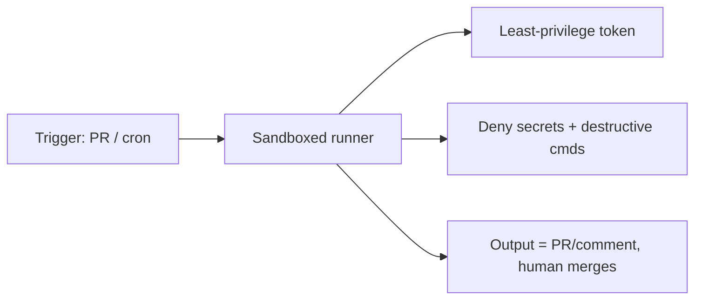

<LevelBadge level="advanced" />

Claude를 [헤드리스](/docs/claude-code/headless-and-agent-sdk)로 실행하거나 [스케줄](/docs/claude-code/background-tasks)에 따라 실행하는 경우 — CI, 크론 작업, 사전 커밋 훅 등 — 평소라면 잘못된 동작을 잡아냈을 사람이 사라집니다. 바로 그 편리함 때문에 이런 실행에는 가장 엄격한 가드레일이 필요합니다.

## 무인 실행에 고유한 위험

- **그 순간 위험한 도구 호출에 "안 돼"라고 말할 사람이 없습니다.**
- **상시 자격 증명(ambient credentials).** CI에는 강력한 토큰(배포, 패키지 레지스트리, 클라우드)이 있는 경우가 많습니다. 그곳의 에이전트는 이를 그대로 상속받습니다.
- **신뢰할 수 없는 입력.** PR이나 이슈로 트리거된 실행은 공격자가 작성한 콘텐츠를 처리할 수 있습니다([인젝션](/docs/security/prompt-injection)).

## 강화 체크리스트

- **시크릿을 명시적으로 차단하세요.** [권한 거부 규칙](/docs/claude-code/permissions)을 통해 `.env`, 키 파일, 자격 증명 경로 읽기를 차단하세요. 모델이 알아서 피하리라고 기대하지 마세요.
- **실제 접근 권한이 있는 머신에서는 절대 bypass/yolo 모드를 사용하지 마세요.** "모든 프롬프트 건너뛰기"는 일회용 샌드박스에만 사용하세요.
- **토큰의 범위를 좁히세요.** 실행에는 풀 액세스 자격 증명이 아니라 최소 권한 토큰(가능한 경우 읽기 전용)을 부여하세요.
- **샌드박스 및 일회성.** 실행 후 파기되는 컨테이너에서 실행하고, 프로덕션에 대한 지속적인 접근 권한은 두지 마세요.
- **명령과 도메인을 허용 목록으로 관리하세요.** 테스트/린트/빌드 명령은 허용하고, 네트워크 연결형이나 파괴적인 명령은 거부하세요.
- **상한을 두세요.** 최대 반복 횟수, 시간 예산, 토큰/비용 예산을 설정하여 루프나 조작된 에이전트가 폭주하지 못하도록 하세요.
- **출력은 자동 적용이 아니라 검토 가능하게 만드세요.** "main에 푸시"보다 "PR 열기 / 코멘트 게시"를 선호하세요. 병합은 사람이 합니다.

## 예시: 안전한 CI 리뷰어

PR 리뷰 봇은 다음과 같이 동작해야 합니다. 코드를 읽기 전용으로 체크아웃하고, 배포/시크릿 접근 권한을 **전혀** 갖지 않으며, 컨테이너에서 실행하고, 그 결과를 **코멘트**로 남깁니다 — 보호된 브랜치는 절대 수정하지 않습니다. [PR 리뷰 워크스루](/docs/walkthroughs/pr-review-action)를 참고하세요.

## 다음

- [권한 및 권한 모드](/docs/claude-code/permissions)
- [에이전트 및 도구 보안](/docs/security/securing-agents)
- [헤드리스 모드와 Agent SDK](/docs/claude-code/headless-and-agent-sdk)
