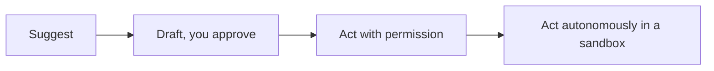

<LevelBadge level="all" />

AI를 최대한 활용한다는 것에는 *책임감 있게* 사용하는 것이 포함됩니다. 이 페이지는 짧고 실용적이며, 초보자부터 빌더까지 모두에게 적용됩니다.

## 검증 마인드셋

가장 중요한 단 하나의 습관은 **검증 수준을 위험 정도에 맞추는 것**입니다.

| 위험 정도 | 예시 | 얼마나 검증할 것인가 |
|---|---|---|
| 낮음 | 브레인스토밍, 초안 | 자유롭게 신뢰하고 훑어보기 |
| 중간 | 업무 이메일, 요약 | 읽어보고 사실관계를 점검 |
| 높음 | 공개할 통계, 실행할 코드, 법률/의료/금융 | 신뢰할 수 있는 출처에 비추어 모든 주장을 검증 |

AI는 빠른 초안일 뿐, 결코 최종 권위가 아닙니다 — [환각](/docs/foundations/hallucinations)을 참고하세요.

## 자율성 사다리

신뢰가 쌓이는 만큼만 AI에 더 많은 독립성을 부여하세요.

"제안하면 내가 승인한다"([플랜 모드](/docs/claude-code/plan-mode))로 시작하고, 완전한 자율성은 위험이 낮고 샌드박스화되어 있으며 되돌릴 수 있는 작업에만 한정하세요([자율 실행 강화하기](/docs/security/hardening-autonomous-runs)).

## 프라이버시 및 데이터

- 검증하지 않은 도구에 시크릿, 자격 증명, 타인의 개인 데이터를 붙여 넣지 마세요.
- 민감한 자료를 공유하기 전에 제공자의 데이터 처리 및 학습 정책을 파악하세요 — [프라이버시 및 데이터 처리](/docs/foundations/privacy)를 참고하세요.
- 규제 대상이거나 기밀인 데이터의 경우, 적절한 엔터프라이즈/통제 설정을 사용하세요.

## 편향, 공정성, 그리고 한계

모델은 학습 데이터에 담긴 패턴을 반영하며, 이는 **편향**을 내포할 수 있습니다. AI 출력이 사람에 관한 결정(채용, 대출, 콘텐츠 모더레이션)에 영향을 미칠 때는 특히 주의하세요. 중대한 결정에 대해서는 사람이 책임을 지도록 하고, AI를 판단을 대체하는 것이 아니라 판단을 돕는 보조 수단으로 취급하세요.

## 사고를 외주화하지 마세요

:::tip AI를 덜 생각하기 위해서가 아니라 더 잘 생각하기 위해 사용하세요
최고의 사용자는 계속 참여합니다 — 출력에 의문을 제기하고, 그로부터 배우며, 결과를 자신의 것으로 책임집니다. 학습의 경우, 복사-붙여넣기가 아니라 [가르치기 되짚기 루프(teach-back loop)](/docs/playbooks/learning)를 의미합니다. AI의 도움으로 출시하는 것에 대한 책임은 사용자에게 있습니다.
:::

## 보안, 간단히

AI가 신뢰할 수 없는 콘텐츠(웹 페이지, 이메일, 문서)를 읽거나 동작을 취하는 순간, 사용자는 보안 모델을 떠안게 됩니다. [프롬프트 인젝션](/docs/security/prompt-injection)과 [에이전트 보안](/docs/security/securing-agents)을 읽어보세요.

## 다음

- [프롬프트 인젝션 설명](/docs/security/prompt-injection)
- [환각과 이를 줄이는 방법](/docs/foundations/hallucinations)
- [프라이버시 및 데이터 처리](/docs/foundations/privacy)
