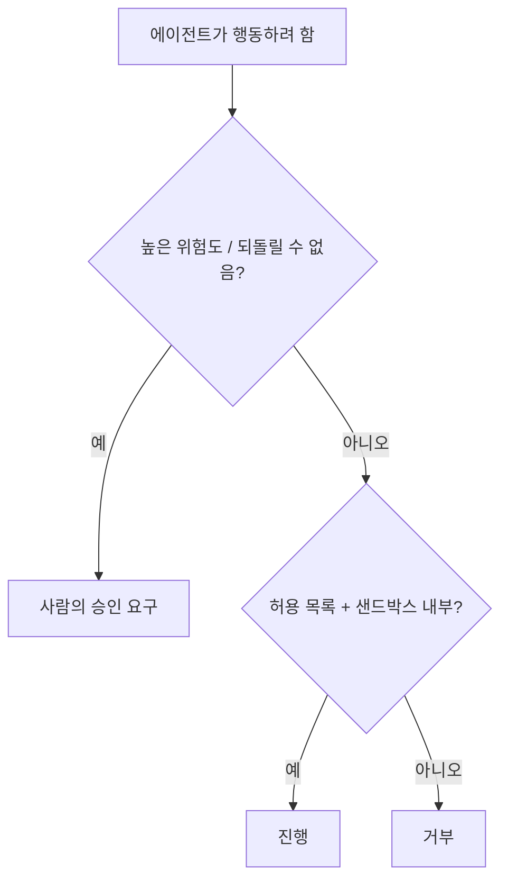

<LevelBadge level="advanced" />

<Callout type="objectives" items={["최소 권한 적용 — 에이전트에게 그 작업에 필요한 접근 권한만 부여하기", "혼란스러운 대리인 문제 인식하기: 에이전트가 당신의 권한을 빌려 쓴다", "에이전트가 속았을 때 피해 범위를 줄여주는 다섯 가지 방어책 계층화하기", "어떤 작업에 사람이 개입하는 루프가 필요한지 결정하기", "잘못되거나 조작된 인자가 실행되지 못하도록 도구 입력 검증하기"]} />

AI가 **행동을 취할** 수 있게 되는 순간(도구 호출, 코드 실행, API 접근), AI는 보안 모델을 물려받습니다. 목표는 모델을 속일 수 없게 만드는 것이 아니라 — **속더라도 큰 피해를 입힐 수 없도록** 만드는 것입니다.

## 핵심 원칙: 최소 권한

에이전트에게 그 작업에 필요한 **최소한의** 접근 권한만 부여하고, 그 이상은 주지 마세요.

- 문서 요약기는 **읽기** 권한이 필요하지, 쓰기나 네트워크 권한이 필요하지 않습니다.
- 리뷰어는 코드를 읽고 코멘트를 남길 수 있으면 됩니다 — 푸시하거나 배포할 필요는 없습니다.
- 도구, API 키, 파일 접근을 작업별로 범위 제한하세요. 좁게 범위가 제한된 에이전트는 [주입 공격을 당해도](/docs/security/prompt-injection) 좁은 범위의 피해만 입힐 수 있습니다.

## 혼란스러운 대리인 문제

에이전트는 종종 **당신의 권한으로**(당신의 토큰, 당신의 세션) 행동합니다. 공격자가 제어하는 입력이 에이전트를 조종하면, 공격자는 당신의 권한을 빌려 쓰게 됩니다 — 이것이 "혼란스러운 대리인(confused deputy)"입니다. 방어책: 에이전트에게 불필요한 상시 권한을 넘겨주지 말고, 민감한 도구에는 명시적이고 범위가 제한된 자격 증명을 요구하세요.

## 방어 계층

이 계층들을 쌓으세요 — 어느 하나만으로는 충분하지 않습니다. 각 계층은 그 위의 계층이 실패할 수 있다고 가정합니다.

<Steps items={[
  {title: "실행과 파일 접근을 샌드박싱하기", body: "코드와 파일 작업을 컨테이너나 임시 디렉터리에서 실행하여 더 넓은 시스템이나 비밀 정보에 접근하지 못하게 하세요. 에이전트가 속더라도 상자 안에서만 놀게 됩니다."},
  {title: "위험한 영역을 허용 목록화하기", body: "어떤 명령, 어떤 도메인, 어떤 경로가 허용되는지 결정하고 — 나머지는 거부하세요. Claude Code에서는 이것이 permissions입니다 (/docs/claude-code/permissions)."},
  {title: "높은 위험도에는 사람이 개입하는 루프", body: "되돌릴 수 없거나 민감한 작업에는 명시적인 승인을 요구하세요: 송금, 이메일 발송, 삭제, 배포, 또는 프로덕션 설정 변경."},
  {title: "신뢰 구역 분리하기", body: "한 에이전트가 동시에 비밀 정보를 보유하고, 신뢰할 수 없는 콘텐츠를 읽고, 임의의 외부 호출을 하도록 두지 마세요 — 그 조합이 바로 유출 경로입니다."},
  {title: "도구 호출을 로깅하고 검토하기", body: "에이전트가 실제로 어떤 도구를 어떤 인자로 호출했는지 기록하여, 동작을 감사하고 이탈을 포착할 수 있게 하세요."}
]} />

## 허용 목록을 문서로 남기기

"위험한 영역을 허용 목록화하기"는 고개를 끄덕이기는 쉽지만 건너뛰기도 쉽습니다. Claude Code에서는 이것이 구체적입니다: 작업에 필요한 좁은 명령과 도메인 집합만 허용하고 나머지는 거부하는 `settings.json`. 제한적으로 시작하고 실제 작업이 막힐 때만 확장하세요.

<PromptCard title="최소 권한 Claude Code permissions 블록">{`{
  "permissions": {
    "allow": [
      "Read",
      "Edit",
      "Bash(npm test:*)",
      "Bash(npm run build:*)",
      "Bash(git status)",
      "Bash(git diff:*)"
    ],
    "deny": [
      "Bash(git push:*)",
      "Bash(rm:*)",
      "Bash(curl:*)",
      "Read(./.env)",
      "Read(./secrets/**)"
    ]
  }
}`}</PromptCard>

`deny` 목록이 `allow`보다 우선하므로, 넓은 범위의 `Read`가 부여되더라도 `.env`와 `secrets/**` 차단은 유지됩니다. 전체 규칙 구문과 우선순위는 [permissions](/docs/claude-code/permissions)를 참고하세요.

## 도구에는 스키마가 있다 — 검증하라

모델이 생성하는 도구 입력은 잘못되거나 조작될 수 있습니다. 실행하기 전에 인자를 **검증**하고, 에이전트가 무작정 재시도하는 대신 복구할 수 있도록 **오류를 결과로 반환**하세요.

<Flashcards title="핵심 용어 익히기" cards={[{front: "최소 권한", back: "에이전트에게 그 특정 작업에 필요한 접근 권한만 부여하기 — 그 이상은 없음. 좁게 범위가 제한된 에이전트는 속더라도 좁은 범위의 피해만 입힐 수 있다."}, {front: "혼란스러운 대리인", back: "에이전트가 당신의 권한으로(당신의 토큰, 당신의 세션) 행동한다. 공격자가 제어하는 입력이 이를 조종하면, 공격자가 당신의 권한을 빌려 쓴다."}, {front: "샌드박스", back: "코드와 파일 접근을 격리된 컨테이너나 임시 디렉터리에서 실행하여 더 넓은 시스템이나 비밀 정보로 가는 경로를 차단함으로써, 속은 에이전트가 상자 안에 갇혀 있게 한다."}, {front: "신뢰 구역", back: "비밀 정보, 신뢰할 수 없는 콘텐츠, 외부 네트워크를 별도의 에이전트에 분리해 둔다. 한 에이전트가 세 가지를 모두 보유하면 유출 경로가 된다."}, {front: "사람이 개입하는 루프", back: "되돌릴 수 없거나 민감한 작업 전에 반드시 거쳐야 하는 사람의 승인 관문 — 송금, 삭제, 배포, 프로덕션 설정 변경."}]} />

<Quiz title="스스로 점검하기" questions={[
  {
    q: "최소 권한 원칙은 에이전트를 구성할 때 무엇을 하라고 요구합니까?",
    options: ["작업 도중 절대 막히지 않도록 넓은 접근 권한을 부여한다", "그 특정 작업에 필요한 접근 권한만 부여한다", "그것을 실행하는 사람과 동일한 권한을 부여한다"],
    answer: 1,
    explain: "최소 권한이란 작업에 필요한 최소한의 접근을 의미합니다. 좁게 범위가 제한된 에이전트는 주입 공격을 당해도 좁은 범위의 피해만 입힐 수 있습니다."
  },
  {
    q: "당신의 토큰으로 행동하는 에이전트가 왜 '혼란스러운 대리인' 위험이 됩니까?",
    options: ["어떤 모델을 호출할지 혼동한다", "공격자가 제어하는 입력이 당신의 권한을 사용하도록 조종할 수 있다", "묻지 않고 다른 에이전트에게 권한을 위임한다"],
    answer: 1,
    explain: "에이전트는 당신의 권한을 보유합니다. 공격자가 제어하는 입력이 이를 조종하면, 공격자는 사실상 당신의 권한을 빌려 쓰게 됩니다 — 혼란스러운 대리인 문제입니다."
  },
  {
    q: "Claude Code permissions 블록에서, 어떤 항목이 에이전트가 비밀 정보 파일을 읽지 못하도록 확실하게 막습니까?",
    options: ["Read에 대한 allow 항목", "secrets 경로에 대한 deny 항목, deny가 allow보다 우선하므로", "Bash 도구 제거"],
    answer: 1,
    explain: "deny가 allow보다 우선하므로, secrets/**에 대한 deny는 넓은 범위의 Read가 부여되더라도 유지됩니다."
  }
]} />

<Callout type="takeaways" items={["최소 권한 우선: 도구, 키, 파일 접근을 작업별로 범위 제한하여 속은 에이전트가 좁은 범위의 피해만 입힐 수 있게 하기", "에이전트는 당신의 권한으로 행동한다 — 불필요한 상시 권한을 넘겨주지 말기(혼란스러운 대리인 문제)", "다섯 가지 계층을 쌓기: 샌드박스, 허용 목록, 사람이 개입하는 루프, 신뢰 구역 분리, 로깅과 검토", "Claude Code에서는 deny 규칙이 allow 규칙을 이긴다 — .env와 secrets 경로를 명시적으로 차단하기", "실행하기 전에 도구 인자를 검증하고, 에이전트가 무작정 재시도하는 대신 복구할 수 있도록 오류를 결과로 반환하기"]} />

## 다음

- [프롬프트 주입 설명](/docs/security/prompt-injection)
- [자율 실행 강화하기](/docs/security/hardening-autonomous-runs)
- [서드파티 코드 검토하기](/docs/security/reviewing-third-party-code)
