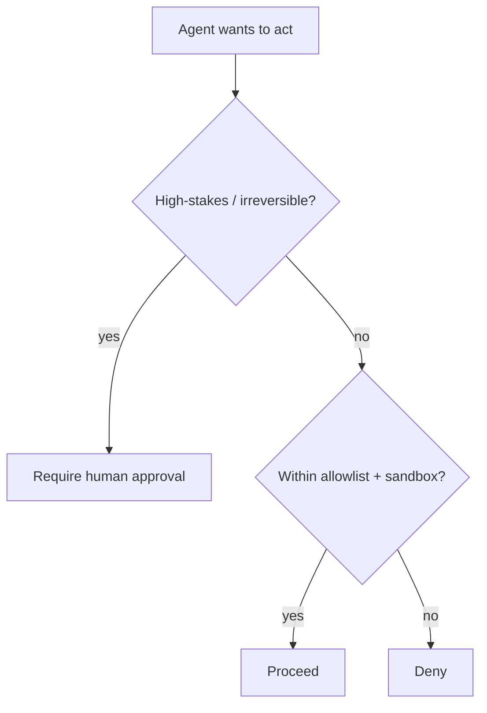

<LevelBadge level="advanced" />

AI가 **동작을 취할 수 있게 되는**(도구 호출, 코드 실행, API 접근) 순간, AI는 보안 모델을 떠안게 됩니다. 목표는 모델을 속일 수 없게 만드는 것이 아니라 — **속더라도 큰 피해를 끼칠 수 없도록** 하는 것입니다.

## 핵심 원칙: 최소 권한

에이전트에게 그 일에 필요한 **최소한**의 접근만 부여하고, 그 이상은 주지 마세요.

- 문서 요약기는 **읽기**가 필요하지, 쓰기나 네트워크는 필요하지 않습니다.
- 리뷰어는 코드를 읽고 코멘트를 게시할 수 있으면 되지 — 푸시나 배포는 필요하지 않습니다.
- 도구, API 키, 파일 접근을 작업별로 범위 지정하세요. 좁게 범위가 지정된 에이전트는 [인젝션](/docs/security/prompt-injection)을 당하더라도 좁은 피해만 줄 수 있습니다.

## 혼란스러운 대리인(confused deputy) 문제

에이전트는 종종 **사용자의 권한으로**(사용자의 토큰, 사용자의 세션) 동작합니다. 공격자가 제어하는 입력이 에이전트를 조종하면, 공격자는 사용자의 권한을 빌리게 됩니다 — "혼란스러운 대리인"입니다. 방어책: 필요하지 않은 상시 권한을 에이전트에게 넘기지 말고, 민감한 도구에는 명시적이고 범위가 지정된 자격 증명을 요구하세요.

## 방어 계층

1. 코드 실행과 파일 접근을 **샌드박싱**하세요 — 컨테이너, 일회성 디렉터리, 더 넓은 시스템이나 시크릿에 대한 접근 차단.
2. 위험한 표면을 **허용 목록으로 관리**하세요. 어떤 명령, 어떤 도메인, 어떤 경로를 허용할지 정하고 나머지는 거부하세요. (Claude Code에서는 [권한](/docs/claude-code/permissions)이 이에 해당합니다.)
3. 되돌릴 수 없거나 위험이 큰 동작에는 **휴먼 인 더 루프(human-in-the-loop)**를 두세요. 금전 송금, 이메일, 삭제, 배포, 프로덕션 설정 변경 등입니다.
4. **신뢰 구역을 분리하세요.** 하나의 에이전트가 시크릿을 보유하면서 동시에 신뢰할 수 없는 콘텐츠를 읽고 임의의 아웃바운드 호출까지 하도록 두지 마세요.
5. 에이전트가 실제로 호출한 도구를 **로깅하고 검토하세요.**

## 도구에는 스키마가 있습니다 — 검증하세요

모델이 생성하는 도구 입력은 틀렸거나 조작되었을 수 있습니다. 실행하기 전에 인자를 **검증**하고, **오류를 결과로 반환**하여 에이전트가 무작정 재시도하는 대신 복구하도록 하세요.

## 다음

- [프롬프트 인젝션 설명](/docs/security/prompt-injection)
- [자율 실행 강화하기](/docs/security/hardening-autonomous-runs)
- [서드파티 코드 검토하기](/docs/security/reviewing-third-party-code)
