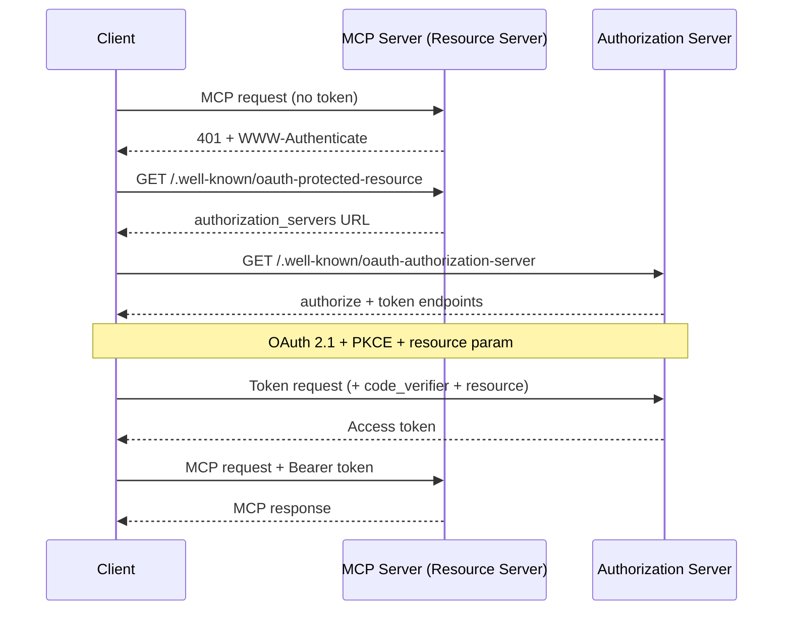
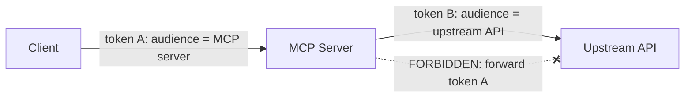

<LevelBadge level="advanced" />

<Callout type="objectives" items={["원격(HTTP) MCP 서버가 단순한 API 키 엔드포인트가 아니라 OAuth 2.1 리소스 서버인 이유를 이해한다", "디스커버리 핸드셰이크를 추적한다: 401 → Protected Resource Metadata → Authorization Server Metadata → 토큰", "토큰 대상 바인딩(RFC 8707)과 그것이 한 서비스의 토큰이 다른 서비스에서 작동하지 못하게 막는 이유를 설명한다", "혼동된 대리자 함정과 그것을 닫는 단 하나의 규칙을 짚는다: 클라이언트의 토큰을 절대 업스트림 API로 그대로 전달하지 말 것", "MCP 서버를 인터넷에 노출하기 전에 짧은 하드닝 체크리스트를 적용한다"]} />

[MCP](/docs/claude-code/mcp)는 신기한 물건에서 에이전트가 도구에 도달하는 기본 방식으로 자리 잡았다 — 이는 곧 MCP 서버가 이제 실제 데이터와 실제 동작 앞에 놓여 있다는 뜻이다. **STDIO**로 실행하는 로컬 서버는 자신의 환경을 신뢰한다: 환경 변수에서 자격 증명을 읽고, 방어해야 할 네트워크 경계가 없다. 그 동일한 서버를 **원격**(HTTP)으로 만드는 순간, 그 URL에 도달할 수 있는 누구나 호출을 시도할 수 있다. 그러면 이것은 인가 문제로 바뀌고, MCP 명세는 그 답으로 — 맞춤형 API 키 방식이 아니라 — **OAuth 2.1**을 제시한다.

이 페이지는 원격 사례에 관한 것이다. 서버가 STDIO 전용이라면, 명세는 명시적으로 OAuth 흐름을 *따르지 말라*고 한다 — 환경에서 자격 증명을 가져오고 넘어가라.

<VerifyNote lastVerified="2026-07-07" source="https://modelcontextprotocol.io/specification/2025-06-18/basic/authorization" />

## 세 가지 역할

OAuth는 문제를 세 당사자로 나눈다. MCP는 여기에 깔끔하게 대응된다:

<Flashcards title="MCP OAuth 흐름에서 누가 누구인가" cards={[{front: "MCP 서버 = 리소스 서버", back: "보호 대상. 액세스 토큰을 실은 요청을 받아 토큰을 검증하고 데이터를 반환한다 — 토큰이 없거나 잘못되면 401을 반환한다. 사용자를 로그인시키지는 않는다."}, {front: "MCP 클라이언트 = OAuth 클라이언트", back: "당신의 에이전트 호스트(Claude Code, 데스크톱 앱, 당신의 코드). 사용자를 대신해 토큰을 얻고 모든 요청에 Bearer 헤더로 붙인다."}, {front: "Authorization Server (AS)", back: "실제로 사용자와 대화하고, 동의를 받고, 토큰을 발급하는 당사자. 서버와 함께 호스팅될 수도, 별도의 아이덴티티 제공자일 수도 있다. 그 내부는 MCP의 범위 밖이다."}]} />

핵심적인 사고의 전환: **MCP 서버는 로그인 자체를 결코 처리하지 않는다.** 그것은 다른 누군가가 발급한 토큰을 검증할 뿐이다. 이 분리 덕분에 당신이 직접 작성한 서버 앞에 기성 아이덴티티 제공자를 둘 수 있다.

## 디스커버리 핸드셰이크

클라이언트가 어디서 인증할지 미리 구성되어 있어야 할 필요는 없다. MCP는 디스커버리를 자동으로 만들며, 이는 `401`에 의해 구동된다:

<Steps items={[
  {title: "클라이언트가 토큰 없이 서버를 호출한다", body: "맨 처음 요청은 아무것도 없이 나간다. 서버는 이를 HTTP 401 Unauthorized와 자신의 리소스 메타데이터 URL을 가리키는 WWW-Authenticate 헤더로 거부한다."},
  {title: "클라이언트가 Protected Resource Metadata (RFC 9728)를 가져온다", body: "서버에서 /.well-known/oauth-protected-resource를 GET한다. 이 문서의 authorization_servers 필드는 클라이언트가 사용할 수 있는 최소 하나의 Authorization Server를 명시한다."},
  {title: "클라이언트가 Authorization Server Metadata (RFC 8414)를 가져온다", body: "AS의 /.well-known/oauth-authorization-server를 GET하여 authorize 및 token 엔드포인트와 지원 기능을 알아낸다."},
  {title: "선택 사항: Dynamic Client Registration (RFC 7591)", body: "클라이언트가 이 AS에 대한 클라이언트 ID가 없다면, /register로 POST하여 사람 개입 없이 ID를 얻을 수 있다 — 클라이언트가 모든 MCP 서버를 미리 알 수 없기 때문에 결정적으로 중요하다."},
  {title: "PKCE + resource를 사용한 OAuth 2.1 인가", body: "클라이언트가 PKCE 검증자/챌린지를 생성하고, resource 파라미터를 포함한 authorize URL로 브라우저를 열며, 사용자가 동의하면, 클라이언트가 반환된 코드를(검증자와 함께) 액세스 토큰으로 교환한다."},
  {title: "클라이언트가 토큰으로 재시도한다", body: "이제 모든 요청은 Authorization: Bearer <token>을 실어 나른다. 서버가 이를 검증하고 응답한다."}
]} />

클라이언트 측에 **하드코딩된 인증 구성이 없다**는 점에 주목하라 — `401`이 모든 것을 부트스트랩한다. 바로 이것이 핵심이다: 에이전트는 한 번도 본 적 없는 서버에 연결하여 어떻게 인증할지 알아낼 수 있다.

## 대상 바인딩: 하중을 견디는 규칙

여기 대상 바인딩이 막으려고 존재하는 실패 모드가 있다. 사용자가 `calendar.example.com`용으로 발급된 토큰을 가지고 있다고 하자. `evil.example.com`에 있는 악의적인(혹은 그저 부주의한) MCP 서버가 클라이언트를 속여 *그* 토큰을 자신에게 보내게 만든다. 만약 `evil`이 그것을 받아들이면, 이제 사용자로 가장해 캘린더 API를 호출할 수 있다. 한 서비스의 토큰이 다른 서비스에서 작동한 것이다. OAuth의 보안 경계가 방금 붕괴했다.

해결책은 **Resource Indicators (RFC 8707)**이다:

<Steps items={[
  {title: "클라이언트가 대상을 선언한다", body: "인가 요청과 토큰 요청 둘 다에서, 클라이언트는 호출하려는 MCP 서버의 정규 URI로 설정된 resource 파라미터를 반드시 포함해야 한다 — 예: resource=https://mcp.example.com. AS가 이를 지원하는지 확실하지 않더라도 이를 보낸다."},
  {title: "AS가 토큰을 그 대상에 바인딩한다", body: "지원되는 경우, AS는 토큰이 그 특정 리소스 서버에 대해서만 유효하도록 도장을 찍는다."},
  {title: "서버가 대상을 검증한다", body: "어떤 작업이든 하기 전에, MCP 서버는 토큰이 자신을 위해 발급되었는지 반드시 확인해야 한다 — 대상 클레임(RFC 9068)을 확인함으로써. 다른 누군가를 위해 발행된 토큰은 401을 받고 그것으로 끝이다."}
]} />

<PromptCard title="인가 요청의 resource 파라미터 (URL-encoded)">{`&resource=https%3A%2F%2Fmcp.example.com`}</PromptCard>

정규 URI는 엄격하다: `https://mcp.example.com`과 `https://mcp.example.com:8443/mcp`는 유효하고, `mcp.example.com`(스킴 없음)과 `https://mcp.example.com#frag`(프래그먼트)는 유효하지 않다. 상호운용성을 위해 끝에 슬래시가 없는 형태를 선호하라.

## 혼동된 대리자: 토큰을 절대 그대로 전달하지 말 것

이것은 선의의 MCP 서버를 공격자의 프록시로 바꿔 놓는 실수다. 에이전트 보안의 그 [혼동된 대리자 문제](/docs/security/securing-agents)와 동일하되, 하나의 구체적인 규칙으로 날카롭게 벼려낸 것이다.

MCP 서버는 종종 **업스트림 API**(GitHub, 데이터베이스 서비스, 다른 SaaS)를 호출해야 한다. 유혹은 클라이언트가 당신에게 건넨 토큰을 받아 업스트림으로 전달하는 것이다. **그러지 마라.** 명세는 단호하다: MCP 서버는 클라이언트로부터 받은 토큰을 **반드시 그대로 전달해서는 안 된다**.

왜 위험한가: 클라이언트의 토큰은 *당신의* 서버를 대상으로 하여 발급되었다. 만약 당신이 이를 전달하면, 업스트림 API는 그것이 당신에게서 온 것처럼 신뢰하거나 당신이 이미 검증했다고 가정할 수 있다 — 그리고 이제 한 홉으로 스코프가 정해진 토큰이 누구의 동의 모델에도 없는 곳에서 두 홉 떨어진 곳까지 일을 하고 있다.

<Callout type="warning" items={["당신의 MCP 서버가 업스트림 API를 호출한다면, 그것은 그 API에 대해 별개의 OAuth 클라이언트로 동작하며 업스트림 authorization server로부터 자신만의 토큰을 얻는다. 독립적인 두 개의 토큰, 독립적인 두 개의 대상. 클라이언트의 토큰은 당신의 문 앞에서 멈춘다."]} />

## 사전 점검 하드닝 체크리스트

원격 MCP 서버가 공개 인터넷에 닿기 전에:

<Steps items={[
  {title: "모든 것을 HTTPS로 제공한다", body: "모든 AS 엔드포인트는 반드시 HTTPS여야 한다. 리디렉션 URI는 반드시 HTTPS 또는 localhost여야 한다 — 그 외에는 안 된다."},
  {title: "모든 요청에서 대상을 검증한다", body: "이 서버를 위해 명확히 발급되지 않은 토큰은 모두 거부한다. 이것이 서비스 간 토큰 재사용을 막는 단 하나의 확인이다."},
  {title: "PKCE를 요구한다", body: "클라이언트는 반드시 PKCE를 사용해야 하며, 그래야 가로챈 인가 코드가 대응하는 검증자 없이는 쓸모없어진다."},
  {title: "정확한 리디렉션 URI를 고정한다", body: "AS는 반드시 리디렉션 URI를 사전 등록된 값과 정확히 일치시켜야 하고, 클라이언트는 state 파라미터를 사용하고 검증해야 한다(SHOULD) — 둘 다 오픈 리디렉트 피싱을 방어한다."},
  {title: "수명이 짧은 토큰 + 리프레시 회전", body: "유출 피해를 제한하기 위해 수명이 짧은 액세스 토큰을 발급한다. 공개 클라이언트의 경우 리프레시 토큰을 회전시킨다. 토큰을 안전하게 저장하고 절대 로그에 남기지 않는다."},
  {title: "토큰을 절대 URL에 넣지 않는다", body: "토큰은 Authorization 헤더에 들어가며, 로그와 리퍼러에 남게 될 쿼리 문자열에는 결코 넣지 않는다."},
  {title: "에이전트 보안 기본기를 겹겹이 쌓는다", body: "대상 바인딩은 전송 계층의 관문이다. 여전히 /docs/security/securing-agents의 최소 권한, 샌드박싱, 사람 개입(human-in-the-loop)을 적용하라. 인증은 누구인지(WHO)를 말할 뿐 — 요청이 안전하다고 말하지는 않는다."}
]} />

## 스스로 점검하기

<Quiz title="스스로 점검하기" questions={[
  {
    q: "원격 MCP 서버가 액세스 토큰 없는 요청을 받는다. 명세는 서버가 가장 먼저 무엇을 하도록 요구하는가?",
    options: [
      "사용자에게 사용자명과 비밀번호를 요구한다",
      "자신의 리소스 메타데이터 URL을 가리키는 WWW-Authenticate 헤더와 함께 HTTP 401을 반환한다",
      "요청을 조용히 업스트림 API로 프록시한다",
      "클라이언트에게 스스로 토큰을 발급한다"
    ],
    answer: 1,
    explain: "서버는 리소스 서버이지 로그인 페이지가 아니다. 토큰 없는 요청에 401 + WWW-Authenticate로 응답하며, 이는 클라이언트의 authorization server 디스커버리를 부트스트랩한다."
  },
  {
    q: "토큰 대상 바인딩(RFC 8707)은 무엇을 방어하는가?",
    options: [
      "느린 토큰 검증",
      "한 서비스용으로 발급된 토큰이 다른 서비스에서 받아들여져 재사용되는 것",
      "사용자가 비밀번호를 잊는 것",
      "큰 컨텍스트 윈도우"
    ],
    answer: 1,
    explain: "resource 파라미터는 토큰을 그것이 발행된 특정 서버에 바인딩한다. 그러면 서버는 대상 클레임을 검증하고 다른 누군가를 위해 발급된 토큰을 모두 거부한다 — 서비스 간 재사용 구멍을 닫는 것이다."
  },
  {
    q: "당신의 MCP 서버가 업스트림 GitHub API를 호출해야 한다. 클라이언트가 보낸 액세스 토큰으로 무엇을 해야 하는가?",
    options: [
      "왕복을 절약하기 위해 그 동일한 토큰을 GitHub로 전달한다",
      "GitHub에 그 토큰으로는 아무것도 하지 않는다 — GitHub에 대한 OAuth 클라이언트로서 자신만의 별개 토큰을 얻고, 클라이언트의 토큰은 절대 그대로 전달하지 않는다",
      "나중에 재생할 수 있도록 토큰을 로그에 남긴다",
      "토큰을 GitHub 요청 URL에 넣는다"
    ],
    answer: 1,
    explain: "클라이언트의 토큰을 업스트림으로 전달하는 것은 혼동된 대리자 함정이며 명시적으로 금지된다. 서버는 그 API의 대상에 바인딩된 별개의 토큰으로 업스트림 API에 대한 자신만의 OAuth 클라이언트로 동작한다."
  },
  {
    q: "STDIO(로컬) MCP 서버의 경우, 명세는 자격 증명을 어떻게 처리해야 한다고 말하는가?",
    options: [
      "매 실행마다 전체 OAuth 2.1 브라우저 흐름을 실행한다",
      "환경에서 가져온다 — OAuth 인가 흐름은 STDIO가 아니라 HTTP 전송을 위한 것이다",
      "클라이언트에 하드코딩한다",
      "모든 전송에 대해 인증을 완전히 건너뛴다"
    ],
    answer: 1,
    explain: "명세는 STDIO 전송이 HTTP 인가 흐름을 따르지 않아야(SHOULD NOT) 하며 대신 환경에서 자격 증명을 읽어야 한다고 말한다. 여기서 OAuth는 특히 원격 HTTP 기반 서버를 위한 것이다."
  }
]} />

## 출처 및 더 읽을거리

- [MCP Authorization specification (2025-06-18)](https://modelcontextprotocol.io/specification/2025-06-18/basic/authorization) — 이 페이지가 요약하는 규범적 흐름, 역할, MUST/SHOULD 요구사항.
- [MCP Security Best Practices](https://modelcontextprotocol.io/specification/2025-06-18/basic/security_best_practices) — 토큰 패스스루, 혼동된 대리자, 그리고 그것들이 금지된 이유.
- [RFC 8707 — Resource Indicators for OAuth 2.0](https://www.rfc-editor.org/rfc/rfc8707.html) — `resource` 파라미터와 대상 바인딩.
- [RFC 9728 — OAuth 2.0 Protected Resource Metadata](https://datatracker.ietf.org/doc/html/rfc9728) — 리소스 서버가 자신의 authorization server를 어떻게 광고하는지.
- [RFC 8414 — OAuth 2.0 Authorization Server Metadata](https://datatracker.ietf.org/doc/html/rfc8414) 와 [RFC 7591 — Dynamic Client Registration](https://datatracker.ietf.org/doc/html/rfc7591).
- [OAuth 2.1 draft](https://datatracker.ietf.org/doc/html/draft-ietf-oauth-v2-1-13) — PKCE, 통신 보안, 토큰 처리 요구사항.
- AILmanac 관련 글: [Securing Agents & Tools](/docs/security/securing-agents) · [Prompt Injection](/docs/security/prompt-injection) · [MCP in Claude Code](/docs/claude-code/mcp).
