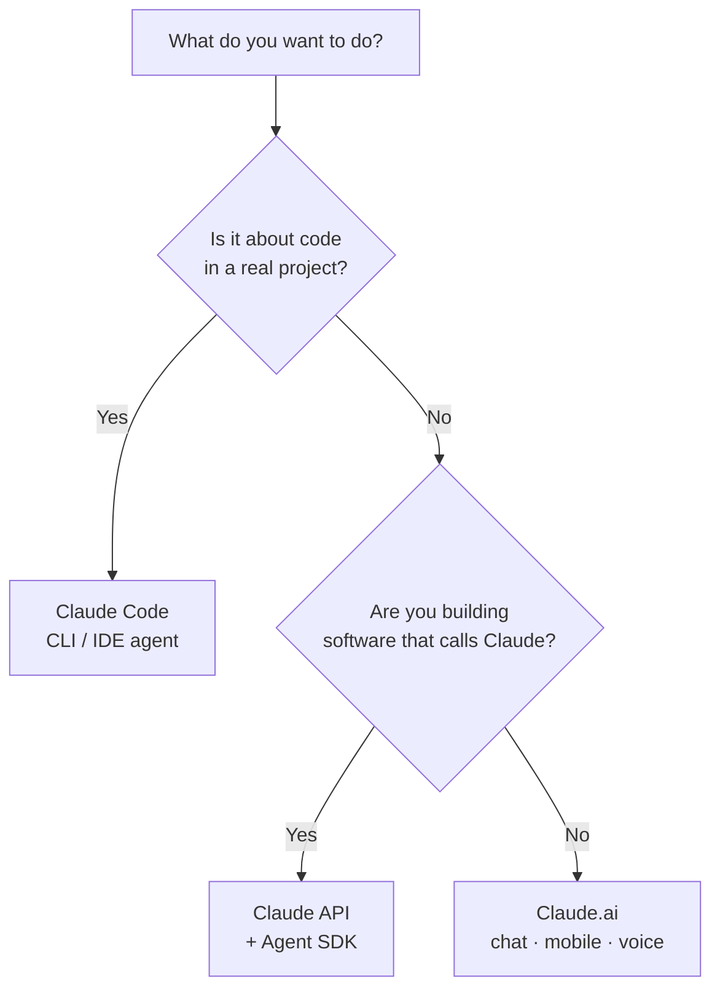

<LevelBadge level="beginner" />

"Claude"에는 몇 가지 형태가 있습니다. 들어본 적 있는 것이 아니라 **하려는 일**을 기준으로 고르세요.

<Callout type="objectives" items={[
  "목표를 알맞은 Claude 표면(채팅, Claude Code, API)에 연결하기",
  "모바일과 음성이 어디에 들어맞는지 알기",
  "레벨이 올라갈수록 세 가지 표면이 어떻게 함께 작동하는지 이해하기",
  "만들기 시작할 때 어떤 모델을 선택할지 빠르게 파악하기"
]} />

## 30초 결정

## 세 가지 표면 한눈에 보기

| 표면 | 가장 적합한 용도 | 대상 | 시작 지점 |
|---|---|---|---|
| **Claude.ai** | 글쓰기, 리서치, 분석, 학습, 계획, 일상적인 질문 | 모든 사람, 설정 불필요 | [Claude.ai로 시작하기](/docs/claude-app/getting-started) |
| **Claude Code** | *코드베이스 안에서* 작업하기 — 읽기, 편집, 명령 실행, 테스트 수정 | 개발자(그리고 기술에 관심 있는 사람) | [Claude Code란](/docs/claude-code/what-is-claude-code) |
| **API 및 Agent SDK** | 프로그래밍 방식으로 Claude를 호출하는 앱, 자동화, 에이전트 | 제품이나 파이프라인을 출시하는 개발자 | [첫 API 호출](/docs/api/first-call) |

### Claude.ai — 채팅 앱

Claude.ai는 모든 사람을 위한 설정이 필요 없는 출발점입니다. **모바일**([iOS/Android](/docs/claude-app/mobile))과 **[음성](/docs/claude-app/voice-mode)**으로도 이용할 수 있어 이동 중에 아이디어를 담기에 좋습니다. [Projects](/docs/claude-app/projects), [사용자 지정 지침](/docs/claude-app/custom-instructions), [Artifacts](/docs/claude-app/artifacts)로 기능을 강화하세요.

### Claude Code — 에이전트형 코딩 도구

Claude Code는 프로젝트 *안에서* 작동합니다. 여러분의 허가를 받아 파일에 대해 작업하며 읽고, 편집하고, 명령을 실행하고, 테스트를 수정합니다.

### API 및 Agent SDK — 여러분의 소프트웨어에 Claude 내장하기

API와 Agent SDK를 사용하면 여러분의 소프트웨어가 프로그래밍 방식으로 Claude를 호출할 수 있어 AI 기능, 자동화, 에이전트를 출시할 수 있습니다.

## 함께 작동합니다

이들은 경쟁 제품이 아닙니다 — 대부분의 사람들은 이들을 거쳐 발전해 갑니다:

| 하고 싶은 일… | 사용 |
|---|---|
| 이메일 초안 작성, PDF 요약, 브레인스토밍 | Claude.ai(또는 음성/모바일) |
| 모듈 리팩터링, 테스트 추가, 버그 수정 | Claude Code |
| *여러분의* 앱에 AI 기능 추가 | API / Agent SDK |

:::tip 잘 모르겠다면 채팅으로 시작하세요
[Claude.ai](/docs/claude-app/getting-started)는 설정이 전혀 필요 없고 Claude가 어떻게 "생각하는지" 알려줍니다. 그 기술은 다른 모든 곳으로 이어집니다.
:::

## 만들기 시작하면 어떤 모델을?

*표면*을 고르는 것이 1단계입니다. Claude Code나 API로 옮겨가면 *모델* — Haiku, Sonnet, 또는 Opus — 도 고르게 됩니다. 세 가지 간단한 질문에 답하면 이 선택기가 출발점을 제안합니다:

<ModelPicker />

:::note 이름을 하드코딩하지 마세요
모델 라인업과 가격은 변합니다. 출시하기 전에 항상 [Claude 모델 선택하기](/docs/api/choosing-a-model) 페이지에서 현재 모델 ID를 확인하세요.
:::

## 스스로 점검하기

<Quiz title="스스로 점검하기" questions={[
  {
    q: "이메일 초안을 작성하고 PDF를 요약하고 싶습니다 — 설정 없이. 어떤 표면인가요?",
    options: ["Claude Code", "Claude.ai (채팅 / 모바일 / 음성)", "API 및 Agent SDK"],
    answer: 1,
    explain: "Claude.ai는 글쓰기, 리서치, 일상적인 질문을 위한 설정이 필요 없는 채팅 표면으로 웹, 모바일, 음성으로 이용할 수 있습니다."
  },
  {
    q: "실제 프로젝트 안에서 모듈을 리팩터링하고 실패하는 테스트를 수정해야 합니다. 어떤 표면인가요?",
    options: ["Claude.ai", "Claude Code", "API 및 Agent SDK"],
    answer: 1,
    explain: "Claude Code는 코드베이스 안에서 작동합니다 — 여러분의 허가를 받아 읽고, 편집하고, 명령을 실행하고, 테스트를 수정합니다."
  },
  {
    q: "현재 모델 이름과 가격은 어디에서 확인해야 하나요?",
    options: ["이 페이지", "Claude 모델 선택하기 페이지", "위의 Mermaid 다이어그램"],
    answer: 1,
    explain: "모델 라인업은 변하므로 이 페이지는 이를 하드코딩하지 않습니다 — 현재 ID와 가격은 Claude 모델 선택하기 페이지에서 확인하세요."
  }
]} />

<Callout type="takeaways" items={[
  "Claude.ai: 글쓰기, 리서치, 일상 작업을 위한 설정이 필요 없는 채팅 — 모바일과 음성으로도 이용 가능",
  "Claude Code: 코드베이스 안에서 작동하는 에이전트",
  "API 및 Agent SDK: 여러분의 소프트웨어에 Claude 내장",
  "이들은 결합됩니다 — 대부분 채팅으로 시작해 Code와 API로 발전합니다",
  "모델(Haiku / Sonnet / Opus)은 만들기 시작할 때만 고르고, 출시 전에 현재 ID를 확인하세요"
]} />

## 다음

- [당신의 첫 5분](/docs/start-here/your-first-5-minutes)
- [학습 경로](/docs/start-here/learning-paths)
- [Claude 모델 선택하기](/docs/api/choosing-a-model) (만들기 시작할 때)
