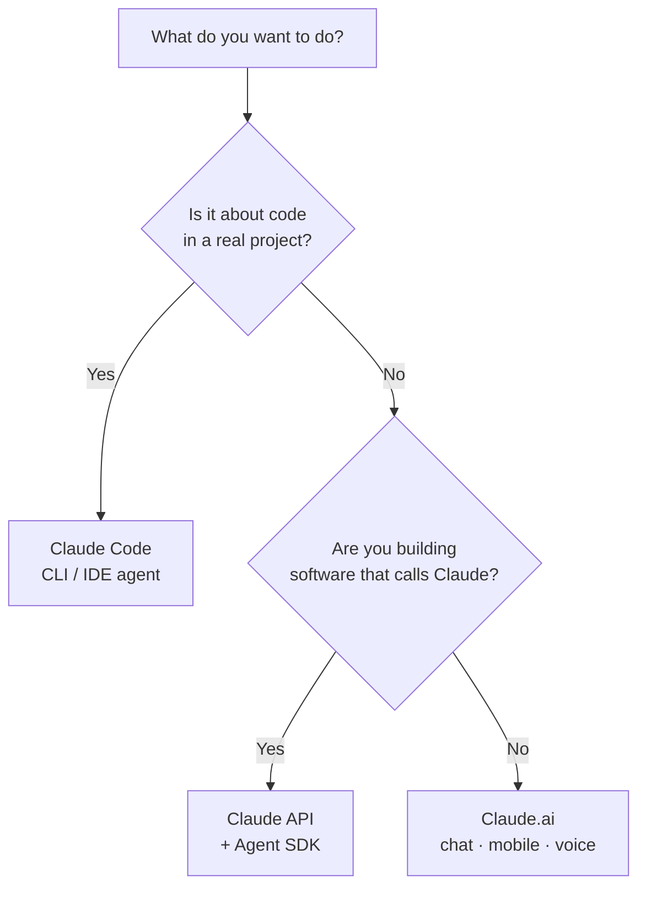

<LevelBadge level="beginner" />

"Claude"는 몇 가지 형태로 제공됩니다. 들어본 적이 있는지가 아니라 **무엇을 하려고 하는지**를 기준으로 고르세요.

## 30초 결정

## Claude.ai — 채팅 앱

**용도:** 글쓰기, 리서치, 분석, 학습, 계획, 일상적인 질문. **대상:** 모두, 설정 불필요.

**모바일**([iOS/Android](/docs/claude-app/mobile))과 **[음성](/docs/claude-app/voice-mode)**으로도 사용할 수 있어 이동 중 아이디어를 기록하기에 좋습니다. [프로젝트](/docs/claude-app/projects), [맞춤 지침](/docs/claude-app/custom-instructions), [아티팩트](/docs/claude-app/artifacts)로 기능을 강화하세요. → [Claude.ai 시작하기](/docs/claude-app/getting-started)에서 출발하세요.

## Claude Code — 에이전트형 코딩 도구

**용도:** *코드베이스 안에서* 작업하기 — 읽기, 편집, 명령 실행, 테스트 수정. **대상:** 개발자(그리고 기술에 호기심이 있는 사람). 당신의 허락을 받아 파일에 작업을 수행합니다. → [Claude Code란 무엇인가](/docs/claude-code/what-is-claude-code).

## API & Agent SDK — Claude를 당신의 소프트웨어에 통합하기

**용도:** Claude를 프로그래밍 방식으로 호출하는 앱, 자동화, 에이전트. **대상:** 제품이나 파이프라인을 출시하는 개발자. → [첫 API 호출](/docs/api/first-call).

## 함께 작동합니다

이들은 경쟁 제품이 아닙니다 — 대부분의 사람은 단계적으로 옮겨갑니다:

| 하고 싶은 것… | 사용 |
|---|---|
| 이메일 초안 작성, PDF 요약, 브레인스토밍 | Claude.ai (또는 음성/모바일) |
| 모듈 리팩터링, 테스트 추가, 버그 수정 | Claude Code |
| *당신의* 앱에 AI 기능 추가 | API / Agent SDK |

:::tip 잘 모르겠다면? 채팅부터 시작하세요
[Claude.ai](/docs/claude-app/getting-started)는 설정이 전혀 필요 없고 Claude가 어떻게 "사고"하는지 알려줍니다. 그 감각은 다른 모든 곳으로 그대로 이어집니다.
:::

## 다음

- [첫 5분](/docs/start-here/your-first-5-minutes)
- [학습 경로](/docs/start-here/learning-paths)
- [Claude 모델 선택하기](/docs/api/choosing-a-model) (무언가를 만들기 시작할 때)
