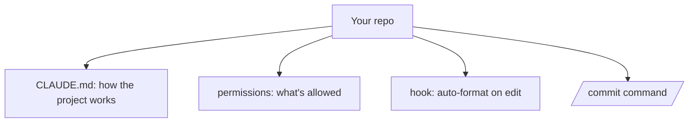

<LevelBadge level="intermediate" />

<Callout type="objectives" items={["새로 체크아웃한 저장소를 약 20분 만에 튜닝된 Claude Code 설정으로 바꾸기", "네 가지 맞춤 설정 각각이 왜 제자리를 차지하는지 이해하기 — CLAUDE.md, 권한, 훅, 명령어", "안전한 작업에서는 방해를 줄이고 위험한 작업은 확실히 멈추는 권한 규칙 작성하기", "됐다고 가정하지 말고 각 요소가 실제로 작동하는지 검증하기"]} />

새로 체크아웃한 저장소를 *프로젝트를 이해하고 규칙을 존중하는* Claude Code 설정으로 약 20분 만에 바꿔봅시다. 핵심 기능들을 각각의 근거와 함께 하나로 엮어 나가겠습니다.

## 최종 상태



## 1단계 — CLAUDE.md 생성 및 다듬기

`/init`을 실행해 [CLAUDE.md](/docs/claude-code/claude-md) 초안을 만든 다음, 실제로 맞는 내용만 남도록 **줄여서 정리하세요**: 스택, 실행/테스트/린트 방법, 실제 컨벤션, 가드레일("작업 완료 전 테스트 실행", "`/generated`는 건드리지 말 것"). *이유:* 가장 효과가 큰 맞춤 설정입니다 — Claude는 매 세션마다 이 파일을 읽습니다.

[CLAUDE.md 템플릿](/docs/templates/claude-md)에서 시작용 템플릿을 가져오세요.

## 2단계 — 권한 설정

안전하고 반복적인 명령은 미리 허용하고 위험한 명령은 거부하는 `.claude/settings.json`([참조](/docs/claude-code/settings))을 추가하세요:

```json
{
  "permissions": {
    "allow": ["Read", "Bash(npm run test:*)", "Bash(npm run lint)", "Bash(git diff:*)"],
    "ask": ["Write", "Bash(npm install:*)"],
    "deny": ["Read(./.env)", "Bash(git push --force:*)"]
  }
}
```

*이유:* 안전한 작업에서는 방해가 줄고, 위험한 작업에서는 확실히 멈춥니다. [권한](/docs/claude-code/permissions)을 참고하세요.

## 3단계 — 포매팅 훅 추가

편집할 때마다 자동으로 포맷하세요([훅](/docs/claude-code/hooks)):

```json
{ "hooks": { "PostToolUse": [ { "matcher": "Edit|Write",
  "hooks": [ { "type": "command", "command": "npx prettier --write \"$CLAUDE_FILE_PATH\" 2>/dev/null || true" } ] } ] } }
```

*이유:* "기억해 주세요"가 아니라 일관된 포매팅이 보장됩니다.

## 4단계 — `/commit` 명령어 추가

[슬래시 명령어 라이브러리](/docs/templates/slash-commands)의 `/commit` 레시피를 `.claude/commands/`에 넣으세요. *이유:* 반복 가능한 워크플로를 한 단어로.

## 5단계 — 첫 실제 작업에 Plan Mode 사용

[Plan Mode](/docs/claude-code/plan-mode)에서 실제 목표를 제시하고, 계획을 검토한 다음 실행하게 하세요. *이유:* 생각과 실행을 분리해 신뢰를 쌓습니다.

## 제대로 작동하는지 확인하기

가정하지 마세요 — 각 요소를 독립적으로 확인하세요. 각 테스트는 하나의 맞춤 설정만 격리하므로, 실패하면 어떤 파일을 고쳐야 하는지 정확히 알 수 있습니다.

<Steps items={[{title: "CLAUDE.md 작동", body: "새 세션을 시작하고 평범한 작업을 시켜보세요. Claude는 여러분이 붙여넣지 않아도 알아서 여러분의 컨벤션을 참조해야 합니다."}, {title: "훅 작동", body: "파일을 편집하고 Claude가 쓰게 하세요. 여러분의 별도 알림 없이 포맷된 상태로 돌아와야 합니다."}, {title: "권한 작동", body: "위험한 명령을 시도해 보세요. Claude는 그냥 실행하는 대신 묻거나 아예 거부해야 합니다."}, {title: "명령어 작동", body: "/commit을 실행하세요. 한 단어로 깔끔한 Conventional Commit 메시지를 받아야 합니다."}]} />

<PromptCard title="Plan Mode에서 첫 실제 작업 시작하기">{`Add pagination to the users list endpoint. Plan it first — I want to review before you touch anything.`}</PromptCard>

<Callout type="takeaways" items={["CLAUDE.md는 Claude가 매 세션마다 읽기 때문에 가장 효과가 큰 맞춤 설정입니다 — /init으로 생성한 다음 실제로 맞는 내용만 남도록 줄여서 정리하세요", "권한은 양면적인 도구입니다: 안전하고 반복적인 명령은 미리 허용해 방해를 줄이고, 위험한 명령은 거부해 확실히 멈추게 하세요", "훅은 포매팅을 \"기억해 주세요\"가 아니라 보장으로 만듭니다 — 하네스가 강제하는 동작이 프롬프트로 요청한 동작을 이깁니다", "슬래시 명령어는 반복 가능한 워크플로를 한 단어로 바꿉니다", "Plan Mode는 생각과 실행을 분리하며, 이것이 더 많은 자율성을 넘기기 전에 신뢰를 쌓는 방법입니다", "각 맞춤 설정을 자체 테스트로 검증하면 실패가 하나의 파일을 가리킵니다"]} />

<Quiz title="스스로 점검하기" questions={[{q: "CLAUDE.md는 왜 가장 효과가 큰 맞춤 설정이라고 불릴까요?", options: ["Claude Code가 쓸 수 있는 유일한 파일이라서", "Claude가 매 세션마다 읽어서, 반복해서 말하지 않아도 모든 작업을 형성하기 때문에", "권한 규칙을 무시하기 때문에"], answer: 1, explain: "Claude는 매 세션마다 CLAUDE.md를 읽습니다. 그것이 바로 효과입니다 — 스택, 명령, 컨벤션, 가드레일이 다시 붙여넣어지는 대신 자동으로 컨텍스트에 들어옵니다. 그래서 실제로 맞는 내용만 남도록 줄여 정리하는 것이기도 합니다."}, {q: "자동 포매팅을 단순히 요청하는 게 아니라 보장하고 싶습니다. 올바른 메커니즘은 무엇일까요?", options: ["CLAUDE.md에 \"편집 후 항상 포맷하라\"고 적은 한 줄", "Edit|Write를 매칭해 포맷터를 실행하는 PostToolUse 훅", "포맷터 명령에 대한 권한 allow 규칙"], answer: 1, explain: "훅은 하네스가 강제합니다 — 모델이 기억하든 안 하든 실행됩니다. CLAUDE.md의 지시는 모델이 놓칠 수 있는 요청이고, 권한 규칙은 명령이 허용되는지만 관장할 뿐 실행 여부는 관장하지 않습니다."}, {q: "예시 settings.json에서 어떤 명령은 \"allow\"에, 다른 명령은 \"ask\"에 있는 이유는 무엇일까요?", options: ["\"ask\" 명령은 위험하므로 대신 \"deny\"에 있어야 한다", "안전하고 반복적인 명령을 미리 허용하면 방해가 줄고, \"ask\"는 부작용이 있는 작업에 사람을 개입시킨다", "\"allow\"는 읽기 작업 전용이다"], answer: 1, explain: "이 구분은 방해 비용 대 위험에 관한 것입니다. Read나 테스트 실행처럼 안전하고 반복적인 것들은 미리 허용되어 여러분을 방해하지 않고, Write나 npm install처럼 실제 부작용이 있는 것들은 \"ask\"로 가며, 강제 푸시처럼 정말 위험한 것들은 확실한 정지로 \"deny\"에 갑니다."}]} />

## 다음 단계

- [첫 번째 Skill 작성하기](/docs/walkthroughs/first-skill)
- [Hooks & settings.json 레시피](/docs/templates/hooks-settings)
- [코딩 & 소프트웨어 개발](/docs/playbooks/coding)
