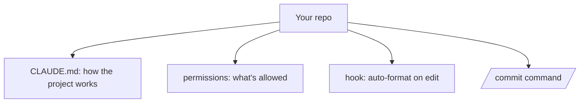

<LevelBadge level="intermediate" />

새로 받은 체크아웃을 *프로젝트를 이해하고 규칙을 존중하는* Claude Code 설정으로 약 20분 만에 바꿔봅시다. 핵심 기능들을 각각의 근거와 함께 하나로 엮어 나가겠습니다.

## 최종 상태



## 1단계 — CLAUDE.md 생성 및 다듬기

`/init`을 실행해 [CLAUDE.md](/docs/claude-code/claude-md) 초안을 만든 다음, 실제로 맞는 내용만 남도록 **줄여서 정리하세요**: 스택, 실행/테스트/린트 방법, 실제 컨벤션, 가드레일("작업 완료 전 테스트 실행", "`/generated`는 건드리지 말 것"). *이유:* 가장 효과가 큰 맞춤 설정입니다 — Claude는 매 세션마다 이 파일을 읽습니다.

[CLAUDE.md 템플릿](/docs/templates/claude-md)에서 시작용 템플릿을 가져오세요.

## 2단계 — 권한 설정

안전하고 반복적인 명령은 미리 허용하고 위험한 명령은 거부하는 `.claude/settings.json`([참조](/docs/claude-code/settings))을 추가하세요:

```json
{
  "permissions": {
    "allow": ["Read", "Bash(npm run test:*)", "Bash(npm run lint)", "Bash(git diff:*)"],
    "ask": ["Write", "Bash(npm install:*)"],
    "deny": ["Read(./.env)", "Bash(git push --force:*)"]
  }
}
```

*이유:* 안전한 작업에서는 방해가 줄고, 위험한 작업에서는 확실히 멈춥니다. [권한](/docs/claude-code/permissions)을 참고하세요.

## 3단계 — 포매팅 훅 추가

편집할 때마다 자동으로 포맷하세요([훅](/docs/claude-code/hooks)):

```json
{ "hooks": { "PostToolUse": [ { "matcher": "Edit|Write",
  "hooks": [ { "type": "command", "command": "npx prettier --write \"$CLAUDE_FILE_PATH\" 2>/dev/null || true" } ] } ] } }
```

*이유:* "기억해 주세요"가 아니라 일관된 포매팅이 보장됩니다.

## 4단계 — `/commit` 명령어 추가

[슬래시 명령어 라이브러리](/docs/templates/slash-commands)의 `/commit` 레시피를 `.claude/commands/`에 넣으세요. *이유:* 반복 가능한 워크플로를 한 단어로.

## 5단계 — 첫 실제 작업에 Plan Mode 사용

[Plan Mode](/docs/claude-code/plan-mode)에서 실제 목표를 제시하고, 계획을 검토한 다음 실행하게 하세요. *이유:* 생각과 실행을 분리해 신뢰를 쌓습니다.

## 제대로 작동하는지 확인하기

- 새 세션 → Claude가 묻지 않아도 여러분의 컨벤션을 참조함 (CLAUDE.md 작동).
- 파일 편집 → 포맷됨 (훅 작동).
- 위험한 명령 → 묻거나 거부함 (권한 작동).
- `/commit` → 깔끔한 Conventional Commit 메시지 (명령어 작동).

## 다음 단계

- [첫 번째 Skill 작성하기](/docs/walkthroughs/first-skill)
- [Hooks & settings.json 레시피](/docs/templates/hooks-settings)
- [코딩 & 소프트웨어 개발](/docs/playbooks/coding)
