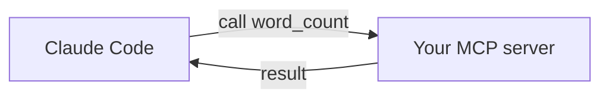

<LevelBadge level="advanced" />

<VerifyNote lastVerified="2026-06-20" source="https://modelcontextprotocol.io">
MCP SDK API와 설정은 계속 변합니다 — 공식 MCP 문서와 Claude Code MCP 문서를 기준으로 확인하세요.
</VerifyNote>

작은 [MCP](/docs/claude-code/mcp) 서버를 만들어 연결함으로써 커스텀 도구를 Claude에 노출해 봅시다. *연결 방식*이 명확히 드러나도록 최소한으로 유지한 다음, 여러분의 실제 로직으로 교체하면 됩니다.

## 우리가 만들 것

Claude가 호출할 수 있는 도구 하나, `word_count`를 가진 stdio 서버입니다. 동일한 패턴이 "내 DB에 쿼리하기", "티켓 열기" 등으로 확장됩니다.



## 1단계 — 서버

`server.py` (Python; TypeScript 버전은 [MCP 스캐폴드](/docs/templates/mcp-config)에 있습니다):

```python
from mcp.server.fastmcp import FastMCP

mcp = FastMCP("text-tools")

@mcp.tool()
def word_count(text: str) -> int:
    """Count the words in a piece of text."""
    return len(text.split())

if __name__ == "__main__":
    mcp.run()  # stdio transport
```

## 2단계 — 선언하기

저장소 루트의 `.mcp.json`에 추가하세요:

```json
{ "mcpServers": {
  "text-tools": { "command": "python", "args": ["server.py"] }
} }
```

## 3단계 — 연결 및 테스트

저장소에서 Claude Code를 시작하세요. 다음과 같이 요청하세요: *"text-tools 서버를 사용해서 'the quick brown fox'의 단어 수를 세어줘."* Claude가 `word_count`를 호출하고 `4`를 보고해야 합니다. 도구가 보이지 않으면, 서버가 단독으로 깔끔하게 시작되는지 그리고 `.mcp.json` 경로가 맞는지 확인하세요.

## 4단계 — 실전용으로 만들기

`word_count`를 실제 기능으로 교체하세요 — DB 쿼리, 내부 API 호출, 파일 작업 등. 입력 검증을 추가하고 오류는 결과로 반환하세요.

## 보안 체크리스트

:::warning 서버는 코드 + 접근 권한입니다
- **최소 권한** — 꼭 필요한 데이터/작업만 ([에이전트 보안하기](/docs/security/securing-agents)).
- 모델이 보내는 **입력을 검증하세요**.
- 서버가 반환하는 신뢰할 수 없는 데이터는 [프롬프트 인젝션](/docs/security/prompt-injection)을 포함할 수 있습니다.
- 서드파티 서버를 연결하기 전에 반드시 **검토하세요**.
:::

## 다음 단계

- [Claude Code의 MCP 서버](/docs/claude-code/mcp)
- [MCP 설정 & 서버 스캐폴드](/docs/templates/mcp-config)
- [도구 사용 / 함수 호출](/docs/api/tool-use)
