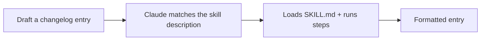

<LevelBadge level="intermediate" />

<Callout type="objectives" items={["동작하는 Skill을 처음부터 만들고 실제로 활성화되는지 증명하기", "적절한 시점에 트리거되는 description 작성하기 — 스킬이 실행될지 말지를 결정하는 유일한 필드", "결정론적 데이터 수집을 위해 언제 헬퍼 스크립트를 추가할지 판단하기", "절대 실행되지 않는 스킬을 진단하고, 그 원인이 되는 세 가지 함정 알기"]} />

<VerifyNote lastVerified="2026-06-20" source="https://code.claude.com/docs/en/skills">
Skill 구조와 탐색 방식은 변할 수 있습니다 — 공식 Skills 문서를 기준으로 확인하세요.
</VerifyNote>

처음부터 동작하는 [Skill](/docs/claude-code/skills)을 만들고 그것이 활성화되는지 증명해 봅시다. 작은 "체인지로그 항목" 스킬을 만들겠습니다 — 범용적이고 재사용 가능합니다.

## 1단계 — 폴더 생성

<PromptCard title="스킬 폴더 생성">{`mkdir -p .claude/skills/changelog-entry`}</PromptCard>

(모든 프로젝트에서 쓰는 개인용 스킬은 `~/.claude/skills/…`를 사용하세요.)

## 2단계 — SKILL.md 작성

`.claude/skills/changelog-entry/SKILL.md`:

```markdown
---
name: changelog-entry
description: Use when the user wants to turn recent git commits into a Keep a Changelog entry.
---

# Changelog Entry

When asked for a changelog entry:
1. Run `git log --oneline -20` to see recent commits.
2. Group them into Added / Changed / Fixed / Removed (Keep a Changelog style).
3. Write concise, user-facing bullets (not raw commit messages).
4. Output only the formatted entry.
```

**`description`이 트리거입니다** — Claude가 적절한 시점에 로드하도록 "Use when…" 형식으로 작성하세요.

## 3단계 — (선택) 헬퍼 스크립트 추가

스킬에는 스크립트를 포함할 수 있습니다. 결정론적으로 데이터를 수집하고 싶다면 `scripts/recent.sh`를 추가하고 SKILL.md에서 참조하세요:

```bash
#!/usr/bin/env bash
git log --oneline -20
```

## 4단계 — 트리거되는지 증명하기

세션을 시작하고 아래 프롬프트를 시도해 보세요. Claude가 의도를 인식하고, 스킬을 로드하고, 그 단계들을 따라야 합니다. 활성화되지 않는다면, *언제* 사용해야 하는지에 대해 `description`이 충분히 구체적이지 않을 가능성이 높습니다 — 더 다듬으세요.

<PromptCard title="스킬이 트리거되는지 증명하기">{`Draft a changelog entry for recent work.`}</PromptCard>



## 5단계 — 공유하기

(다른 스킬들과 함께) [플러그인](/docs/claude-code/plugins-marketplaces)으로 묶어 팀이 한 번에 설치하게 하거나 — AILmanac의 [스킬 팩](/docs/templates/skills)에 기여하세요.

## 흔한 함정

- **모호한 description** → 절대 트리거되지 않거나(혹은 항상 트리거됨). 구체적으로 작성하세요.
- **하나의 스킬에 너무 많은 내용** → 하나의 명확한 작업으로 유지하세요.
- **공유 스킬에 비밀 값 포함** → 절대 금지; [서드파티 코드 검토하기](/docs/security/reviewing-third-party-code)를 참고하세요.

<Callout type="takeaways" items={["스킬은 폴더 하나와 SKILL.md입니다 — 프로젝트용은 .claude/skills/<name>/, 모든 프로젝트용은 ~/.claude/skills/", "description이 트리거입니다. Claude가 적절한 순간에 로드하도록 \"Use when…\" 형식으로 작성하세요", "스킬에는 스크립트를 포함할 수 있습니다 — Claude가 명령을 즉흥적으로 만드는 대신 결정론적 데이터 수집을 원할 때 사용하세요", "스킬 이름을 부르는 대신 의도를 프롬프트로 던져 동작을 증명하세요. 트리거되지 않는다면 description이 언제(WHEN) 쓸지에 대해 충분히 구체적이지 않은 것입니다", "하나의 스킬은 하나의 명확한 작업으로 유지하고, 공유하는 스킬에는 절대 비밀 값을 넣지 마세요"]} />

<Quiz title="스스로 점검하기" questions={[{q: "무엇을 물어봐도 스킬이 전혀 활성화되지 않습니다. 거의 확실하게 문제가 되는 필드는?", options: ["name — 폴더와 정확히 일치해야 한다", "description — 언제(WHEN) 스킬을 써야 하는지에 대해 충분히 구체적이지 않다", "헬퍼 스크립트에 실행 비트가 빠져 있다"], answer: 1, explain: "description이 트리거입니다. \"Use when…\" 형식으로 쓰고 상황을 구체적으로 명시하면 Claude에게 언제 스킬을 로드할지 알려줍니다. 모호한 description은 절대 트리거되지 않거나 — 계속 트리거됩니다."}, {q: "체인지로그 스킬을 이 프로젝트뿐 아니라 작업하는 모든 프로젝트에서 쓰고 싶습니다. 어디에 둬야 하나요?", options: ["각 저장소의 .claude/skills/changelog-entry/", "~/.claude/skills/changelog-entry/", "먼저 플러그인으로 게시해야 한다"], answer: 1, explain: "모든 프로젝트에 적용되는 개인용 스킬은 ~/.claude/skills/…를 사용하세요. 저장소 내 .claude/skills/ 경로는 스킬을 해당 프로젝트로 한정합니다."}, {q: "scripts/recent.sh 같은 헬퍼 스크립트를 스킬과 함께 배포하는 이유는?", options: ["스킬은 스크립트 없이는 셸 명령을 실행할 수 없다", "결정론적 데이터 수집을 위해 — Claude가 즉흥적으로 만드는 대신 스크립트가 매번 동일하게 실행된다", "스킬을 더 빠르게 로드시킨다"], answer: 1, explain: "스킬에는 스크립트를 포함할 수 있고, SKILL.md에서 참조하면 결정론적 데이터 수집이 됩니다. 선택 사항입니다 — 모델에 맡기는 대신 매 실행마다 정확히 같은 명령을 원할 때 추가합니다."}]} />

## 다음 단계

- [Skills: 필요할 때 꺼내 쓰는 전문성](/docs/claude-code/skills)
- [SKILL.md 템플릿](/docs/templates/skills)
- [첫 번째 MCP 서버 만들고 연결하기](/docs/walkthroughs/first-mcp-server)
