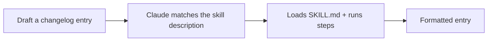

<LevelBadge level="intermediate" />

<VerifyNote lastVerified="2026-06-20" source="https://docs.anthropic.com/en/docs/claude-code/skills">
Skill 구조와 탐색 방식은 변할 수 있습니다 — 공식 Skills 문서를 기준으로 확인하세요.
</VerifyNote>

처음부터 동작하는 [Skill](/docs/claude-code/skills)을 만들고 그것이 활성화되는지 증명해 봅시다. 작은 "체인지로그 항목" 스킬을 만들겠습니다 — 범용적이고 재사용 가능합니다.

## 1단계 — 폴더 생성

```bash
mkdir -p .claude/skills/changelog-entry
```

(모든 프로젝트에서 쓰는 개인용 스킬은 `~/.claude/skills/…`를 사용하세요.)

## 2단계 — SKILL.md 작성

`.claude/skills/changelog-entry/SKILL.md`:

```markdown
---
name: changelog-entry
description: Use when the user wants to turn recent git commits into a Keep a Changelog entry.
---

# Changelog Entry

When asked for a changelog entry:
1. Run `git log --oneline -20` to see recent commits.
2. Group them into Added / Changed / Fixed / Removed (Keep a Changelog style).
3. Write concise, user-facing bullets (not raw commit messages).
4. Output only the formatted entry.
```

**`description`이 트리거입니다** — Claude가 적절한 시점에 로드하도록 "Use when…" 형식으로 작성하세요.

## 3단계 — (선택) 헬퍼 스크립트 추가

스킬에는 스크립트를 포함할 수 있습니다. 결정론적으로 데이터를 수집하고 싶다면 `scripts/recent.sh`를 추가하고 SKILL.md에서 참조하세요:

```bash
#!/usr/bin/env bash
git log --oneline -20
```

## 4단계 — 트리거되는지 증명하기

세션을 시작하고 이렇게 말하세요: *"최근 작업에 대한 체인지로그 항목을 작성해줘."* Claude가 의도를 인식하고, 스킬을 로드하고, 그 단계들을 따라야 합니다. 활성화되지 않는다면, *언제* 사용해야 하는지에 대해 `description`이 충분히 구체적이지 않을 가능성이 높습니다 — 더 다듬으세요.



## 5단계 — 공유하기

(다른 스킬들과 함께) [플러그인](/docs/claude-code/plugins-marketplaces)으로 묶어 팀이 한 번에 설치하게 하거나 — AILmanac의 [스킬 팩](/docs/templates/skills)에 기여하세요.

## 흔한 함정

- **모호한 description** → 절대 트리거되지 않거나(혹은 항상 트리거됨). 구체적으로 작성하세요.
- **하나의 스킬에 너무 많은 내용** → 하나의 명확한 작업으로 유지하세요.
- **공유 스킬에 비밀 값 포함** → 절대 금지; [서드파티 코드 검토하기](/docs/security/reviewing-third-party-code)를 참고하세요.

## 다음 단계

- [Skills: 필요할 때 꺼내 쓰는 전문성](/docs/claude-code/skills)
- [SKILL.md 템플릿](/docs/templates/skills)
- [첫 번째 MCP 서버 만들고 연결하기](/docs/walkthroughs/first-mcp-server)
