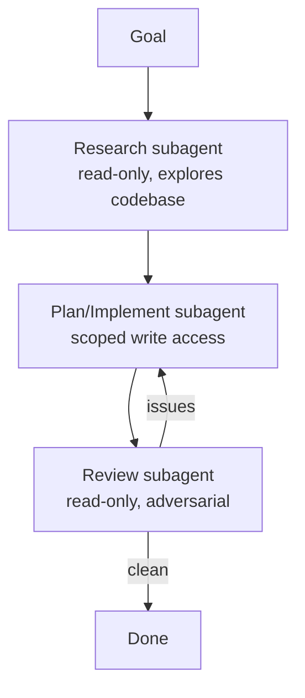

<LevelBadge level="advanced" />

큰 작업은 모든 것을 하나의 컨텍스트에 밀어넣는 대신, 집중된 [서브에이전트](/docs/claude-code/subagents)들로 나눌 때 더 잘 풀립니다. 리서치 → 구현 → 검토 파이프라인을 설계해 봅시다.

## 형태

각 서브에이전트는 **자체 컨텍스트**와 **맞춤형 도구 세트**를 가지며 — *결과*만 메인 세션으로 돌아오므로 메인 세션이 깔끔하게 유지됩니다.

## 1단계 — 에이전트 정의

`/agents` 인터페이스를 통해 세 개를 정의하세요. 각각 좁은 `description`(메인 에이전트가 올바르게 위임하도록)과 범위가 한정된 도구를 갖습니다:

- **researcher** — 읽기/검색만. 관련 코드를 파악하고 발견 사항을 반환합니다.
- **implementer** — 파일을 편집하고 테스트를 실행할 수 있음; researcher의 발견 사항을 입력으로 받습니다.
- **reviewer** — 읽기 전용, 적대적: 버그, 누락된 케이스, 컨벤션 위반을 찾습니다.

## 2단계 — 핸드오프로 오케스트레이션

메인 세션이 각 단계의 출력을 다음 단계로 전달합니다: 리서치 → 구현(리서치 활용) → 검토(구현 결과 대상). **검토 게이트**를 추가하세요: 리뷰어가 문제를 찾으면 마무리하기 전에 implementer로 되돌아갑니다.

## 3단계 — 이렇게 하면 안 되는 때 알기

:::warning 병렬/다중 에이전트는 공짜가 아닙니다
- **순차적 의존성**(구현은 리서치가 필요)은 순차로 유지하세요 — 순서가 중요한 곳에서는 펼치지 마세요.
- **공유 파일 쓰기**는 충돌할 수 있습니다 — [git 워크트리](/docs/claude-code/worktrees)로 격리하거나 직렬화하세요.
- 작은 작업에서는 조율 오버헤드가 이득을 넘어섭니다. **규모가 크고 분해 가능한** 작업에 사용하세요.
:::

## 4단계 — 확인하기

좋은 다중 에이전트 실행은 다음을 보여줍니다: 집중된 메인 컨텍스트(무거운 읽기는 researcher에서 일어남), 리서치를 반영하는 구현, 그리고 실제로 뭔가를 잡아낸(또는 신뢰성 있게 승인한) 검토. 리뷰어가 형식적인 도장 찍기에 그친다면, 그 프롬프트를 **적대적으로** 만드세요("무엇이 잘못됐는지 찾아내려고 해봐").

## 더 나아가기

동일한 패턴을 프로그래밍 방식으로 구현하면 [API로 에이전트 구축하기](/docs/api/building-agents)와 [Cowork & 에이전트 팀](/docs/api/cowork-and-agent-teams) 같은 제품 표면이 됩니다.

## 다음 단계

- [서브에이전트 & 병렬 에이전트](/docs/claude-code/subagents)
- [Git 워크트리](/docs/claude-code/worktrees)
- [API로 에이전트 구축하기](/docs/api/building-agents)
